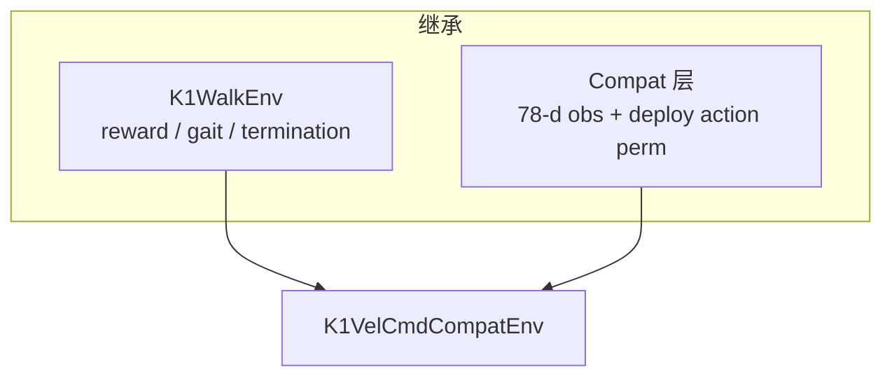

## K1VelCmdCompat 设计思路

### 定位：补「能走、能站、能跟 cmd」这一块

仓库里已有两类 K1 任务，但中间缺一环：

| 任务 | 强项 | 短板 |
|------|------|------|
| **K1SoccerDribbleCompat** | 78 维 obs 与 MOS-SIM 部署一致，已走通 | cmd 由环境/课程生成（朝球走），不是通用摇杆 |
| **K1WalkFlat** | 经典 `tracking_lin_vel` 速度跟踪 | G1 风格 75 维 obs，与 `k1_model_46000` 部署 layout **不兼容** |

**K1VelCmdCompat** 的目标是：用 **摇杆式速度指令训练**，同时 **obs / 传感器 / 执行器 / 站立姿态** 与已部署的 DribbleCompat 完全一致，训完可直接上 MOS-SIM。

---

### 架构：「Walk 的身体 + Compat 的脸」



- **继承 `K1WalkEnv`**：复用成熟的行走 reward（`tracking_lin_vel` / `tracking_ang_vel`、feet_phase、orientation 惩罚等）、步态相位、倒地终止。
- **只覆盖 3 处**（与 DribbleCompat 同模式）：
  - `obs_groups_spec` → 78 / 81 维
  - `_compute_obs` → 46000 布局
  - `apply_action` → `K1_DEPLOY_JOINT_ORDER` ↔ actuator 置换

不碰球、不做课程，逻辑比 Dribble 简单很多。

---

### 与部署对齐的部分（硬约束）

这些刻意与 `K1SoccerDribbleCompat` / `*_visual_unilab.xml` / `_obs_k1_unilab_compat` 保持一致：

| 维度 | 值 |
|------|-----|
| 机器人资产 | `k1.xml`（position 执行器 + trunk 三传感器） |
| stand 高度 | `z = 0.57437…`（与 dribble keyframe 相同） |
| `action_scale` | `0.35` |
| `sim_dt` | `0.002`（Motrix 稳定） |
| Actor obs | 78 维，scale 与 MOS-SIM `OBS_SCALE` 一致 |
| 关节序 | obs/action 用 `K1_DEPLOY_JOINT_ORDER`，控制用 perm 写回 actuator |

**78 维 actor 布局**（与部署一字不差）：

```
linvel(3) | angvel×0.2(3) | gravity(3) | cmd(3) | joint_pos(22) | joint_vel×0.05(22) | last_action(22)
```

Critic 81 维 = actor + 特权 `base_lin_vel`(3)（SAC 估值用，不进 actor）。

---

### 速度指令设计

- **机体系** `[vx, vy, yaw_rate]`，物理单位 m/s、m/s、rad/s。
- **采样范围** `[-1, 1]` 每轴（yaml 里 `vel_limit` 可改）。
- **每 episode 固定一条 cmd**（`resampling_time=0`），策略学「给定指令下怎么动」。
- **`rel_standing_envs=0.25`**：25% 环境 reset 时 cmd=`[0,0,0]`，专门练 **静止不倒**。
- **关掉 `zero_small_xy_commands`**：原版 Walk 会把小速度清零；这里保留小速度，方便学精细跟踪。

Reward 核心是 `tracking_lin_vel` + `tracking_ang_vel`：cmd=0 时奖励速度≈0，cmd≠0 时奖励跟指令走。

---

### 场景

`scene_vel_cmd_compat.xml`：从 dribble minimal 场景精简而来——

- 保留：`k1.xml`、`COL_Collider` 地面、脚底 contact 传感器、相同 stand keyframe  
- 去掉：球、waypoint、课程相关几何  

平地速度跟踪够用，物理与已走通部署一致。

---

### 与 DribbleCompat 的关系

| | DribbleCompat | VelCmdCompat |
|--|---------------|--------------|
| obs / action 契约 | 78 维 compat | **相同** |
| cmd 来源 | 环境采样 / 朝球 | **外部摇杆语义 [-1,1]** |
| reward | 带球、phase1/2 课程 | **纯速度跟踪 + 步态** |
| 部署 | 已实现 | 训完用同一套 MOS-SIM 链路，Decider 直接填 `cmd` |

Dribble 策略学到的是「跟环境给的 cmd 走（后期 cmd 指向球）」；VelCmd 策略学的是「跟任意 `[-1,1]` 速度指令走 + 零指令站立」。obs 接口相同，部署侧只需改 cmd 来源，不必改网络或传感器。

---

### 训练入口

```bash
uv run train --algo flashsac --task k1_vel_cmd_compat --sim mujoco
# 或 motrix
uv run train --algo flashsac --task k1_vel_cmd_compat --sim motrix
```

