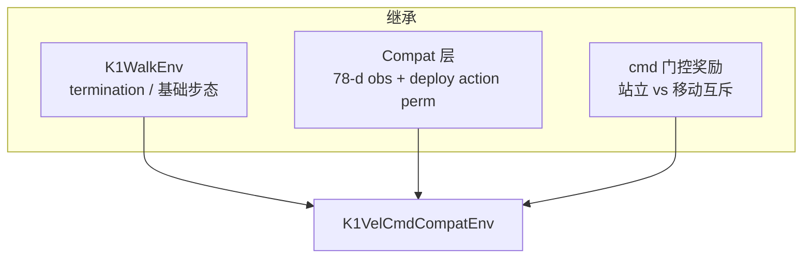

## K1VelCmdCompat 设计思路

### 定位：补「能走、能站、能跟 cmd」这一块

仓库里已有两类 K1 任务，但中间缺一环：

| 任务 | 强项 | 短板 |
|------|------|------|
| **K1SoccerDribbleCompat** | 78 维 obs 与 MOS-SIM 部署一致，已走通 | cmd 由环境/课程生成（朝球走），不是通用摇杆 |
| **K1WalkFlat** | 经典 `tracking_lin_vel` 速度跟踪 | G1 风格 75 维 obs，与 `k1_model_46000` 部署 layout **不兼容** |

**K1VelCmdCompat** 的目标是：用 **摇杆式速度指令训练**，同时 **obs / 传感器 / 执行器 / 站立姿态** 与已部署的 DribbleCompat 完全一致，训完可直接上 MOS-SIM。

**当前验收标准（已走通）**：

- `cmd ≈ [0,0,0]` → 原地站立，不明显漂移或前冲
- `cmd ≠ 0`（含负向 vx/vy、yaw）→ 机体系速度跟踪指令，能走、能退、能横移
- 部署侧与 DribbleCompat 共用 78 维 obs / 22 维 action 契约

---

### 架构：「Walk 的身体 + Compat 的脸 + cmd 双模式奖励」



- **继承 `K1WalkEnv`**：倒地终止、feet_phase 步态几何、orientation / base_height 等通用惩罚。
- **Compat 层**（与 DribbleCompat 同模式）：
  - `obs_groups_spec` → 78 / 81 维
  - `_compute_obs` → 46000 / MOS-SIM 布局
  - `apply_action` → `K1_DEPLOY_JOINT_ORDER` ↔ actuator 置换
- **VelCmd 专有层**（`k1_vel_cmd_compat.py`）：
  - cmd 双模式 reward 门控（见下）
  - 步态相位：站立锁双脚、移动才推进 `gait_phase`
  - 关闭 `zero_small_xy_commands`，保留 `[-1,1]` 精细速度采样

实现入口：`src/unilab/envs/locomotion/k1/k1_vel_cmd_compat.py`  
Owner 配置：`conf/offpolicy/task/flashsac/k1_vel_cmd_compat/{mujoco,motrix}.yaml`

---

### 与部署对齐的部分（硬约束）

这些刻意与 `K1SoccerDribbleCompat` / `*_visual_unilab.xml` / MOS-SIM `_obs_k1_unilab_compat` 保持一致：

| 维度 | 值 |
|------|-----|
| 机器人资产 | `k1.xml`（position 执行器 + trunk 三传感器） |
| 场景 | `scene_vel_cmd_compat.xml`（平地、无球） |
| stand 高度 | `z = 0.57437…`（与 dribble keyframe 相同） |
| `action_scale` | `0.35` |
| `sim_dt` | `0.002`（Motrix 稳定） |
| `ctrl_dt` | `0.02`（`control_decimation=10`） |
| Actor obs | 78 维，scale 与 MOS-SIM `OBS_SCALE` 一致 |
| 关节序 | obs/action 用 `K1_DEPLOY_JOINT_ORDER`，控制用 perm 写回 actuator |

**78 维 actor 布局**（与部署一字不差）：

```
linvel(3) | angvel×0.2(3) | gravity(3) | cmd(3) | joint_pos(22) | joint_vel×0.05(22) | last_action(22)
```

Critic 81 维 = actor + 特权 `base_lin_vel`(3)（SAC 估值用，不进 actor）。

---

### 速度指令设计

- **机体系** `[vx, vy, yaw_rate]`，物理单位 m/s、m/s、rad/s。
- **采样范围** `[-1, 1]` 每轴（`commands.vel_limit`）。
- **每 episode 固定一条 cmd**（`resampling_time=0`），策略学「给定指令下怎么动」。
- **`rel_standing_envs=0.2`**：20% 环境 reset 时 cmd=`[0,0,0]`，练站立；80% 练移动跟踪。
- **关掉 `zero_small_xy_commands`**：不把小幅速度清零，便于学精细跟踪与后退。
- **`reset_base_qvel_limit=0.1`**：减小 reset 初速度，避免开局乱晃。

**cmd 模式分界**（统一阈值 `stand_still_cmd_threshold = 0.1`）：

| 条件 | 模式 |
|------|------|
| `‖cmd_xy‖ < 0.1` 且 `|cmd_yaw| < 0.1` | **站立** |
| 否则 | **移动**（含负向 vx/vy） |

---

### 奖励设计（当前定稿）

核心原则：**站立奖励与移动跟踪互斥门控**，避免策略塌缩成「永远不动」或「cmd=0 仍前冲」。

#### 移动模式（cmd 超过阈值）

| Reward key | Scale | 作用 |
|------------|-------|------|
| `tracking_lin_vel` | +4.0 | 指数跟踪 xy，`moving_tracking_sigma=0.08`（较紧） |
| `tracking_ang_vel` | +3.0 | 指数跟踪 yaw，同上 |
| `cmd_lin_vel_error` | -8.0 | xy 速度平方误差惩罚 |
| `cmd_ang_vel_error` | -5.0 | yaw 误差惩罚 |
| `cmd_speed_shortfall` | -4.0 | 平面速度低于指令的归一化惩罚（**双向**，含后退） |
| `feet_phase*` | 见 yaml | 步态几何；**门控仅看 cmd**，不要求身体先动起来才给奖励 |
| `feet_double_stance` | -1.0 | 移动时惩罚双脚同时着地 |

#### 站立模式（cmd ≈ 0）

| Reward key | Scale | 作用 |
|------------|-------|------|
| `stand_still_linvel` | +3.0 | 基座近零速正奖励（`stand_still_linvel_sigma=0.02`） |
| `stand_still_drift` | -6.0 | 惩罚 xy / yaw 漂移 |
| `stand_still_dof_vel` | -1.0 | 惩罚关节速度 |
| `stand_still_action` | -0.5 | 惩罚过大 policy 输出（勿过强，否则移动也学成全 0 action） |
| `stand_still` | -0.5 | 关节偏离默认站姿 |
| `stand_double_stance` | +1.5 | 奖励双脚着地 |
| `penalty_action_rate` | -5.0（站立 ×2） | 站立时加大动作变化惩罚 |

站立时 **不激活** `cmd_*_error`；移动时 **不激活** `stand_still_*`。

#### 步态相位（`apply_action`）

- **cmd ≈ 0**：`gait_phase` 锁在 `[0, π]`（双脚着地目标），不递增。
- **cmd ≠ 0**：正常按 `gait_frequency` 推进相位。

#### 调参备忘（迭代中总结）

| 现象 | 方向 |
|------|------|
| cmd=0 仍前移 / 乱晃 | 略增 `stand_still_drift`、检查 MOS-SIM 默认 cmd 是否为 0 |
| cmd≠0 不动 | 增 `cmd_lin_vel_error` / `tracking_lin_vel`，减 `stand_still_*`，**勿**把 `rel_standing_envs` 提太高 |
| 跟踪松、有滞后 | 降 `moving_tracking_sigma`（如 0.06）或增 `cmd_lin_vel_error` |
| 后退不走 | 确认步态门控用 **平面速度** 而非 `max(vx,0)`（已在 env 层修复） |

完整 scale 以 `mujoco.yaml` / `motrix.yaml` 的 `reward.scales` 为准。

---

### 场景

`scene_vel_cmd_compat.xml`：从 dribble minimal 场景精简而来——

- 保留：`k1.xml`、`COL_Collider` 地面、脚底 contact 传感器、相同 stand keyframe  
- 去掉：球、waypoint、课程相关几何  

平地速度跟踪够用，物理与已走通部署一致。

---

### 与 DribbleCompat 的关系

| | DribbleCompat | VelCmdCompat |
|--|---------------|--------------|
| obs / action 契约 | 78 维 compat | **相同** |
| cmd 来源 | 环境采样 / 朝球 | **外部摇杆语义 [-1,1]** |
| reward | 带球、phase1/2 课程 | **cmd 门控：站立 + 双向速度跟踪** |
| 部署 | 已实现 | 同一套 MOS-SIM 链路；策略名含 `vel_cmd` 时默认 cmd=`[0,0,0]`、yaw 不强制为 0 |

Dribble 默认 cmd 常为 `vx≈0.55`（朝球）；VelCmd 部署默认 **站立**，等 Decider / WebView 再发速度。

---

### 训练与验证

```bash
# 训练（owner YAML）
uv run train --algo flashsac --task k1_vel_cmd_compat/mujoco
# 或 motrix
uv run train --algo flashsac --task k1_vel_cmd_compat/motrix

# UniLab 内键盘摇杆
uv run scripts/play_interactive.py \
  --config-path conf/offpolicy --config-name config \
  algo=flashsac task=flashsac/k1_vel_cmd_compat/mujoco \
  algo.load_run=<run_dir> \
  +interactive.action_mode=policy +interactive.keyboard=true
```

FlashSAC 典型超参（mujoco owner）：`num_envs=4096`，`max_iterations=20000`，`batch_size=2048`，`updates_per_step=8`。

---

### MOS-SIM 部署

```bash
# 1. 导出 TorchScript（FlashSAC ckpt 不能直接用）
uv run scripts/export_k1_dribble_compat_deploy.py \
  --checkpoint logs/flash_sac/K1VelCmdCompat/<run>/model_<iter>.pt \
  --output MOS-SIM-perf-pipelined-capture/simulation/motrixsim/assets/policies/k1_vel_cmd_model_<iter>.pt

# 2. 比赛场景 + WebView
conda activate motrixsim0508
cd MOS-SIM-perf-pipelined-capture/simulation/motrixsim
python sim2sim_runner.py --robot-type k1 --team-size 1 --no-k1-legged-gym \
  --policy assets/policies/k1_vel_cmd_model_<iter>.pt --real-time

# 3. headless 快速验（需先 set_command）
python tools/test_k1_unilab_headless.py --policy assets/policies/k1_vel_cmd_model_<iter>.pt \
  --vx 0 --vy 0 --yaw 0 --seconds 16
python tools/test_k1_unilab_headless.py --policy assets/policies/k1_vel_cmd_model_<iter>.pt \
  --vx 0.5 --vy 0 --yaw 0 --seconds 16
```

部署层要点（`runtime_config.py` / `multi_robot_sim.py`）：

- 策略文件名含 `vel_cmd` → `cmd_clip=(1,1,1)`，`k1_compat_zero_yaw_cmd=False`
- VelCmd 启动默认 `cmd=[0,0,0]` 并跑站立策略；Dribble 仍用 `vx≈0.55` + policy gate
- 机器人 XML：`K1_22dof_*_visual_unilab.xml`，trunk 三传感器 + position 执行器

更全命令见仓库根目录 `run.cmd.md`。

---

### 相关文件

| 用途 | 路径 |
|------|------|
| 环境实现 | `src/unilab/envs/locomotion/k1/k1_vel_cmd_compat.py` |
| 共享 cmd 误差 reward | `src/unilab/envs/locomotion/common/rewards.py` |
| cmd / 站立 mask | `src/unilab/envs/locomotion/g1/joystick.py` |
| 单元测试 | `tests/envs/locomotion/k1/test_k1_vel_cmd_compat.py` |
| 导出脚本 | `scripts/export_k1_dribble_compat_deploy.py` |
| MOS-SIM 部署复盘 | `MOS-SIM-perf-pipelined-capture/分析/K1_UniLab_部署倒地问题复盘.md` |
