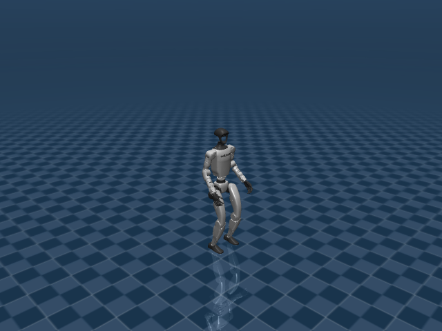

# Unitree G1 机器人资产与关节说明



G1 是 UniLab 中人形 locomotion 与 motion tracking 的核心机器人。其 29 个可控关节覆盖腿、腰和双臂，任务从速度命令行走扩展到翻转、爬箱、靠墙翻转和全身轨迹模仿。

## 机器人定位

- 用途：人形行走与全身动作追踪机器人
- 主场景：`src/unilab/assets/robots/g1/scene_flat.xml`
- 默认 keyframe：`stand`
- 资产快照：`robots/g1/assets/`

这份文档只把 `src/unilab/assets/robots/g1/` 下的机器人、场景、mesh、texture 等素材复制到博客目录。motion、checkpoint、cache 不属于机器人结构说明，未复制进文档资产目录。

## 编译模型概览

| 字段 | 数值 | 说明 |
| --- | --- | --- |
| nq | 36 | 广义坐标维度，free joint 的四元数会占 4 维 |
| nv | 35 | 广义速度维度 |
| nu | 29 | 执行器数量，也就是默认 action 维度 |
| njnt | 30 | MuJoCo 编译后的 joint 数，包含 free/object joint |
| nsensor | 21 | 传感器数量 |
| keyframes | stand | scene/task 层 keyframe |

## 资产结构

<details>
<summary>已复制文件（默认折叠，点击展开）</summary>

| 已复制文件 |
| --- |
| docs/blog/zh_CN/rl_tasks/robots/g1/assets/assets/box_tracking/largebox.obj |
| docs/blog/zh_CN/rl_tasks/robots/g1/assets/assets/climb_20_z_scale_1/box1.obj |
| docs/blog/zh_CN/rl_tasks/robots/g1/assets/assets/climb_20_z_scale_1/box2.obj |
| docs/blog/zh_CN/rl_tasks/robots/g1/assets/assets/crawl_slope/ground.obj |
| docs/blog/zh_CN/rl_tasks/robots/g1/assets/assets/crawl_slope/plateau.obj |
| docs/blog/zh_CN/rl_tasks/robots/g1/assets/assets/crawl_slope/slope.obj |
| docs/blog/zh_CN/rl_tasks/robots/g1/assets/assets/head_link.STL |
| docs/blog/zh_CN/rl_tasks/robots/g1/assets/assets/left_ankle_pitch_link.STL |
| docs/blog/zh_CN/rl_tasks/robots/g1/assets/assets/left_ankle_roll_link.STL |
| docs/blog/zh_CN/rl_tasks/robots/g1/assets/assets/left_elbow_link.STL |
| docs/blog/zh_CN/rl_tasks/robots/g1/assets/assets/left_hand_index_0_link.STL |
| docs/blog/zh_CN/rl_tasks/robots/g1/assets/assets/left_hand_index_1_link.STL |
| docs/blog/zh_CN/rl_tasks/robots/g1/assets/assets/left_hand_middle_0_link.STL |
| docs/blog/zh_CN/rl_tasks/robots/g1/assets/assets/left_hand_middle_1_link.STL |
| docs/blog/zh_CN/rl_tasks/robots/g1/assets/assets/left_hand_palm_link.STL |
| docs/blog/zh_CN/rl_tasks/robots/g1/assets/assets/left_hand_thumb_0_link.STL |
| docs/blog/zh_CN/rl_tasks/robots/g1/assets/assets/left_hand_thumb_1_link.STL |
| docs/blog/zh_CN/rl_tasks/robots/g1/assets/assets/left_hand_thumb_2_link.STL |
| docs/blog/zh_CN/rl_tasks/robots/g1/assets/assets/left_hip_pitch_link.STL |
| docs/blog/zh_CN/rl_tasks/robots/g1/assets/assets/left_hip_roll_link.STL |
| docs/blog/zh_CN/rl_tasks/robots/g1/assets/assets/left_hip_yaw_link.STL |
| docs/blog/zh_CN/rl_tasks/robots/g1/assets/assets/left_knee_link.STL |
| docs/blog/zh_CN/rl_tasks/robots/g1/assets/assets/left_rubber_hand.STL |
| docs/blog/zh_CN/rl_tasks/robots/g1/assets/assets/left_shoulder_pitch_link.STL |
| docs/blog/zh_CN/rl_tasks/robots/g1/assets/assets/left_shoulder_roll_link.STL |
| docs/blog/zh_CN/rl_tasks/robots/g1/assets/assets/left_shoulder_yaw_link.STL |
| docs/blog/zh_CN/rl_tasks/robots/g1/assets/assets/left_wrist_pitch_link.STL |
| docs/blog/zh_CN/rl_tasks/robots/g1/assets/assets/left_wrist_roll_link.STL |
| docs/blog/zh_CN/rl_tasks/robots/g1/assets/assets/left_wrist_yaw_link.STL |
| docs/blog/zh_CN/rl_tasks/robots/g1/assets/assets/logo_link.STL |
| docs/blog/zh_CN/rl_tasks/robots/g1/assets/assets/pelvis.STL |
| docs/blog/zh_CN/rl_tasks/robots/g1/assets/assets/pelvis_contour_link.STL |
| docs/blog/zh_CN/rl_tasks/robots/g1/assets/assets/right_ankle_pitch_link.STL |
| docs/blog/zh_CN/rl_tasks/robots/g1/assets/assets/right_ankle_roll_link.STL |
| docs/blog/zh_CN/rl_tasks/robots/g1/assets/assets/right_elbow_link.STL |
| docs/blog/zh_CN/rl_tasks/robots/g1/assets/assets/right_hand_index_0_link.STL |
| docs/blog/zh_CN/rl_tasks/robots/g1/assets/assets/right_hand_index_1_link.STL |
| docs/blog/zh_CN/rl_tasks/robots/g1/assets/assets/right_hand_middle_0_link.STL |
| docs/blog/zh_CN/rl_tasks/robots/g1/assets/assets/right_hand_middle_1_link.STL |
| docs/blog/zh_CN/rl_tasks/robots/g1/assets/assets/right_hand_palm_link.STL |
| docs/blog/zh_CN/rl_tasks/robots/g1/assets/assets/right_hand_thumb_0_link.STL |
| docs/blog/zh_CN/rl_tasks/robots/g1/assets/assets/right_hand_thumb_1_link.STL |
| docs/blog/zh_CN/rl_tasks/robots/g1/assets/assets/right_hand_thumb_2_link.STL |
| docs/blog/zh_CN/rl_tasks/robots/g1/assets/assets/right_hip_pitch_link.STL |
| docs/blog/zh_CN/rl_tasks/robots/g1/assets/assets/right_hip_roll_link.STL |
| docs/blog/zh_CN/rl_tasks/robots/g1/assets/assets/right_hip_yaw_link.STL |
| docs/blog/zh_CN/rl_tasks/robots/g1/assets/assets/right_knee_link.STL |
| docs/blog/zh_CN/rl_tasks/robots/g1/assets/assets/right_rubber_hand.STL |
| docs/blog/zh_CN/rl_tasks/robots/g1/assets/assets/right_shoulder_pitch_link.STL |
| docs/blog/zh_CN/rl_tasks/robots/g1/assets/assets/right_shoulder_roll_link.STL |
| docs/blog/zh_CN/rl_tasks/robots/g1/assets/assets/right_shoulder_yaw_link.STL |
| docs/blog/zh_CN/rl_tasks/robots/g1/assets/assets/right_wrist_pitch_link.STL |
| docs/blog/zh_CN/rl_tasks/robots/g1/assets/assets/right_wrist_roll_link.STL |
| docs/blog/zh_CN/rl_tasks/robots/g1/assets/assets/right_wrist_yaw_link.STL |
| docs/blog/zh_CN/rl_tasks/robots/g1/assets/assets/scene_crawl_slope.xml |
| docs/blog/zh_CN/rl_tasks/robots/g1/assets/assets/torso_link_rev_1_0.STL |
| docs/blog/zh_CN/rl_tasks/robots/g1/assets/assets/waist_roll_link_rev_1_0.STL |
| docs/blog/zh_CN/rl_tasks/robots/g1/assets/assets/waist_yaw_link_rev_1_0.STL |
| docs/blog/zh_CN/rl_tasks/robots/g1/assets/g1.xml |
| docs/blog/zh_CN/rl_tasks/robots/g1/assets/g1_sphere_hand.xml |
| docs/blog/zh_CN/rl_tasks/robots/g1/assets/hfields/hfield.png |
| docs/blog/zh_CN/rl_tasks/robots/g1/assets/locomotion_task.xml |
| docs/blog/zh_CN/rl_tasks/robots/g1/assets/scene_climb_20_z_scale_1.xml |
| docs/blog/zh_CN/rl_tasks/robots/g1/assets/scene_crawl_slope.xml |
| docs/blog/zh_CN/rl_tasks/robots/g1/assets/scene_flat.xml |
| docs/blog/zh_CN/rl_tasks/robots/g1/assets/scene_flat_with_largebox.xml |
| docs/blog/zh_CN/rl_tasks/robots/g1/assets/scene_flat_with_wall.xml |
| docs/blog/zh_CN/rl_tasks/robots/g1/assets/scene_rough.xml |
| docs/blog/zh_CN/rl_tasks/robots/g1/assets/textures/floor.png |
| docs/blog/zh_CN/rl_tasks/robots/g1/assets/textures/rocky.png |

</details>

关键 XML 片段如下。`<include>` 把纯机器人 XML 放入 scene，`<keyframe>` 留在 scene 或 task fragment 中，符合 UniLab 的资产分层约束。

```xml
<!-- src/unilab/assets/robots/g1/scene_flat.xml -->
<mujoco model="g1_29dof flat scene">
  <include file="g1.xml"/>

  <statistic center="1 -0.8 1.1" extent=".35"/>

```

## 关节说明

`free` joint 表示浮动基座或任务物体自由度，不直接对应 policy action；`controlled=是` 表示该 joint 被 actuator 直接驱动，是 action 空间的一部分。“中文含义”按机器人运动学命名拆解，用于快速理解每个关节控制的身体部位和运动方向。

| ID | 关节名称 | 中文含义 | 类型 | 有限位 | 关节限制 | 受控 |
| --- | --- | --- | --- | --- | --- | --- |
| 0 | floating_base_joint | 机器人浮动基座自由关节 | free | 否 | 无 | 否 |
| 1 | left_hip_pitch_joint | 左髋俯仰关节 | hinge | 是 | -2.531 ~ 2.88 | 是 |
| 2 | left_hip_roll_joint | 左髋侧摆关节 | hinge | 是 | -0.5236 ~ 2.967 | 是 |
| 3 | left_hip_yaw_joint | 左髋偏航关节 | hinge | 是 | -2.758 ~ 2.758 | 是 |
| 4 | left_knee_joint | 左膝关节 | hinge | 是 | -0.08727 ~ 2.88 | 是 |
| 5 | left_ankle_pitch_joint | 左踝俯仰关节 | hinge | 是 | -0.8727 ~ 0.5236 | 是 |
| 6 | left_ankle_roll_joint | 左踝侧摆关节 | hinge | 是 | -0.2618 ~ 0.2618 | 是 |
| 7 | right_hip_pitch_joint | 右髋俯仰关节 | hinge | 是 | -2.531 ~ 2.88 | 是 |
| 8 | right_hip_roll_joint | 右髋侧摆关节 | hinge | 是 | -2.967 ~ 0.5236 | 是 |
| 9 | right_hip_yaw_joint | 右髋偏航关节 | hinge | 是 | -2.758 ~ 2.758 | 是 |
| 10 | right_knee_joint | 右膝关节 | hinge | 是 | -0.08727 ~ 2.88 | 是 |
| 11 | right_ankle_pitch_joint | 右踝俯仰关节 | hinge | 是 | -0.8727 ~ 0.5236 | 是 |
| 12 | right_ankle_roll_joint | 右踝侧摆关节 | hinge | 是 | -0.2618 ~ 0.2618 | 是 |
| 13 | waist_yaw_joint | 腰偏航关节 | hinge | 是 | -2.618 ~ 2.618 | 是 |
| 14 | waist_roll_joint | 腰侧摆关节 | hinge | 是 | -0.52 ~ 0.52 | 是 |
| 15 | waist_pitch_joint | 腰俯仰关节 | hinge | 是 | -0.52 ~ 0.52 | 是 |
| 16 | left_shoulder_pitch_joint | 左肩俯仰关节 | hinge | 是 | -3.089 ~ 2.67 | 是 |
| 17 | left_shoulder_roll_joint | 左肩侧摆关节 | hinge | 是 | -1.588 ~ 2.252 | 是 |
| 18 | left_shoulder_yaw_joint | 左肩偏航关节 | hinge | 是 | -2.618 ~ 2.618 | 是 |
| 19 | left_elbow_joint | 左肘关节 | hinge | 是 | -1.047 ~ 2.094 | 是 |
| 20 | left_wrist_roll_joint | 左腕侧摆关节 | hinge | 是 | -1.972 ~ 1.972 | 是 |
| 21 | left_wrist_pitch_joint | 左腕俯仰关节 | hinge | 是 | -1.614 ~ 1.614 | 是 |
| 22 | left_wrist_yaw_joint | 左腕偏航关节 | hinge | 是 | -1.614 ~ 1.614 | 是 |
| 23 | right_shoulder_pitch_joint | 右肩俯仰关节 | hinge | 是 | -3.089 ~ 2.67 | 是 |
| 24 | right_shoulder_roll_joint | 右肩侧摆关节 | hinge | 是 | -2.252 ~ 1.588 | 是 |
| 25 | right_shoulder_yaw_joint | 右肩偏航关节 | hinge | 是 | -2.618 ~ 2.618 | 是 |
| 26 | right_elbow_joint | 右肘关节 | hinge | 是 | -1.047 ~ 2.094 | 是 |
| 27 | right_wrist_roll_joint | 右腕侧摆关节 | hinge | 是 | -1.972 ~ 1.972 | 是 |
| 28 | right_wrist_pitch_joint | 右腕俯仰关节 | hinge | 是 | -1.614 ~ 1.614 | 是 |
| 29 | right_wrist_yaw_joint | 右腕偏航关节 | hinge | 是 | -1.614 ~ 1.614 | 是 |

## 执行器说明

执行器表来自 MuJoCo 编译模型的 `actuator` 段。RL action 的每一维最终会映射到这些执行器的控制目标或控制范围。

| ID | 执行器名称 | 驱动关节 | 中文含义 | 控制范围 |
| --- | --- | --- | --- | --- |
| 0 | left_hip_pitch_joint | left_hip_pitch_joint | 左髋俯仰关节 | 未显式限制 |
| 1 | left_hip_roll_joint | left_hip_roll_joint | 左髋侧摆关节 | 未显式限制 |
| 2 | left_hip_yaw_joint | left_hip_yaw_joint | 左髋偏航关节 | 未显式限制 |
| 3 | left_knee_joint | left_knee_joint | 左膝关节 | 未显式限制 |
| 4 | left_ankle_pitch_joint | left_ankle_pitch_joint | 左踝俯仰关节 | 未显式限制 |
| 5 | left_ankle_roll_joint | left_ankle_roll_joint | 左踝侧摆关节 | 未显式限制 |
| 6 | right_hip_pitch_joint | right_hip_pitch_joint | 右髋俯仰关节 | 未显式限制 |
| 7 | right_hip_roll_joint | right_hip_roll_joint | 右髋侧摆关节 | 未显式限制 |
| 8 | right_hip_yaw_joint | right_hip_yaw_joint | 右髋偏航关节 | 未显式限制 |
| 9 | right_knee_joint | right_knee_joint | 右膝关节 | 未显式限制 |
| 10 | right_ankle_pitch_joint | right_ankle_pitch_joint | 右踝俯仰关节 | 未显式限制 |
| 11 | right_ankle_roll_joint | right_ankle_roll_joint | 右踝侧摆关节 | 未显式限制 |
| 12 | waist_yaw_joint | waist_yaw_joint | 腰偏航关节 | 未显式限制 |
| 13 | waist_roll_joint | waist_roll_joint | 腰侧摆关节 | 未显式限制 |
| 14 | waist_pitch_joint | waist_pitch_joint | 腰俯仰关节 | 未显式限制 |
| 15 | left_shoulder_pitch_joint | left_shoulder_pitch_joint | 左肩俯仰关节 | 未显式限制 |
| 16 | left_shoulder_roll_joint | left_shoulder_roll_joint | 左肩侧摆关节 | 未显式限制 |
| 17 | left_shoulder_yaw_joint | left_shoulder_yaw_joint | 左肩偏航关节 | 未显式限制 |
| 18 | left_elbow_joint | left_elbow_joint | 左肘关节 | 未显式限制 |
| 19 | left_wrist_roll_joint | left_wrist_roll_joint | 左腕侧摆关节 | 未显式限制 |
| 20 | left_wrist_pitch_joint | left_wrist_pitch_joint | 左腕俯仰关节 | 未显式限制 |
| 21 | left_wrist_yaw_joint | left_wrist_yaw_joint | 左腕偏航关节 | 未显式限制 |
| 22 | right_shoulder_pitch_joint | right_shoulder_pitch_joint | 右肩俯仰关节 | 未显式限制 |
| 23 | right_shoulder_roll_joint | right_shoulder_roll_joint | 右肩侧摆关节 | 未显式限制 |
| 24 | right_shoulder_yaw_joint | right_shoulder_yaw_joint | 右肩偏航关节 | 未显式限制 |
| 25 | right_elbow_joint | right_elbow_joint | 右肘关节 | 未显式限制 |
| 26 | right_wrist_roll_joint | right_wrist_roll_joint | 右腕侧摆关节 | 未显式限制 |
| 27 | right_wrist_pitch_joint | right_wrist_pitch_joint | 右腕俯仰关节 | 未显式限制 |
| 28 | right_wrist_yaw_joint | right_wrist_yaw_joint | 右腕偏航关节 | 未显式限制 |

## 传感器说明

传感器既包括机器人本体 IMU/速度传感器，也可能包括 scene/task fragment 增加的接触传感器。任务文档会说明哪些传感器进入 obs 或 reward。

| ID | 传感器名称 | 维度 |
| --- | --- | --- |
| 0 | pelvis_local_linvel | 3 |
| 1 | pelvis_gyro | 3 |
| 2 | pelvis_acceleration | 3 |
| 3 | pelvis_upvector | 3 |
| 4 | torso_gyro | 3 |
| 5 | torso_acceleration | 3 |
| 6 | torso_upvector | 3 |
| 7 | left_foot_pos | 3 |
| 8 | left_foot_quat | 4 |
| 9 | left_foot_upvector | 3 |
| 10 | right_foot_pos | 3 |
| 11 | right_foot_quat | 4 |
| 12 | right_foot_upvector | 3 |
| 13 | left_foot_contact_0 | 1 |
| 14 | left_foot_contact_1 | 1 |
| 15 | left_foot_contact_2 | 1 |
| 16 | left_foot_contact_3 | 1 |
| 17 | right_foot_contact_0 | 1 |
| 18 | right_foot_contact_1 | 1 |
| 19 | right_foot_contact_2 | 1 |
| 20 | right_foot_contact_3 | 1 |
