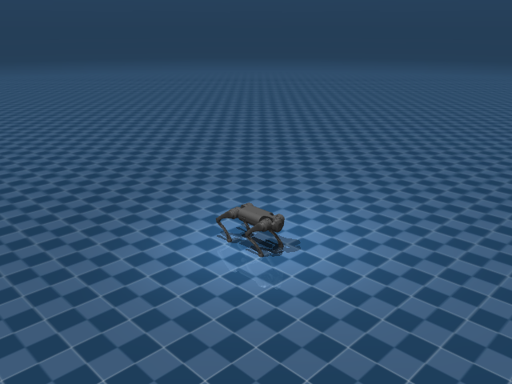

# Unitree Go1 机器人资产与关节说明



Go1 是 UniLab 中较轻量的四足运动控制基线，主要用于平地/崎岖地形 joystick 指令跟踪。资产目录同时保留纯机器人 XML、MuJoCo 扩展 XML 和 locomotion fragment，用来展示 robot/scene/task 三层边界。

## 机器人定位

- 用途：四足速度跟踪与崎岖地形基线机器人
- 主场景：`src/unilab/assets/robots/go1/scene_flat.xml`
- 默认 keyframe：`home`
- 资产快照：`robots/go1/assets/`

这份文档只把 `src/unilab/assets/robots/go1/` 下的机器人、场景、mesh、texture 等素材复制到博客目录。motion、checkpoint、cache 不属于机器人结构说明，未复制进文档资产目录。

## 编译模型概览

| 字段 | 数值 | 说明 |
| --- | --- | --- |
| nq | 19 | 广义坐标维度，free joint 的四元数会占 4 维 |
| nv | 18 | 广义速度维度 |
| nu | 12 | 执行器数量，也就是默认 action 维度 |
| njnt | 13 | MuJoCo 编译后的 joint 数，包含 free/object joint |
| nsensor | 14 | 传感器数量 |
| keyframes | home | scene/task 层 keyframe |

## 资产结构

<details>
<summary>已复制文件（默认折叠，点击展开）</summary>

| 已复制文件 |
| --- |
| docs/blog/zh_CN/rl_tasks/robots/go1/assets/assets/calf.stl |
| docs/blog/zh_CN/rl_tasks/robots/go1/assets/assets/hip.stl |
| docs/blog/zh_CN/rl_tasks/robots/go1/assets/assets/thigh.stl |
| docs/blog/zh_CN/rl_tasks/robots/go1/assets/assets/thigh_mirror.stl |
| docs/blog/zh_CN/rl_tasks/robots/go1/assets/assets/trunk.stl |
| docs/blog/zh_CN/rl_tasks/robots/go1/assets/go1.xml |
| docs/blog/zh_CN/rl_tasks/robots/go1/assets/go1_mujoco.xml |
| docs/blog/zh_CN/rl_tasks/robots/go1/assets/locomotion_task.xml |
| docs/blog/zh_CN/rl_tasks/robots/go1/assets/scene_flat.xml |

</details>

关键 XML 片段如下。`<include>` 把纯机器人 XML 放入 scene，`<keyframe>` 留在 scene 或 task fragment 中，符合 UniLab 的资产分层约束。

```xml
<!-- src/unilab/assets/robots/go1/scene_flat.xml -->
<mujoco model="go1 scene">
  <include file="go1.xml"/>

  <statistic center="0 0 0.1" extent="0.8"/>

```

## 关节说明

`free` joint 表示浮动基座或任务物体自由度，不直接对应 policy action；`controlled=是` 表示该 joint 被 actuator 直接驱动，是 action 空间的一部分。“中文含义”按机器人运动学命名拆解，用于快速理解每个关节控制的身体部位和运动方向。

| ID | 关节名称 | 中文含义 | 类型 | 有限位 | 关节限制 | 受控 |
| --- | --- | --- | --- | --- | --- | --- |
| 0 | <unnamed:0> | 机器人浮动基座自由关节 | free | 否 | 无 | 否 |
| 1 | FR_hip_joint | 右前腿髋外展/内收关节 | hinge | 是 | -0.863 ~ 0.863 | 是 |
| 2 | FR_thigh_joint | 右前腿髋俯仰（大腿）关节 | hinge | 是 | -0.686 ~ 4.501 | 是 |
| 3 | FR_calf_joint | 右前腿膝关节（小腿摆动） | hinge | 是 | -2.818 ~ -0.888 | 是 |
| 4 | FL_hip_joint | 左前腿髋外展/内收关节 | hinge | 是 | -0.863 ~ 0.863 | 是 |
| 5 | FL_thigh_joint | 左前腿髋俯仰（大腿）关节 | hinge | 是 | -0.686 ~ 4.501 | 是 |
| 6 | FL_calf_joint | 左前腿膝关节（小腿摆动） | hinge | 是 | -2.818 ~ -0.888 | 是 |
| 7 | RR_hip_joint | 右后腿髋外展/内收关节 | hinge | 是 | -0.863 ~ 0.863 | 是 |
| 8 | RR_thigh_joint | 右后腿髋俯仰（大腿）关节 | hinge | 是 | -0.686 ~ 4.501 | 是 |
| 9 | RR_calf_joint | 右后腿膝关节（小腿摆动） | hinge | 是 | -2.818 ~ -0.888 | 是 |
| 10 | RL_hip_joint | 左后腿髋外展/内收关节 | hinge | 是 | -0.863 ~ 0.863 | 是 |
| 11 | RL_thigh_joint | 左后腿髋俯仰（大腿）关节 | hinge | 是 | -0.686 ~ 4.501 | 是 |
| 12 | RL_calf_joint | 左后腿膝关节（小腿摆动） | hinge | 是 | -2.818 ~ -0.888 | 是 |

## 执行器说明

执行器表来自 MuJoCo 编译模型的 `actuator` 段。RL action 的每一维最终会映射到这些执行器的控制目标或控制范围。

| ID | 执行器名称 | 驱动关节 | 中文含义 | 控制范围 |
| --- | --- | --- | --- | --- |
| 0 | FR_hip | FR_hip_joint | 右前腿髋外展/内收关节 | -0.863 ~ 0.863 |
| 1 | FR_thigh | FR_thigh_joint | 右前腿髋俯仰（大腿）关节 | -0.686 ~ 4.501 |
| 2 | FR_calf | FR_calf_joint | 右前腿膝关节（小腿摆动） | -2.818 ~ -0.888 |
| 3 | FL_hip | FL_hip_joint | 左前腿髋外展/内收关节 | -0.863 ~ 0.863 |
| 4 | FL_thigh | FL_thigh_joint | 左前腿髋俯仰（大腿）关节 | -0.686 ~ 4.501 |
| 5 | FL_calf | FL_calf_joint | 左前腿膝关节（小腿摆动） | -2.818 ~ -0.888 |
| 6 | RR_hip | RR_hip_joint | 右后腿髋外展/内收关节 | -0.863 ~ 0.863 |
| 7 | RR_thigh | RR_thigh_joint | 右后腿髋俯仰（大腿）关节 | -0.686 ~ 4.501 |
| 8 | RR_calf | RR_calf_joint | 右后腿膝关节（小腿摆动） | -2.818 ~ -0.888 |
| 9 | RL_hip | RL_hip_joint | 左后腿髋外展/内收关节 | -0.863 ~ 0.863 |
| 10 | RL_thigh | RL_thigh_joint | 左后腿髋俯仰（大腿）关节 | -0.686 ~ 4.501 |
| 11 | RL_calf | RL_calf_joint | 左后腿膝关节（小腿摆动） | -2.818 ~ -0.888 |

## 传感器说明

传感器既包括机器人本体 IMU/速度传感器，也可能包括 scene/task fragment 增加的接触传感器。任务文档会说明哪些传感器进入 obs 或 reward。

| ID | 传感器名称 | 维度 |
| --- | --- | --- |
| 0 | gyro | 3 |
| 1 | local_linvel | 3 |
| 2 | position | 3 |
| 3 | upvector | 3 |
| 4 | global_linvel | 3 |
| 5 | global_angvel | 3 |
| 6 | FR_pos | 3 |
| 7 | FL_pos | 3 |
| 8 | RR_pos | 3 |
| 9 | RL_pos | 3 |
| 10 | FL_foot_contact | 3 |
| 11 | FR_foot_contact | 3 |
| 12 | RL_foot_contact | 3 |
| 13 | RR_foot_contact | 3 |
