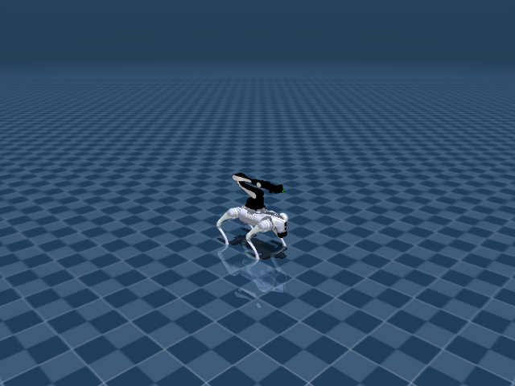

# Go2 + Airbot Arm 机器人资产与关节说明



Go2Arm 将 Go2 四足底盘和 6 DoF 机械臂组合成移动操作任务资产。它的文档重点区分底盘 locomotion action 与机械臂关节 action，以及目标物体距离类 reward。

## 机器人定位

- 用途：四足移动操作机器人
- 主场景：`src/unilab/assets/robots/go2_arm/scene_flat.xml`
- 默认 keyframe：`home`
- 资产快照：`robots/go2_arm/assets/`

这份文档只把 `src/unilab/assets/robots/go2_arm/` 下的机器人、场景、mesh、texture 等素材复制到博客目录。motion、checkpoint、cache 不属于机器人结构说明，未复制进文档资产目录。

## 编译模型概览

| 字段 | 数值 | 说明 |
| --- | --- | --- |
| nq | 25 | 广义坐标维度，free joint 的四元数会占 4 维 |
| nv | 24 | 广义速度维度 |
| nu | 18 | 执行器数量，也就是默认 action 维度 |
| njnt | 19 | MuJoCo 编译后的 joint 数，包含 free/object joint |
| nsensor | 97 | 传感器数量 |
| keyframes | home | scene/task 层 keyframe |

## 资产结构

<details>
<summary>已复制文件（默认折叠，点击展开）</summary>

| 已复制文件 |
| --- |
| docs/blog/zh_CN/rl_tasks/robots/go2_arm/assets/assets/arm_base_0.obj |
| docs/blog/zh_CN/rl_tasks/robots/go2_arm/assets/assets/arm_base_1.obj |
| docs/blog/zh_CN/rl_tasks/robots/go2_arm/assets/assets/left.obj |
| docs/blog/zh_CN/rl_tasks/robots/go2_arm/assets/assets/link1.obj |
| docs/blog/zh_CN/rl_tasks/robots/go2_arm/assets/assets/link2_0.obj |
| docs/blog/zh_CN/rl_tasks/robots/go2_arm/assets/assets/link2_1.obj |
| docs/blog/zh_CN/rl_tasks/robots/go2_arm/assets/assets/link3_0.obj |
| docs/blog/zh_CN/rl_tasks/robots/go2_arm/assets/assets/link3_1.obj |
| docs/blog/zh_CN/rl_tasks/robots/go2_arm/assets/assets/link4.obj |
| docs/blog/zh_CN/rl_tasks/robots/go2_arm/assets/assets/link5_0.obj |
| docs/blog/zh_CN/rl_tasks/robots/go2_arm/assets/assets/link5_1.obj |
| docs/blog/zh_CN/rl_tasks/robots/go2_arm/assets/assets/link6.obj |
| docs/blog/zh_CN/rl_tasks/robots/go2_arm/assets/assets/new_base_link.STL |
| docs/blog/zh_CN/rl_tasks/robots/go2_arm/assets/assets/right.obj |
| docs/blog/zh_CN/rl_tasks/robots/go2_arm/assets/assets/slider_base_link_0.STL |
| docs/blog/zh_CN/rl_tasks/robots/go2_arm/assets/go2_with_arm_mjx_full_collision.xml |
| docs/blog/zh_CN/rl_tasks/robots/go2_arm/assets/scene_flat.xml |

</details>

关键 XML 片段如下。`<include>` 把纯机器人 XML 放入 scene，`<keyframe>` 留在 scene 或 task fragment 中，符合 UniLab 的资产分层约束。

```xml
<!-- src/unilab/assets/robots/go2_arm/scene_flat.xml -->
<mujoco model="go2 scene">
  <include file="go2_with_arm_mjx_full_collision.xml"/>

  <statistic center="0 0 0.1" extent="0.8" meansize="0.04"/>

```

## 关节说明

`free` joint 表示浮动基座或任务物体自由度，不直接对应 policy action；`controlled=是` 表示该 joint 被 actuator 直接驱动，是 action 空间的一部分。“中文含义”按机器人运动学命名拆解，用于快速理解每个关节控制的身体部位和运动方向。

| ID | 关节名称 | 中文含义 | 类型 | 有限位 | 关节限制 | 受控 |
| --- | --- | --- | --- | --- | --- | --- |
| 0 | <unnamed:0> | 机器人浮动基座自由关节 | free | 否 | 无 | 否 |
| 1 | FL_hip_joint | 左前腿髋外展/内收关节 | hinge | 是 | -1.047 ~ 1.047 | 是 |
| 2 | FL_thigh_joint | 左前腿髋俯仰（大腿）关节 | hinge | 是 | -1.571 ~ 3.491 | 是 |
| 3 | FL_calf_joint | 左前腿膝关节（小腿摆动） | hinge | 是 | -2.723 ~ -0.8378 | 是 |
| 4 | FR_hip_joint | 右前腿髋外展/内收关节 | hinge | 是 | -1.047 ~ 1.047 | 是 |
| 5 | FR_thigh_joint | 右前腿髋俯仰（大腿）关节 | hinge | 是 | -1.571 ~ 3.491 | 是 |
| 6 | FR_calf_joint | 右前腿膝关节（小腿摆动） | hinge | 是 | -2.723 ~ -0.8378 | 是 |
| 7 | RL_hip_joint | 左后腿髋外展/内收关节 | hinge | 是 | -1.047 ~ 1.047 | 是 |
| 8 | RL_thigh_joint | 左后腿髋俯仰（大腿）关节 | hinge | 是 | -1.571 ~ 3.491 | 是 |
| 9 | RL_calf_joint | 左后腿膝关节（小腿摆动） | hinge | 是 | -2.723 ~ -0.8378 | 是 |
| 10 | RR_hip_joint | 右后腿髋外展/内收关节 | hinge | 是 | -1.047 ~ 1.047 | 是 |
| 11 | RR_thigh_joint | 右后腿髋俯仰（大腿）关节 | hinge | 是 | -1.571 ~ 3.491 | 是 |
| 12 | RR_calf_joint | 右后腿膝关节（小腿摆动） | hinge | 是 | -2.723 ~ -0.8378 | 是 |
| 13 | joint1 | 机械臂第 1 轴关节 | hinge | 是 | -3.142 ~ 2.094 | 是 |
| 14 | joint2 | 机械臂第 2 轴关节 | hinge | 是 | -2.967 ~ 0.1745 | 是 |
| 15 | joint3 | 机械臂第 3 轴关节 | hinge | 是 | -0.08727 ~ 3.142 | 是 |
| 16 | joint4 | 机械臂第 4 轴关节 | hinge | 是 | -3.011 ~ 3.011 | 是 |
| 17 | joint5 | 机械臂第 5 轴关节 | hinge | 是 | -1.763 ~ 1.763 | 是 |
| 18 | joint6 | 机械臂第 6 轴关节 | hinge | 是 | -3.011 ~ 3.011 | 是 |

## 执行器说明

执行器表来自 MuJoCo 编译模型的 `actuator` 段。RL action 的每一维最终会映射到这些执行器的控制目标或控制范围。

| ID | 执行器名称 | 驱动关节 | 中文含义 | 控制范围 |
| --- | --- | --- | --- | --- |
| 0 | FL_hip | FL_hip_joint | 左前腿髋外展/内收关节 | -0.9472 ~ 0.9472 |
| 1 | FL_thigh | FL_thigh_joint | 左前腿髋俯仰（大腿）关节 | -1.4 ~ 2.5 |
| 2 | FL_calf | FL_calf_joint | 左前腿膝关节（小腿摆动） | -2.623 ~ -0.8478 |
| 3 | FR_hip | FR_hip_joint | 右前腿髋外展/内收关节 | -0.9472 ~ 0.9472 |
| 4 | FR_thigh | FR_thigh_joint | 右前腿髋俯仰（大腿）关节 | -1.4 ~ 2.5 |
| 5 | FR_calf | FR_calf_joint | 右前腿膝关节（小腿摆动） | -2.623 ~ -0.8478 |
| 6 | RL_hip | RL_hip_joint | 左后腿髋外展/内收关节 | -0.9472 ~ 0.9472 |
| 7 | RL_thigh | RL_thigh_joint | 左后腿髋俯仰（大腿）关节 | -1.4 ~ 2.5 |
| 8 | RL_calf | RL_calf_joint | 左后腿膝关节（小腿摆动） | -2.623 ~ -0.8478 |
| 9 | RR_hip | RR_hip_joint | 右后腿髋外展/内收关节 | -0.9472 ~ 0.9472 |
| 10 | RR_thigh | RR_thigh_joint | 右后腿髋俯仰（大腿）关节 | -1.4 ~ 2.5 |
| 11 | RR_calf | RR_calf_joint | 右后腿膝关节（小腿摆动） | -2.623 ~ -0.8478 |
| 12 | <unnamed:12> | joint1 | 机械臂第 1 轴关节 | -3.142 ~ 2.094 |
| 13 | <unnamed:13> | joint2 | 机械臂第 2 轴关节 | -2.967 ~ 0.1745 |
| 14 | <unnamed:14> | joint3 | 机械臂第 3 轴关节 | -0.08727 ~ 3.142 |
| 15 | <unnamed:15> | joint4 | 机械臂第 4 轴关节 | -3.011 ~ 3.011 |
| 16 | <unnamed:16> | joint5 | 机械臂第 5 轴关节 | -1.763 ~ 1.763 |
| 17 | <unnamed:17> | joint6 | 机械臂第 6 轴关节 | -3.011 ~ 3.011 |

## 传感器说明

传感器既包括机器人本体 IMU/速度传感器，也可能包括 scene/task fragment 增加的接触传感器。任务文档会说明哪些传感器进入 obs 或 reward。

| ID | 传感器名称 | 维度 |
| --- | --- | --- |
| 0 | abduction_front_left_pos | 1 |
| 1 | hip_front_left_pos | 1 |
| 2 | knee_front_left_pos | 1 |
| 3 | abduction_hind_left_pos | 1 |
| 4 | hip_hind_left_pos | 1 |
| 5 | knee_hind_left_pos | 1 |
| 6 | abduction_front_right_pos | 1 |
| 7 | hip_front_right_pos | 1 |
| 8 | knee_front_right_pos | 1 |
| 9 | abduction_hind_right_pos | 1 |
| 10 | hip_hind_right_pos | 1 |
| 11 | knee_hind_right_pos | 1 |
| 12 | abduction_front_left_vel | 1 |
| 13 | hip_front_left_vel | 1 |
| 14 | knee_front_left_vel | 1 |
| 15 | abduction_hind_left_vel | 1 |
| 16 | hip_hind_left_vel | 1 |
| 17 | knee_hind_left_vel | 1 |
| 18 | abduction_front_right_vel | 1 |
| 19 | hip_front_right_vel | 1 |
| 20 | knee_front_right_vel | 1 |
| 21 | abduction_hind_right_vel | 1 |
| 22 | hip_hind_right_vel | 1 |
| 23 | knee_hind_right_vel | 1 |
| 24 | gyro | 3 |
| 25 | accelerometer | 3 |
| 26 | local_linvel | 3 |
| 27 | upvector | 3 |
| 28 | orientation | 4 |
| 29 | global_position | 3 |
| 30 | global_linvel | 3 |
| 31 | global_angvel | 3 |
| 32 | FR_global_linvel | 3 |
| 33 | FL_global_linvel | 3 |
| 34 | RR_global_linvel | 3 |
| 35 | RL_global_linvel | 3 |
| 36 | FR_pos | 3 |
| 37 | FL_pos | 3 |
| 38 | RR_pos | 3 |
| 39 | RL_pos | 3 |
| 40 | joint1_pos | 1 |
| 41 | joint2_pos | 1 |
| 42 | joint3_pos | 1 |
| 43 | joint4_pos | 1 |
| 44 | joint5_pos | 1 |
| 45 | joint6_pos | 1 |
| 46 | joint1_vel | 1 |
| 47 | joint2_vel | 1 |
| 48 | joint3_vel | 1 |
| 49 | joint4_vel | 1 |
| 50 | joint5_vel | 1 |
| 51 | joint6_vel | 1 |
| 52 | joint1_torque | 1 |
| 53 | joint2_torque | 1 |
| 54 | joint3_torque | 1 |
| 55 | joint4_torque | 1 |
| 56 | joint5_torque | 1 |
| 57 | joint6_torque | 1 |
| 58 | endpoint_pos | 3 |
| 59 | endpoint_quat | 4 |
| 60 | endpoint_vel | 3 |
| 61 | endpoint_relative_pos | 3 |
| 62 | endpoint_relative_quat | 4 |
| 63 | armbasepoint_world_pos | 3 |
| 64 | armbasepoint_world_quat | 4 |
| 65 | arm_touch_base | 1 |
| 66 | arm_touch_link1 | 1 |
| 67 | arm_touch_link2 | 1 |
| 68 | arm_touch_link3 | 1 |
| 69 | arm_touch_link4 | 1 |
| 70 | arm_touch_link5 | 1 |
| 71 | arm_touch_link6 | 1 |
| 72 | arm_touch_eef | 1 |
| 73 | arm_touch_g2base | 1 |
| 74 | FL_foot_contact | 1 |
| 75 | FR_foot_contact | 1 |
| 76 | RL_foot_contact | 1 |
| 77 | RR_foot_contact | 1 |
| 78 | base1_contact | 1 |
| 79 | base2_contact | 1 |
| 80 | base3_contact | 1 |
| 81 | FL_hip_contact | 1 |
| 82 | FR_hip_contact | 1 |
| 83 | RL_hip_contact | 1 |
| 84 | RR_hip_contact | 1 |
| 85 | FL_thigh_contact | 1 |
| 86 | FR_thigh_contact | 1 |
| 87 | RL_thigh_contact | 1 |
| 88 | RR_thigh_contact | 1 |
| 89 | FL_calf_contact1 | 1 |
| 90 | FR_calf_contact1 | 1 |
| 91 | RL_calf_contact1 | 1 |
| 92 | RR_calf_contact1 | 1 |
| 93 | FL_calf_contact2 | 1 |
| 94 | FR_calf_contact2 | 1 |
| 95 | RL_calf_contact2 | 1 |
| 96 | RR_calf_contact2 | 1 |
