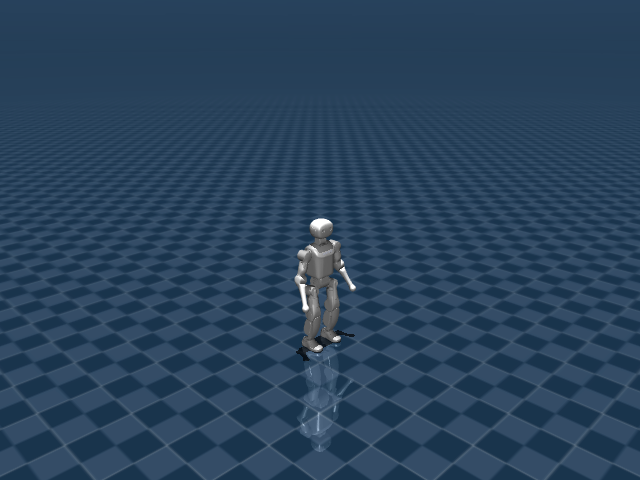

# Booster K1 机器人资产与关节说明



K1 使用 22 DoF 可控人形模型，既用于稳定行走，也用于带球盘带。足球任务在 scene 中加入球体自由关节，机器人 XML 本身仍保持纯机器人描述。

## 机器人定位

- 用途：人形行走与足球盘带机器人
- 主场景：`src/unilab/assets/robots/k1/scene_flat.xml`
- 默认 keyframe：`stand`
- 资产快照：`robots/k1/assets/`

这份文档只把 `src/unilab/assets/robots/k1/` 下的机器人、场景、mesh、texture 等素材复制到博客目录。motion、checkpoint、cache 不属于机器人结构说明，未复制进文档资产目录。

## 编译模型概览

| 字段 | 数值 | 说明 |
| --- | --- | --- |
| nq | 29 | 广义坐标维度，free joint 的四元数会占 4 维 |
| nv | 28 | 广义速度维度 |
| nu | 22 | 执行器数量，也就是默认 action 维度 |
| njnt | 23 | MuJoCo 编译后的 joint 数，包含 free/object joint |
| nsensor | 9 | 传感器数量 |
| keyframes | stand | scene/task 层 keyframe |

## 资产结构

<details>
<summary>已复制文件（默认折叠，点击展开）</summary>

| 已复制文件 |
| --- |
| docs/blog/zh_CN/rl_tasks/robots/k1/assets/k1.xml |
| docs/blog/zh_CN/rl_tasks/robots/k1/assets/meshes/Head_1.STL |
| docs/blog/zh_CN/rl_tasks/robots/k1/assets/meshes/Head_2.STL |
| docs/blog/zh_CN/rl_tasks/robots/k1/assets/meshes/Head_2_Collision.STL |
| docs/blog/zh_CN/rl_tasks/robots/k1/assets/meshes/Head_2_ZED.STL |
| docs/blog/zh_CN/rl_tasks/robots/k1/assets/meshes/K1_left_foot.STL |
| docs/blog/zh_CN/rl_tasks/robots/k1/assets/meshes/K1logo.STL |
| docs/blog/zh_CN/rl_tasks/robots/k1/assets/meshes/L1_XX_Ball.STL |
| docs/blog/zh_CN/rl_tasks/robots/k1/assets/meshes/L1_X_Ball.STL |
| docs/blog/zh_CN/rl_tasks/robots/k1/assets/meshes/L1_Y_Ball.STL |
| docs/blog/zh_CN/rl_tasks/robots/k1/assets/meshes/L2_XX_Ball.STL |
| docs/blog/zh_CN/rl_tasks/robots/k1/assets/meshes/L2_X_Ball.STL |
| docs/blog/zh_CN/rl_tasks/robots/k1/assets/meshes/L2_Y_Ball.STL |
| docs/blog/zh_CN/rl_tasks/robots/k1/assets/meshes/Left_Ankle_Cross.STL |
| docs/blog/zh_CN/rl_tasks/robots/k1/assets/meshes/Left_Arm_1.STL |
| docs/blog/zh_CN/rl_tasks/robots/k1/assets/meshes/Left_Arm_2.STL |
| docs/blog/zh_CN/rl_tasks/robots/k1/assets/meshes/Left_Arm_3.STL |
| docs/blog/zh_CN/rl_tasks/robots/k1/assets/meshes/Left_Arm_4.STL |
| docs/blog/zh_CN/rl_tasks/robots/k1/assets/meshes/Left_Crank_Down.STL |
| docs/blog/zh_CN/rl_tasks/robots/k1/assets/meshes/Left_Crank_Up.STL |
| docs/blog/zh_CN/rl_tasks/robots/k1/assets/meshes/Left_Foot.STL |
| docs/blog/zh_CN/rl_tasks/robots/k1/assets/meshes/Left_Foot_Collision.STL |
| docs/blog/zh_CN/rl_tasks/robots/k1/assets/meshes/Left_Foot_old.STL |
| docs/blog/zh_CN/rl_tasks/robots/k1/assets/meshes/Left_Hip_Pitch.STL |
| docs/blog/zh_CN/rl_tasks/robots/k1/assets/meshes/Left_Hip_Roll.STL |
| docs/blog/zh_CN/rl_tasks/robots/k1/assets/meshes/Left_Hip_Yaw.STL |
| docs/blog/zh_CN/rl_tasks/robots/k1/assets/meshes/Left_Link_Long.STL |
| docs/blog/zh_CN/rl_tasks/robots/k1/assets/meshes/Left_Link_Short.STL |
| docs/blog/zh_CN/rl_tasks/robots/k1/assets/meshes/Left_Shank.STL |
| docs/blog/zh_CN/rl_tasks/robots/k1/assets/meshes/R1_XX_Ball.STL |
| docs/blog/zh_CN/rl_tasks/robots/k1/assets/meshes/R1_X_Ball.STL |
| docs/blog/zh_CN/rl_tasks/robots/k1/assets/meshes/R1_Y_Ball.STL |
| docs/blog/zh_CN/rl_tasks/robots/k1/assets/meshes/R2_XX_Ball.STL |
| docs/blog/zh_CN/rl_tasks/robots/k1/assets/meshes/R2_X_Ball.STL |
| docs/blog/zh_CN/rl_tasks/robots/k1/assets/meshes/R2_Y_Ball.STL |
| docs/blog/zh_CN/rl_tasks/robots/k1/assets/meshes/Right_Ankle_Cross.STL |
| docs/blog/zh_CN/rl_tasks/robots/k1/assets/meshes/Right_Arm_1.STL |
| docs/blog/zh_CN/rl_tasks/robots/k1/assets/meshes/Right_Arm_2.STL |
| docs/blog/zh_CN/rl_tasks/robots/k1/assets/meshes/Right_Arm_3.STL |
| docs/blog/zh_CN/rl_tasks/robots/k1/assets/meshes/Right_Arm_4.STL |
| docs/blog/zh_CN/rl_tasks/robots/k1/assets/meshes/Right_Crank_Down.STL |
| docs/blog/zh_CN/rl_tasks/robots/k1/assets/meshes/Right_Crank_Up.STL |
| docs/blog/zh_CN/rl_tasks/robots/k1/assets/meshes/Right_Foot.STL |
| docs/blog/zh_CN/rl_tasks/robots/k1/assets/meshes/Right_Foot_Collision.STL |
| docs/blog/zh_CN/rl_tasks/robots/k1/assets/meshes/Right_Foot_old.STL |
| docs/blog/zh_CN/rl_tasks/robots/k1/assets/meshes/Right_Hip_Pitch.STL |
| docs/blog/zh_CN/rl_tasks/robots/k1/assets/meshes/Right_Hip_Roll.STL |
| docs/blog/zh_CN/rl_tasks/robots/k1/assets/meshes/Right_Hip_Yaw.STL |
| docs/blog/zh_CN/rl_tasks/robots/k1/assets/meshes/Right_Link_Long.STL |
| docs/blog/zh_CN/rl_tasks/robots/k1/assets/meshes/Right_Link_Short.STL |
| docs/blog/zh_CN/rl_tasks/robots/k1/assets/meshes/Right_Shank.STL |
| docs/blog/zh_CN/rl_tasks/robots/k1/assets/meshes/Trunk.STL |
| docs/blog/zh_CN/rl_tasks/robots/k1/assets/meshes/Trunk_Collision.STL |
| docs/blog/zh_CN/rl_tasks/robots/k1/assets/meshes/soccer_ball/Robot_Football.obj |
| docs/blog/zh_CN/rl_tasks/robots/k1/assets/meshes/soccer_ball/Robot_Football.png |
| docs/blog/zh_CN/rl_tasks/robots/k1/assets/scene_flat.xml |
| docs/blog/zh_CN/rl_tasks/robots/k1/assets/scene_soccer_dribble_minimal.xml |
| docs/blog/zh_CN/rl_tasks/robots/k1/assets/soccer_ball/Robot_Football.obj |
| docs/blog/zh_CN/rl_tasks/robots/k1/assets/soccer_ball/Robot_Football.png |

</details>

关键 XML 片段如下。`<include>` 把纯机器人 XML 放入 scene，`<keyframe>` 留在 scene 或 task fragment 中，符合 UniLab 的资产分层约束。

```xml
<!-- src/unilab/assets/robots/k1/scene_flat.xml -->
<mujoco model="k1 flat scene">
  <include file="k1.xml"/>

  <statistic center="0 0 0.55" extent="0.8"/>

```

## 关节说明

`free` joint 表示浮动基座或任务物体自由度，不直接对应 policy action；`controlled=是` 表示该 joint 被 actuator 直接驱动，是 action 空间的一部分。“中文含义”按机器人运动学命名拆解，用于快速理解每个关节控制的身体部位和运动方向。

| ID | 关节名称 | 中文含义 | 类型 | 有限位 | 关节限制 | 受控 |
| --- | --- | --- | --- | --- | --- | --- |
| 0 | world_joint | 机器人浮动基座自由关节 | free | 否 | 无 | 否 |
| 1 | AAHead_yaw | 头部偏航关节 | hinge | 是 | -1 ~ 1 | 是 |
| 2 | Head_pitch | 头部俯仰关节 | hinge | 是 | -0.349 ~ 0.855 | 是 |
| 3 | ALeft_Shoulder_Pitch | 肩俯仰关节 | hinge | 是 | -3.316 ~ 1.22 | 是 |
| 4 | Left_Shoulder_Roll | 左肩侧摆关节 | hinge | 是 | -1.74 ~ 1.57 | 是 |
| 5 | Left_Elbow_Pitch | 左肘俯仰关节 | hinge | 是 | -2.27 ~ 2.27 | 是 |
| 6 | Left_Elbow_Yaw | 左肘偏航关节 | hinge | 是 | -2.44 ~ 0 | 是 |
| 7 | ARight_Shoulder_Pitch | 肩俯仰关节 | hinge | 是 | -3.316 ~ 1.22 | 是 |
| 8 | Right_Shoulder_Roll | 右肩侧摆关节 | hinge | 是 | -1.57 ~ 1.74 | 是 |
| 9 | Right_Elbow_Pitch | 右肘俯仰关节 | hinge | 是 | -2.27 ~ 2.27 | 是 |
| 10 | Right_Elbow_Yaw | 右肘偏航关节 | hinge | 是 | 0 ~ 2.44 | 是 |
| 11 | Left_Hip_Pitch | 左髋俯仰关节 | hinge | 是 | -3 ~ 2.21 | 是 |
| 12 | Left_Hip_Roll | 左髋侧摆关节 | hinge | 是 | -0.4 ~ 1.57 | 是 |
| 13 | Left_Hip_Yaw | 左髋偏航关节 | hinge | 是 | -1 ~ 1 | 是 |
| 14 | Left_Knee_Pitch | 左膝俯仰关节 | hinge | 是 | 0 ~ 2.23 | 是 |
| 15 | Left_Ankle_Pitch | 左踝俯仰关节 | hinge | 是 | -0.87 ~ 0.345 | 是 |
| 16 | Left_Ankle_Roll | 左踝侧摆关节 | hinge | 是 | -0.345 ~ 0.345 | 是 |
| 17 | Right_Hip_Pitch | 右髋俯仰关节 | hinge | 是 | -3 ~ 2.21 | 是 |
| 18 | Right_Hip_Roll | 右髋侧摆关节 | hinge | 是 | -1.57 ~ 0.4 | 是 |
| 19 | Right_Hip_Yaw | 右髋偏航关节 | hinge | 是 | -1 ~ 1 | 是 |
| 20 | Right_Knee_Pitch | 右膝俯仰关节 | hinge | 是 | 0 ~ 2.23 | 是 |
| 21 | Right_Ankle_Pitch | 右踝俯仰关节 | hinge | 是 | -0.87 ~ 0.345 | 是 |
| 22 | Right_Ankle_Roll | 右踝侧摆关节 | hinge | 是 | -0.345 ~ 0.345 | 是 |

## 执行器说明

执行器表来自 MuJoCo 编译模型的 `actuator` 段。RL action 的每一维最终会映射到这些执行器的控制目标或控制范围。

| ID | 执行器名称 | 驱动关节 | 中文含义 | 控制范围 |
| --- | --- | --- | --- | --- |
| 0 | AAHead_yaw | AAHead_yaw | 头部偏航关节 | 未显式限制 |
| 1 | Head_pitch | Head_pitch | 头部俯仰关节 | 未显式限制 |
| 2 | ALeft_Shoulder_Pitch | ALeft_Shoulder_Pitch | 肩俯仰关节 | 未显式限制 |
| 3 | Left_Shoulder_Roll | Left_Shoulder_Roll | 左肩侧摆关节 | 未显式限制 |
| 4 | Left_Elbow_Pitch | Left_Elbow_Pitch | 左肘俯仰关节 | 未显式限制 |
| 5 | Left_Elbow_Yaw | Left_Elbow_Yaw | 左肘偏航关节 | 未显式限制 |
| 6 | ARight_Shoulder_Pitch | ARight_Shoulder_Pitch | 肩俯仰关节 | 未显式限制 |
| 7 | Right_Shoulder_Roll | Right_Shoulder_Roll | 右肩侧摆关节 | 未显式限制 |
| 8 | Right_Elbow_Pitch | Right_Elbow_Pitch | 右肘俯仰关节 | 未显式限制 |
| 9 | Right_Elbow_Yaw | Right_Elbow_Yaw | 右肘偏航关节 | 未显式限制 |
| 10 | Left_Hip_Pitch | Left_Hip_Pitch | 左髋俯仰关节 | 未显式限制 |
| 11 | Left_Hip_Roll | Left_Hip_Roll | 左髋侧摆关节 | 未显式限制 |
| 12 | Left_Hip_Yaw | Left_Hip_Yaw | 左髋偏航关节 | 未显式限制 |
| 13 | Left_Knee_Pitch | Left_Knee_Pitch | 左膝俯仰关节 | 未显式限制 |
| 14 | Left_Ankle_Pitch | Left_Ankle_Pitch | 左踝俯仰关节 | 未显式限制 |
| 15 | Left_Ankle_Roll | Left_Ankle_Roll | 左踝侧摆关节 | 未显式限制 |
| 16 | Right_Hip_Pitch | Right_Hip_Pitch | 右髋俯仰关节 | 未显式限制 |
| 17 | Right_Hip_Roll | Right_Hip_Roll | 右髋侧摆关节 | 未显式限制 |
| 18 | Right_Hip_Yaw | Right_Hip_Yaw | 右髋偏航关节 | 未显式限制 |
| 19 | Right_Knee_Pitch | Right_Knee_Pitch | 右膝俯仰关节 | 未显式限制 |
| 20 | Right_Ankle_Pitch | Right_Ankle_Pitch | 右踝俯仰关节 | 未显式限制 |
| 21 | Right_Ankle_Roll | Right_Ankle_Roll | 右踝侧摆关节 | 未显式限制 |

## 传感器说明

传感器既包括机器人本体 IMU/速度传感器，也可能包括 scene/task fragment 增加的接触传感器。任务文档会说明哪些传感器进入 obs 或 reward。

| ID | 传感器名称 | 维度 |
| --- | --- | --- |
| 0 | trunk_local_linvel | 3 |
| 1 | trunk_gyro | 3 |
| 2 | trunk_upvector | 3 |
| 3 | left_foot_pos | 3 |
| 4 | left_foot_quat | 4 |
| 5 | right_foot_pos | 3 |
| 6 | right_foot_quat | 4 |
| 7 | left_foot_contact_0 | 1 |
| 8 | right_foot_contact_0 | 1 |
