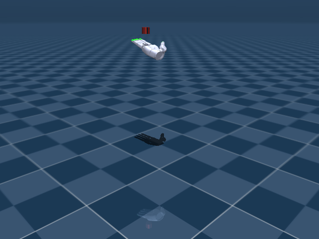

# Sharpa Wave Hand 机器人资产与关节说明



Sharpa Wave 是带触觉/接触建模的 22 DoF 灵巧手，场景中包含被操作圆柱物体。文档会把手部执行器、物体自由关节和接触传感器分开说明。

## 机器人定位

- 用途：触觉灵巧手旋转与抓取任务
- 主场景：`src/unilab/assets/robots/sharpa_wave/scene.xml`
- 默认 keyframe：`home`
- 资产快照：`robots/sharpa_wave/assets/`

这份文档只把 `src/unilab/assets/robots/sharpa_wave/` 下的机器人、场景、mesh、texture 等素材复制到博客目录。motion、checkpoint、cache 不属于机器人结构说明，未复制进文档资产目录。

## 编译模型概览

| 字段 | 数值 | 说明 |
| --- | --- | --- |
| nq | 29 | 广义坐标维度，free joint 的四元数会占 4 维 |
| nv | 28 | 广义速度维度 |
| nu | 22 | 执行器数量，也就是默认 action 维度 |
| njnt | 23 | MuJoCo 编译后的 joint 数，包含 free/object joint |
| nsensor | 10 | 传感器数量 |
| keyframes | home | scene/task 层 keyframe |

## 资产结构

<details>
<summary>已复制文件（默认折叠，点击展开）</summary>

| 已复制文件 |
| --- |
| docs/blog/zh_CN/rl_tasks/robots/sharpa_wave/assets/meshes/DP_HB1_4F.STL |
| docs/blog/zh_CN/rl_tasks/robots/sharpa_wave/assets/meshes/DP_HB1_TH.STL |
| docs/blog/zh_CN/rl_tasks/robots/sharpa_wave/assets/meshes/DP_Visual_HB1_TH.STL |
| docs/blog/zh_CN/rl_tasks/robots/sharpa_wave/assets/meshes/DP_elastomer.STL |
| docs/blog/zh_CN/rl_tasks/robots/sharpa_wave/assets/meshes/DP_elastomer_HB1_4F.STL |
| docs/blog/zh_CN/rl_tasks/robots/sharpa_wave/assets/meshes/DP_elastomer_HB1_TH.STL |
| docs/blog/zh_CN/rl_tasks/robots/sharpa_wave/assets/meshes/DP_visual_HB1_4F.STL |
| docs/blog/zh_CN/rl_tasks/robots/sharpa_wave/assets/meshes/MCP_VL.STL |
| docs/blog/zh_CN/rl_tasks/robots/sharpa_wave/assets/meshes/elastomer.STL |
| docs/blog/zh_CN/rl_tasks/robots/sharpa_wave/assets/meshes/elastomer_HB1_4F.STL |
| docs/blog/zh_CN/rl_tasks/robots/sharpa_wave/assets/meshes/elastomer_HB1_TH.STL |
| docs/blog/zh_CN/rl_tasks/robots/sharpa_wave/assets/meshes/elastomer_surface.STL |
| docs/blog/zh_CN/rl_tasks/robots/sharpa_wave/assets/meshes/flange_A.STL |
| docs/blog/zh_CN/rl_tasks/robots/sharpa_wave/assets/meshes/flange_B.STL |
| docs/blog/zh_CN/rl_tasks/robots/sharpa_wave/assets/meshes/right_DP.STL |
| docs/blog/zh_CN/rl_tasks/robots/sharpa_wave/assets/meshes/right_DP_visual.STL |
| docs/blog/zh_CN/rl_tasks/robots/sharpa_wave/assets/meshes/right_MCP_VL_visual.STL |
| docs/blog/zh_CN/rl_tasks/robots/sharpa_wave/assets/meshes/right_MP.STL |
| docs/blog/zh_CN/rl_tasks/robots/sharpa_wave/assets/meshes/right_MP_visual.STL |
| docs/blog/zh_CN/rl_tasks/robots/sharpa_wave/assets/meshes/right_PP.STL |
| docs/blog/zh_CN/rl_tasks/robots/sharpa_wave/assets/meshes/right_PP_visual.STL |
| docs/blog/zh_CN/rl_tasks/robots/sharpa_wave/assets/meshes/right_hand_C_MC.STL |
| docs/blog/zh_CN/rl_tasks/robots/sharpa_wave/assets/meshes/right_hand_C_MC_visual.STL |
| docs/blog/zh_CN/rl_tasks/robots/sharpa_wave/assets/meshes/right_hand_C_MC_visual_.STL |
| docs/blog/zh_CN/rl_tasks/robots/sharpa_wave/assets/meshes/right_pinky_MC.STL |
| docs/blog/zh_CN/rl_tasks/robots/sharpa_wave/assets/meshes/right_pinky_MC_visual.STL |
| docs/blog/zh_CN/rl_tasks/robots/sharpa_wave/assets/meshes/right_thumb_CMC_VL_visual.STL |
| docs/blog/zh_CN/rl_tasks/robots/sharpa_wave/assets/meshes/right_thumb_DP.STL |
| docs/blog/zh_CN/rl_tasks/robots/sharpa_wave/assets/meshes/right_thumb_DP_visual.STL |
| docs/blog/zh_CN/rl_tasks/robots/sharpa_wave/assets/meshes/right_thumb_MC.STL |
| docs/blog/zh_CN/rl_tasks/robots/sharpa_wave/assets/meshes/right_thumb_MCP_VL_visual.STL |
| docs/blog/zh_CN/rl_tasks/robots/sharpa_wave/assets/meshes/right_thumb_MC_visual.STL |
| docs/blog/zh_CN/rl_tasks/robots/sharpa_wave/assets/meshes/right_thumb_PP.STL |
| docs/blog/zh_CN/rl_tasks/robots/sharpa_wave/assets/meshes/right_thumb_PP_visual.STL |
| docs/blog/zh_CN/rl_tasks/robots/sharpa_wave/assets/meshes/thumb_DP_elastomer.STL |
| docs/blog/zh_CN/rl_tasks/robots/sharpa_wave/assets/meshes/thumb_elastomer.STL |
| docs/blog/zh_CN/rl_tasks/robots/sharpa_wave/assets/meshes/thumb_elastomer_surface.STL |
| docs/blog/zh_CN/rl_tasks/robots/sharpa_wave/assets/meshes/wrist_A.STL |
| docs/blog/zh_CN/rl_tasks/robots/sharpa_wave/assets/meshes/wrist_B.STL |
| docs/blog/zh_CN/rl_tasks/robots/sharpa_wave/assets/meshes/wrist_collision.STL |
| docs/blog/zh_CN/rl_tasks/robots/sharpa_wave/assets/right_sharpa_wave.xml |
| docs/blog/zh_CN/rl_tasks/robots/sharpa_wave/assets/scene.xml |

</details>

关键 XML 片段如下。`<include>` 把纯机器人 XML 放入 scene，`<keyframe>` 留在 scene 或 task fragment 中，符合 UniLab 的资产分层约束。

```xml
<!-- src/unilab/assets/robots/sharpa_wave/scene.xml -->
<mujoco model="sharpa_inhand_scene">
  <include file="right_sharpa_wave.xml"/>

  <statistic center="0 0 0.2" extent="1.0"/>

```

## 关节说明

`free` joint 表示浮动基座或任务物体自由度，不直接对应 policy action；`controlled=是` 表示该 joint 被 actuator 直接驱动，是 action 空间的一部分。“中文含义”按机器人运动学命名拆解，用于快速理解每个关节控制的身体部位和运动方向。

| ID | 关节名称 | 中文含义 | 类型 | 有限位 | 关节限制 | 受控 |
| --- | --- | --- | --- | --- | --- | --- |
| 0 | right_thumb_CMC_FE | 右拇指腕掌屈伸关节 | hinge | 是 | -0.1745 ~ 1.92 | 是 |
| 1 | right_thumb_CMC_AA | 右拇指腕掌外展/内收关节 | hinge | 是 | -0.3491 ~ 0.3491 | 是 |
| 2 | right_thumb_MCP_FE | 右拇指掌指屈伸关节 | hinge | 是 | -0.5236 ~ 1.396 | 是 |
| 3 | right_thumb_MCP_AA | 右拇指掌指外展/内收关节 | hinge | 是 | -0.3491 ~ 0.3491 | 是 |
| 4 | right_thumb_IP | 右拇指指间关节 | hinge | 是 | 0 ~ 1.745 | 是 |
| 5 | right_index_MCP_FE | 右食指掌指屈伸关节 | hinge | 是 | -0.1745 ~ 1.571 | 是 |
| 6 | right_index_MCP_AA | 右食指掌指外展/内收关节 | hinge | 是 | -0.3491 ~ 0.3491 | 是 |
| 7 | right_index_PIP | 右食指近端指间关节 | hinge | 是 | 0 ~ 1.745 | 是 |
| 8 | right_index_DIP | 右食指远端指间关节 | hinge | 是 | 0 ~ 1.396 | 是 |
| 9 | right_middle_MCP_FE | 右中指掌指屈伸关节 | hinge | 是 | -0.1745 ~ 1.571 | 是 |
| 10 | right_middle_MCP_AA | 右中指掌指外展/内收关节 | hinge | 是 | -0.3491 ~ 0.3491 | 是 |
| 11 | right_middle_PIP | 右中指近端指间关节 | hinge | 是 | 0 ~ 1.745 | 是 |
| 12 | right_middle_DIP | 右中指远端指间关节 | hinge | 是 | 0 ~ 1.396 | 是 |
| 13 | right_ring_MCP_FE | 右无名指掌指屈伸关节 | hinge | 是 | -0.1745 ~ 1.571 | 是 |
| 14 | right_ring_MCP_AA | 右无名指掌指外展/内收关节 | hinge | 是 | -0.3491 ~ 0.3491 | 是 |
| 15 | right_ring_PIP | 右无名指近端指间关节 | hinge | 是 | 0 ~ 1.745 | 是 |
| 16 | right_ring_DIP | 右无名指远端指间关节 | hinge | 是 | 0 ~ 1.396 | 是 |
| 17 | right_pinky_CMC | 右小指腕掌关节 | hinge | 是 | 0 ~ 0.2618 | 是 |
| 18 | right_pinky_MCP_FE | 右小指掌指屈伸关节 | hinge | 是 | -0.1745 ~ 1.571 | 是 |
| 19 | right_pinky_MCP_AA | 右小指掌指外展/内收关节 | hinge | 是 | -0.3491 ~ 0.3491 | 是 |
| 20 | right_pinky_PIP | 右小指近端指间关节 | hinge | 是 | 0 ~ 1.745 | 是 |
| 21 | right_pinky_DIP | 右小指远端指间关节 | hinge | 是 | 0 ~ 1.396 | 是 |
| 22 | object_joint | 被操作物体的 6 自由度自由关节 | free | 否 | 无 | 否 |

## 执行器说明

执行器表来自 MuJoCo 编译模型的 `actuator` 段。RL action 的每一维最终会映射到这些执行器的控制目标或控制范围。

| ID | 执行器名称 | 驱动关节 | 中文含义 | 控制范围 |
| --- | --- | --- | --- | --- |
| 0 | right_thumb_CMC_FE_ctrl | right_thumb_CMC_FE | 右拇指腕掌屈伸关节 | -0.1745 ~ 1.92 |
| 1 | right_thumb_CMC_AA_ctrl | right_thumb_CMC_AA | 右拇指腕掌外展/内收关节 | -0.3491 ~ 0.3491 |
| 2 | right_thumb_MCP_FE_ctrl | right_thumb_MCP_FE | 右拇指掌指屈伸关节 | -0.5236 ~ 1.396 |
| 3 | right_thumb_MCP_AA_ctrl | right_thumb_MCP_AA | 右拇指掌指外展/内收关节 | -0.3491 ~ 0.3491 |
| 4 | right_thumb_IP_ctrl | right_thumb_IP | 右拇指指间关节 | 0 ~ 1.745 |
| 5 | right_index_MCP_FE_ctrl | right_index_MCP_FE | 右食指掌指屈伸关节 | -0.1745 ~ 1.571 |
| 6 | right_index_MCP_AA_ctrl | right_index_MCP_AA | 右食指掌指外展/内收关节 | -0.3491 ~ 0.3491 |
| 7 | right_index_PIP_ctrl | right_index_PIP | 右食指近端指间关节 | 0 ~ 1.745 |
| 8 | right_index_DIP_ctrl | right_index_DIP | 右食指远端指间关节 | 0 ~ 1.396 |
| 9 | right_middle_MCP_FE_ctrl | right_middle_MCP_FE | 右中指掌指屈伸关节 | -0.1745 ~ 1.571 |
| 10 | right_middle_MCP_AA_ctrl | right_middle_MCP_AA | 右中指掌指外展/内收关节 | -0.3491 ~ 0.3491 |
| 11 | right_middle_PIP_ctrl | right_middle_PIP | 右中指近端指间关节 | 0 ~ 1.745 |
| 12 | right_middle_DIP_ctrl | right_middle_DIP | 右中指远端指间关节 | 0 ~ 1.396 |
| 13 | right_ring_MCP_FE_ctrl | right_ring_MCP_FE | 右无名指掌指屈伸关节 | -0.1745 ~ 1.571 |
| 14 | right_ring_MCP_AA_ctrl | right_ring_MCP_AA | 右无名指掌指外展/内收关节 | -0.3491 ~ 0.3491 |
| 15 | right_ring_PIP_ctrl | right_ring_PIP | 右无名指近端指间关节 | 0 ~ 1.745 |
| 16 | right_ring_DIP_ctrl | right_ring_DIP | 右无名指远端指间关节 | 0 ~ 1.396 |
| 17 | right_pinky_CMC_ctrl | right_pinky_CMC | 右小指腕掌关节 | 0 ~ 0.2618 |
| 18 | right_pinky_MCP_FE_ctrl | right_pinky_MCP_FE | 右小指掌指屈伸关节 | -0.1745 ~ 1.571 |
| 19 | right_pinky_MCP_AA_ctrl | right_pinky_MCP_AA | 右小指掌指外展/内收关节 | -0.3491 ~ 0.3491 |
| 20 | right_pinky_PIP_ctrl | right_pinky_PIP | 右小指近端指间关节 | 0 ~ 1.745 |
| 21 | right_pinky_DIP_ctrl | right_pinky_DIP | 右小指远端指间关节 | 0 ~ 1.396 |

## 传感器说明

传感器既包括机器人本体 IMU/速度传感器，也可能包括 scene/task fragment 增加的接触传感器。任务文档会说明哪些传感器进入 obs 或 reward。

| ID | 传感器名称 | 维度 |
| --- | --- | --- |
| 0 | contact_right_thumb_elastomer_force | 3 |
| 1 | contact_right_index_elastomer_force | 3 |
| 2 | contact_right_middle_elastomer_force | 3 |
| 3 | contact_right_ring_elastomer_force | 3 |
| 4 | contact_right_pinky_elastomer_force | 3 |
| 5 | contact_right_thumb_dp_force | 3 |
| 6 | contact_right_index_dp_force | 3 |
| 7 | contact_right_middle_dp_force | 3 |
| 8 | contact_right_ring_dp_force | 3 |
| 9 | contact_right_pinky_dp_force | 3 |
