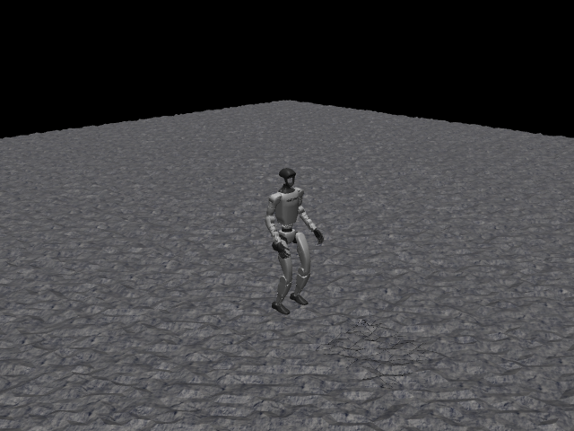

# G1 Walk Rough

## 任务目标

训练 G1 在崎岖地形上保持人形行走命令跟踪，重点处理地形相对高度与跌倒风险。



> 图片由 `_tools/render_static_images.py` 使用 `src/unilab/assets/robots/g1/scene_rough.xml` 的 MuJoCo scene 离屏渲染生成；如果当前环境无法启用 EGL/OSMesa，生成 manifest 会记录失败原因。

## 证据索引

| 项目 | 内容 |
| --- | --- |
| 任务类别 | 运动控制 |
| 机器人 | g1 |
| 代表 scene | src/unilab/assets/robots/g1/scene_rough.xml |
| 代表源码 | src/unilab/envs/locomotion/g1/joystick.py |
| 代表 owner YAML | conf/offpolicy/task/sac/g1_walk_rough/mujoco.yaml |
| 动作维度 | 29 |

### Registry 与 Owner

| 注册名 | 后端 | 配置类 | 配置源码 |
| --- | --- | --- | --- |
| G1WalkRough | mujoco, motrix | G1WalkRoughCfg | src/unilab/envs/locomotion/g1/joystick.py |

| 算法组 | 后端 | training.task_name | owner YAML |
| --- | --- | --- | --- |
| sac | motrix | G1WalkRough | conf/offpolicy/task/sac/g1_walk_rough/motrix.yaml |
| sac | mujoco | G1WalkRough | conf/offpolicy/task/sac/g1_walk_rough/mujoco.yaml |

## 代码级执行流

这部分不再用通用关键词套模板，而是为 `g1_walk_rough` 单独写源码导读。源码片段只负责提供证据；每节说明都围绕本任务自己的配置、状态、观测、动作和 reward 语义展开。

| 阶段 | 证据位置 | 代码级说明 |
| --- | --- | --- |
| 1. Hydra owner | conf/offpolicy/task/sac/g1_walk_rough/mujoco.yaml | 训练命令先 compose owner YAML。这里确定 `training.task_name`、后端身份、obs_groups、reward scale 和 env override。 |
| 2. Registry 构造 Env | src/unilab/envs/locomotion/g1/joystick.py | `@registry.envcfg` 注册配置类，`@registry.env` 注册后端实现类；训练脚本只调用 registry，不直接 new 任务类。 |
| 3. Reset/初始状态 | src/unilab/assets/robots/g1/scene_rough.xml | env 从 scene keyframe 或 motion/grasp cache 取初态，再通过 reset randomization 改写 qpos/qvel/info。 |
| 4. Obs dict | src/unilab/envs/locomotion/g1/joystick.py | env 读取 backend 传感器和 info，返回 dict；learner 根据 `obs_groups_spec` 和 owner `algo.obs_groups` 选择 actor/critic 输入。 |
| 5. Action 到控制目标 | src/unilab/envs/locomotion/g1/joystick.py | policy 输出先按 action scale / 控制顺序映射到 actuator，再由 backend step 推进仿真。 |
| 6. Reward dispatch | src/unilab/envs/locomotion/g1/joystick.py | 源码把 reward key 映射到函数，owner YAML 的 scale 决定每项奖励/惩罚是否启用以及权重。 |
| 7. Termination | src/unilab/envs/locomotion/g1/joystick.py | env 根据高度、姿态、接触、参考轨迹误差、物体状态或能量阈值生成 done/terminated。 |

### 本任务阅读重点

| 阅读重点 |
| --- |
| G1 rough 与 flat 共用 G1WalkEnv 源码，但任务差异在 owner/scene 和 terrain-relative 终止口径，文档必须显式说明这一点。 |
| 它不是新的 action 解释，仍是 29 DoF；重点是崎岖地形下高度、姿态和 reward 权重变化。 |
| 源码阅读要把 `G1WalkRough` registry/config 与同文件的 G1WalkEnv 行为对应起来。 |

### 本任务注册入口

| 注册名 | 配置类 | 可用后端 |
| --- | --- | --- |
| G1WalkRough | G1WalkRoughCfg | mujoco, motrix |

### 本任务源码锚点

| 小节 | 源码文件 | 明确锚点 |
| --- | --- | --- |
| 配置：G1WalkRough | src/unilab/envs/locomotion/g1/joystick.py | G1WalkRoughCfg, G1WalkRough |
| Obs：G1 rough 输入 | src/unilab/envs/locomotion/g1/joystick.py | obs_groups_spec, _compute_obs |
| Action：不变的 29 DoF | src/unilab/envs/locomotion/g1/joystick.py | apply_action, default_angles |
| Reward：rough 权重 | src/unilab/envs/locomotion/g1/joystick.py | _init_reward_functions, PenaltyCurriculum |
| Termination：地形相对高度 | src/unilab/envs/locomotion/g1/joystick.py | update_state, _terrain_relative_base_height |

## 关键源码逐段解释（按本任务手写）

### 配置：G1WalkRough

| 本任务人工导读 |
| --- |
| rough cfg 选择 scene_rough，并沿用 G1WalkEnv 行为。 |
| 任务差异主要来自配置、scene 和 owner YAML 权重。 |
| rough 不在训练脚本里增加分支；它通过 cfg/scene 切换地形资源。 |

```python
# src/unilab/envs/locomotion/g1/joystick.py
@registry.envcfg("G1WalkRough")
# 注册配置名为 G1WalkRough，owner YAML 的 training.task_name 通过这个名字找到 cfg。
@dataclass
# dataclass 让 Hydra 可以组合和覆盖 scene、reward_config、domain_rand 等字段。
class G1WalkRoughCfg(G1WalkFlatCfg):
# Rough 继承 Flat，表示控制、obs、reward dispatch 和 reset provider 都复用 G1WalkEnv。
    scene: SceneCfg = field(
# 只覆盖 scene 字段，这是 rough 与 flat 在 cfg 层最关键的差异。
        default_factory=lambda: SceneCfg(
# default_factory 延迟创建 SceneCfg，避免 dataclass 可变默认值问题。
            model_file=str(ASSETS_ROOT_PATH / "robots" / "g1" / "scene_rough.xml")
# rough 场景加载 scene_rough.xml，地形差异在资产/场景层表达。
        )
    )


registry.register_env("G1WalkFlat", G1WalkEnv, sim_backend="mujoco")
# Flat 和 Rough 都注册到同一个 G1WalkEnv；任务差异不写进训练脚本。
registry.register_env("G1WalkFlat", G1WalkEnv, sim_backend="motrix")
# Flat 同时支持 motrix 后端。
registry.register_env("G1WalkRough", G1WalkEnv, sim_backend="mujoco")
# Rough 的 mujoco 版本也使用同一个 env 类。
registry.register_env("G1WalkRough", G1WalkEnv, sim_backend="motrix")
# Rough 的 motrix 版本通过 backend 适配层处理仿真差异。
```
### Obs：G1 rough 输入

| 本任务人工导读 |
| --- |
| obs 结构和 G1 flat 保持一致，便于复用策略结构。 |
| rough 的环境风险通过地形相对高度和 reward/termination 进入学习。 |
| 观测不因为 rough 地形增加训练脚本分支；维度 contract 仍由 env 声明。 |

```python
# src/unilab/envs/locomotion/g1/joystick.py
    @property
# obs_groups_spec 声明 obs dict 中各组维度，learner 按它校验输入。
    def obs_groups_spec(self) -> dict[str, int]:
# Rough 复用 Flat 的观测维度，说明策略网络结构可以保持一致。
        # gyro(3) + gravity(3) + diff(29) + dof_vel(29) + action(29) + cmd(3) + phase(2) = 98
# actor obs 由 3+3+29+29+29+3+2 拼成 98 维。
        return {"obs": 98, "critic": 101}
# critic 额外拿 3 维 base local linvel，因此是 101 维。

```

```python
# src/unilab/envs/locomotion/g1/joystick.py
    def _compute_obs(
# Rough 每步仍调用同一个 G1WalkEnv._compute_obs。
        self, info: dict, linvel, gyro, gravity, dof_pos, dof_vel
# info 提供命令、动作历史、gait phase；backend 提供机器人状态。
    ) -> dict[str, np.ndarray]:
# 返回值必须是 obs dict，不能返回裸数组。
        noise_cfg = self._cfg.noise_config
# 读取 actor 观测噪声配置。
        diff = dof_pos - self.default_angles
# 关节位置转换成相对默认站姿的偏差。
        command = info["commands"]
# 速度/转向命令由 reset 或 command sampler 写入 info。
        last_actions = info.get("current_actions", np.zeros_like(diff))
# 上一帧动作作为观测输入；缺失时用 29 维零数组。
        gait_phase = info.get("gait_phase", np.zeros((self._num_envs, 2), dtype=get_global_dtype()))
# 左右脚相位是 2 维步态时钟，reset 时初始化，apply_action 中推进。
        walk_profile = self._uses_walk_observation_profile()
# 根据当前 reward/profile 决定是否使用 walk 专用缩放。

        noisy_gyro = self._obs_noise(gyro, noise_cfg.scale_gyro)
# actor 看到带噪角速度，模拟 IMU 噪声。
        noisy_gravity = self._obs_noise(gravity, noise_cfg.scale_gravity)
# actor 看到带噪重力方向，提高抗姿态传感器误差能力。
        noisy_diff = self._obs_noise(diff, noise_cfg.scale_joint_angle)
# actor 关节角偏差加噪，模拟编码器误差。
        noisy_dof_vel = self._obs_noise(dof_vel, noise_cfg.scale_joint_vel)
# actor 关节速度加噪，避免过拟合理想速度观测。
        actor_gyro_scale = 0.25 if walk_profile else 1.0
# walk profile 下缩小 gyro 尺度。
        actor_dof_vel_scale = 0.05 if walk_profile else 1.0
# walk profile 下缩小 dof_vel 尺度。

        actor = np.concatenate(
# 拼接 actor observation。
            [
                noisy_gyro * actor_gyro_scale,
# 3 维带噪角速度。
                -noisy_gravity,
# 3 维重力方向取负，保持 up-vector 约定。
                noisy_diff,
# 29 维关节角偏差。
                noisy_dof_vel * actor_dof_vel_scale,
# 29 维带噪关节速度。
                last_actions,
# 29 维上一帧动作。
                command,
# 3 维目标运动命令。
                gait_phase,
# 2 维左右脚相位。
            ],
            axis=1,
# 沿特征维拼接。
            dtype=get_global_dtype(),
# 使用全局 dtype。
        )

        critic_gyro_scale = 0.25 if walk_profile else 1.0
# critic 与 actor 保持相同缩放口径。
        critic_dof_vel_scale = 0.05 if walk_profile else 1.0
# critic 关节速度缩放同 actor。
        critic_linvel_scale = 2.0 if walk_profile else 1.0
# walk profile 下放大 linvel，帮助 value 学习速度相关误差。
        critic_base = np.concatenate(
# critic_base 复用 actor 结构，但使用无噪真实量。
            [
                gyro * critic_gyro_scale,
# 无噪角速度。
                -gravity,
# 无噪重力方向。
                diff,
# 无噪关节角偏差。
                dof_vel * critic_dof_vel_scale,
# 无噪关节速度。
                last_actions,
# 动作历史。
                command,
# 命令。
                gait_phase,
# 步态相位。
            ],
            axis=1,
# 沿特征维拼接。
            dtype=get_global_dtype(),
# 使用全局 dtype。
        )
        critic = np.concatenate(
# critic 在 98 维基础上追加线速度。
            [
                critic_base,
# 前 98 维 critic 本体/命令特征。
                np.asarray(linvel * critic_linvel_scale, dtype=get_global_dtype()),
# 3 维 base 局部线速度，只给 critic 做特权观测。
            ],
            axis=1,
# 拼接为 101 维。
            dtype=get_global_dtype(),
# 保持 dtype 一致。
        )

        return {"obs": actor, "critic": critic}
# 返回 actor/critic 两组观测。

```
### Action：不变的 29 DoF

| 本任务人工导读 |
| --- |
| action 仍是全身关节目标。 |
| 不能因为 rough 场景存在就引入训练脚本层面的动作分支。 |
| rough 地形只改变机器人接触和终止风险，action 映射仍是 29 DoF PD target。 |

```python
# src/unilab/envs/locomotion/g1/joystick.py
    def apply_action(self, actions: np.ndarray, state: NpEnvState) -> np.ndarray:
# policy 输出 29 维 action 后，在 env 层映射为 29 个关节目标。
        state.info["last_actions"] = state.info.get("current_actions", np.zeros_like(actions))
# 保存上一帧 action，供 obs 和 action_rate reward 使用。
        state.info["current_actions"] = actions
# 保存当前 action，下一帧会变成 last_actions。

        gait_phase = state.info.get(
# 读取左右脚步态相位。
            "gait_phase", np.zeros((self._num_envs, 2), dtype=get_global_dtype())
# 如果 reset 信息里暂时没有 gait_phase，就创建全零相位。
        )
        gait_phase[:, 0] = (gait_phase[:, 0] + self._gait_phase_delta) % (2 * np.pi)
# 左脚相位按控制周期推进，取模保持在一个周期内。
        gait_phase[:, 1] = (gait_phase[:, 1] + self._gait_phase_delta) % (2 * np.pi)
# 右脚相位同步推进；初始相位差决定左右脚交替。
        state.info["gait_phase"] = gait_phase
# 写回 info，reward 和下一帧 obs 都会读取。

        ctrl: np.ndarray = actions * self._cfg.control_config.action_scale + self.default_angles
# action_scale 缩放策略输出，再加默认站姿角，得到 PD 目标角。
        return ctrl
# 返回 backend actuator 使用的关节目标；rough 不额外增加动作维度。


```
### Reward：rough 权重

| 本任务人工导读 |
| --- |
| 源码 reward map 与 flat 相近，具体权重由 rough owner YAML 决定。 |
| penalty curriculum 影响惩罚项强度，帮助崎岖地形训练稳定。 |
| reward 函数表不等于启用项；实际启用和权重仍以 rough owner YAML 的 `reward.scales` 为准。 |

```python
# src/unilab/envs/locomotion/g1/joystick.py
    def _init_reward_functions(self):
# 初始化 reward key 到函数的映射表。
        self._reward_fns: dict[str, Any] = {
# run_reward_dispatch 后续按 reward.scales 遍历这些 key。
            "tracking_lin_vel": rewards.tracking_lin_vel,
# 线速度命令跟踪。
            "tracking_ang_vel": rewards.tracking_ang_vel,
# yaw 角速度命令跟踪。
            "forward_progress": rewards.forward_progress,
# 沿前进方向的进度项。
            "under_speed": rewards.under_speed,
# 速度不足相关项。
            "lin_vel_z": rewards.lin_vel_z,
# 垂直速度惩罚，rough 地形上尤其防止跳动。
            "orientation": rewards.orientation,
# 躯干姿态约束。
            "penalty_orientation": rewards.orientation,
# penalty 命名复用 orientation 实现，权重符号由 YAML 决定。
            "ang_vel_xy": rewards.ang_vel_xy,
# 横滚/俯仰角速度约束。
            "penalty_ang_vel_xy": rewards.ang_vel_xy,
# penalty 命名复用 ang_vel_xy 实现。
            "action_rate": rewards.action_rate,
# 动作变化平滑项。
            "penalty_action_rate": rewards.action_rate,
# penalty 命名复用 action_rate 实现。
            "base_height": rewards.base_height,
# base 高度项，rough 场景下仍使用 backend base z 高度。
            "pose": rewards.weighted_pose,
# 29 维关节姿态偏差加权项。
            "upper_body_pose": self._reward_upper_body_pose,
# 上半身姿态项，防止腰和手臂在崎岖地形上乱摆。
            "penalty_close_feet_xy": self._reward_close_feet_xy,
# 双脚过近惩罚，减少绊脚。
            "penalty_feet_ori": self._reward_feet_ori,
# 脚姿态惩罚，减少脚掌翻转。
            "feet_phase": self._reward_feet_phase,
# 摆动脚高度跟踪 gait phase。
            "feet_phase_contrast": self._reward_feet_phase_contrast,
# 左右脚高度差跟踪相位目标。
            "feet_phase_contact": self._reward_feet_phase_contact,
# 足底接触状态匹配相位目标。
            "feet_double_stance": self._reward_feet_double_stance,
# 双支撑相关项。
            "feet_air_time": self._reward_feet_air_time,
# 脚离地时间相关项。
            "alive": rewards.alive,
# 存活奖励。
        }

```
### Termination：地形相对高度

| 本任务人工导读 |
| --- |
| 终止看 tilt 和 terrain-relative base height。 |
| 这一点是 rough 与 flat 文档必须分开的关键。 |
| 当前源码中的 `_terrain_relative_base_height` 直接取 base z；如果未来引入真实高度场相对高度，应在 env/backend owner 层实现，而不是训练脚本里判断。 |

```python
# src/unilab/envs/locomotion/g1/joystick.py
    def update_state(self, state: NpEnvState) -> NpEnvState:
# step 后统一更新终止、reward、obs 和 curriculum 日志。
        linvel = self.get_local_linvel()
# base 局部线速度，用于 reward 和 critic obs。
        gyro = self.get_gyro()
# IMU 角速度，用于 obs 和姿态稳定项。
        gravity = self._backend.get_sensor_data(self._cfg.sensor.upvector)
# 读取 upvector 传感器，作为倾斜角计算依据。
        dof_pos = self.get_dof_pos()
# 读取 G1 29 个控制关节位置。
        dof_vel = self.get_dof_vel()
# 读取 G1 29 个控制关节速度。

        max_tilt_rad = np.deg2rad(self._reward_cfg.max_tilt_deg)
# 使用 numpy 将配置中的最大倾斜角从 degree 转为 radian。
        tilt = np.arccos(np.clip(gravity[:, 2], -1, 1))
# 用 upvector z 分量求倾斜角；clip 避免浮点误差让 arccos 输入越界。
        terminated = np.logical_or(
# 只要倾斜过大或 base 过低，就终止 episode。
            tilt > max_tilt_rad,
# rough 地形上跌倒通常表现为躯干倾斜超过阈值。
            self._terrain_relative_base_height() < self._reward_cfg.min_base_height,
# base 高度低于阈值说明机器人摔倒或贴近地面。
        )

        reward = self._compute_reward(state.info, linvel, gyro, gravity, dof_pos, dof_vel)
# 按当前状态和 info 计算 reward。
        obs = self._compute_obs(state.info, linvel, gyro, gravity, dof_pos, dof_vel)
# 组装下一帧 obs dict。
        state = state.replace(obs=obs, reward=reward, terminated=terminated)
# 写回 NpEnvState，保持 env contract。

        done = state.terminated | state.truncated
# done 包含失败终止和时间截断。
        if self._episode_tracker is None or self._penalty_curriculum is None or not np.any(done):
# 没有启用 curriculum 或当前没有 episode 结束时，不更新课程学习。
            return state
# 直接返回当前 state。

        done_indices = np.where(done)[0]
# 找到结束的 env 下标。
        episode_lengths = state.info["steps"][done_indices] + 1
# episode 长度由 steps 加 1 得到。
        self._episode_tracker.update(episode_lengths)
# 更新 episode 长度统计。
        self._penalty_curriculum.update(self._episode_tracker.average_length)
# 根据平均长度更新 penalty curriculum。

        if "log" not in state.info:
# 初始化日志容器。
            state.info["log"] = {}
# log 会被训练器读取。
        state.info["log"]["curriculum/average_episode_length"] = float(
# 记录平均 episode 长度。
            self._episode_tracker.average_length
# 当前 tracker 的平均值。
        )
        state.info["log"]["curriculum/penalty_scale"] = float(
# 记录当前 penalty 缩放。
            self._penalty_curriculum.current_scale
# curriculum 当前 scale。
        )
        return state
# 返回更新后的 state。

```

```python
# src/unilab/envs/locomotion/g1/joystick.py
    def _terrain_relative_base_height(self) -> np.ndarray:
# 终止和 reward 使用的 base 高度入口。
        return np.asarray(self._backend.get_base_pos()[:, 2], dtype=get_global_dtype())
# 当前实现直接取世界系 base z，并转成全局 dtype。

```


## Agent

Agent 仍输出 29 维全身关节目标，算法配置主要来自 offpolicy SAC owner。

训练入口通过 owner YAML 决定注册 env、后端身份和算法参数；CLI 应使用 `--sim` 选择 backend owner，而不是单独 override `training.sim_backend`。

```yaml
# conf/offpolicy/task/sac/g1_walk_rough/mujoco.yaml
training:
  task_name: G1WalkRough
  sim_backend: mujoco
algo:
  obs_groups: {}
  num_envs: 2048
  max_iterations: 5000
```

## Env

Env 使用 G1 rough cfg，在平地行走 env 上切换地形场景和终止高度口径。

Env 必须遵守 `NpEnv` contract：`reset()` 返回 `(obs_dict, info_dict)`，`obs` 是 dict，`obs_groups_spec` 决定 learner 使用哪些观测组。

```python
# src/unilab/envs/locomotion/g1/joystick.py
@dataclass
class G1WalkRewardConfig(G1RewardConfig):
    """对齐 holosoma G1 walking 奖励权重。"""


@registry.envcfg("G1WalkFlat")
@dataclass
class G1WalkFlatCfg(G1WalkEnvCfg):
    reward_config: G1WalkRewardConfig | None = None
    scene: SceneCfg = field(
        default_factory=lambda: SceneCfg(
```

## Obs

观测保留 gait phase 与本体状态，并根据 rough 配置提供地形或特权信息。

### Obs 字段级拆解

下面的表格把源码里的观测拼接逻辑拆成语义字段。维度如果依赖 history、terrain scan 或 motion body 数量，文档会写成“规模”而不是硬编码，避免和配置漂移。

| 观测字段 | 维度/规模 | 代码来源 | 中文说明 |
| --- | --- | --- | --- |
| command | 3 维 | `Commands` | 期望前进、横移和转向速度。 |
| gait_phase | 2 或更多 | `gait_phase` / phase target | 左右腿步态相位，决定摆动脚和支撑脚的节律。 |
| gyro / gravity | 各 3 维 | IMU 传感器 | 反映躯干角速度和倾斜方向，是防摔核心输入。 |
| dof_pos - default | nu 维 | keyframe `stand` 差值 | 全身关节相对默认站姿的偏移。 |
| dof_vel | nu 维 | backend dof velocity | 全身关节速度。 |
| last_actions | nu 维 | 动作历史 | 让策略观察自身上一帧控制目标。 |
| critic base linvel | 3 维 | critic 特权观测 | 训练 critic 使用真实 base 线速度，提高 value 学习稳定性。 |

owner YAML 中的 `algo.obs_groups` 说明算法从 env obs dict 中读取哪些组。没有写入 owner 的字段保持 env cfg 默认值，文档不臆造未配置项。

```yaml
# conf/offpolicy/task/sac/g1_walk_rough/mujoco.yaml
algo:
  obs_groups:
    {}

```

代码侧观测通常在 `_get_obs`、`_build_obs`、`obs_groups_spec` 或 base env 中组装：

```python
# src/unilab/envs/locomotion/g1/joystick.py
            dr_provider = G1WalkDomainRandomizationProvider(base_kp=base_kp, base_kd=base_kd)
        else:
            dr_provider = G1WalkDomainRandomizationProvider()
        self._init_domain_randomization(dr_provider)

    @property
    def obs_groups_spec(self) -> dict[str, int]:
        # gyro(3) + gravity(3) + diff(29) + dof_vel(29) + action(29) + cmd(3) + phase(2) = 98
        return {"obs": 98, "critic": 101}

    def _init_reward_functions(self):
        self._reward_fns: dict[str, Any] = {
            "tracking_lin_vel": rewards.tracking_lin_vel,
```

源码锚点拆解：

| 源码符号 | 中文说明 |
| --- | --- |
| obs_groups_spec | 声明 obs dict 中各观测组的维度，是 wrapper/learner 对齐观测的契约。 |
| _compute_obs | 读取 backend 传感器和 info 字段，拼接 actor/critic 观测。 |

## Action

动作空间与 G1 平地一致。

### Action 逐维拆解

G1 的 action 覆盖 29 个可控关节：腿、腰和双臂都参与控制。行走任务更强调腿部和腰部稳定，motion tracking 则让上肢也跟随参考动作。

当前代表 scene 编译出的 action 维度为 `29`。下表来自 MuJoCo 编译模型的 actuator 顺序，也就是策略输出维度和执行器维度的对应关系。

| Action 维度 | 执行器 | 驱动关节 | 中文含义 | 控制/限制说明 |
| --- | --- | --- | --- | --- |
| 0 | left_hip_pitch_joint | left_hip_pitch_joint | 左髋俯仰关节 | XML 未显式限制，实际由 env 缩放/默认角和 backend 控制 |
| 1 | left_hip_roll_joint | left_hip_roll_joint | 左髋侧摆关节 | XML 未显式限制，实际由 env 缩放/默认角和 backend 控制 |
| 2 | left_hip_yaw_joint | left_hip_yaw_joint | 左髋偏航关节 | XML 未显式限制，实际由 env 缩放/默认角和 backend 控制 |
| 3 | left_knee_joint | left_knee_joint | 左膝关节 | XML 未显式限制，实际由 env 缩放/默认角和 backend 控制 |
| 4 | left_ankle_pitch_joint | left_ankle_pitch_joint | 左踝俯仰关节 | XML 未显式限制，实际由 env 缩放/默认角和 backend 控制 |
| 5 | left_ankle_roll_joint | left_ankle_roll_joint | 左踝侧摆关节 | XML 未显式限制，实际由 env 缩放/默认角和 backend 控制 |
| 6 | right_hip_pitch_joint | right_hip_pitch_joint | 右髋俯仰关节 | XML 未显式限制，实际由 env 缩放/默认角和 backend 控制 |
| 7 | right_hip_roll_joint | right_hip_roll_joint | 右髋侧摆关节 | XML 未显式限制，实际由 env 缩放/默认角和 backend 控制 |
| 8 | right_hip_yaw_joint | right_hip_yaw_joint | 右髋偏航关节 | XML 未显式限制，实际由 env 缩放/默认角和 backend 控制 |
| 9 | right_knee_joint | right_knee_joint | 右膝关节 | XML 未显式限制，实际由 env 缩放/默认角和 backend 控制 |
| 10 | right_ankle_pitch_joint | right_ankle_pitch_joint | 右踝俯仰关节 | XML 未显式限制，实际由 env 缩放/默认角和 backend 控制 |
| 11 | right_ankle_roll_joint | right_ankle_roll_joint | 右踝侧摆关节 | XML 未显式限制，实际由 env 缩放/默认角和 backend 控制 |
| 12 | waist_yaw_joint | waist_yaw_joint | 腰偏航关节 | XML 未显式限制，实际由 env 缩放/默认角和 backend 控制 |
| 13 | waist_roll_joint | waist_roll_joint | 腰侧摆关节 | XML 未显式限制，实际由 env 缩放/默认角和 backend 控制 |
| 14 | waist_pitch_joint | waist_pitch_joint | 腰俯仰关节 | XML 未显式限制，实际由 env 缩放/默认角和 backend 控制 |
| 15 | left_shoulder_pitch_joint | left_shoulder_pitch_joint | 左肩俯仰关节 | XML 未显式限制，实际由 env 缩放/默认角和 backend 控制 |
| 16 | left_shoulder_roll_joint | left_shoulder_roll_joint | 左肩侧摆关节 | XML 未显式限制，实际由 env 缩放/默认角和 backend 控制 |
| 17 | left_shoulder_yaw_joint | left_shoulder_yaw_joint | 左肩偏航关节 | XML 未显式限制，实际由 env 缩放/默认角和 backend 控制 |
| 18 | left_elbow_joint | left_elbow_joint | 左肘关节 | XML 未显式限制，实际由 env 缩放/默认角和 backend 控制 |
| 19 | left_wrist_roll_joint | left_wrist_roll_joint | 左腕侧摆关节 | XML 未显式限制，实际由 env 缩放/默认角和 backend 控制 |
| 20 | left_wrist_pitch_joint | left_wrist_pitch_joint | 左腕俯仰关节 | XML 未显式限制，实际由 env 缩放/默认角和 backend 控制 |
| 21 | left_wrist_yaw_joint | left_wrist_yaw_joint | 左腕偏航关节 | XML 未显式限制，实际由 env 缩放/默认角和 backend 控制 |
| 22 | right_shoulder_pitch_joint | right_shoulder_pitch_joint | 右肩俯仰关节 | XML 未显式限制，实际由 env 缩放/默认角和 backend 控制 |
| 23 | right_shoulder_roll_joint | right_shoulder_roll_joint | 右肩侧摆关节 | XML 未显式限制，实际由 env 缩放/默认角和 backend 控制 |
| 24 | right_shoulder_yaw_joint | right_shoulder_yaw_joint | 右肩偏航关节 | XML 未显式限制，实际由 env 缩放/默认角和 backend 控制 |
| 25 | right_elbow_joint | right_elbow_joint | 右肘关节 | XML 未显式限制，实际由 env 缩放/默认角和 backend 控制 |
| 26 | right_wrist_roll_joint | right_wrist_roll_joint | 右腕侧摆关节 | XML 未显式限制，实际由 env 缩放/默认角和 backend 控制 |
| 27 | right_wrist_pitch_joint | right_wrist_pitch_joint | 右腕俯仰关节 | XML 未显式限制，实际由 env 缩放/默认角和 backend 控制 |
| 28 | right_wrist_yaw_joint | right_wrist_yaw_joint | 右腕偏航关节 | XML 未显式限制，实际由 env 缩放/默认角和 backend 控制 |

控制参数来自 owner YAML 的 `env.control_config`，缺省值由对应 env cfg/dataclass 提供。

| 配置字段 | 当前值 | 中文说明 |
| --- | --- | --- |
| action_scale | 1.0 | 策略输出到目标关节角的缩放系数。 |

```yaml
# conf/offpolicy/task/sac/g1_walk_rough/mujoco.yaml
env:
  control_config:
    action_scale: 1.0

```

动作到执行器的实际映射由 backend 的 actuator control range 和 env 的 `apply_action`/控制函数完成：

```python
# src/unilab/envs/locomotion/g1/joystick.py
        diff = ctx.dof_pos - self.default_angles
        return np.asarray(
            np.sum(self._upper_body_pose_weights * np.square(diff), axis=1),
            dtype=get_global_dtype(),
        )

    def apply_action(self, actions: np.ndarray, state: NpEnvState) -> np.ndarray:
        state.info["last_actions"] = state.info.get("current_actions", np.zeros_like(actions))
        state.info["current_actions"] = actions

        gait_phase = state.info.get(
            "gait_phase", np.zeros((self._num_envs, 2), dtype=get_global_dtype())
        )
```

源码锚点拆解：

| 源码符号 | 中文说明 |
| --- | --- |
| apply_action | 把策略输出缩放为执行器控制目标。 |

## Reward

reward 沿用 G1 locomotion 项，同时在 rough owner YAML 中调整权重。

### Reward 逐项拆解

reward scale 以 owner YAML 的 `reward.scales` 为真源；源码中的 `RewardConfig` 描述可用字段，训练脚本只做 Hydra 组装和注入。正数通常表示奖励，负数通常表示惩罚，0 表示该项在当前 owner 中关闭或仅保留接口。

| Reward key | Scale | 方向 | 中文含义 |
| --- | --- | --- | --- |
| tracking_lin_vel | 2.0 | 奖励 | 线速度命令跟踪奖励，鼓励机器人实际平面速度贴近 joystick/命令速度。 |
| tracking_ang_vel | 1.5 | 奖励 | 角速度命令跟踪奖励，鼓励 yaw 角速度贴近转向命令。 |
| penalty_ang_vel_xy | -1.0 | 惩罚 | 横滚/俯仰角速度惩罚，抑制身体剧烈摇摆。 |
| penalty_orientation | -10.0 | 惩罚 | 姿态项，通常基于重力投影或目标朝向惩罚倾斜。 |
| penalty_action_rate | -4.0 | 惩罚 | 动作变化惩罚，抑制相邻控制步之间的目标突变。 |
| pose | -0.5 | 惩罚 | 默认姿态或参考姿态约束，防止无关关节偏离可用构型。 |
| penalty_feet_ori | -20.0 | 惩罚 | 朝向相关奖励/惩罚，用于约束姿态或参考朝向。 |
| feet_phase | 5.0 | 奖励 | 步态相位奖励，鼓励左右脚按期望相位摆动/支撑。 |
| alive | 10.0 | 奖励 | 存活奖励，鼓励保持非终止状态。 |

```yaml
# conf/offpolicy/task/sac/g1_walk_rough/mujoco.yaml
reward:
  scales:
    tracking_lin_vel: 2.0
    tracking_ang_vel: 1.5
    penalty_ang_vel_xy: -1.0
    penalty_orientation: -10.0
    penalty_action_rate: -4.0
    pose: -0.5
    penalty_feet_ori: -20.0
    feet_phase: 5.0
    alive: 10.0
  tracking_sigma: 0.25
  base_height_target: 0.754
  min_base_height: 0.3
  max_tilt_deg: 65.0
  gait_frequency: 1.5
  feet_phase_swing_height: 0.09
  feet_phase_tracking_sigma: 0.04
  close_feet_threshold: 0.15
  pose_weights:
  - 0.01
  - 1.0
  - 5.0
  - 0.01
  - 5.0
  - 5.0
  - 0.01
  - 1.0
  - 5.0
  - 0.01
  - 5.0
  - 5.0
  - 50.0
  - 50.0
  - 50.0
  - 50.0
  - 50.0
  - 50.0
  - 50.0
  - 50.0
  - 50.0
  - 50.0
  - 50.0
  - 50.0
  - 50.0
  - 50.0
  - 50.0
  - 50.0
  - 50.0

```

源码中的 reward 入口：

```python
# src/unilab/envs/locomotion/g1/joystick.py

def compute_forward_command_mask(commands: np.ndarray) -> np.ndarray:
    return np.asarray(np.maximum(commands[:, 0], 0.0) > 1.0e-6, dtype=get_global_dtype())


@dataclass
class G1RewardConfig:
    scales: dict[str, float]
    tracking_sigma: float
    gait_frequency: float
    feet_phase_swing_height: float
    feet_phase_tracking_sigma: float
    base_height_target: float
```

源码锚点拆解：

| 源码符号 | 中文说明 |
| --- | --- |
| G1RewardConfig: | 声明 reward 可用参数和默认 scale。 |
| G1WalkLegacyRewardConfig | 声明 reward 可用参数和默认 scale。 |
| _init_reward_functions | 把 reward 名称映射到源码函数，owner YAML 的 scale 会按这些 key 分发。 |
| _build_reward_context | 单个 reward 项的实现函数，通常返回每个 env 的 reward 向量。 |
| _compute_reward | reward 相关源码锚点。 |
| _reward_feet_phase | 单个 reward 项的实现函数，通常返回每个 env 的 reward 向量。 |
| _gait_reward_gate | 单个 reward 项的实现函数，通常返回每个 env 的 reward 向量。 |
| _reward_feet_phase_contrast | 单个 reward 项的实现函数，通常返回每个 env 的 reward 向量。 |
| _reward_feet_phase_contact | 单个 reward 项的实现函数，通常返回每个 env 的 reward 向量。 |
| _reward_feet_double_stance | 单个 reward 项的实现函数，通常返回每个 env 的 reward 向量。 |
| _reward_feet_ori | 单个 reward 项的实现函数，通常返回每个 env 的 reward 向量。 |
| _reward_close_feet_xy | 单个 reward 项的实现函数，通常返回每个 env 的 reward 向量。 |

## 初始状态

reset 使用 `stand` keyframe 并在地形上采样初始位置。

机器人默认姿态来自 scene/task fragment 中的 keyframe；任务 reset 在此基础上加入命令、motion reference、物体状态或随机化。

```xml
<!-- src/unilab/assets/robots/g1/scene_rough.xml -->
    <geom name="floor" type="hfield" hfield="hfield" material="groundplane" contype="1" conaffinity="0" priority="1" friction="1.0"/>
  </worldbody>

  <keyframe>
    <key name="stand"
      qpos="
      0 0 0.79
```

```python
# src/unilab/envs/locomotion/g1/joystick.py
        )

    phase = rng.uniform(0.0, 2.0 * np.pi, size=(num_samples,))
    return np.asarray(np.column_stack([phase, phase + np.pi]), dtype=get_global_dtype())


def sample_reset_base_qvel(rng, num_samples: int, limit: float) -> np.ndarray:
    return np.asarray(rng.uniform(-limit, limit, size=(num_samples, 6)), dtype=get_global_dtype())


def build_upper_body_pose_weights(pose_weights: list[float]) -> np.ndarray:
    weights = np.asarray(pose_weights, dtype=get_global_dtype()).copy()
    weights[:12] = 0.0
```

## 终止条件

终止使用 terrain-relative base height 与倾斜阈值。

终止条件通常由 env 源码中的 `_compute_termination(s)`、reward config 阈值和 `max_episode_seconds` 共同决定。

```yaml
# conf/offpolicy/task/sac/g1_walk_rough/mujoco.yaml
env:
  {}

reward:
  min_base_height: 0.3
  max_tilt_deg: 65.0

```

```python
# src/unilab/envs/locomotion/g1/joystick.py
        linvel = self.get_local_linvel()
        gyro = self.get_gyro()
        gravity = self._backend.get_sensor_data(self._cfg.sensor.upvector)
        dof_pos = self.get_dof_pos()
        dof_vel = self.get_dof_vel()

        max_tilt_rad = np.deg2rad(self._reward_cfg.max_tilt_deg)
        tilt = np.arccos(np.clip(gravity[:, 2], -1, 1))
        terminated = np.logical_or(
            tilt > max_tilt_rad,
            self._terrain_relative_base_height() < self._reward_cfg.min_base_height,
        )

        reward = self._compute_reward(state.info, linvel, gyro, gravity, dof_pos, dof_vel)
        obs = self._compute_obs(state.info, linvel, gyro, gravity, dof_pos, dof_vel)
        state = state.replace(obs=obs, reward=reward, terminated=terminated)

```

## 域随机化

domain_rand 覆盖地形、物理参数、推力和控制参数。

域随机化只在 reset/interval 等冷路径触发，不在 step 热路径解析资产或探测 backend 私有能力。

### 域随机化字段拆解

| 配置字段 | 当前值 | 中文说明 |
| --- | --- | --- |

```yaml
# conf/offpolicy/task/sac/g1_walk_rough/mujoco.yaml
env:
  domain_rand:
    {}

```

```python
# src/unilab/envs/locomotion/g1/joystick.py
from unilab.envs.locomotion.common import rewards
from unilab.envs.locomotion.common.commands import (
    Commands,
    sample_heading_commands,
    zero_small_xy_commands,
)
from unilab.envs.locomotion.common.domain_rand import DomainRandConfig
from unilab.envs.locomotion.common.dr_provider import LocomotionDRProvider
from unilab.envs.locomotion.common.rewards import RewardContext
from unilab.envs.locomotion.g1.base import G1BaseCfg, G1BaseEnv


@dataclass
```
