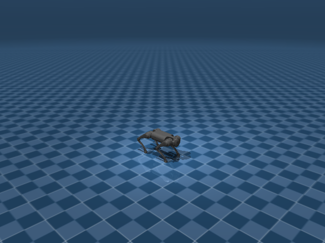

# Go1 Joystick Rough

## 任务目标

让 Go1 在崎岖地形上保持 joystick 跟踪能力，并适应高度扫描、地形 spawn 与足端接触扰动。



> 图片由 `_tools/render_static_images.py` 使用 `src/unilab/assets/robots/go1/scene_flat.xml` 的 MuJoCo scene 离屏渲染生成；如果当前环境无法启用 EGL/OSMesa，生成 manifest 会记录失败原因。

## 证据索引

| 项目 | 内容 |
| --- | --- |
| 任务类别 | 运动控制 |
| 机器人 | go1 |
| 代表 scene | src/unilab/assets/robots/go1/scene_flat.xml |
| 代表源码 | src/unilab/envs/locomotion/go1/rough.py |
| 代表 owner YAML | conf/ppo/task/go1_joystick_rough/mujoco.yaml |
| 动作维度 | 12 |

### Registry 与 Owner

| 注册名 | 后端 | 配置类 | 配置源码 |
| --- | --- | --- | --- |
| Go1JoystickRough | mujoco, motrix | Go1JoystickRoughCfg | src/unilab/envs/locomotion/go1/rough.py |

| 算法组 | 后端 | training.task_name | owner YAML |
| --- | --- | --- | --- |
| ppo | motrix | Go1JoystickRough | conf/ppo/task/go1_joystick_rough/motrix.yaml |
| ppo | mujoco | Go1JoystickRough | conf/ppo/task/go1_joystick_rough/mujoco.yaml |

## 代码级执行流

这部分不再用通用关键词套模板，而是为 `go1_joystick_rough` 单独写源码导读。源码片段只负责提供证据；每节说明都围绕本任务自己的配置、状态、观测、动作和 reward 语义展开。

| 阶段 | 证据位置 | 代码级说明 |
| --- | --- | --- |
| 1. Hydra owner | conf/ppo/task/go1_joystick_rough/mujoco.yaml | 训练命令先 compose owner YAML。这里确定 `training.task_name`、后端身份、obs_groups、reward scale 和 env override。 |
| 2. Registry 构造 Env | src/unilab/envs/locomotion/go1/rough.py | `@registry.envcfg` 注册配置类，`@registry.env` 注册后端实现类；训练脚本只调用 registry，不直接 new 任务类。 |
| 3. Reset/初始状态 | src/unilab/assets/robots/go1/scene_flat.xml | env 从 scene keyframe 或 motion/grasp cache 取初态，再通过 reset randomization 改写 qpos/qvel/info。 |
| 4. Obs dict | src/unilab/envs/locomotion/go1/rough.py | env 读取 backend 传感器和 info，返回 dict；learner 根据 `obs_groups_spec` 和 owner `algo.obs_groups` 选择 actor/critic 输入。 |
| 5. Action 到控制目标 | src/unilab/envs/locomotion/go1/rough.py | policy 输出先按 action scale / 控制顺序映射到 actuator，再由 backend step 推进仿真。 |
| 6. Reward dispatch | src/unilab/envs/locomotion/go1/rough.py | 源码把 reward key 映射到函数，owner YAML 的 scale 决定每项奖励/惩罚是否启用以及权重。 |
| 7. Termination | src/unilab/envs/locomotion/go1/rough.py | env 根据高度、姿态、接触、参考轨迹误差、物体状态或能量阈值生成 done/terminated。 |

### 本任务阅读重点

| 阅读重点 |
| --- |
| Go1 rough 不是换一个奖励名字，而是在 rough env 中显式加入 terrain、spawn、height scan 和地形相对高度判断。 |
| 动作空间仍是 Go1 12 DoF，变化集中在 reset 如何落到地形、obs 如何加入地形信息、reward 如何惩罚拖脚和姿态失稳。 |
| 阅读时要把 `Go1JoystickRoughCfg` 和 `Go1JoystickRoughEnv` 同平地任务对比，才能看出 rough 任务新增了哪些风险边界。 |

### 本任务注册入口

| 注册名 | 配置类 | 可用后端 |
| --- | --- | --- |
| Go1JoystickRough | Go1JoystickRoughCfg | mujoco, motrix |

### 本任务源码锚点

| 小节 | 源码文件 | 明确锚点 |
| --- | --- | --- |
| 配置与地形 | src/unilab/envs/locomotion/go1/rough.py | Go1JoystickRoughCfg, Go1RoughTerrainCfg |
| Reset：地形 spawn | src/unilab/envs/locomotion/go1/rough.py | build_reset_plan, spawn |
| Obs：高度扫描 | src/unilab/envs/locomotion/go1/rough.py | obs_groups_spec, _compute_obs, height_scan |
| Action：控制语义不变 | src/unilab/envs/locomotion/go1/rough.py | apply_action, clip_actions |
| Reward/Termination：地形风险 | src/unilab/envs/locomotion/go1/rough.py | _init_reward_functions, update_state |

## 关键源码逐段解释（按本任务手写）

### 配置与地形

| 本任务人工导读 |
| --- |
| Rough cfg 声明 terrain generator、rough scene 和地形采样参数。 |
| 这些字段属于任务层，机器人 XML 不承载地形规则。 |
| `<keyframe>` 和 locomotion task fragment 留在 task-level XML，rough 地形通过 `TerrainSceneCfg` 注入。 |

```python
# src/unilab/envs/locomotion/go1/rough.py
@registry.envcfg("Go1JoystickRough")
# 注册 rough 任务配置名，Hydra owner 通过 Go1JoystickRough 找到它。
@dataclass
# dataclass 让 terrain_scan、termination_config 等字段可被配置系统覆盖。
class Go1JoystickRoughCfg(Go1JoystickCfg):
# 继承平地 Go1JoystickCfg，保留 Go1 12 DoF joystick 控制主逻辑。
    scene: SceneCfg = field(
# rough 任务覆盖 scene，不能复用平地 scene_flat.xml。
        default_factory=lambda: SceneCfg(
# default_factory 防止 dataclass 共享可变 SceneCfg。
            model_file=str(ASSETS_ROOT_PATH / "robots" / "go1" / "go1.xml"),
# model_file 指向纯机器人 XML，机器人描述不包含 rough 地形规则。
            fragment_files=[
# fragment_files 引入任务级 XML 片段。
                str(ASSETS_ROOT_PATH / "robots" / "go1" / "locomotion_task.xml"),
# locomotion_task.xml 承载任务相关 keyframe/传感器/场景片段。
            ],
            terrain=TerrainSceneCfg(
# terrain 字段声明 height field 地形，由 backend/materialization 冷路径生成。
                generator=Go1RoughTerrainCfg(),
# 使用 Go1RoughTerrainCfg 生成多类型 rough terrain。
                hfield_name="terrain_hfield",
# hfield 名称要和场景里使用的高度场资源对应。
                geom_name="floor",
# floor geom 绑定到 terrain height field。
            ),
        )
    )
    control_config: RoughControlConfig = field(default_factory=RoughControlConfig)
# rough 使用专门控制配置，hip 和非 hip action scale 不同。
    commands: RoughCommands = field(default_factory=RoughCommands)
# rough 使用 heading command 和更宽速度范围。
    terrain_scan: HeightScanConfig = field(default_factory=HeightScanConfig)
# critic 高度扫描配置，定义采样网格。
    termination_config: RoughTerminationConfig = field(default_factory=RoughTerminationConfig)
# rough 终止/截断配置，例如是否检查 terrain out-of-bounds。
    terrain_curriculum: TerrainCurriculumCfg = field(default_factory=TerrainCurriculumCfg)
# 地形课程学习配置，用于根据完成情况调整 spawn 难度。
    sensor: RoughJoystickSensor = field(default_factory=RoughJoystickSensor)
# rough 传感器在平地基础上增加 feet_vel 和 undesired_contact。
    domain_rand: Go1RoughDomainRandConfig = field(default_factory=Go1RoughDomainRandConfig)
# rough 专用 DR 默认打开 kp/kd 随机化。
    reward_config: RoughRewardConfig | None = None
# reward_config 仍由 owner YAML 注入，源码只声明类型。


```

```python
# src/unilab/envs/locomotion/go1/rough.py
@dataclass(kw_only=True)
# kw_only 强制 terrain cfg 使用关键字参数构造，减少字段顺序错误。
class Go1RoughTerrainCfg(TerrainGeneratorCfg):
# 继承通用 TerrainGeneratorCfg，供 TerrainSceneCfg 在冷路径生成 hfield。
    size: tuple[float, float] = (8.0, 8.0)
# 单个 terrain cell 的尺寸是 8m x 8m。
    num_rows: int = 6
# 地形网格有 6 行。
    num_cols: int = 6
# 地形网格有 6 列，共 36 个子地形区域。
    border_width: float = 1.0
# 全局边界宽度，用于避免机器人出生在地形边缘。
    add_lights: bool = True
# 生成场景时附加灯光，方便可视化。
    horizontal_scale: float = 0.2
# height field 横向采样分辨率。

    sub_terrains: dict[str, SubTerrainCfg] = field(
# 定义不同 rough 子地形及其比例。
        default_factory=lambda: {
# 使用 lambda 避免共享 dict。
            "flat": flat(proportion=0.0),
# flat 比例为 0，说明本 rough 训练不主动采样平地子地形。
            "pyramid_stairs": pyramid_stairs(
# 正向金字塔楼梯地形。
                proportion=0.1,
# 占 10% 地形样本。
                step_height_range=(0.025, 0.10),
# 台阶高度从 2.5cm 到 10cm。
                step_width=0.4,
# 每级台阶宽度 0.4m。
                platform_width=3.0,
# 中央平台宽度 3m，给机器人稳定区域。
                border_width=0.2,
# 子地形边界 0.2m。
            ),
            "pyramid_stairs_inv": pyramid_stairs_inv(
# 反向金字塔楼梯。
                proportion=0.1,
# 占 10%。
                step_height_range=(0.025, 0.10),
# 台阶高度范围同正向楼梯。
                step_width=0.4,
# 台阶宽度同正向楼梯。
                platform_width=3.0,
# 中央平台宽度。
                border_width=0.2,
# 子地形边界。
            ),
            "hf_pyramid_slope": hf_pyramid_slope(
# 正向斜坡地形。
                proportion=0.2,
# 占 20%。
                slope_range=(0.0, 0.3),
# 坡度从 0 到 0.3。
                platform_width=2.0,
# 平台宽度 2m。
                border_width=0.2,
# 子地形边界。
            ),
            "hf_pyramid_slope_inv": hf_pyramid_slope_inv(
# 反向斜坡地形。
                proportion=0.2,
# 占 20%。
                slope_range=(0.0, 0.3),
# 坡度范围同正向斜坡。
                platform_width=2.0,
# 平台宽度。
                border_width=0.2,
# 子地形边界。
            ),
            "random_rough": random_rough(
# 随机粗糙地面。
                proportion=0.3,
# 占 30%，是 rough 训练的主要扰动之一。
                noise_range=(0.01, 0.06),
# 高度噪声 1cm 到 6cm。
                noise_step=0.01,
# 噪声量化步长 1cm。
                border_width=0.2,
# 子地形边界。
            ),
            "wave_terrain": wave_terrain(
# 波浪地形。
                proportion=0.3,
# 占 30%。
                amplitude_range=(0.0, 0.12),
# 波浪幅值 0 到 12cm。
                num_waves=4,
# 一个 cell 内生成 4 个波。
                border_width=0.2,
# 子地形边界。
            ),
        }
    )


```
### Reset：地形 spawn

| 本任务人工导读 |
| --- |
| reset 会按 terrain spawn 重新放置 base，而不是简单复用平地位置。 |
| qpos/qvel、commands 和 reset randomization 一起写入 ResetPlan。 |
| reset 属于冷路径：采样出生点、随机 root 姿态、采样命令和 DR payload 都集中在 ResetPlan。 |

```python
# src/unilab/envs/locomotion/go1/rough.py
    def build_reset_plan(self, env: Any, env_ids: np.ndarray) -> ResetPlan:
# rough reset provider 为指定 env 构造完整 reset 方案。
        num_reset = len(env_ids)
# 本次 reset 的并行环境数量。
        qpos = np.tile(env._init_qpos, (num_reset, 1))
# 从模型 home keyframe 复制 qpos，保持关节默认姿态。
        qvel = np.tile(env._init_qvel, (num_reset, 1))
# 从初始 qvel 复制速度状态。
        qpos[:, 0:2] += np.random.uniform(-0.5, 0.5, (num_reset, 2))
# 在局部 x/y 方向增加出生随机偏移。
        qpos[:, 2] += np.random.uniform(0.25, 0.5, (num_reset,))
# 抬高 base，避免出生时直接插入崎岖地形。
        qpos[:, 0:3] += env._spawn.origins_for(env_ids)
# 把局部出生位姿平移到 terrain curriculum 选中的地形 cell 原点。
        roll = np.random.uniform(-3.14, 3.14, (num_reset,))
# 随机 roll，增强 reset 姿态多样性。
        pitch = np.random.uniform(-3.14, 3.14, (num_reset,))
# 随机 pitch。
        yaw = np.random.uniform(-3.14, 3.14, (num_reset,))
# 随机 yaw。
        qpos[:, 3:7] = np_quat_mul(qpos[:, 3:7], np_quat_from_euler_xyz(roll, pitch, yaw))
# 把随机欧拉角转四元数后乘到 root quaternion 上。
        qvel[:, 0:6] = np.asarray(
# 随机 root 线速度和角速度。
            np.random.uniform(-0.5, 0.5, size=(num_reset, 6)), dtype=get_global_dtype()
# 速度范围是 [-0.5, 0.5]，dtype 与 env 数组一致。
        )
        commands = self._sample_commands(env, num_reset)
# reset 时采样新的速度/heading 命令。
        info_updates: dict[str, Any] = {
# info_updates 会在 reset lifecycle 写入 state.info。
            "commands": commands,
# 写入当前 episode 的命令。
            "current_actions": zero_actions(num_reset, env._num_action),
# 清空当前动作历史。
            "last_actions": zero_actions(num_reset, env._num_action),
# 清空上一帧动作历史。
            "qacc": np.zeros((num_reset, env._num_action), dtype=get_global_dtype()),
# 初始化关节加速度缓存，供 rough reward 使用。
            "torques": np.zeros((num_reset, env._num_action), dtype=get_global_dtype()),
# 初始化力矩缓存，供 torque/power reward 使用。
        }
        if env.cfg.commands.heading_command:
# heading command 打开时，还需要单独采样目标 heading。
            info_updates["heading_commands"] = sample_heading_commands(env, num_reset)
# 写入 heading_commands，后续 _update_commands 会做 yaw feedback。
        env._spawn.record_episode_start(env_ids, qpos[:, 0:3])
# 记录每个 env 的 episode 起点，用于 terrain curriculum 和越界判断。
        return ResetPlan(
# 返回标准 ResetPlan，交给 DR manager/backend 统一应用。
            env_ids=env_ids,
# 指定 reset 的 env id。
            qpos=qpos,
# reset 后的完整 qpos。
            qvel=qvel,
# reset 后的完整 qvel。
            info_updates=info_updates,
# episode 级 info 更新。
            randomization=build_common_reset_randomization(env, num_reset),
# 叠加通用 reset randomization，例如质量、COM、摩擦、kp/kd 等。
        )


```
### Obs：高度扫描

| 本任务人工导读 |
| --- |
| policy obs 保持紧凑，critic 扩展 height scan 特权信息。 |
| 高度扫描只来自 env/backend 的地形查询结果，训练脚本不直接读地形资产。 |
| actor 不直接拿 height scan；critic 使用 `height_scan_obs` 提供地形特权信息。 |

```python
# src/unilab/envs/locomotion/go1/rough.py
    @property
# 声明 rough 任务的 obs group 维度。
    def obs_groups_spec(self) -> dict[str, int]:
# policy/actor 组保持 45 维，critic 组随 height scan 网格变化。
        # Match the rough format: policy obs = 45, critic = 48 + height_scan.
# 45 = gyro(3)+gravity(3)+cmd(3)+diff(12)+vel(12)+action(12)。
        return {"obs": 45, "critic": 48 + self._height_scan_dim}
# critic_base 是 48 维，再追加 height scan。

```

```python
# src/unilab/envs/locomotion/go1/rough.py
    def _compute_obs(
# rough 覆写 obs，去掉平地 feet_phase，加入 critic height scan。
        self,
# 当前 env。
        info: dict,
# reset/step 信息，包括 commands 和动作历史。
        linvel: np.ndarray,
# base 局部线速度。
        gyro: np.ndarray,
# IMU 角速度。
        gravity: np.ndarray,
# upvector/重力方向。
        dof_pos: np.ndarray,
# 12 维关节角。
        dof_vel: np.ndarray,
# 12 维关节速度。
        feet_phase: np.ndarray,
# rough obs 不使用 feet_phase，但签名保持和父类兼容。
    ) -> dict[str, np.ndarray]:
# 返回 obs dict。
        del feet_phase
# 明确丢弃 feet_phase，rough policy 不把相位作为输入。
        noise_cfg = self._cfg.noise_config
# 读取噪声配置。
        diff = dof_pos - self.default_angles
# 关节角相对默认角偏差。
        policy_gyro = self._obs_noise(gyro, noise_cfg.scale_gyro) * 0.25
# actor 角速度加噪并缩放。
        policy_gravity = self._obs_noise(-gravity, noise_cfg.scale_gravity)
# actor 使用负 gravity 表示 up direction，并加噪。
        policy_diff = self._obs_noise(diff, noise_cfg.scale_joint_angle)
# actor 关节角偏差加噪。
        policy_dof_vel = self._obs_noise(dof_vel, noise_cfg.scale_joint_vel) * 0.05
# actor 关节速度加噪并缩放。
        last_actions = info.get("current_actions", np.zeros_like(diff))
# 读取上一帧/当前动作历史。
        commands = info["commands"]
# 读取速度/heading 命令。
        obs = np.concatenate(
# 拼接 45 维 actor obs。
            [policy_gyro, policy_gravity, commands, policy_diff, policy_dof_vel, last_actions],
# 3+3+3+12+12+12 = 45。
            axis=1,
# 沿特征维拼接。
            dtype=get_global_dtype(),
# 保持全局 dtype。
        )
        critic_base = np.concatenate(
# critic 使用无噪状态加 command/action。
            [linvel, gyro, -gravity, commands, diff, dof_vel, last_actions],
# 3+3+3+3+12+12+12 = 48。
            axis=1,
# 沿特征维拼接。
            dtype=get_global_dtype(),
# 保持全局 dtype。
        )
        critic = np.concatenate(
# critic 在 base 信息之后追加地形高度扫描。
            [critic_base, height_scan_obs(self, self._cfg.terrain_scan, critic_base.shape[0])],
# height_scan_obs 从 env/backend 已初始化的 height scan sensor 读取，不解析资产。
            axis=1,
# 沿特征维拼接。
            dtype=get_global_dtype(),
# 保持全局 dtype。
        )
        return {"obs": obs, "critic": critic}
# 返回 actor/critic obs dict。

```

```python
# src/unilab/envs/locomotion/go1/rough.py
    height_scan_obs,
    init_height_scan_sensor,
    raw_height_scan_obs,
    terrain_out_of_bounds,
)
from unilab.envs.locomotion.common.rewards import RewardContext
from unilab.envs.locomotion.common.terrain_spawn import (
    TerrainCurriculumCfg,
)
from unilab.envs.locomotion.go1.base import ControlConfig
from unilab.envs.locomotion.go1.joystick import (
    Go1JoystickCfg,
    Go1JoystickDomainRandomizationProvider,
    Go1WalkTask,
    JoystickSensor,
    RewardConfig,
)
from unilab.terrains import (
    SubTerrainCfg,
    TerrainGeneratorCfg,
    flat,
    hf_pyramid_slope,
    hf_pyramid_slope_inv,
    pyramid_stairs,
    pyramid_stairs_inv,
    random_rough,
    wave_terrain,
)

# pyright: reportIncompatibleVariableOverride=false, reportAttributeAccessIssue=false, reportCallIssue=false


GO1_HIP_INDICES = np.asarray([0, 3, 6, 9], dtype=np.int32)
GO1_FRONT_LEFT = 0
GO1_FRONT_RIGHT = 1
GO1_REAR_LEFT = 2
GO1_REAR_RIGHT = 3


```
### Action：控制语义不变

| 本任务人工导读 |
| --- |
| rough 仍输出 12 维腿部位置目标。 |
| 代码中先裁剪 action，再叠加默认角，保证崎岖地形扰动下控制边界稳定。 |
| hip 使用更小 action scale，降低髋关节在 rough 地形上的横向大幅摆动。 |

```python
# src/unilab/envs/locomotion/go1/rough.py
    def apply_action(self, actions: np.ndarray, state: NpEnvState) -> np.ndarray:
# rough 自己覆写 action 映射，增加 clip 和 per-joint action scale。
        clipped = np.asarray(
# 先把 action 裁剪到配置范围，再转 dtype。
            np.clip(
# 使用 numpy clip 做向量化裁剪。
                actions,
# policy 输出的原始动作。
                -float(self._cfg.control_config.clip_actions),
# 下界是 -clip_actions。
                float(self._cfg.control_config.clip_actions),
# 上界是 +clip_actions。
            ),
            dtype=get_global_dtype(),
# 裁剪结果使用全局 dtype。
        )
        state.info["last_actions"] = state.info.get("current_actions", np.zeros_like(clipped))
# 保存上一帧动作。
        state.info["current_actions"] = clipped
# 保存裁剪后的当前动作，obs/reward 都以裁剪后动作为准。
        exec_actions = (
# exec_actions 是实际执行动作。
            state.info["last_actions"]
# 如果模拟动作延迟，则执行上一帧动作。
            if self._cfg.control_config.simulate_action_latency
# 延迟开关来自 control_config。
            else clipped
# 默认执行当前裁剪动作。
        )
        return np.asarray(
# 直接返回 12 维关节目标角。
            exec_actions * self._action_scale + self.default_angles, dtype=get_global_dtype()
# 每个关节使用 _action_scale；hip scale 小，非 hip scale 大，然后加默认角。
        )

```
### Reward/Termination：地形风险

| 本任务人工导读 |
| --- |
| rough reward 增加 foot_drag、upright/height 等地形稳定相关项。 |
| 终止要看 terrain-relative base height，而不是只看世界坐标高度。 |
| 当前 `_compute_terminated` 不按倾倒直接终止；地形越界通过 `_compute_truncated`，而 reward 用 upright gate 抑制失稳状态。 |

```python
# src/unilab/envs/locomotion/go1/rough.py
    def _init_reward_functions(self):
# 初始化 rough 专用 reward dispatch 表。
        scale_gravity = self._upright_scale
# scale_gravity 根据重力方向计算 upright gate，机器人越倒奖励越被压低。

        def gated(fn):
# 给普通 reward 包一层 upright gate。
            return lambda ctx: fn(ctx) * scale_gravity(ctx.gravity)
# 返回一个闭包：原 reward 乘以 upright scale。

        def _joint_pos_penalty(ctx: RewardContext) -> np.ndarray:
# joint_pos_penalty 需要 rough reward cfg 中的多个阈值参数。
            cfg = self._reward_cfg
# 读取当前 rough reward 配置。
            return rewards.joint_pos_penalty(
# 调用通用 joint_pos_penalty 实现。
                ctx,
# 传入 reward context。
                stand_still_scale=cfg.joint_pos_penalty_stand_still_scale,
# 站立时姿态惩罚放大系数。
                velocity_threshold=cfg.joint_pos_penalty_velocity_threshold,
# 速度阈值。
                command_threshold=cfg.joint_pos_penalty_command_threshold,
# 命令阈值。
            ) * scale_gravity(ctx.gravity)
# 姿态惩罚也乘 upright gate。

        def _stand_still(ctx: RewardContext) -> np.ndarray:
# stand_still 包装通用站立奖励/惩罚。
            return rewards.stand_still(
# 调用通用 stand_still。
                ctx, command_threshold=self._reward_cfg.stand_still_command_threshold
# 命令很小时才要求站稳。
            ) * scale_gravity(ctx.gravity)
# 同样乘 upright gate。

        self._reward_fns: dict[str, Any] = {
# reward key 到函数的映射，是否启用由 owner YAML scales 决定。
            "tracking_lin_vel": gated(rewards.tracking_lin_vel),
# 线速度跟踪，乘 upright gate。
            "tracking_ang_vel": gated(rewards.tracking_ang_vel),
# yaw 角速度跟踪，乘 upright gate。
            "lin_vel_z": gated(rewards.lin_vel_z),
# 垂直速度惩罚，乘 upright gate。
            "ang_vel_xy": gated(rewards.ang_vel_xy),
# roll/pitch 角速度惩罚，乘 upright gate。
            "dof_torques_l2": gated(rewards.dof_torques_l2),
# 关节力矩 L2 惩罚。
            "joint_torques_l2": gated(rewards.dof_torques_l2),
# 兼容 joint_torques_l2 key，复用 dof_torques_l2。
            "dof_acc_l2": gated(rewards.dof_acc_l2),
# 关节加速度惩罚。
            "joint_acc_l2": gated(rewards.dof_acc_l2),
# 兼容 joint_acc_l2 key，复用 dof_acc_l2。
            "joint_power": gated(rewards.joint_power),
# 关节功率惩罚。
            "stand_still": _stand_still,
# 小命令时保持站立。
            "hip_pos": self._reward_hip_pos,
# 髋关节位置惩罚，约束 lateral hip。
            "joint_pos_penalty": _joint_pos_penalty,
# 关节姿态综合惩罚。
            "joint_mirror": self._reward_joint_mirror,
# 左右腿镜像对称项。
            "action_rate": rewards.action_rate,
# 动作变化惩罚。
            "action_rate_l2": rewards.action_rate,
# action_rate_l2 key 复用 action_rate。
            "undesired_contacts": self._reward_undesired_contacts,
# 非期望部位接触惩罚。
            "contact_forces": self._reward_contact_forces,
# 足端接触力过大惩罚。
            "feet_air_time": self._reward_feet_air_time,
# 足端腾空时间奖励/惩罚。
            "feet_air_time_variance": self._reward_feet_air_time_variance,
# 四足腾空时间方差约束。
            "feet_contact_without_cmd": self._reward_feet_contact_without_cmd,
# 无命令时脚接触约束。
            "feet_slide": self._reward_feet_slide,
# 足端滑动惩罚。
            "feet_height_body": self._reward_feet_height_body,
# 脚相对身体高度项，适应崎岖地形。
            "feet_gait": self._reward_feet_gait,
# 四足步态节律项。
            "upward": rewards.upward,
# 躯干朝上奖励。
        }

```

```python
# src/unilab/envs/locomotion/go1/rough.py
    def update_state(self, state: NpEnvState) -> NpEnvState:
# 每个 step 后更新命令、步态、传感器缓存、reward、obs 和 terrain curriculum。
        self._update_commands(state.info)
# heading_command 开启时根据 heading 反馈更新 yaw command。
        self.phase = np.fmod(self.phase + self._cfg.ctrl_dt * self.gait_frequency, 1.0)
# 推进全局步态相位。
        self.feet_phase[:, 0] = self.phase
# FL 脚相位。
        self.feet_phase[:, 3] = self.phase
# RR 脚相位，与 FL 同相。
        self.feet_phase[:, 1] = (self.phase + 0.5) % 1
# FR 脚相位，错半周期。
        self.feet_phase[:, 2] = (self.phase + 0.5) % 1
# RL 脚相位，和 FR 同相。

        linvel = self.get_local_linvel()
# base 局部线速度。
        gyro = self.get_gyro()
# base 角速度。
        gravity = self._backend.get_sensor_data("upvector")
# upvector，用于 upright gate 和 obs。
        dof_pos = self.get_dof_pos()
# 12 维关节位置。
        dof_vel = self.get_dof_vel()
# 12 维关节速度。

        self.feet_force[:, :, :] = 0
# 清空足端力缓存。
        for i in range(len(self._cfg.sensor.feet_force)):
# 遍历四个足端力传感器。
            self.feet_force[:, i, :] = self._backend.get_sensor_data(self._cfg.sensor.feet_force[i])
# 写入当前足端力。
        for i in range(len(self._cfg.sensor.feet_pos)):
# 遍历四个足端位置传感器。
            self.feet_pos[:, i, :] = self._backend.get_sensor_data(self._cfg.sensor.feet_pos[i])
# 写入足端位置。
        for i in range(len(self._cfg.sensor.feet_vel)):
# 遍历四个足端速度传感器。
            self.feet_vel[:, i, :] = self._backend.get_sensor_data(self._cfg.sensor.feet_vel[i])
# 写入足端速度，用于 feet_slide 等 reward。

        self._update_contact_timers(self._foot_contact_mask())
# 根据足端接触更新 air/contact time 计时器。
        state.info["qacc"] = self._estimate_dof_acc(dof_vel)
# 估计关节加速度，供 dof_acc reward 使用。
        state.info["torques"] = self._estimate_pd_torques(state.info, dof_pos, dof_vel)
# 估计 PD 力矩，供 torque/power reward 使用。

        terminated = self._compute_terminated(gravity)
# 当前实现不直接用倾倒终止，返回全 False。
        reward = self._compute_rough_reward(state.info, linvel, gyro, gravity, dof_pos, dof_vel)
# 计算 rough reward。
        obs = self._compute_obs(
# 计算下一帧 obs dict。
            state.info, linvel, gyro, gravity, dof_pos, dof_vel, self.feet_phase
# 传入当前机器人状态和 feet_phase。
        )
        state = state.replace(obs=obs, reward=reward, terminated=terminated)
# 更新 NpEnvState。

        done = state.terminated | state.truncated
# done 包含 terminated 和 truncated。
        if np.any(done):
# 有 env 结束时更新 terrain curriculum。
            done_indices = np.where(done)[0]
# 找到结束的 env id。
            stats = self._spawn.update_on_done(
# 根据结束位置更新地形课程统计。
                done_indices, self._backend.get_base_pos()[done_indices]
# 提供结束 env 的 base 位置。
            )
            if stats:
# 如果 curriculum 返回统计信息，则写入 log。
                if "log" not in state.info:
# 初始化 log 字典。
                    state.info["log"] = {}
# log 会被训练器采集。
                for k, v in stats.items():
# 遍历地形课程统计项。
                    state.info["log"][f"terrain_curriculum/{k}"] = float(v)
# 写入 terrain_curriculum 前缀的日志。
        return state
# 返回更新后的 state。

```


## Agent

Agent 与平地任务一致输出 12 维关节目标，但训练信号加入崎岖地形下的稳定性约束。

训练入口通过 owner YAML 决定注册 env、后端身份和算法参数；CLI 应使用 `--sim` 选择 backend owner，而不是单独 override `training.sim_backend`。

```yaml
# conf/ppo/task/go1_joystick_rough/mujoco.yaml
training:
  task_name: Go1JoystickRough
  sim_backend: mujoco
  play_steps: 500
  play_env_num: 16
  render_spacing: 0.0
  cam_tracking: true
  cam_tracking_env_idx: 0
  cam_tracking_extra_envs: 9
algo:
  obs_groups:
    actor:
    - actor
    critic:
    - critic
  num_envs: 2048
  max_iterations: 1000
```

## Env

Env 使用 rough 配置和 scene fragment，把地形/接触传感器留在任务层而不是机器人 XML。

Env 必须遵守 `NpEnv` contract：`reset()` 返回 `(obs_dict, info_dict)`，`obs` 是 dict，`obs_groups_spec` 决定 learner 使用哪些观测组。

```python
# src/unilab/envs/locomotion/go1/rough.py
            ),
        }
    )


@registry.envcfg("Go1JoystickRough")
@dataclass
class Go1JoystickRoughCfg(Go1JoystickCfg):
    scene: SceneCfg = field(
        default_factory=lambda: SceneCfg(
            model_file=str(ASSETS_ROOT_PATH / "robots" / "go1" / "go1.xml"),
```

## Obs

观测在基础 locomotion 观测外引入地形高度扫描或地形相关特权信息，critic 维度随扫描网格变化。

### Obs 字段级拆解

下面的表格把源码里的观测拼接逻辑拆成语义字段。维度如果依赖 history、terrain scan 或 motion body 数量，文档会写成“规模”而不是硬编码，避免和配置漂移。

| 观测字段 | 维度/规模 | 代码来源 | 中文说明 |
| --- | --- | --- | --- |
| command | 通常 3 维 | `commands` / joystick 采样 | 期望 x/y 线速度和 yaw 角速度，是策略要跟踪的外部目标。 |
| gyro | 3 维 | `get_gyro()` / sensor.gyro | 机身角速度，帮助策略判断身体旋转和姿态变化。 |
| gravity | 3 维 | 局部重力投影 | 把世界重力投到 body 坐标系，用于表示 roll/pitch 倾斜。 |
| dof_pos - default | nu 维 | 关节角与 keyframe 默认角差 | 告诉策略每个关节离默认站姿有多远。 |
| dof_vel | nu 维 | backend dof velocity | 关节速度，用于阻尼和判断腿部摆动速度。 |
| last_actions | nu 维 | info['last_actions'] | 上一控制步动作，帮助策略形成平滑控制。 |
| critic privileged | 任务相关 | `critic` obs group | 训练 critic 可读取更多速度或地形信息，actor 不一定可见。 |

owner YAML 中的 `algo.obs_groups` 说明算法从 env obs dict 中读取哪些组。没有写入 owner 的字段保持 env cfg 默认值，文档不臆造未配置项。

```yaml
# conf/ppo/task/go1_joystick_rough/mujoco.yaml
algo:
  obs_groups:
    actor:
    - actor
    critic:
    - critic

```

代码侧观测通常在 `_get_obs`、`_build_obs`、`obs_groups_spec` 或 base env 中组装：

```python
# src/unilab/envs/locomotion/go1/rough.py
        self._last_contact_time = np.zeros((num_envs, len(cfg.sensor.feet_force)), dtype=np.float32)
        self._first_foot_contact = np.zeros((num_envs, len(cfg.sensor.feet_force)), dtype=bool)

        init_height_scan_sensor(self, cfg.terrain_scan, cfg.asset.base_name)

    @property
    def obs_groups_spec(self) -> dict[str, int]:
        # Match the rough format: policy obs = 45, critic = 48 + height_scan.
        return {"obs": 45, "critic": 48 + self._height_scan_dim}

    def reset(self, env_indices: np.ndarray) -> tuple[dict[str, np.ndarray], dict]:
        env_ids = np.asarray(env_indices, dtype=np.int32)
        obs, info = super().reset(env_ids)
```

源码锚点拆解：

| 源码符号 | 中文说明 |
| --- | --- |
| obs_groups_spec | 声明 obs dict 中各观测组的维度，是 wrapper/learner 对齐观测的契约。 |
| _compute_obs | 读取 backend 传感器和 info 字段，拼接 actor/critic 观测。 |

## Action

动作仍对应 Go1 12 个腿部执行器，控制语义不因地形变化而改变。

### Action 逐维拆解

四足任务的 action 逐维对应四条腿的 hip/thigh/calf actuator。env 在 `apply_action` 中把策略输出乘以 `action_scale`，再加到 keyframe 默认角上；因此策略学习的是“相对默认站姿的目标角偏移”，不是直接力矩。

当前代表 scene 编译出的 action 维度为 `12`。下表来自 MuJoCo 编译模型的 actuator 顺序，也就是策略输出维度和执行器维度的对应关系。

| Action 维度 | 执行器 | 驱动关节 | 中文含义 | 控制/限制说明 |
| --- | --- | --- | --- | --- |
| 0 | FR_hip | FR_hip_joint | 右前腿髋外展/内收关节 | -0.863 ~ 0.863 |
| 1 | FR_thigh | FR_thigh_joint | 右前腿髋俯仰（大腿）关节 | -0.686 ~ 4.501 |
| 2 | FR_calf | FR_calf_joint | 右前腿膝关节（小腿摆动） | -2.818 ~ -0.888 |
| 3 | FL_hip | FL_hip_joint | 左前腿髋外展/内收关节 | -0.863 ~ 0.863 |
| 4 | FL_thigh | FL_thigh_joint | 左前腿髋俯仰（大腿）关节 | -0.686 ~ 4.501 |
| 5 | FL_calf | FL_calf_joint | 左前腿膝关节（小腿摆动） | -2.818 ~ -0.888 |
| 6 | RR_hip | RR_hip_joint | 右后腿髋外展/内收关节 | -0.863 ~ 0.863 |
| 7 | RR_thigh | RR_thigh_joint | 右后腿髋俯仰（大腿）关节 | -0.686 ~ 4.501 |
| 8 | RR_calf | RR_calf_joint | 右后腿膝关节（小腿摆动） | -2.818 ~ -0.888 |
| 9 | RL_hip | RL_hip_joint | 左后腿髋外展/内收关节 | -0.863 ~ 0.863 |
| 10 | RL_thigh | RL_thigh_joint | 左后腿髋俯仰（大腿）关节 | -0.686 ~ 4.501 |
| 11 | RL_calf | RL_calf_joint | 左后腿膝关节（小腿摆动） | -2.818 ~ -0.888 |

控制参数来自 owner YAML 的 `env.control_config`，缺省值由对应 env cfg/dataclass 提供。

| 配置字段 | 当前值 | 中文说明 |
| --- | --- | --- |
| action_scale | 0.25 | 策略输出到目标关节角的缩放系数。 |
| clip_actions | 100.0 | 动作裁剪范围，防止策略输出过大。 |
| hip_action_scale | 0.125 | 策略输出到目标关节角的缩放系数。 |
| non_hip_action_scale | 0.25 | 策略输出到目标关节角的缩放系数。 |

```yaml
# conf/ppo/task/go1_joystick_rough/mujoco.yaml
env:
  control_config:
    action_scale: 0.25
    hip_action_scale: 0.125
    non_hip_action_scale: 0.25
    clip_actions: 100.0

```

动作到执行器的实际映射由 backend 的 actuator control range 和 env 的 `apply_action`/控制函数完成：

```python
# src/unilab/envs/locomotion/go1/rough.py
            "feet_slide": self._reward_feet_slide,
            "feet_height_body": self._reward_feet_height_body,
            "feet_gait": self._reward_feet_gait,
            "upward": rewards.upward,
        }

    def apply_action(self, actions: np.ndarray, state: NpEnvState) -> np.ndarray:
        clipped = np.asarray(
            np.clip(
                actions,
                -float(self._cfg.control_config.clip_actions),
                float(self._cfg.control_config.clip_actions),
            ),
```

源码锚点拆解：

| 源码符号 | 中文说明 |
| --- | --- |
| apply_action | 把策略输出缩放为执行器控制目标。 |

## Reward

reward 在速度跟踪之外提高姿态、足端拖拽、接触稳定性和高度约束的权重。

### Reward 逐项拆解

reward scale 以 owner YAML 的 `reward.scales` 为真源；源码中的 `RewardConfig` 描述可用字段，训练脚本只做 Hydra 组装和注入。正数通常表示奖励，负数通常表示惩罚，0 表示该项在当前 owner 中关闭或仅保留接口。

| Reward key | Scale | 方向 | 中文含义 |
| --- | --- | --- | --- |
| lin_vel_z | -2.0 | 惩罚 | 竖直速度惩罚，限制 base 上下弹跳。 |
| ang_vel_xy | -0.05 | 惩罚 | 横滚/俯仰角速度惩罚，抑制身体剧烈摇摆。 |
| joint_torques_l2 | -2.5e-05 | 惩罚 | 力矩惩罚，降低控制输出过大。 |
| joint_acc_l2 | -2.5e-07 | 惩罚 | 仓库 owner YAML 中声明的奖励项；具体实现见本页源码片段和 env 的 reward dispatch。 |
| joint_power | -2e-05 | 惩罚 | 仓库 owner YAML 中声明的奖励项；具体实现见本页源码片段和 env 的 reward dispatch。 |
| stand_still | -2.0 | 惩罚 | 仓库 owner YAML 中声明的奖励项；具体实现见本页源码片段和 env 的 reward dispatch。 |
| hip_pos | -0.5 | 惩罚 | 位置相关奖励/惩罚，用于跟踪目标位置或避免偏离安全区域。 |
| joint_pos_penalty | -1.0 | 惩罚 | 位置相关奖励/惩罚，用于跟踪目标位置或避免偏离安全区域。 |
| joint_mirror | -0.05 | 惩罚 | 仓库 owner YAML 中声明的奖励项；具体实现见本页源码片段和 env 的 reward dispatch。 |
| action_rate | -0.01 | 惩罚 | 动作变化惩罚，抑制相邻控制步之间的目标突变。 |
| undesired_contacts | -1.0 | 惩罚 | 非期望接触惩罚，例如手、膝、身体等部位异常触地。 |
| contact_forces | -0.00015 | 惩罚 | 接触项，约束指定足端或身体部位的接触模式。 |
| tracking_lin_vel | 3.0 | 奖励 | 线速度命令跟踪奖励，鼓励机器人实际平面速度贴近 joystick/命令速度。 |
| tracking_ang_vel | 1.5 | 奖励 | 角速度命令跟踪奖励，鼓励 yaw 角速度贴近转向命令。 |
| feet_air_time | 0.5 | 奖励 | 仓库 owner YAML 中声明的奖励项；具体实现见本页源码片段和 env 的 reward dispatch。 |
| feet_air_time_variance | -1.0 | 惩罚 | 仓库 owner YAML 中声明的奖励项；具体实现见本页源码片段和 env 的 reward dispatch。 |
| feet_contact_without_cmd | 0.1 | 奖励 | 接触项，约束指定足端或身体部位的接触模式。 |
| feet_slide | -0.1 | 惩罚 | 仓库 owner YAML 中声明的奖励项；具体实现见本页源码片段和 env 的 reward dispatch。 |
| feet_height_body | -5.0 | 惩罚 | 目标高度奖励，用于 footstand/handstand 等姿态任务。 |
| feet_gait | 0.5 | 奖励 | 仓库 owner YAML 中声明的奖励项；具体实现见本页源码片段和 env 的 reward dispatch。 |
| upward | 1.0 | 奖励 | 仓库 owner YAML 中声明的奖励项；具体实现见本页源码片段和 env 的 reward dispatch。 |

```yaml
# conf/ppo/task/go1_joystick_rough/mujoco.yaml
reward:
  scales:
    lin_vel_z: -2.0
    ang_vel_xy: -0.05
    joint_torques_l2: -2.5e-05
    joint_acc_l2: -2.5e-07
    joint_power: -2.0e-05
    stand_still: -2.0
    hip_pos: -0.5
    joint_pos_penalty: -1.0
    joint_mirror: -0.05
    action_rate: -0.01
    undesired_contacts: -1.0
    contact_forces: -0.00015
    tracking_lin_vel: 3.0
    tracking_ang_vel: 1.5
    feet_air_time: 0.5
    feet_air_time_variance: -1.0
    feet_contact_without_cmd: 0.1
    feet_slide: -0.1
    feet_height_body: -5.0
    feet_gait: 0.5
    upward: 1.0
  tracking_sigma: 0.25
  base_height_target: 0.33
  stand_still_command_threshold: 0.1
  joint_pos_penalty_stand_still_scale: 5.0
  joint_pos_penalty_velocity_threshold: 0.5
  joint_pos_penalty_command_threshold: 0.1
  contact_threshold: 1.0
  contact_forces_threshold: 100.0
  feet_air_time_threshold: 0.5
  feet_height_body_target: -0.2
  feet_height_body_tanh_mult: 2.0
  feet_gait_std: 0.7071067811865476
  feet_gait_max_err: 0.2
  feet_gait_velocity_threshold: 0.5
  feet_gait_command_threshold: 0.1

```

源码中的 reward 入口：

```python
# src/unilab/envs/locomotion/go1/rough.py
from unilab.envs.locomotion.go1.base import ControlConfig
from unilab.envs.locomotion.go1.joystick import (
    Go1JoystickCfg,
    Go1JoystickDomainRandomizationProvider,
    Go1WalkTask,
    JoystickSensor,
    RewardConfig,
)
from unilab.terrains import (
    SubTerrainCfg,
    TerrainGeneratorCfg,
    flat,
    hf_pyramid_slope,
```

源码锚点拆解：

| 源码符号 | 中文说明 |
| --- | --- |
| RoughRewardConfig | 声明 reward 可用参数和默认 scale。 |
| _init_reward_functions | 把 reward 名称映射到源码函数，owner YAML 的 scale 会按这些 key 分发。 |
| _reward_base_height_values | 单个 reward 项的实现函数，通常返回每个 env 的 reward 向量。 |
| _reward_hip_pos | 单个 reward 项的实现函数，通常返回每个 env 的 reward 向量。 |
| _reward_joint_mirror | 单个 reward 项的实现函数，通常返回每个 env 的 reward 向量。 |
| _reward_undesired_contacts | 单个 reward 项的实现函数，通常返回每个 env 的 reward 向量。 |
| _reward_contact_forces | 单个 reward 项的实现函数，通常返回每个 env 的 reward 向量。 |
| _reward_feet_air_time | 单个 reward 项的实现函数，通常返回每个 env 的 reward 向量。 |
| _reward_feet_air_time_variance | 单个 reward 项的实现函数，通常返回每个 env 的 reward 向量。 |
| _reward_feet_contact_without_cmd | 单个 reward 项的实现函数，通常返回每个 env 的 reward 向量。 |
| _reward_feet_slide | 单个 reward 项的实现函数，通常返回每个 env 的 reward 向量。 |
| _reward_feet_height_body | 单个 reward 项的实现函数，通常返回每个 env 的 reward 向量。 |

## 初始状态

reset 通过地形 spawn manager 放置机器人，并从 `home` 姿态开始。

机器人默认姿态来自 scene/task fragment 中的 keyframe；任务 reset 在此基础上加入命令、motion reference、物体状态或随机化。

```xml
<!-- src/unilab/assets/robots/go1/scene_flat.xml -->
    <contact name="RR_foot_contact" geom1="floor" geom2="RR" data="force" num="1" reduce="mindist"/>
  </sensor>

  <keyframe>
    <key name="home" qpos="
        0 0 0.27 1 0 0 0  
        0 0.9 -1.8
```

```python
# src/unilab/envs/locomotion/go1/rough.py

from unilab.assets import ASSETS_ROOT_PATH
from unilab.base import registry
from unilab.base.np_env import NpEnvState
from unilab.base.scene import SceneCfg, TerrainSceneCfg
from unilab.dr import DomainRandomizationManager, ResetPlan
from unilab.dr.dr_utils import build_common_reset_randomization, zero_actions
from unilab.dtype_config import get_global_dtype
from unilab.envs.common.rotation import (
    np_quat_apply_inverse,
    np_quat_from_euler_xyz,
    np_quat_mul,
)
```

## 终止条件

终止条件除倾倒外，还关注崎岖地形相对高度导致的跌落。

终止条件通常由 env 源码中的 `_compute_termination(s)`、reward config 阈值和 `max_episode_seconds` 共同决定。

```yaml
# conf/ppo/task/go1_joystick_rough/mujoco.yaml
env:
  {}

reward:
  {}

```

```python
# src/unilab/envs/locomotion/go1/rough.py
            self.feet_pos[:, i, :] = self._backend.get_sensor_data(self._cfg.sensor.feet_pos[i])
        for i in range(len(self._cfg.sensor.feet_vel)):
            self.feet_vel[:, i, :] = self._backend.get_sensor_data(self._cfg.sensor.feet_vel[i])

        self._update_contact_timers(self._foot_contact_mask())
        state.info["qacc"] = self._estimate_dof_acc(dof_vel)
        state.info["torques"] = self._estimate_pd_torques(state.info, dof_pos, dof_vel)

        terminated = self._compute_terminated(gravity)
        reward = self._compute_rough_reward(state.info, linvel, gyro, gravity, dof_pos, dof_vel)
        obs = self._compute_obs(
            state.info, linvel, gyro, gravity, dof_pos, dof_vel, self.feet_phase
        )
        state = state.replace(obs=obs, reward=reward, terminated=terminated)

        done = state.terminated | state.truncated
        if np.any(done):
```

## 域随机化

域随机化包含地形、摩擦、质量、COM、推力和控制延迟等鲁棒训练项。

域随机化只在 reset/interval 等冷路径触发，不在 step 热路径解析资产或探测 backend 私有能力。

### 域随机化字段拆解

| 配置字段 | 当前值 | 中文说明 |
| --- | --- | --- |
| added_mass_range | [-1.0, 3.0] | 随机采样范围或控制范围。 |
| kd_multiplier_range | [0.5, 2.0] | 随机采样范围或控制范围。 |
| kp_multiplier_range | [0.5, 2.0] | 随机采样范围或控制范围。 |
| max_force | [1.0, 1.0, 0.5] | 任务 owner YAML 中的配置字段。 |
| push_interval | 625 | 任务 owner YAML 中的配置字段。 |
| push_robots | True | 布尔开关。 |
| random_com | True | 布尔开关。 |
| randomize_base_mass | True | 域随机化开关。 |
| randomize_kd | True | 域随机化开关。 |
| randomize_kp | True | 域随机化开关。 |

```yaml
# conf/ppo/task/go1_joystick_rough/mujoco.yaml
env:
  domain_rand:
    randomize_base_mass: true
    added_mass_range:
    - -1.0
    - 3.0
    random_com: true
    randomize_kp: true
    kp_multiplier_range:
    - 0.5
    - 2.0
    randomize_kd: true
    kd_multiplier_range:
    - 0.5
    - 2.0
    push_robots: true
    push_interval: 625
    max_force:
    - 1.0
    - 1.0
    - 0.5

```

```python
# src/unilab/envs/locomotion/go1/rough.py
import numpy as np

from unilab.assets import ASSETS_ROOT_PATH
from unilab.base import registry
from unilab.base.np_env import NpEnvState
from unilab.base.scene import SceneCfg, TerrainSceneCfg
from unilab.dr import DomainRandomizationManager, ResetPlan
from unilab.dr.dr_utils import build_common_reset_randomization, zero_actions
from unilab.dtype_config import get_global_dtype
from unilab.envs.common.rotation import (
    np_quat_apply_inverse,
    np_quat_from_euler_xyz,
    np_quat_mul,
```
