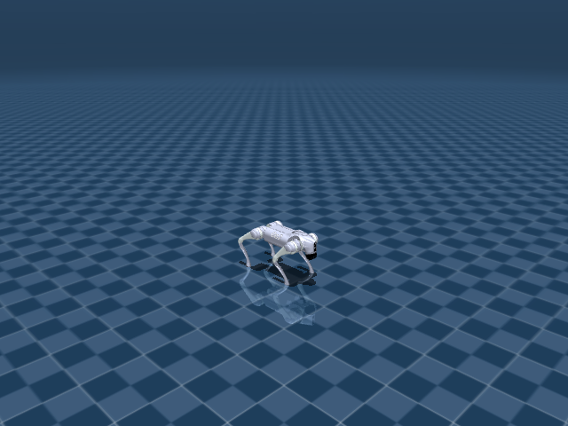

# Go2 FootStand

## 任务目标

训练 Go2 以前足支撑姿态站立，保持指定身体高度、姿态稳定和后腿接触/离地模式。



> 图片由 `_tools/render_static_images.py` 使用 `src/unilab/assets/robots/go2/scene_flat.xml` 的 MuJoCo scene 离屏渲染生成；如果当前环境无法启用 EGL/OSMesa，生成 manifest 会记录失败原因。

## 证据索引

| 项目 | 内容 |
| --- | --- |
| 任务类别 | 运动控制 |
| 机器人 | go2 |
| 代表 scene | src/unilab/assets/robots/go2/scene_flat.xml |
| 代表源码 | src/unilab/envs/locomotion/go2/footstand.py |
| 代表 owner YAML | conf/ppo/task/go2_footstand/mujoco.yaml |
| 动作维度 | 12 |

### Registry 与 Owner

| 注册名 | 后端 | 配置类 | 配置源码 |
| --- | --- | --- | --- |
| Go2FootStand | mujoco | Go2FootStandCfg | src/unilab/envs/locomotion/go2/footstand.py |

| 算法组 | 后端 | training.task_name | owner YAML |
| --- | --- | --- | --- |
| ppo | mujoco | Go2FootStand | conf/ppo/task/go2_footstand/mujoco.yaml |

## 代码级执行流

这部分不再用通用关键词套模板，而是为 `go2_footstand` 单独写源码导读。源码片段只负责提供证据；每节说明都围绕本任务自己的配置、状态、观测、动作和 reward 语义展开。

| 阶段 | 证据位置 | 代码级说明 |
| --- | --- | --- |
| 1. Hydra owner | conf/ppo/task/go2_footstand/mujoco.yaml | 训练命令先 compose owner YAML。这里确定 `training.task_name`、后端身份、obs_groups、reward scale 和 env override。 |
| 2. Registry 构造 Env | src/unilab/envs/locomotion/go2/footstand.py | `@registry.envcfg` 注册配置类，`@registry.env` 注册后端实现类；训练脚本只调用 registry，不直接 new 任务类。 |
| 3. Reset/初始状态 | src/unilab/assets/robots/go2/scene_flat.xml | env 从 scene keyframe 或 motion/grasp cache 取初态，再通过 reset randomization 改写 qpos/qvel/info。 |
| 4. Obs dict | src/unilab/envs/locomotion/go2/footstand.py | env 读取 backend 传感器和 info，返回 dict；learner 根据 `obs_groups_spec` 和 owner `algo.obs_groups` 选择 actor/critic 输入。 |
| 5. Action 到控制目标 | src/unilab/envs/locomotion/go2/footstand.py | policy 输出先按 action scale / 控制顺序映射到 actuator，再由 backend step 推进仿真。 |
| 6. Reward dispatch | src/unilab/envs/locomotion/go2/footstand.py | 源码把 reward key 映射到函数，owner YAML 的 scale 决定每项奖励/惩罚是否启用以及权重。 |
| 7. Termination | src/unilab/envs/locomotion/go2/footstand.py | env 根据高度、姿态、接触、参考轨迹误差、物体状态或能量阈值生成 done/terminated。 |

### 本任务阅读重点

| 阅读重点 |
| --- |
| Footstand 是 Go2 中最需要单独写的任务：它有专用 reset provider、obs history、energy termination 和前/后足接触逻辑。 |
| 动作仍是 12 维，但 reward 明确区分目标前足支撑、后足接触、身体高度和能耗。 |
| 阅读时优先看 `Go2FootStandTask`，它不是 Go2WalkTask 的简单参数变体。 |

### 本任务注册入口

| 注册名 | 配置类 | 可用后端 |
| --- | --- | --- |
| Go2FootStand | Go2FootStandCfg | mujoco |

### 本任务源码锚点

| 小节 | 源码文件 | 明确锚点 |
| --- | --- | --- |
| 配置：前足站立 | src/unilab/envs/locomotion/go2/footstand.py | Go2FootStandCfg, Go2FootStand |
| Reset：站立初态 | src/unilab/envs/locomotion/go2/footstand.py | build_reset_plan, FootStand |
| Obs：历史堆叠 | src/unilab/envs/locomotion/go2/footstand.py | obs_groups_spec, _compute_obs |
| Action：裁剪与默认角 | src/unilab/envs/locomotion/go2/footstand.py | apply_action, clip_actions |
| Reward/Termination：能量与接触 | src/unilab/envs/locomotion/go2/footstand.py | _init_reward_functions, update_state |

## 关键源码逐段解释（按本任务手写）

### 配置：前足站立

| 本任务人工导读 |
| --- |
| 配置中设置 max_episode_seconds、history、reward 和 footstand 专用阈值。 |
| MuJoCo-only 任务应通过 owner YAML 选择，而不是覆盖 backend 字段。 |

```python
# src/unilab/envs/locomotion/go2/footstand.py
# FootStand 继承 HandStand 配置，但以独立注册名暴露给 owner YAML。
@registry.envcfg("Go2FootStand")
@dataclass
class Go2FootStandCfg(Go2HandStandCfg):
    # 前足站立任务 episode 更短，避免长时间失败姿态占用采样。
    max_episode_seconds: float = 10.0
    # 需要 accelerometer/global_angvel 等 body 传感器写入 critic 特权尾部。
    add_body_sensors: bool = True
    # actor 使用历史堆叠，默认至少 15 帧，补足短时动态信息。
    obs_history_len: int = _FOOTSTAND_MIN_OBS_HISTORY_LEN
    # 软关节限位比例，用于 dof_pos_limits 惩罚而不是硬截断。
    soft_joint_pos_limit_factor: float = 0.9
    # 能量终止阈值可由 owner YAML 覆盖；cfg 默认不启用能量终止。
    energy_termination_threshold: float = np.inf
    # 起立早期给 grace steps，避免还没站起就因高度/姿态失败终止。
    termination_grace_steps: int = 100
    # 低于目标高度该比例时，grace 后判定站立失败。
    termination_height_fraction: float = 0.8
    # 姿态分数低于阈值时，grace 后判定站立失败。
    termination_orientation_threshold: float = 0.2
    # FootStand 单独调小关节角噪声、调大关节速度噪声，匹配历史观测。
    noise_config: FootstandNoiseConfig = field(default_factory=FootstandNoiseConfig)  # type: ignore[assignment]
    # action_scale=0.3，并由 FootstandControlConfig 提供 clip_actions。
    control_config: FootstandControlConfig = field(  # type: ignore[assignment]
        default_factory=lambda: FootstandControlConfig(action_scale=0.3)
    )
    # 传感器把终止接触定义为后腿/后部接触，惩罚接触定义为前腿/前部接触。
    sensor: FootstandSensor = field(default_factory=FootstandSensor)  # type: ignore[assignment]
    # FootStand DR 关闭 kp/kd/base mass 通用项，改用摩擦、link mass、torso COM 等专项扰动。
    domain_rand: Go2FootStandDomainRandConfig = field(default_factory=Go2FootStandDomainRandConfig)  # type: ignore[assignment]


```

```python
# src/unilab/envs/locomotion/go2/footstand.py
@dataclass
class Go2FootStandDomainRandConfig(Go2DomainRandConfig):
    # 这些通用 Go2 DR 在 FootStand 中关闭，避免控制增益扰动压过站立学习信号。
    randomize_kp: bool = False
    randomize_kd: bool = False
    randomize_base_mass: bool = False
    random_com: bool = False
    push_robots: bool = False

    # 地面摩擦随机化影响前足支撑是否打滑。
    randomize_floor_friction: bool = True
    floor_friction_range: list[float] = field(default_factory=lambda: [0.4, 1.0])

    # link mass 和 torso added mass 改变身体惯量，提升站立姿态鲁棒性。
    randomize_link_mass: bool = True
    link_mass_scale_range: list[float] = field(default_factory=lambda: [0.9, 1.1])
    torso_added_mass_range: list[float] = field(default_factory=lambda: [-1.0, 1.0])

    # torso COM 偏移模拟重心误差，是 footstand 稳定性的关键扰动。
    randomize_torso_com: bool = True
    torso_com_offset_range: list[float] = field(default_factory=lambda: [-0.05, 0.05])

    # armature 扰动改变关节动态响应。
    randomize_dof_armature: bool = True
    dof_armature_scale_range: list[float] = field(default_factory=lambda: [1.0, 1.05])

    # reset 时轻微扰动 12 个腿部关节角，训练从非完全 home 姿态恢复。
    randomize_reset_joint_qpos: bool = True
    reset_joint_qpos_range: list[float] = field(default_factory=lambda: [-0.05, 0.05])


```
### Reset：站立初态

| 本任务人工导读 |
| --- |
| reset 在 handstand 基础上改写站立任务需要的信息。 |
| 随机关节 qpos、质量和摩擦都只在 reset 冷路径发生。 |

```python
# src/unilab/envs/locomotion/go2/footstand.py
    def build_reset_plan(self, env: Any, env_ids: np.ndarray) -> ResetPlan:
        # 先复用 HandStand reset：初始 qpos/qvel、obs 基础信息和通用随机化都来自父类。
        plan = super().build_reset_plan(env, env_ids)
        # 复制 qpos，后续只改本次 reset 的关节初态，不污染父类 plan。
        qpos = np.asarray(plan.qpos, dtype=get_global_dtype()).copy()
        domain_rand = env.cfg.domain_rand
        # FootStand 只在 reset 冷路径扰动关节初始角，避免 step 热路径做资产/随机化逻辑。
        if domain_rand.randomize_reset_joint_qpos:
            low, high = domain_rand.reset_joint_qpos_range
            # 最后 env._num_action 维对应 12 个腿部关节 qpos。
            qpos[:, -env._num_action :] += np.random.uniform(
                low, high, size=(len(env_ids), env._num_action)
            ).astype(qpos.dtype)

        # 合并父类随机化和 playground 专项随机化，形成一次 reset payload。
        return ResetPlan(
            env_ids=plan.env_ids,
            qpos=qpos,
            qvel=plan.qvel,
            info_updates=plan.info_updates,
            randomization=self._merge_reset_randomization(
                plan.randomization,
                env._build_playground_reset_randomization(len(env_ids)),
            ),
        )

    @staticmethod
```

```python
# src/unilab/envs/locomotion/go2/footstand.py
@dataclass
class Go2FootStandDomainRandConfig(Go2DomainRandConfig):
    # 与上方配置一致：关闭通用增益/推力扰动，使用 FootStand 专项物理扰动。
    randomize_kp: bool = False
    randomize_kd: bool = False
    randomize_base_mass: bool = False
    random_com: bool = False
    push_robots: bool = False

    # 前足支撑对 floor friction 很敏感。
    randomize_floor_friction: bool = True
    floor_friction_range: list[float] = field(default_factory=lambda: [0.4, 1.0])

    # link mass、torso mass 和 COM 让策略适应不同重心/惯量。
    randomize_link_mass: bool = True
    link_mass_scale_range: list[float] = field(default_factory=lambda: [0.9, 1.1])
    torso_added_mass_range: list[float] = field(default_factory=lambda: [-1.0, 1.0])

    randomize_torso_com: bool = True
    torso_com_offset_range: list[float] = field(default_factory=lambda: [-0.05, 0.05])

    # dof armature 和 reset joint qpos 扰动关节动态与起始构型。
    randomize_dof_armature: bool = True
    dof_armature_scale_range: list[float] = field(default_factory=lambda: [1.0, 1.05])

    randomize_reset_joint_qpos: bool = True
    reset_joint_qpos_range: list[float] = field(default_factory=lambda: [-0.05, 0.05])


```
### Obs：历史堆叠

| 本任务人工导读 |
| --- |
| obs 包含 playground/姿态/动作历史等字段，history 让策略记住姿态变化趋势。 |
| critic 包含更多特权项帮助 value 估计前足支撑是否稳定。 |

```python
# src/unilab/envs/locomotion/go2/footstand.py
    @property
    def obs_groups_spec(self) -> dict[str, int]:
        # Playground state:
        # linvel(3) + gyro(3) + gravity(3) + diff(12) + dof_vel(12) + last_action(12) = 45.
        # UniLab stacks the actor state for short-horizon dynamics; critic appends current privileged tail.
        # actor 维度 = 单帧 45 维 * history_len；默认 15 帧就是 675 维。
        obs_dim = _FOOTSTAND_FRAME_OBS_DIM * self._obs_history_len
        # critic 在 actor 历史后追加 49 维当前特权状态。
        return {"obs": obs_dim, "critic": obs_dim + _FOOTSTAND_PRIVILEGED_TAIL_DIM}

    @property
```

```python
# src/unilab/envs/locomotion/go2/footstand.py
    def _compute_obs(
        self,
        info: dict,
        linvel: np.ndarray,
        gyro: np.ndarray,
        gravity: np.ndarray,
        dof_pos: np.ndarray,
        dof_vel: np.ndarray,
        height: np.ndarray,
        accelerometer: np.ndarray | None = None,
        global_angvel: np.ndarray | None = None,
        env_ids: np.ndarray | None = None,
    ) -> dict[str, np.ndarray]:
        # FootStand 使用自己的噪声配置，owner YAML 明确打开 level=1.0。
        noise_cfg = self._cfg.noise_config
        # diff 表示当前关节角相对默认角的偏移。
        diff = dof_pos - self.default_angles
        # actor 单帧包含 base 局部速度、角速度、局部重力、关节误差、关节速度和上一动作。
        noisy_linvel = self._obs_noise(linvel, noise_cfg.scale_linvel)
        noisy_gyro = self._obs_noise(gyro, noise_cfg.scale_gyro)
        noisy_gravity = self._obs_noise(gravity, noise_cfg.scale_gravity)
        noisy_diff = self._obs_noise(diff, noise_cfg.scale_joint_angle)
        noisy_dof_vel = self._obs_noise(dof_vel, noise_cfg.scale_joint_vel)
        # 使用 last_actions 而不是 current_actions，表示策略上一帧真实执行的控制趋势。
        last_actions = info.get("last_actions", np.zeros_like(diff))

        # 先拼出 45 维单帧 actor state。
        obs = np.concatenate(
            [noisy_linvel, noisy_gyro, noisy_gravity, noisy_diff, noisy_dof_vel, last_actions],
            axis=1,
            dtype=get_global_dtype(),
        )
        # 再堆叠历史帧，让 actor 看到短时间姿态变化趋势。
        obs = self._update_obs_history(obs, env_ids=env_ids)
        # torques 是训练期特权量，来自 PD 估计或 reset 初始化。
        torques = np.asarray(info.get("torques", np.zeros_like(dof_pos)), dtype=get_global_dtype())
        # reset 阶段可能没有这些 body sensor，则填 0 保持 critic 维度稳定。
        if accelerometer is None:
            accelerometer = np.zeros_like(gyro)
        if global_angvel is None:
            global_angvel = np.zeros_like(gyro)
        # critic = actor 历史 + 当前真实 IMU/速度/关节/力矩/高度特权尾部。
        critic = np.concatenate(
            [
                obs,
                gyro,
                accelerometer,
                linvel,
                global_angvel,
                dof_pos,
                dof_vel,
                torques,
                height,
            ],
            axis=1,
            dtype=get_global_dtype(),
        )
        return {"obs": obs, "critic": critic}

```
### Action：裁剪与默认角

| 本任务人工导读 |
| --- |
| 动作裁剪后乘 action_scale，并叠加 default angles。 |
| 这里每一维仍对应 Go2 actuator 表中的腿部关节。 |

```python
# src/unilab/envs/locomotion/go2/footstand.py
    def apply_action(self, actions: np.ndarray, state: NpEnvState) -> np.ndarray:
        # FootStand 把策略输出裁剪到 clip_actions，owner 默认 clip=1.0。
        clip_actions = float(getattr(self._cfg.control_config, "clip_actions", np.inf))
        actions_np = np.asarray(actions, dtype=get_global_dtype())
        if np.isfinite(clip_actions):
            actions_np = np.clip(actions_np, -clip_actions, clip_actions)

        # 保存动作历史；obs/action_rate/reward 使用同一份裁剪后的动作。
        state.info["last_actions"] = state.info.get("current_actions", np.zeros_like(actions_np))
        state.info["current_actions"] = actions_np
        # 可选执行延迟；默认直接执行当前动作。
        exec_actions = (
            state.info["last_actions"]
            if self._cfg.control_config.simulate_action_latency
            else actions_np
        )
        # 与 flat/handstand 不同，FootStand 是在 motor_targets 上做增量积分。
        self._motor_targets += exec_actions * self._cfg.control_config.action_scale
        # motor target 被软/硬目标范围裁剪，防止长期积分越过关节范围。
        self._clip_motor_targets()
        # 返回 actuator control order 的 12 维目标角。
        return np.asarray(self._motor_targets, dtype=get_global_dtype())

```
### Reward/Termination：能量与接触

| 本任务人工导读 |
| --- |
| height/orientation/contact/tar/rear_feet_contact/energy 是本任务核心。 |
| termination 不只是摔倒，还包括能量阈值和站立姿态失败。 |

```python
# src/unilab/envs/locomotion/go2/footstand.py
    def _init_reward_functions(self):
        # FootStand reward 明确区分站立高度、前足支撑、后足接触、能耗和姿态失败。
        self._reward_fns: dict[str, Any] = {
            # 高度和朝向是站成前足支撑姿态的主奖励。
            "height": self._reward_height,
            "contact": self._cost_contact,
            "orientation": self._reward_orientation,
            # 兼容旧 owner 中的拼写错误 key，仍映射到同一朝向奖励。
            "oritentation": self._reward_orientation,
            # 动作平滑和终止惩罚。
            "action_rate": rewards.action_rate,
            "termination": self._reward_termination,
            # 关节限位、力矩和姿态偏离用于约束可执行构型。
            "dof_pos_limits": self._cost_joint_pos_limits,
            "torques": self._cost_torques,
            "pose": self._cost_pose,
            # 前部/后部接触项分别约束不该碰地和应该支撑的部位。
            "penalty_contact": self._reward_penalty_contact,
            "tar": self._reward_tar,
            "rear_feet_contact": self._reward_rear_feet_contact,
            # 细化站立形态：后腿对称、前腿稳定、身体静止、膝部离地。
            "rear_leg_symmetry": self._cost_rear_leg_symmetry,
            "front_leg_motion": self._cost_front_leg_motion,
            "upright_stability": self._cost_upright_stability,
            "knee_clearance": self._cost_knee_clearance,
            "stay_still": self._cost_stay_still,
            # 能量和关节加速度降低高频、费力的站立策略。
            "energy": rewards.energy,
            "dof_acc": rewards.dof_acc,
        }

```

```python
# src/unilab/envs/locomotion/go2/footstand.py
    def update_state(self, state: NpEnvState) -> NpEnvState:
        # 读取本帧速度、IMU、局部重力和 body 传感器。
        linvel = self.get_local_linvel()
        gyro = self.get_gyro()
        upvector = self._backend.get_sensor_data("upvector")
        gravity = self._get_local_gravity()
        accelerometer = self._backend.get_sensor_data(self._cfg.sensor.accelerometer)
        global_angvel = self._backend.get_sensor_data(self._cfg.sensor.global_angvel)
        dof_pos = self.get_dof_pos()
        dof_vel = self.get_dof_vel()
        # 刷新足端接触力和位置，供 contact/rear_feet/knee 相关 reward 使用。
        self.feet_force[:, :, :] = 0
        for i in range(len(self._cfg.sensor.feet_force)):
            self.feet_force[:, i, :] = self._backend.get_sensor_data(self._cfg.sensor.feet_force[i])
        for i in range(len(self._cfg.sensor.feet_pos)):
            self.feet_pos[:, i, :] = self._backend.get_sensor_data(self._cfg.sensor.feet_pos[i])
        # torso_height 是高度 reward 和低高度终止的直接输入。
        self.torso_height = self._backend.get_sensor_data(self._cfg.sensor.global_pos)[:, -1]
        # ternamate_contact 在 FootStand 中代表后腿/后部不允许触发的失败接触。
        contact_arrays = []
        for name in self._cfg.sensor.ternamate_contact:
            arr = self._backend.get_sensor_data(name)
            contact_arrays.append(arr)
        result = np.concatenate(contact_arrays, axis=1)

        # qacc 和 torques 是 reward/energy/critic 特权信息。
        state.info["qacc"] = self._estimate_dof_acc(dof_vel)
        state.info["torques"] = self._estimate_pd_torques(state.info, dof_pos, dof_vel)
        # orientation_score 衡量机身前向是否朝向目标竖直方向。
        orientation = self._orientation_score()
        # grace 期内不因高度/姿态不足终止，让策略有时间起立。
        step_count = state.info.get("steps", np.zeros((self._num_envs,), dtype=np.uint32))
        grace_elapsed = step_count >= self._cfg.termination_grace_steps
        # upvector 翻转过多视为摔倒。
        terminated_z = upvector[:, 2] < -0.25
        # 失败接触、低高度、坏姿态和能量过高构成 FootStand 的终止面。
        terminated_contact = np.any(result, axis=1)
        terminated_low_height = (
            self.torso_height < self._z_des * self._cfg.termination_height_fraction
        )
        terminated_bad_orientation = orientation < self._cfg.termination_orientation_threshold
        terminated_pose = grace_elapsed & (terminated_low_height | terminated_bad_orientation)
        # 能量 = |torque| * |dof_vel| 的逐关节和，超过 owner 阈值时终止。
        energy = np.sum(np.abs(state.info["torques"]) * np.abs(dof_vel), axis=1)
        terminated_energy = energy > self._cfg.energy_termination_threshold
        # 汇总所有失败条件，记录到 _last_terminated 供 termination reward 使用。
        terminated = np.logical_or.reduce(
            (terminated_contact, terminated_z, terminated_energy, terminated_pose)
        )
        self._last_terminated = terminated.copy()
        # reward 和 obs 使用同一帧状态；obs 包含历史堆叠和 critic 特权尾部。
        reward = self._compute_reward(state.info, linvel, gyro, dof_pos, dof_vel)
        obs = self._compute_obs(
            state.info,
            linvel,
            gyro,
            gravity,
            dof_pos,
            dof_vel,
            self.torso_height.reshape(-1, 1),
            accelerometer,
            global_angvel,
        )
        return state.replace(obs=obs, reward=reward, terminated=terminated)

```


## Agent

Agent 输出 12 维关节目标；owner YAML 使用较长 obs history 强化姿态控制记忆。

训练入口通过 owner YAML 决定注册 env、后端身份和算法参数；CLI 应使用 `--sim` 选择 backend owner，而不是单独 override `training.sim_backend`。

```yaml
# conf/ppo/task/go2_footstand/mujoco.yaml
training:
  task_name: Go2FootStand
  sim_backend: mujoco
algo:
  obs_groups:
    actor:
    - actor
    critic:
    - critic
  num_envs: 1024
  max_iterations: 10000
```

## Env

Env 使用 `Go2FootStandTask`，是 MuJoCo-only 的足式站立专用任务。

Env 必须遵守 `NpEnv` contract：`reset()` 返回 `(obs_dict, info_dict)`，`obs` 是 dict，`obs_groups_spec` 决定 learner 使用哪些观测组。

```python
# src/unilab/envs/locomotion/go2/footstand.py
        "FR_calf_contact1",
        "FR_calf_contact2",
    ]


@registry.envcfg("Go2FootStand")
@dataclass
class Go2FootStandCfg(Go2HandStandCfg):
    max_episode_seconds: float = 10.0
    add_body_sensors: bool = True
    obs_history_len: int = _FOOTSTAND_MIN_OBS_HISTORY_LEN
```

## Obs

观测堆叠历史帧，包含姿态、角速度、关节误差、关节速度、动作历史和特权信息。

### Obs 字段级拆解

下面的表格把源码里的观测拼接逻辑拆成语义字段。维度如果依赖 history、terrain scan 或 motion body 数量，文档会写成“规模”而不是硬编码，避免和配置漂移。

| 观测字段 | 维度/规模 | 代码来源 | 中文说明 |
| --- | --- | --- | --- |
| linvel | 3 维 | `_FOOTSTAND_FRAME_OBS_DIM` 注释 | base 局部线速度，用于判断是否在姿态任务中漂移。 |
| gyro | 3 维 | `sensor.gyro` | 躯干角速度，判断倒立/前足站立是否稳定。 |
| gravity | 3 维 | `_get_local_gravity()` | 局部重力方向，是姿态误差的主要观测。 |
| diff | 12 维 | 当前关节角与目标/默认角差 | 腿部 12 个关节的姿态误差。 |
| dof_vel | 12 维 | 关节速度 | 腿部运动速度。 |
| last_action | 12 维 | 上一帧动作 | 动作平滑和控制滞后建模。 |
| history stack | 45 × history | `obs_history_len` | 把单帧 45 维堆叠为短时序观测，默认至少 15 帧。 |
| critic tail | 49 维 | `_FOOTSTAND_PRIVILEGED_TAIL_DIM` | critic 附加当前特权状态，用于训练但不直接部署。 |

owner YAML 中的 `algo.obs_groups` 说明算法从 env obs dict 中读取哪些组。没有写入 owner 的字段保持 env cfg 默认值，文档不臆造未配置项。

```yaml
# conf/ppo/task/go2_footstand/mujoco.yaml
algo:
  obs_groups:
    actor:
    - actor
    critic:
    - critic

```

代码侧观测通常在 `_get_obs`、`_build_obs`、`obs_groups_spec` 或 base env 中组装：

```python
# src/unilab/envs/locomotion/go2/footstand.py
        self.feet_geom_names = list(_FOOTSTAND_FRONT_FEET)
        self._joint_ids = list(_FOOTSTAND_REAR_LEG_IDS)
        self._tar_ids = list(_FOOTSTAND_FRONT_LEG_IDS)
        self.target_angle = np.asarray(_FOOTSTAND_FRONT_LEG_TARGET, dtype=get_global_dtype())

    @property
    def obs_groups_spec(self) -> dict[str, int]:
        # Playground state:
        # linvel(3) + gyro(3) + gravity(3) + diff(12) + dof_vel(12) + last_action(12) = 45.
        # UniLab stacks the actor state for short-horizon dynamics; critic appends current privileged tail.
        obs_dim = _FOOTSTAND_FRAME_OBS_DIM * self._obs_history_len
        return {"obs": obs_dim, "critic": obs_dim + _FOOTSTAND_PRIVILEGED_TAIL_DIM}

```

源码锚点拆解：

| 源码符号 | 中文说明 |
| --- | --- |
| obs_groups_spec | 声明 obs dict 中各观测组的维度，是 wrapper/learner 对齐观测的契约。 |
| _compute_obs | 读取 backend 传感器和 info 字段，拼接 actor/critic 观测。 |

## Action

动作经 `action_scale` 叠加到默认角度，控制 Go2 全部 12 个腿部 actuator。

### Action 逐维拆解

四足任务的 action 逐维对应四条腿的 hip/thigh/calf actuator。env 在 `apply_action` 中把策略输出乘以 `action_scale`，再加到 keyframe 默认角上；因此策略学习的是“相对默认站姿的目标角偏移”，不是直接力矩。

当前代表 scene 编译出的 action 维度为 `12`。下表来自 MuJoCo 编译模型的 actuator 顺序，也就是策略输出维度和执行器维度的对应关系。

| Action 维度 | 执行器 | 驱动关节 | 中文含义 | 控制/限制说明 |
| --- | --- | --- | --- | --- |
| 0 | FR_hip | FR_hip_joint | 右前腿髋外展/内收关节 | XML 未显式限制，实际由 env 缩放/默认角和 backend 控制 |
| 1 | FR_thigh | FR_thigh_joint | 右前腿髋俯仰（大腿）关节 | XML 未显式限制，实际由 env 缩放/默认角和 backend 控制 |
| 2 | FR_calf | FR_calf_joint | 右前腿膝关节（小腿摆动） | XML 未显式限制，实际由 env 缩放/默认角和 backend 控制 |
| 3 | FL_hip | FL_hip_joint | 左前腿髋外展/内收关节 | XML 未显式限制，实际由 env 缩放/默认角和 backend 控制 |
| 4 | FL_thigh | FL_thigh_joint | 左前腿髋俯仰（大腿）关节 | XML 未显式限制，实际由 env 缩放/默认角和 backend 控制 |
| 5 | FL_calf | FL_calf_joint | 左前腿膝关节（小腿摆动） | XML 未显式限制，实际由 env 缩放/默认角和 backend 控制 |
| 6 | RR_hip | RR_hip_joint | 右后腿髋外展/内收关节 | XML 未显式限制，实际由 env 缩放/默认角和 backend 控制 |
| 7 | RR_thigh | RR_thigh_joint | 右后腿髋俯仰（大腿）关节 | XML 未显式限制，实际由 env 缩放/默认角和 backend 控制 |
| 8 | RR_calf | RR_calf_joint | 右后腿膝关节（小腿摆动） | XML 未显式限制，实际由 env 缩放/默认角和 backend 控制 |
| 9 | RL_hip | RL_hip_joint | 左后腿髋外展/内收关节 | XML 未显式限制，实际由 env 缩放/默认角和 backend 控制 |
| 10 | RL_thigh | RL_thigh_joint | 左后腿髋俯仰（大腿）关节 | XML 未显式限制，实际由 env 缩放/默认角和 backend 控制 |
| 11 | RL_calf | RL_calf_joint | 左后腿膝关节（小腿摆动） | XML 未显式限制，实际由 env 缩放/默认角和 backend 控制 |

控制参数来自 owner YAML 的 `env.control_config`，缺省值由对应 env cfg/dataclass 提供。

| 配置字段 | 当前值 | 中文说明 |
| --- | --- | --- |
| action_scale | 0.3 | 策略输出到目标关节角的缩放系数。 |

```yaml
# conf/ppo/task/go2_footstand/mujoco.yaml
env:
  control_config:
    action_scale: 0.3

```

动作到执行器的实际映射由 backend 的 actuator control range 和 env 的 `apply_action`/控制函数完成：

```python
# src/unilab/envs/locomotion/go2/footstand.py

    def _standing_mask(self) -> np.ndarray:
        height_ready = self.torso_height >= self._z_des * _FOOTSTAND_STAND_HEIGHT_FRACTION
        orientation_ready = self._orientation_score() >= _FOOTSTAND_STAND_ORIENTATION_THRESHOLD
        return np.asarray(height_ready & orientation_ready, dtype=get_global_dtype())

    def apply_action(self, actions: np.ndarray, state: NpEnvState) -> np.ndarray:
        clip_actions = float(getattr(self._cfg.control_config, "clip_actions", np.inf))
        actions_np = np.asarray(actions, dtype=get_global_dtype())
        if np.isfinite(clip_actions):
            actions_np = np.clip(actions_np, -clip_actions, clip_actions)

        state.info["last_actions"] = state.info.get("current_actions", np.zeros_like(actions_np))
```

源码锚点拆解：

| 源码符号 | 中文说明 |
| --- | --- |
| _dof_to_ctrl_order | action 相关源码锚点。 |
| apply_action | 把策略输出缩放为执行器控制目标。 |

## Reward

reward 明确包含 height/orientation/contact/tar/rear_feet_contact/energy 等项，约束站立高度、稳定性和能耗。

### Reward 逐项拆解

reward scale 以 owner YAML 的 `reward.scales` 为真源；源码中的 `RewardConfig` 描述可用字段，训练脚本只做 Hydra 组装和注入。正数通常表示奖励，负数通常表示惩罚，0 表示该项在当前 owner 中关闭或仅保留接口。

| Reward key | Scale | 方向 | 中文含义 |
| --- | --- | --- | --- |
| height | 2.0 | 奖励 | 目标高度奖励，用于 footstand/handstand 等姿态任务。 |
| orientation | 2.0 | 奖励 | 姿态项，通常基于重力投影或目标朝向惩罚倾斜。 |
| contact | -1.0 | 惩罚 | 接触项，约束指定足端或身体部位的接触模式。 |
| action_rate | -0.01 | 惩罚 | 动作变化惩罚，抑制相邻控制步之间的目标突变。 |
| termination | -2.0 | 惩罚 | 失败终止惩罚，在触发终止时给负奖励。 |
| dof_pos_limits | -0.5 | 惩罚 | 关节位置限位惩罚，防止接近 XML joint range 边界。 |
| torques | 0.0 | 记录/关闭 | 力矩惩罚，降低控制输出过大。 |
| pose | -0.1 | 惩罚 | 默认姿态或参考姿态约束，防止无关关节偏离可用构型。 |
| penalty_contact | -0.2 | 惩罚 | 接触项，约束指定足端或身体部位的接触模式。 |
| tar | 0.8 | 奖励 | 目标前腿姿态项，FootStand 中约束前腿到目标角度。 |
| rear_feet_contact | 0.5 | 奖励 | 后足接触奖励/约束，FootStand 中用于稳定后腿接触模式。 |
| rear_leg_symmetry | -0.2 | 惩罚 | 后腿对称性约束，避免左右后腿构型过度不一致。 |
| front_leg_motion | -0.05 | 惩罚 | 前腿运动惩罚，抑制支撑姿态下前腿无效摆动。 |
| upright_stability | -0.2 | 惩罚 | 竖直稳定项，鼓励身体朝向目标支撑方向。 |
| knee_clearance | -0.5 | 惩罚 | 膝部离地/高度约束，防止膝盖碰地。 |
| stay_still | -0.1 | 惩罚 | 静止约束，姿态任务中减少 base 漂移。 |
| energy | -0.003 | 惩罚 | 能量消耗惩罚，降低力矩与速度共同造成的控制代价。 |
| dof_acc | -2.5e-07 | 惩罚 | 关节加速度惩罚，抑制高频振荡。 |

```yaml
# conf/ppo/task/go2_footstand/mujoco.yaml
reward:
  scales:
    height: 2.0
    orientation: 2.0
    contact: -1.0
    action_rate: -0.01
    termination: -2.0
    dof_pos_limits: -0.5
    torques: 0.0
    pose: -0.1
    penalty_contact: -0.2
    tar: 0.8
    rear_feet_contact: 0.5
    rear_leg_symmetry: -0.2
    front_leg_motion: -0.05
    upright_stability: -0.2
    knee_clearance: -0.5
    stay_still: -0.1
    energy: -0.003
    dof_acc: -2.5e-07
  tracking_sigma: 0.25
  base_height_target: 0.3
  knee_height_target: 0.08

```

源码中的 reward 入口：

```python
# src/unilab/envs/locomotion/go2/footstand.py
        energy = np.sum(np.abs(state.info["torques"]) * np.abs(dof_vel), axis=1)
        terminated_energy = energy > self._cfg.energy_termination_threshold
        terminated = np.logical_or.reduce(
            (terminated_contact, terminated_z, terminated_energy, terminated_pose)
        )
        self._last_terminated = terminated.copy()
        reward = self._compute_reward(state.info, linvel, gyro, dof_pos, dof_vel)
        obs = self._compute_obs(
            state.info,
            linvel,
            gyro,
            gravity,
            dof_pos,
```

源码锚点拆解：

| 源码符号 | 中文说明 |
| --- | --- |
| _init_reward_functions | 把 reward 名称映射到源码函数，owner YAML 的 scale 会按这些 key 分发。 |
| _reward_height | 单个 reward 项的实现函数，通常返回每个 env 的 reward 向量。 |
| _compute_reward | reward 相关源码锚点。 |
| _reward_termination | 单个 reward 项的实现函数，通常返回每个 env 的 reward 向量。 |
| _reward_orientation | 单个 reward 项的实现函数，通常返回每个 env 的 reward 向量。 |
| _reward_rear_feet_contact | 单个 reward 项的实现函数，通常返回每个 env 的 reward 向量。 |

## 初始状态

初始状态来自 Go2 `home` keyframe，reset 时可随机关节 qpos、质量和地面摩擦。

机器人默认姿态来自 scene/task fragment 中的 keyframe；任务 reset 在此基础上加入命令、motion reference、物体状态或随机化。

```xml
<!-- src/unilab/assets/robots/go2/scene_flat.xml -->
    <contact name="RR_calf_contact2" geom1="floor" geom2="RR_calf_geom2" data="found" num="1" reduce="mindist"/>
  </sensor>

  <keyframe>
    <key name="home" qpos="
        0 0 0.3  1 0 0 0
        0 0.8 -1.5
```

```python
# src/unilab/envs/locomotion/go2/footstand.py
    randomize_torso_com: bool = True
    torso_com_offset_range: list[float] = field(default_factory=lambda: [-0.05, 0.05])

    randomize_dof_armature: bool = True
    dof_armature_scale_range: list[float] = field(default_factory=lambda: [1.0, 1.05])

    randomize_reset_joint_qpos: bool = True
    reset_joint_qpos_range: list[float] = field(default_factory=lambda: [-0.05, 0.05])


@dataclass
class FootstandSensor(JoystickSensor):
    accelerometer = "accelerometer"
```

## 终止条件

终止包括姿态失败、接触失败、能量阈值和超时。

终止条件通常由 env 源码中的 `_compute_termination(s)`、reward config 阈值和 `max_episode_seconds` 共同决定。

```yaml
# conf/ppo/task/go2_footstand/mujoco.yaml
env:
  energy_termination_threshold: 200.0

reward:
  {}

```

```python
# src/unilab/envs/locomotion/go2/footstand.py
        height = env._backend.get_sensor_data(env._cfg.sensor.global_pos)[env_ids, -1].reshape(
            -1, 1
        )
        local_gravity = env._get_local_gravity()[env_ids]
        accelerometer = env._backend.get_sensor_data(env._cfg.sensor.accelerometer)[env_ids]
        global_angvel = env._backend.get_sensor_data(env._cfg.sensor.global_angvel)[env_ids]
        env.torso_height[env_ids] = height[:, 0]
        env._last_dof_vel_for_acc[env_ids, :] = dof_vel
        env._last_terminated[env_ids] = False
        env._motor_targets[env_ids] = env._dof_to_ctrl_order(dof_pos)
        target_dof = env._ctrl_to_dof_order(env._motor_targets[env_ids])
        info_updates["torques"] = np.asarray(
            env._cfg.control_config.Kp * (target_dof - dof_pos)
            - env._cfg.control_config.Kd * dof_vel,
            dtype=get_global_dtype(),
        )

```

## 域随机化

domain_rand 在 owner YAML 中启用 floor friction、link mass、torso COM、armature 和 reset joint qpos 随机化。

域随机化只在 reset/interval 等冷路径触发，不在 step 热路径解析资产或探测 backend 私有能力。

### 域随机化字段拆解

| 配置字段 | 当前值 | 中文说明 |
| --- | --- | --- |
| dof_armature_scale_range | [1.0, 1.05] | 观测噪声或传感器噪声缩放，用于提升鲁棒性。 |
| floor_friction_range | [0.4, 1.0] | 随机采样范围或控制范围。 |
| link_mass_scale_range | [0.9, 1.1] | 观测噪声或传感器噪声缩放，用于提升鲁棒性。 |
| randomize_dof_armature | True | 域随机化开关。 |
| randomize_floor_friction | True | 域随机化开关。 |
| randomize_link_mass | True | 域随机化开关。 |
| randomize_reset_joint_qpos | True | 域随机化开关。 |
| randomize_torso_com | True | 域随机化开关。 |
| reset_joint_qpos_range | [-0.05, 0.05] | 随机采样范围或控制范围。 |
| torso_added_mass_range | [-1.0, 1.0] | 随机采样范围或控制范围。 |
| torso_com_offset_range | [-0.05, 0.05] | 随机采样范围或控制范围。 |

```yaml
# conf/ppo/task/go2_footstand/mujoco.yaml
env:
  domain_rand:
    randomize_floor_friction: true
    floor_friction_range:
    - 0.4
    - 1.0
    randomize_link_mass: true
    link_mass_scale_range:
    - 0.9
    - 1.1
    torso_added_mass_range:
    - -1.0
    - 1.0
    randomize_torso_com: true
    torso_com_offset_range:
    - -0.05
    - 0.05
    randomize_dof_armature: true
    dof_armature_scale_range:
    - 1.0
    - 1.05
    randomize_reset_joint_qpos: true
    reset_joint_qpos_range:
    - -0.05
    - 0.05

```

```python
# src/unilab/envs/locomotion/go2/footstand.py
from unilab.dtype_config import get_global_dtype
from unilab.envs.common.rotation import np_quat_apply, np_quat_apply_inverse
from unilab.envs.locomotion.common import rewards
from unilab.envs.locomotion.common.rewards import RewardContext
from unilab.envs.locomotion.go2.base import ControlConfig, NoiseConfig
from unilab.envs.locomotion.go2.handstand import (
    Go2DomainRandConfig,
    Go2HandStandCfg,
    Go2HandStandDomainRandomizationProvider,
    Go2HandStandTask,
    JoystickSensor,
)

```
