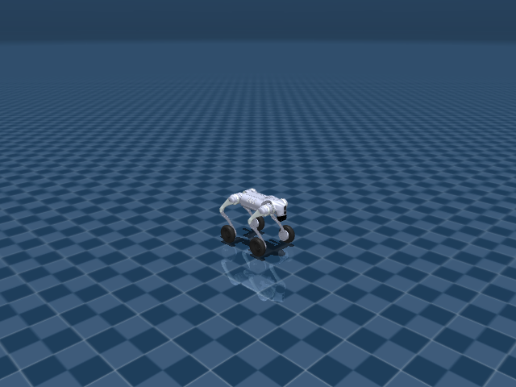

# Go2W Joystick Rough

## 任务目标

让 Go2W 在崎岖地形上融合轮部推进与腿部支撑，保持速度命令跟踪和通过性。



> 图片由 `_tools/render_static_images.py` 使用 `src/unilab/assets/robots/go2w/scene_flat.xml` 的 MuJoCo scene 离屏渲染生成；如果当前环境无法启用 EGL/OSMesa，生成 manifest 会记录失败原因。

## 证据索引

| 项目 | 内容 |
| --- | --- |
| 任务类别 | 运动控制 |
| 机器人 | go2w |
| 代表 scene | src/unilab/assets/robots/go2w/scene_flat.xml |
| 代表源码 | src/unilab/envs/locomotion/go2w/rough.py |
| 代表 owner YAML | conf/ppo/task/go2w_joystick_rough/mujoco.yaml |
| 动作维度 | 16 |

### Registry 与 Owner

| 注册名 | 后端 | 配置类 | 配置源码 |
| --- | --- | --- | --- |
| Go2WJoystickRough | mujoco, motrix | Go2WJoystickRoughCfg | src/unilab/envs/locomotion/go2w/rough.py |

| 算法组 | 后端 | training.task_name | owner YAML |
| --- | --- | --- | --- |
| ppo | motrix | Go2WJoystickRough | conf/ppo/task/go2w_joystick_rough/motrix.yaml |
| ppo | mujoco | Go2WJoystickRough | conf/ppo/task/go2w_joystick_rough/mujoco.yaml |

## 代码级执行流

这部分不再用通用关键词套模板，而是为 `go2w_joystick_rough` 单独写源码导读。源码片段只负责提供证据；每节说明都围绕本任务自己的配置、状态、观测、动作和 reward 语义展开。

| 阶段 | 证据位置 | 代码级说明 |
| --- | --- | --- |
| 1. Hydra owner | conf/ppo/task/go2w_joystick_rough/mujoco.yaml | 训练命令先 compose owner YAML。这里确定 `training.task_name`、后端身份、obs_groups、reward scale 和 env override。 |
| 2. Registry 构造 Env | src/unilab/envs/locomotion/go2w/rough.py | `@registry.envcfg` 注册配置类，`@registry.env` 注册后端实现类；训练脚本只调用 registry，不直接 new 任务类。 |
| 3. Reset/初始状态 | src/unilab/assets/robots/go2w/scene_flat.xml | env 从 scene keyframe 或 motion/grasp cache 取初态，再通过 reset randomization 改写 qpos/qvel/info。 |
| 4. Obs dict | src/unilab/envs/locomotion/go2w/rough.py | env 读取 backend 传感器和 info，返回 dict；learner 根据 `obs_groups_spec` 和 owner `algo.obs_groups` 选择 actor/critic 输入。 |
| 5. Action 到控制目标 | src/unilab/envs/locomotion/go2w/rough.py | policy 输出先按 action scale / 控制顺序映射到 actuator，再由 backend step 推进仿真。 |
| 6. Reward dispatch | src/unilab/envs/locomotion/go2w/rough.py | 源码把 reward key 映射到函数，owner YAML 的 scale 决定每项奖励/惩罚是否启用以及权重。 |
| 7. Termination | src/unilab/envs/locomotion/go2w/rough.py | env 根据高度、姿态、接触、参考轨迹误差、物体状态或能量阈值生成 done/terminated。 |

### 本任务阅读重点

| 阅读重点 |
| --- |
| Go2W rough 同时有轮足控制和地形通过性，必须单独读 rough env，而不是套 Go2W flat 或 Go2 rough。 |
| 动作 16 维不变，新增复杂度来自 terrain reset、height scan critic 和 rough reward gate。 |
| 这个任务最重要的是区分轮部推进、腿部支撑和地形观测三条线。 |

### 本任务注册入口

| 注册名 | 配置类 | 可用后端 |
| --- | --- | --- |
| Go2WJoystickRough | Go2WJoystickRoughCfg | mujoco, motrix |

### 本任务源码锚点

| 小节 | 源码文件 | 明确锚点 |
| --- | --- | --- |
| 配置与地形 | src/unilab/envs/locomotion/go2w/rough.py | Go2WJoystickRoughCfg, Go2WRoughTerrainCfg |
| Reset：轮足地形 spawn | src/unilab/envs/locomotion/go2w/rough.py | build_reset_plan, spawn |
| Obs：轮足 + height scan | src/unilab/envs/locomotion/go2w/rough.py | obs_groups_spec, _compute_obs |
| Action：专用轮足控制 | src/unilab/envs/locomotion/go2w/joystick.py | apply_action, compute_go2w_motor_ctrl |
| Reward/Termination | src/unilab/envs/locomotion/go2w/rough.py | _init_reward_functions |

## 关键源码逐段解释（按本任务手写）

### 配置与地形

| 本任务人工导读 |
| --- |
| rough cfg 声明轮足地形任务的 terrain generator。 |
| scene/task fragment 承载地形，robot asset 不写任务逻辑。 |

```python
# src/unilab/envs/locomotion/go2w/rough.py
# rough 任务单独注册，不复用 flat 的注册名，owner YAML 通过这个名字选择 env。
@registry.envcfg("Go2WJoystickRough")
@dataclass
class Go2WJoystickRoughCfg(Go2WJoystickCfg):
    """Go2W rough terrain task with procedurally generated sub-terrains."""

# rough 任务使用 robot XML + locomotion_task fragment，再由 terrain cfg materialize hfield。
    scene: SceneCfg = field(
        default_factory=lambda: SceneCfg(
            model_file=str(ASSETS_ROOT_PATH / "robots" / "go2w" / "go2w.xml"),
            fragment_files=[
# keyframe 等 task-level 资源放在 fragment，避免把任务语义写进 robot.xml。
                str(ASSETS_ROOT_PATH / "robots" / "go2w" / "locomotion_task.xml"),
            ],
            terrain=TerrainSceneCfg(
# generator 决定 6x6 terrain grid 里各类子地形的分布。
                generator=Go2WRoughTerrainCfg(),
                hfield_name="terrain_hfield",
                geom_name="floor",
            ),
        )
    )
# rough 命令范围更大，并支持 heading_command。
    commands: Go2WRoughCommands = field(default_factory=Go2WRoughCommands)
# height scan 只作为观测传感器配置，具体采样由 common.height_scan 处理。
    terrain_scan: HeightScanConfig = field(default_factory=HeightScanConfig)
# rough 不用 gravity 直接 terminated，而把地形越界放进 truncated。
    termination_config: RoughTerminationConfig = field(default_factory=RoughTerminationConfig)
# curriculum/spawn manager 根据地形格子选择 reset 出生点。
    terrain_curriculum: TerrainCurriculumCfg = field(default_factory=TerrainCurriculumCfg)


```

```python
# src/unilab/envs/locomotion/go2w/rough.py
@dataclass(kw_only=True)
class Go2WRoughTerrainCfg(TerrainGeneratorCfg):
# 每个子地形 cell 的物理尺寸，owner YAML 可覆盖。
    size: tuple[float, float] = (8.0, 8.0)
# 6x6 grid 提供不同难度/类型的 rough terrain。
    num_rows: int = 6
    num_cols: int = 6
    border_width: float = 1.0
    add_lights: bool = True
# heightfield 横向分辨率，影响扫描和地形细节。
    horizontal_scale: float = 0.1

    sub_terrains: dict[str, SubTerrainCfg] = field(
        default_factory=lambda: {
# flat 比例为 0，说明这个 rough 任务训练重点不是平地。
            "flat": flat(proportion=0.0),
# stairs / inverted stairs 测试轮足跨台阶和下台阶能力。
            "pyramid_stairs": pyramid_stairs(
                proportion=0.1,
                step_height_range=(0.025, 0.10),
                step_width=0.4,
                platform_width=3.0,
                border_width=0.2,
            ),
            "pyramid_stairs_inv": pyramid_stairs_inv(
                proportion=0.1,
                step_height_range=(0.025, 0.10),
                step_width=0.4,
                platform_width=3.0,
                border_width=0.2,
            ),
# 坡面和反向坡面测试轮部推进与腿部支撑在倾斜地形上的配合。
            "hf_pyramid_slope": hf_pyramid_slope(
                proportion=0.2,
                slope_range=(0.0, 0.3),
                platform_width=2.0,
                border_width=0.2,
            ),
            "hf_pyramid_slope_inv": hf_pyramid_slope_inv(
                proportion=0.2,
                slope_range=(0.0, 0.3),
                platform_width=2.0,
                border_width=0.2,
            ),
# random_rough 与 wave_terrain 占比最高，强化通过连续起伏地形的能力。
            "random_rough": random_rough(
                proportion=0.3,
                noise_range=(0.01, 0.06),
                noise_step=0.01,
                border_width=0.2,
            ),
            "wave_terrain": wave_terrain(
                proportion=0.3,
                amplitude_range=(0.0, 0.12),
                num_waves=4,
                border_width=0.2,
            ),
        }
    )


```
### Reset：轮足地形 spawn

| 本任务人工导读 |
| --- |
| reset 同时处理地形 spawn 和 16 维轮足动作缓存。 |
| 随机化只在 reset payload 中传递给 backend。 |

```python
# src/unilab/envs/locomotion/go2w/rough.py
    def build_reset_plan(self, env: Any, env_ids: np.ndarray) -> ResetPlan:
# 本批 reset 的 env 数量用于构造 qpos/qvel/info 批数组。
        num_reset = len(env_ids)
# 从 locomotion_task 的 keyframe 初态复制，避免 reset 时重新解析 XML。
        qpos = np.tile(env._init_qpos, (num_reset, 1))
        qvel = np.tile(env._init_qvel, (num_reset, 1))
# xy 小扰动让机器人不总从地形 cell 中心起步。
        qpos[:, 0:2] += np.random.uniform(-0.5, 0.5, (num_reset, 2))
# rough reset 额外抬高 base，降低初始时与崎岖地形穿插的风险。
        qpos[:, 2] += np.random.uniform(0.25, 0.5, (num_reset,))
# TerrainSpawnManager 返回不同地形格子的出生原点。
        qpos[:, 0:3] += env._spawn.origins_for(env_ids)
# rough 初始姿态可随机 roll/pitch/yaw，训练从更强扰动恢复。
        roll = np.random.uniform(-3.14, 3.14, (num_reset,))
        pitch = np.random.uniform(-3.14, 3.14, (num_reset,))
        yaw = np.random.uniform(-3.14, 3.14, (num_reset,))
        qpos[:, 3:7] = np_quat_mul(qpos[:, 3:7], np_quat_from_euler_xyz(roll, pitch, yaw))
# base 初速度扰动模拟落地/不稳定起步状态。
        qvel[:, 0:6] = np.asarray(
            np.random.uniform(-0.5, 0.5, size=(num_reset, 6)), dtype=get_global_dtype()
        )

# rough owner 通常开启 kp/kd 随机化，增强控制参数鲁棒性。
        motor_kp, motor_kd = env.sample_reset_motor_gains(num_reset)
        env.set_motor_gains(env_ids, motor_kp, motor_kd)
# 命令在 rough provider 中按 [-1, 1] 范围采样，并可由 heading feedback 修改 yaw。
        commands = self._sample_commands(env, num_reset)
        info_updates: dict[str, Any] = {
            "commands": commands,
# 16 维 action 缓存和 flat 一致：12 腿 + 4 轮。
            "current_actions": zero_actions(num_reset, env._num_action),
            "last_actions": zero_actions(num_reset, env._num_action),
            "motor_kp": motor_kp.astype(get_global_dtype()),
            "motor_kd": motor_kd.astype(get_global_dtype()),
# torque 初值供第一帧 critic/reward 读取。
            "torques": np.zeros((num_reset, env._num_action), dtype=get_global_dtype()),
        }
# heading_command 打开时记录目标 heading，后续 _update_commands 会闭环到 yaw rate。
        if getattr(env.cfg.commands, "heading_command", False):
            info_updates["heading_commands"] = sample_go2w_heading_commands(env, num_reset)
# randomization payload 只包含 backend 支持的质量、COM、重力等 reset 随机化。
        return ResetPlan(
            env_ids=env_ids,
            qpos=qpos,
            qvel=qvel,
            info_updates=info_updates,
            randomization=build_go2w_backend_reset_randomization(env, num_reset),
        )


```
### Obs：轮足 + height scan

| 本任务人工导读 |
| --- |
| policy 观测保留轮足本体状态，critic 增加 height scan。 |
| rough 下高度扫描帮助 value 判断轮足是否处于危险地形。 |

```python
# src/unilab/envs/locomotion/go2w/rough.py
    @property
    def obs_groups_spec(self) -> dict[str, int]:
# actor 仍是 53 维本体观测；critic 是 56 维基础特权量加 height scan 维度。
        return {"obs": 53, "critic": 56 + self._height_scan_dim}

```

```python
# src/unilab/envs/locomotion/go2w/rough.py
    def _compute_obs(
        self,
        info: dict,
        linvel: np.ndarray,
        gyro: np.ndarray,
        gravity: np.ndarray,
        dof_pos: np.ndarray,
        dof_vel: np.ndarray,
    ) -> dict[str, np.ndarray]:
# rough actor 观测仍做噪声增强，但把 gyro/dof_vel 缩小，避免高频量主导策略。
        noise_cfg = self._cfg.noise_config
# 只对腿部计算默认姿态偏差，轮子使用速度/动作历史表达。
        leg_diff = dof_pos[:, :NUM_LEG_ACTIONS] - self.default_angles[:NUM_LEG_ACTIONS]
        policy_gyro = self._obs_noise(gyro, noise_cfg.scale_gyro) * 0.25
# gravity 取负后表示机体坐标系下“向上”方向。
        policy_gravity = self._obs_noise(-gravity, noise_cfg.scale_gravity)
        policy_leg_diff = self._obs_noise(leg_diff, noise_cfg.scale_joint_angle)
# rough 中 dof_vel 包含腿和轮，并按 0.05 缩放进入 policy。
        policy_dof_vel = self._obs_noise(dof_vel, noise_cfg.scale_joint_vel) * 0.05
        num_obs = gyro.shape[0]
# current_actions 提供 16 维动作历史，帮助轮足控制保持连续。
        last_actions = info.get(
            "current_actions", np.zeros((num_obs, NUM_GO2W_ACTIONS), dtype=dof_pos.dtype)
        )
# commands 可能已经由 heading yaw feedback 改写。
        commands = info["commands"]

# actor 不直接看 height scan，只看本体、命令和动作历史。
        obs = np.concatenate(
            [
                policy_gyro,
                policy_gravity,
                commands,
                policy_leg_diff,
                policy_dof_vel,
                last_actions,
            ],
            axis=1,
            dtype=get_global_dtype(),
        )
# critic_base 使用无噪声本体量和完整 dof_vel，作为 value 的特权观测。
        critic_base = np.concatenate(
            [linvel, gyro, -gravity, commands, leg_diff, dof_vel, last_actions],
            axis=1,
            dtype=get_global_dtype(),
        )
# rough 的地形高度扫描只追加到 critic，帮助估计崎岖地形风险。
        critic = np.concatenate(
            [critic_base, height_scan_obs(self, self._cfg.terrain_scan, num_obs)],
            axis=1,
            dtype=get_global_dtype(),
        )
# 返回 dict，PPO owner 里 actor/critic obs_groups 分别消费不同组。
        return {"obs": obs, "critic": critic}

```
### Action：专用轮足控制

| 本任务人工导读 |
| --- |
| Go2W rough 继承 Go2W flat 的轮足 apply_action，不在 rough.py 中重复实现。 |
| 腿部和轮部控制语义不同，必须看 Go2W 专用映射。 |

```python
# src/unilab/envs/locomotion/go2w/joystick.py
    def apply_action(self, actions: np.ndarray, state: NpEnvState) -> np.ndarray:
# rough.py 继承这个方法；owner YAML 把 action_scale 改小、clip_actions 放宽。
        clipped_actions = np.asarray(
            np.clip(
                actions,
                -self._cfg.control_config.clip_actions,
                self._cfg.control_config.clip_actions,
            ),
            dtype=self._np_dtype,
        )
# 保存动作历史，既给 obs 使用，也给 action_rate reward 使用。
        state.info["last_actions"] = state.info.get(
            "current_actions", np.zeros_like(clipped_actions)
        )
        state.info["current_actions"] = clipped_actions
# rough owner 关闭 simulate_action_latency，因此默认执行当前 action。
        exec_actions = (
            state.info["last_actions"]
            if self._cfg.control_config.simulate_action_latency
            else clipped_actions
        )

# 前 12 维腿关节目标受 action_scale 和 hip_action_scale 控制。
        leg_targets = (
            exec_actions[:, :NUM_LEG_ACTIONS] * self._leg_action_scale
            + self.default_angles[:NUM_LEG_ACTIONS]
        )
# 后 4 维轮关节输出解释为目标轮速，rough owner 将 wheel_action_scale 设为 5.0。
        wheel_velocity_targets = (
            exec_actions[:, NUM_LEG_ACTIONS:] * self._cfg.control_config.wheel_action_scale
        )
# 返回 16 维 owner-level control，backend pre-step 再转 torque。
        return np.concatenate([leg_targets, wheel_velocity_targets], axis=1, dtype=self._np_dtype)

```

```python
# src/unilab/envs/locomotion/go2w/joystick.py
    def _pre_step_motor_control(self, backend: Any, policy_ctrl: np.ndarray) -> np.ndarray:
# pre-step 从 backend 批量读取 16 个关节传感器，保持控制热路径无 XML 解析。
        joint_pos = stack_joint_sensors(backend, "pos", dtype=self.default_angles.dtype)
        joint_vel = stack_joint_sensors(backend, "vel", dtype=self.default_angles.dtype)
# helper 把腿部位置目标和轮部速度目标统一转成 motor torque。
        motor_ctrl = compute_go2w_motor_ctrl(
            policy_ctrl,
            joint_pos,
            joint_vel,
            self._motor_kp,
            self._motor_kd,
            self._wheel_kd,
            self._ctrl_lower,
            self._ctrl_upper,
            self._last_motor_ctrl,
        )
        return motor_ctrl
```
### Reward/Termination

| 本任务人工导读 |
| --- |
| rough.py 本地覆写 reward map，并用 upright gate 调整地形稳定项。 |
| 终止逻辑继承 Go2WJoystickEnv.update_state，结合倾斜、地形相对高度和 horizon。 |

```python
# src/unilab/envs/locomotion/go2w/rough.py
    def _init_reward_functions(self) -> None:
# upright gate 让倾倒姿态下的多数 shaping reward 失效，避免摔倒后刷奖励。
        def gated(fn):
            return lambda ctx: fn(ctx) * self._upright_scale(ctx.gravity)

# 这两个本地 wrapper 保留 Go2W 专用逻辑，再乘 upright gate。
        def _joint_pos_penalty(ctx: RewardContext) -> np.ndarray:
            return self._reward_joint_pos_penalty(ctx) * self._upright_scale(ctx.gravity)

        def _stand_still(ctx: RewardContext) -> np.ndarray:
            return self._reward_stand_still(ctx) * self._upright_scale(ctx.gravity)

# rough reward map 覆写 flat map；owner YAML 的 scale 仍按这些 key 分发。
        self._reward_fns = {
# 速度跟踪在 rough owner 中权重更高，是崎岖地形通过性的主目标。
            "tracking_lin_vel": gated(rewards.tracking_lin_vel),
            "tracking_ang_vel": gated(rewards.tracking_ang_vel),
# 这些稳定项都 gated，机器人不朝上时不再获得正常 locomotion shaping。
            "lin_vel_z": gated(rewards.lin_vel_z),
            "ang_vel_xy": gated(rewards.ang_vel_xy),
            "base_height": gated(rewards.base_height),
            "orientation": gated(rewards.orientation),
            "similar_to_default": gated(rewards.similar_to_default),
            "torques": gated(self._reward_torques_l2),
            "joint_torques_l2": gated(self._reward_joint_torques_l2),
            "energy": gated(rewards.energy),
            "dof_vel": gated(self._reward_dof_vel),
            "dof_acc": gated(self._reward_dof_acc),
            "joint_acc_l2": gated(self._reward_dof_acc),
            "wheel_acc": gated(self._reward_wheel_acc),
            "joint_acc_wheel_l2": gated(self._reward_wheel_acc),
# stand_still、hip_pos、joint_pos_penalty 约束腿部支撑姿态，避免轮子单独拖行。
            "stand_still": _stand_still,
            "hip_pos": gated(self._reward_hip_pos),
            "dof_error": gated(self._reward_dof_error),
            "joint_pos_penalty": _joint_pos_penalty,
            "joint_power": gated(self._reward_joint_power),
            "joint_mirror": gated(self._reward_joint_mirror),
# alive/upward 不 gated，用于提供基础存活/朝上信号。
            "alive": rewards.alive,
            "upward": rewards.upward,
            "wheel_vel": gated(self._reward_wheel_vel),
# action_rate 不 gated，摔倒前后的动作抖动都持续受罚。
            "action_rate": rewards.action_rate,
        }

```

```python
# src/unilab/envs/locomotion/go2w/rough.py
    def _compute_terminated(self, gravity: np.ndarray) -> np.ndarray:
# rough 不用倾斜直接 terminated；摔倒信号主要通过 reward gate/超时和地形越界处理。
        del gravity
        return np.zeros((self._num_envs,), dtype=bool)

    def _compute_truncated(self, state: NpEnvState) -> np.ndarray:
# 先保留基类的 episode horizon truncated。
        truncated = super()._compute_truncated(state)
# owner YAML 打开 terrain_out_of_bounds 时，离开地形有效区域也结束 episode。
        if self._cfg.termination_config.terrain_out_of_bounds:
            terrain_scene = self._cfg.scene.terrain
            terrain_cfg = terrain_scene.generator if terrain_scene is not None else None
            np.logical_or(
                truncated,
                terrain_out_of_bounds(
                    self,
                    terrain_cfg,
                    float(self._cfg.termination_config.terrain_distance_buffer),
                ),
                out=truncated,
            )
        return truncated
```


## Agent

Agent 输出 16 维轮足动作，策略需要在地形扰动下协调轮和腿。

训练入口通过 owner YAML 决定注册 env、后端身份和算法参数；CLI 应使用 `--sim` 选择 backend owner，而不是单独 override `training.sim_backend`。

```yaml
# conf/ppo/task/go2w_joystick_rough/mujoco.yaml
training:
  task_name: Go2WJoystickRough
  sim_backend: mujoco
  play_steps: 500
  play_env_num: 16
  render_spacing: 0.0
  cam_tracking: true
  cam_tracking_env_idx: 0
  cam_tracking_extra_envs: 9
algo:
  obs_groups:
    actor:
    - actor
    critic:
    - critic
  num_envs: 2048
  max_iterations: 1200
```

## Env

Env 使用 rough 场景/fragment 与 Go2W 专用控制逻辑。

Env 必须遵守 `NpEnv` contract：`reset()` 返回 `(obs_dict, info_dict)`，`obs` 是 dict，`obs_groups_spec` 决定 learner 使用哪些观测组。

```python
# src/unilab/envs/locomotion/go2w/rough.py
            ),
        }
    )


@registry.envcfg("Go2WJoystickRough")
@dataclass
class Go2WJoystickRoughCfg(Go2WJoystickCfg):
    """Go2W rough terrain task with procedurally generated sub-terrains."""

    scene: SceneCfg = field(
```

## Obs

观测包含轮足状态、命令、IMU、关节误差、动作历史和地形相关信息。

### Obs 字段级拆解

下面的表格把源码里的观测拼接逻辑拆成语义字段。维度如果依赖 history、terrain scan 或 motion body 数量，文档会写成“规模”而不是硬编码，避免和配置漂移。

| 观测字段 | 维度/规模 | 代码来源 | 中文说明 |
| --- | --- | --- | --- |
| command | 通常 3 维 | `commands` / joystick 采样 | 期望 x/y 线速度和 yaw 角速度，是策略要跟踪的外部目标。 |
| gyro | 3 维 | `get_gyro()` / sensor.gyro | 机身角速度，帮助策略判断身体旋转和姿态变化。 |
| gravity | 3 维 | 局部重力投影 | 把世界重力投到 body 坐标系，用于表示 roll/pitch 倾斜。 |
| dof_pos - default | nu 维 | 关节角与 keyframe 默认角差 | 告诉策略每个关节离默认站姿有多远。 |
| dof_vel | nu 维 | backend dof velocity | 关节速度，用于阻尼和判断腿部摆动速度。 |
| last_actions | nu 维 | info['last_actions'] | 上一控制步动作，帮助策略形成平滑控制。 |
| critic privileged | 任务相关 | `critic` obs group | 训练 critic 可读取更多速度或地形信息，actor 不一定可见。 |

owner YAML 中的 `algo.obs_groups` 说明算法从 env obs dict 中读取哪些组。没有写入 owner 的字段保持 env cfg 默认值，文档不臆造未配置项。

```yaml
# conf/ppo/task/go2w_joystick_rough/mujoco.yaml
algo:
  obs_groups:
    actor:
    - actor
    critic:
    - critic

```

代码侧观测通常在 `_get_obs`、`_build_obs`、`obs_groups_spec` 或 base env 中组装：

```python
# src/unilab/envs/locomotion/go2w/rough.py
        self._dr_manager = DomainRandomizationManager(
            self, Go2WJoystickRoughDomainRandomizationProvider()
        )
        init_height_scan_sensor(self, cfg.terrain_scan, cfg.asset.base_name)

    @property
    def obs_groups_spec(self) -> dict[str, int]:
        return {"obs": 53, "critic": 56 + self._height_scan_dim}

    def _init_reward_functions(self) -> None:
        def gated(fn):
            return lambda ctx: fn(ctx) * self._upright_scale(ctx.gravity)

```

源码锚点拆解：

| 源码符号 | 中文说明 |
| --- | --- |
| obs_groups_spec | 声明 obs dict 中各观测组的维度，是 wrapper/learner 对齐观测的契约。 |
| _compute_obs | 读取 backend 传感器和 info 字段，拼接 actor/critic 观测。 |

## Action

动作空间保持 16 维，rough 任务主要改变地形观测和奖励。

### Action 逐维拆解

Go2W 的 action 包含 12 个腿部关节和 4 个轮关节。腿部仍是位置目标，轮部由 Go2W 专用控制逻辑解释，文档表中把轮关节单独标出。

当前代表 scene 编译出的 action 维度为 `16`。下表来自 MuJoCo 编译模型的 actuator 顺序，也就是策略输出维度和执行器维度的对应关系。

| Action 维度 | 执行器 | 驱动关节 | 中文含义 | 控制/限制说明 |
| --- | --- | --- | --- | --- |
| 0 | FR_hip | FR_hip_joint | 右前腿髋外展/内收关节 | -23.7 ~ 23.7 |
| 1 | FR_thigh | FR_thigh_joint | 右前腿髋俯仰（大腿）关节 | -23.7 ~ 23.7 |
| 2 | FR_calf | FR_calf_joint | 右前腿膝关节（小腿摆动） | -45.43 ~ 45.43 |
| 3 | FL_hip | FL_hip_joint | 左前腿髋外展/内收关节 | -23.7 ~ 23.7 |
| 4 | FL_thigh | FL_thigh_joint | 左前腿髋俯仰（大腿）关节 | -23.7 ~ 23.7 |
| 5 | FL_calf | FL_calf_joint | 左前腿膝关节（小腿摆动） | -45.43 ~ 45.43 |
| 6 | RR_hip | RR_hip_joint | 右后腿髋外展/内收关节 | -23.7 ~ 23.7 |
| 7 | RR_thigh | RR_thigh_joint | 右后腿髋俯仰（大腿）关节 | -23.7 ~ 23.7 |
| 8 | RR_calf | RR_calf_joint | 右后腿膝关节（小腿摆动） | -45.43 ~ 45.43 |
| 9 | RL_hip | RL_hip_joint | 左后腿髋外展/内收关节 | -23.7 ~ 23.7 |
| 10 | RL_thigh | RL_thigh_joint | 左后腿髋俯仰（大腿）关节 | -23.7 ~ 23.7 |
| 11 | RL_calf | RL_calf_joint | 左后腿膝关节（小腿摆动） | -45.43 ~ 45.43 |
| 12 | FR_wheel | FR_wheel_joint | 右前腿轮子滚转关节 | -15 ~ 15 |
| 13 | FL_wheel | FL_wheel_joint | 左前腿轮子滚转关节 | -15 ~ 15 |
| 14 | RR_wheel | RR_wheel_joint | 右后腿轮子滚转关节 | -15 ~ 15 |
| 15 | RL_wheel | RL_wheel_joint | 左后腿轮子滚转关节 | -15 ~ 15 |

控制参数来自 owner YAML 的 `env.control_config`，缺省值由对应 env cfg/dataclass 提供。

| 配置字段 | 当前值 | 中文说明 |
| --- | --- | --- |
| action_scale | 0.25 | 策略输出到目标关节角的缩放系数。 |
| clip_actions | 100.0 | 动作裁剪范围，防止策略输出过大。 |
| hip_action_scale | 0.125 | 策略输出到目标关节角的缩放系数。 |
| simulate_action_latency | False | 布尔开关。 |
| wheel_Kd | 0.5 | 任务 owner YAML 中的配置字段。 |
| wheel_action_scale | 5.0 | 策略输出到目标关节角的缩放系数。 |

```yaml
# conf/ppo/task/go2w_joystick_rough/mujoco.yaml
env:
  control_config:
    action_scale: 0.25
    hip_action_scale: 0.125
    wheel_action_scale: 5.0
    wheel_Kd: 0.5
    clip_actions: 100.0
    simulate_action_latency: false

```

动作到执行器的实际映射由 backend 的 actuator control range 和 env 的 `apply_action`/控制函数完成：

```text
# 未在 src/unilab/envs/locomotion/go2w/rough.py 中找到片段：apply_action, action_scale, compute_go2w_motor_ctrl, _init_action_space
```

源码锚点拆解：

| 源码符号 | 中文说明 |
| --- | --- |

## Reward

reward 加强地形稳定、接触、拖拽和姿态项。

### Reward 逐项拆解

reward scale 以 owner YAML 的 `reward.scales` 为真源；源码中的 `RewardConfig` 描述可用字段，训练脚本只做 Hydra 组装和注入。正数通常表示奖励，负数通常表示惩罚，0 表示该项在当前 owner 中关闭或仅保留接口。

| Reward key | Scale | 方向 | 中文含义 |
| --- | --- | --- | --- |
| tracking_lin_vel | 3.0 | 奖励 | 线速度命令跟踪奖励，鼓励机器人实际平面速度贴近 joystick/命令速度。 |
| tracking_ang_vel | 1.5 | 奖励 | 角速度命令跟踪奖励，鼓励 yaw 角速度贴近转向命令。 |
| lin_vel_z | -2.0 | 惩罚 | 竖直速度惩罚，限制 base 上下弹跳。 |
| ang_vel_xy | -0.05 | 惩罚 | 横滚/俯仰角速度惩罚，抑制身体剧烈摇摆。 |
| orientation | -2.0 | 惩罚 | 姿态项，通常基于重力投影或目标朝向惩罚倾斜。 |
| joint_torques_l2 | -2.5e-05 | 惩罚 | 力矩惩罚，降低控制输出过大。 |
| joint_acc_l2 | -2.5e-07 | 惩罚 | 仓库 owner YAML 中声明的奖励项；具体实现见本页源码片段和 env 的 reward dispatch。 |
| joint_acc_wheel_l2 | -2.5e-09 | 惩罚 | 仓库 owner YAML 中声明的奖励项；具体实现见本页源码片段和 env 的 reward dispatch。 |
| joint_power | -2e-05 | 惩罚 | 仓库 owner YAML 中声明的奖励项；具体实现见本页源码片段和 env 的 reward dispatch。 |
| action_rate | -0.01 | 惩罚 | 动作变化惩罚，抑制相邻控制步之间的目标突变。 |
| stand_still | -2.0 | 惩罚 | 仓库 owner YAML 中声明的奖励项；具体实现见本页源码片段和 env 的 reward dispatch。 |
| hip_pos | -2.0 | 惩罚 | 位置相关奖励/惩罚，用于跟踪目标位置或避免偏离安全区域。 |
| joint_pos_penalty | -1.0 | 惩罚 | 位置相关奖励/惩罚，用于跟踪目标位置或避免偏离安全区域。 |
| joint_mirror | -0.05 | 惩罚 | 仓库 owner YAML 中声明的奖励项；具体实现见本页源码片段和 env 的 reward dispatch。 |
| upward | 1.0 | 奖励 | 仓库 owner YAML 中声明的奖励项；具体实现见本页源码片段和 env 的 reward dispatch。 |

```yaml
# conf/ppo/task/go2w_joystick_rough/mujoco.yaml
reward:
  scales:
    tracking_lin_vel: 3.0
    tracking_ang_vel: 1.5
    lin_vel_z: -2.0
    ang_vel_xy: -0.05
    orientation: -2.0
    joint_torques_l2: -2.5e-05
    joint_acc_l2: -2.5e-07
    joint_acc_wheel_l2: -2.5e-09
    joint_power: -2.0e-05
    action_rate: -0.01
    stand_still: -2.0
    hip_pos: -2.0
    joint_pos_penalty: -1.0
    joint_mirror: -0.05
    upward: 1.0
  tracking_sigma: 0.25
  base_height_target: 0.4
  only_positive_rewards: false

```

源码中的 reward 入口：

```python
# src/unilab/envs/locomotion/go2w/rough.py
        init_height_scan_sensor(self, cfg.terrain_scan, cfg.asset.base_name)

    @property
    def obs_groups_spec(self) -> dict[str, int]:
        return {"obs": 53, "critic": 56 + self._height_scan_dim}

    def _init_reward_functions(self) -> None:
        def gated(fn):
            return lambda ctx: fn(ctx) * self._upright_scale(ctx.gravity)

        def _joint_pos_penalty(ctx: RewardContext) -> np.ndarray:
            return self._reward_joint_pos_penalty(ctx) * self._upright_scale(ctx.gravity)

```

源码锚点拆解：

| 源码符号 | 中文说明 |
| --- | --- |
| _init_reward_functions | 把 reward 名称映射到源码函数，owner YAML 的 scale 会按这些 key 分发。 |
| _reward_base_height_values | 单个 reward 项的实现函数，通常返回每个 env 的 reward 向量。 |

## 初始状态

reset 在地形 spawn 点应用 `home` keyframe。

机器人默认姿态来自 scene/task fragment 中的 keyframe；任务 reset 在此基础上加入命令、motion reference、物体状态或随机化。

```xml
<!-- src/unilab/assets/robots/go2w/scene_flat.xml -->
    <geom name="floor" size="0 0 0.05" type="plane" material="groundplane"/>
  </worldbody>

  <keyframe>
    <key name="home" qpos="
        0 0 0.42  1 0 0 0
        0 0.8 -1.5 0
```

```python
# src/unilab/envs/locomotion/go2w/rough.py
)
from unilab.envs.locomotion.go2w.base import NUM_GO2W_ACTIONS, NUM_LEG_ACTIONS
from unilab.envs.locomotion.go2w.joystick import (
    Go2WJoystickCfg,
    Go2WJoystickDomainRandomizationProvider,
    Go2WJoystickEnv,
    build_go2w_backend_reset_randomization,
    sample_go2w_heading_commands,
)
from unilab.terrains import (
    SubTerrainCfg,
    TerrainGeneratorCfg,
    flat,
```

## 终止条件

终止由跌倒、倾斜、地形相对高度异常和超时触发。

终止条件通常由 env 源码中的 `_compute_termination(s)`、reward config 阈值和 `max_episode_seconds` 共同决定。

```yaml
# conf/ppo/task/go2w_joystick_rough/mujoco.yaml
env:
  {}

reward:
  {}

```

```python
# src/unilab/envs/locomotion/go2w/rough.py

        if self._cfg.commands.heading_command:
            heading_commands = self._ensure_heading_commands(info, commands_arr.shape[0])
            base_quat = np.asarray(self._backend.get_base_quat(), dtype=get_global_dtype())
            if base_quat.shape[0] == commands_arr.shape[0]:
                apply_heading_yaw_feedback(commands_arr, base_quat, heading_commands, stiffness=0.5)
        info["commands"] = commands_arr

    def _compute_terminated(self, gravity: np.ndarray) -> np.ndarray:
        del gravity
        return np.zeros((self._num_envs,), dtype=bool)

    def _raw_height_scan_obs(self, num_obs: int) -> tuple[np.ndarray | None, np.ndarray | None]:
        return raw_height_scan_obs(self, num_obs)

    def _compute_truncated(self, state: NpEnvState) -> np.ndarray:
        truncated = super()._compute_truncated(state)
```

## 域随机化

domain_rand 覆盖地形、摩擦、质量、COM、推力和控制参数。

域随机化只在 reset/interval 等冷路径触发，不在 step 热路径解析资产或探测 backend 私有能力。

### 域随机化字段拆解

| 配置字段 | 当前值 | 中文说明 |
| --- | --- | --- |
| added_mass_range | [-1.0, 3.0] | 随机采样范围或控制范围。 |
| com_offset_x | [-0.05, 0.05] | 任务 owner YAML 中的配置字段。 |
| kd_multiplier_range | [0.5, 1.0] | 随机采样范围或控制范围。 |
| kp_multiplier_range | [0.5, 1.0] | 随机采样范围或控制范围。 |
| max_force | [1.0, 1.0, 0.5] | 任务 owner YAML 中的配置字段。 |
| push_body_name | base_link | 任务 owner YAML 中的配置字段。 |
| push_interval | 625 | 任务 owner YAML 中的配置字段。 |
| push_robots | True | 布尔开关。 |
| random_com | True | 布尔开关。 |
| randomize_base_mass | True | 域随机化开关。 |
| randomize_kd | True | 域随机化开关。 |
| randomize_kp | True | 域随机化开关。 |

```yaml
# conf/ppo/task/go2w_joystick_rough/mujoco.yaml
env:
  domain_rand:
    randomize_base_mass: true
    added_mass_range:
    - -1.0
    - 3.0
    random_com: true
    com_offset_x:
    - -0.05
    - 0.05
    randomize_kp: true
    kp_multiplier_range:
    - 0.5
    - 1.0
    randomize_kd: true
    kd_multiplier_range:
    - 0.5
    - 1.0
    push_robots: true
    push_interval: 625
    max_force:
    - 1.0
    - 1.0
    - 0.5
    push_body_name: base_link

```

```python
# src/unilab/envs/locomotion/go2w/rough.py
import numpy as np

from unilab.assets import ASSETS_ROOT_PATH
from unilab.base import registry
from unilab.base.np_env import NpEnvState
from unilab.base.scene import SceneCfg, TerrainSceneCfg
from unilab.dr import DomainRandomizationManager, ResetPlan
from unilab.dr.dr_utils import zero_actions
from unilab.dtype_config import get_global_dtype
from unilab.envs.common.rotation import (
    np_quat_from_euler_xyz,
    np_quat_mul,
)
```
