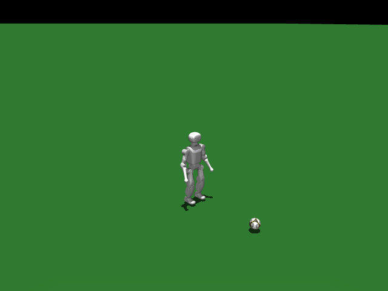

# K1 Soccer Dribble

## 任务目标

训练 K1 接近足球、保持球在前方并按照目标方向盘带前进。



> 图片由 `_tools/render_static_images.py` 使用 `src/unilab/assets/robots/k1/scene_soccer_dribble_minimal.xml` 的 MuJoCo scene 离屏渲染生成；如果当前环境无法启用 EGL/OSMesa，生成 manifest 会记录失败原因。

## 证据索引

| 项目 | 内容 |
| --- | --- |
| 任务类别 | 运动控制 |
| 机器人 | k1 |
| 代表 scene | src/unilab/assets/robots/k1/scene_soccer_dribble_minimal.xml |
| 代表源码 | src/unilab/envs/locomotion/k1/soccer_dribble.py |
| 代表 owner YAML | conf/appo/task/k1_soccer_dribble/motrix.yaml |
| 动作维度 | 22 |

### Registry 与 Owner

| 注册名 | 后端 | 配置类 | 配置源码 |
| --- | --- | --- | --- |
| K1SoccerDribble | mujoco, motrix | K1SoccerDribbleFlatCfg | src/unilab/envs/locomotion/k1/soccer_dribble.py |

| 算法组 | 后端 | training.task_name | owner YAML |
| --- | --- | --- | --- |
| appo | motrix | K1SoccerDribble | conf/appo/task/k1_soccer_dribble/motrix.yaml |
| flashsac | motrix | K1SoccerDribble | conf/offpolicy/task/flashsac/k1_soccer_dribble/motrix.yaml |

## 代码级执行流

这部分不再用通用关键词套模板，而是为 `k1_soccer_dribble` 单独写源码导读。源码片段只负责提供证据；每节说明都围绕本任务自己的配置、状态、观测、动作和 reward 语义展开。

| 阶段 | 证据位置 | 代码级说明 |
| --- | --- | --- |
| 1. Hydra owner | conf/appo/task/k1_soccer_dribble/motrix.yaml | 训练命令先 compose owner YAML。这里确定 `training.task_name`、后端身份、obs_groups、reward scale 和 env override。 |
| 2. Registry 构造 Env | src/unilab/envs/locomotion/k1/soccer_dribble.py | `@registry.envcfg` 注册配置类，`@registry.env` 注册后端实现类；训练脚本只调用 registry，不直接 new 任务类。 |
| 3. Reset/初始状态 | src/unilab/assets/robots/k1/scene_soccer_dribble_minimal.xml | env 从 scene keyframe 或 motion/grasp cache 取初态，再通过 reset randomization 改写 qpos/qvel/info。 |
| 4. Obs dict | src/unilab/envs/locomotion/k1/soccer_dribble.py | env 读取 backend 传感器和 info，返回 dict；learner 根据 `obs_groups_spec` 和 owner `algo.obs_groups` 选择 actor/critic 输入。 |
| 5. Action 到控制目标 | src/unilab/envs/locomotion/k1/soccer_dribble.py | policy 输出先按 action scale / 控制顺序映射到 actuator，再由 backend step 推进仿真。 |
| 6. Reward dispatch | src/unilab/envs/locomotion/k1/soccer_dribble.py | 源码把 reward key 映射到函数，owner YAML 的 scale 决定每项奖励/惩罚是否启用以及权重。 |
| 7. Termination | src/unilab/envs/locomotion/k1/soccer_dribble.py | env 根据高度、姿态、接触、参考轨迹误差、物体状态或能量阈值生成 done/terminated。 |

### 本任务阅读重点

| 阅读重点 |
| --- |
| K1 足球盘带必须单独写：action 只控制机器人，球的运动来自 free joint 和接触动力学。 |
| obs 在 K1 行走历史帧基础上加入 ball relative state；reward 也从行走扩展到 ball_progress、ball_keep、ball_front、ball_lost。 |
| 这个任务的 reset provider 会初始化机器人和球，并生成朝球/带球命令，是理解任务目标的关键。 |

### 本任务注册入口

| 注册名 | 配置类 | 可用后端 |
| --- | --- | --- |
| K1SoccerDribble | K1SoccerDribbleFlatCfg | mujoco, motrix |

### 本任务源码锚点

| 小节 | 源码文件 | 明确锚点 |
| --- | --- | --- |
| 配置：足球场景 | src/unilab/envs/locomotion/k1/soccer_dribble.py | K1SoccerDribbleFlatCfg, K1SoccerDribbleCfg |
| Reset：机器人 + 球 | src/unilab/envs/locomotion/k1/soccer_dribble.py | build_reset_plan, _build_extra_info_updates |
| Obs：球相对状态 | src/unilab/envs/locomotion/k1/soccer_dribble.py | obs_groups_spec, _compute_obs, _ball_state |
| Action：只控机器人 | src/unilab/envs/locomotion/k1/joystick.py | apply_action, default_angles |
| Reward/Termination：盘带目标 | src/unilab/envs/locomotion/k1/soccer_dribble.py | _init_reward_functions, update_state |

## 关键源码逐段解释（按本任务手写）

### 配置：足球场景

| 本任务人工导读 |
| --- |
| cfg 指向 scene_soccer_dribble_minimal，场景中包含足球 free joint。 |
| K1SoccerDribbleEnv 继承 K1WalkEnv，但加入球相关状态。 |

```python
# src/unilab/envs/locomotion/k1/soccer_dribble.py
# 足球盘带任务以 K1SoccerDribble 为注册名，owner YAML 通过该名字选择 env。
@registry.envcfg("K1SoccerDribble")
@dataclass
class K1SoccerDribbleFlatCfg(K1SoccerDribbleCfg):
# reward_config 扩展自 K1RewardConfig，增加 ball_* 和足球终止参数。
    reward_config: K1SoccerDribbleRewardConfig | None = None


# 同一个任务注册到 mujoco/motrix；当前代表 owner 使用 motrix。
registry.register_env("K1SoccerDribble", K1SoccerDribbleEnv, sim_backend="mujoco")
registry.register_env("K1SoccerDribble", K1SoccerDribbleEnv, sim_backend="motrix")

```

```python
# src/unilab/envs/locomotion/k1/soccer_dribble.py
@dataclass
class K1SoccerDribbleCfg(K1WalkEnvCfg):
# 足球任务使用最小 K1+ball scene，球是场景物体，不是 action 维度。
    scene: SceneCfg = field(
        default_factory=lambda: SceneCfg(
            model_file=str(ASSETS_ROOT_PATH / "robots" / "k1" / "scene_soccer_dribble_minimal.xml")
        )
    )
# 命令默认朝正前方速度范围；运行时 _command_toward_ball 会按球相对方向改写。
    commands: Commands = field(
        default_factory=lambda: Commands(
            vel_limit=[
                [0.35, 0.0, 0.0],
                [0.75, 0.0, 0.0],
            ],
            rel_standing_envs=0.0,
        )
    )
# 足球场景的 base/ground 名称不同于普通 K1 flat scene。
    asset: K1SoccerAsset = field(default_factory=K1SoccerAsset)
# 当前 owner 关闭观测噪声，避免足球相对状态被噪声放大。
    noise_config: K1SoccerNoiseConfig = field(default_factory=K1SoccerNoiseConfig)  # type: ignore[assignment]
# domain_rand 字段保留，但 motrix owner 关闭质量/摩擦/推力等随机化。
    domain_rand: DomainRandConfig = field(default_factory=DomainRandConfig)
# reset 时机器人和球从确定初态开始，不给 base qvel 额外扰动。
    reset_base_qvel_limit: float = 0.0
    # Motrix impulse solver 在 box(COL_Collider)+mesh(ball) 下需 0.002 才稳定（0.005 发散）。
    # ctrl_dt 保持 0.02 → decimation=10。见 scene_soccer_dribble_minimal.xml / zzz_debug/BALL_PHYSICS.md。
# 这里缩小 sim_dt 是为了足球接触稳定，ctrl_dt 仍由基类保持 0.02。
    sim_dt: float = 0.002
    reward_config: K1SoccerDribbleRewardConfig | None = None


```
### Reset：机器人 + 球

| 本任务人工导读 |
| --- |
| reset 复制机器人初态并通过 spawn 记录 episode start。 |
| info_updates 中写入 commands、动作历史和球任务额外信息。 |

```python
# src/unilab/envs/locomotion/k1/soccer_dribble.py
    def build_reset_plan(self, env: Any, env_ids: np.ndarray) -> ResetPlan:
# 当前 reset 批次大小。
        num_reset = len(env_ids)
# 机器人和球的初态都来自 scene keyframe；这里按 env 数复制。
        qpos = np.tile(env._init_qpos, (num_reset, 1))
# 足球任务 reset 将 qvel 置零，避免球或机器人带初速度开局。
        qvel = np.zeros_like(np.tile(env._init_qvel, (num_reset, 1)))
# yaw 固定为 0，spawn 只负责把 base 放到对应 env 原点。
        yaw = np.zeros((num_reset,), dtype=get_global_dtype())
        qpos[:, 0:3] = env._spawn.apply_spawn(env_ids, qpos[:, 0:3], yaw=yaw)
        info_updates: dict[str, Any] = {
# 初始 commands 先置零；reset 后 K1SoccerDribbleEnv.reset 会根据球相对位置改写。
            "commands": self._sample_commands(env, num_reset),
# 动作仍是 K1 22 维关节 action，球没有 action slot。
            "current_actions": zero_actions(num_reset, env._num_action),
            "last_actions": zero_actions(num_reset, env._num_action),
        }
# 写入 gait_phase 等足球任务额外 info。
        info_updates.update(self._build_extra_info_updates(env, num_reset))
# 记录 episode 起点，用于 spawn/curriculum 相关统计。
        env._spawn.record_episode_start(env_ids, qpos[:, 0:3])
        return ResetPlan(
            env_ids=env_ids,
            qpos=qpos,
            qvel=qvel,
            info_updates=info_updates,
# 该 provider 是确定性 reset，不额外构造 backend randomization payload。
            randomization=None,
        )


```

```python
# src/unilab/envs/locomotion/k1/soccer_dribble.py
    def _build_extra_info_updates(self, env: Any, num_reset: int) -> dict[str, np.ndarray]:
# 足球任务固定 offset gait phase：左右脚相差 pi，便于盘带时交替迈步。
        phase = np.zeros((num_reset,), dtype=get_global_dtype())
        return {
            "gait_phase": np.asarray(
                np.column_stack([phase, phase + np.pi]), dtype=get_global_dtype()
            ),
        }

```
### Obs：球相对状态

| 本任务人工导读 |
| --- |
| obs 在 K1 stack 基础上增加球相对位置/速度等字段。 |
| critic 继续添加 base linvel，帮助估计盘带稳定性。 |

```python
# src/unilab/envs/locomotion/k1/soccer_dribble.py
    @property
    def obs_groups_spec(self) -> dict[str, int]:
# obs_stacked_dim = (K1 单帧 75 维 + 3 维球观测) * obs_frame_stack。
        return {"obs": self._obs_stacked_dim, "critic": self._obs_stacked_dim + 3}

```

```python
# src/unilab/envs/locomotion/k1/soccer_dribble.py
    def _compute_obs(
        self,
        info: dict,
        linvel,
        gyro,
        gravity,
        dof_pos,
        dof_vel,
        *,
        env_ids: np.ndarray | None = None,
        is_reset: bool = False,
    ) -> dict[str, np.ndarray]:
# reset 子集和正常 step 都走同一套拼接逻辑。
        num_rows = linvel.shape[0]
# 22 个 K1 actuator 仍按相对默认角进入观测。
        diff = dof_pos - self.default_angles
# 足球任务不直接使用 info["commands"]，而是实时计算“朝球方向”的 body-frame command。
        command = self._command_toward_ball(env_ids)
        last_actions = info.get("current_actions", np.zeros((num_rows, self._num_action)))
# ball_obs 是 3 维：球在机体坐标系下的 x/y 相对位置和 x 相对速度。
        ball_obs = self._ball_obs(env_ids)

# actor 单帧观测：命令、球观测、IMU、关节偏差、关节速度、动作历史。
        single_actor = self._build_single_frame_obs(
            command=command,
            ball_obs=ball_obs,
            gravity=-gravity,
            gyro=gyro,
            joint_diff=diff,
            dof_vel=dof_vel,
            last_actions=last_actions,
            noisy=True,
        )
# critic 单帧观测结构相同，但不加观测噪声。
        single_critic = self._build_single_frame_obs(
            command=command,
            ball_obs=ball_obs,
            gravity=-gravity,
            gyro=gyro,
            joint_diff=diff,
            dof_vel=dof_vel,
            last_actions=last_actions,
            noisy=False,
        )
# 继承 K1 的 history 机制，reset 时用同一帧填满历史。
        actor, critic_base = self._update_obs_history(
            env_ids=env_ids,
            single_actor=single_actor,
            single_critic=single_critic,
            is_reset=is_reset,
        )
# critic 额外追加真实 local linvel，帮助 value 判断机器人自身盘带速度。
        critic = np.concatenate(
            (critic_base, np.asarray(linvel * 2.0, dtype=np.float32)),
            axis=1,
            dtype=np.float32,
        )
        return {"obs": actor, "critic": critic}

```

```python
# src/unilab/envs/locomotion/k1/soccer_dribble.py
    def _ball_state(self) -> tuple[np.ndarray, np.ndarray, np.ndarray, np.ndarray]:
# 读取机器人 base 位姿和速度，作为球相对状态的参考坐标系。
        base_pos = self._backend.get_base_pos()
        base_quat = self._backend.get_base_quat()
        base_lin_vel = self._backend.get_base_lin_vel()
# ball body id 在 __init__ 中按名称查出，这里只读后端状态。
        ball_pos_w = self._backend.get_body_pos_w(self._ball_body_ids)[:, 0, :]
        ball_vel_w = self._backend.get_body_lin_vel_w(self._ball_body_ids)[:, 0, :]
# 世界系相对位置 = 球位置 - base 位置。
        rel_pos_w = ball_pos_w - base_pos
# 转到机体坐标系，策略看到的是“球在我前/侧方哪里”。
        rel_pos_b = np_quat_apply_inverse(base_quat, rel_pos_w)
# 相对速度同样转到机体坐标系，过滤掉机器人自身 base 速度。
        rel_vel_b = np_quat_apply_inverse(base_quat, ball_vel_w - base_lin_vel)
        return ball_pos_w, ball_vel_w, rel_pos_b, rel_vel_b

```
### Action：只控机器人

| 本任务人工导读 |
| --- |
| K1 足球任务继承 K1WalkEnv 的 apply_action，动作维度仍是 K1 22 个 actuator。 |
| 球不在 action 中，盘带效果完全由接触物理产生。 |

```python
# src/unilab/envs/locomotion/k1/joystick.py
    def apply_action(self, actions: np.ndarray, state: NpEnvState) -> np.ndarray:
# 足球任务继承 K1WalkEnv.apply_action，policy 仍只输出 22 维机器人关节目标。
        state.info["last_actions"] = state.info.get("current_actions", np.zeros_like(actions))
        state.info["current_actions"] = actions

# gait_phase 驱动步态 reward；盘带任务也需要交替迈步节律。
        gait_phase = state.info.get(
            "gait_phase", np.zeros((self._num_envs, 2), dtype=get_global_dtype())
        )
# 每个 control step 推进左右脚相位，保持和 K1 walk 相同的步态时间基准。
        gait_phase[:, 0] = (gait_phase[:, 0] + self._gait_phase_delta) % (2 * np.pi)
        gait_phase[:, 1] = (gait_phase[:, 1] + self._gait_phase_delta) % (2 * np.pi)
        state.info["gait_phase"] = gait_phase

# action_scale 在 soccer motrix owner 中是 0.15，比普通 walk 更保守。
        return actions * self._cfg.control_config.action_scale + self.default_angles


```
### Reward/Termination：盘带目标

| 本任务人工导读 |
| --- |
| reward map 追加 ball_progress、ball_keep、ball_front、ball_speed_match、ball_lost 等。 |
| termination 同时看机器人跌倒和球丢失距离。 |

```python
# src/unilab/envs/locomotion/k1/soccer_dribble.py
    def _init_reward_functions(self) -> None:
# 先继承 K1 walk 的速度、姿态、步态、pose 等基础 reward。
        super()._init_reward_functions()
# 再追加足球盘带专用 reward key；owner YAML 的 scales 决定每项权重。
        self._reward_fns.update(
            {
# 奖励足球向目标方向前进，并保持球在机器人附近和前方。
                "ball_progress": self._reward_ball_progress,
                "ball_keep": self._reward_ball_keep,
                "ball_front": self._reward_ball_front,
# 约束球速：既要跟命令速度匹配，也不能完全不动或过快失控。
                "ball_speed_match": self._reward_ball_speed_match,
                "ball_approach": self._reward_ball_approach,
                "ball_moving": self._reward_ball_moving,
                "ball_still": self._reward_ball_still,
                "ball_lost": self._reward_ball_lost,
                "ball_over_speed": self._reward_ball_over_speed,
# ball_orbit 惩罚绕球横向打转，鼓励直接推进。
                "ball_orbit": self._reward_ball_orbit,
# 足球专用脚部 shaping：抑制内扣，鼓励有效步幅接触球。
                "feet_inward_yaw": self._reward_feet_inward_yaw,
                "feet_step_travel": self._reward_feet_step_travel,
# 跌倒/过低终止给一次性重罚；硬丢球由 terminated 处理。
                "termination_bad": self._reward_termination_bad,
            }
        )

```

```python
# src/unilab/envs/locomotion/k1/soccer_dribble.py
    def update_state(self, state):
# 与 K1 walk 一样读取本体状态，但足球任务还会读取球状态。
        linvel = self.get_local_linvel()
        gyro = self.get_gyro()
        gravity = self._backend.get_sensor_data(self._cfg.sensor.upvector)
        dof_pos = self.get_dof_pos()
        dof_vel = self.get_dof_vel()

# rel_pos_b 用于计算球到机器人在水平面的距离。
        _, _, rel_pos_b, _ = self._ball_state()
        ball_dist_xy = np.linalg.norm(rel_pos_b[:, :2], axis=1)
# 每步重新生成朝球命令，让策略先接近球再推动球。
        state.info["commands"] = self._command_toward_ball()

# 机器人跌倒判据仍是 K1 walk 的倾斜角和 base 高度。
        max_tilt_rad = np.deg2rad(self._reward_cfg.max_tilt_deg)
        tilt = np.arccos(np.clip(gravity[:, 2], -1, 1))
        term_fall = tilt > max_tilt_rad
        term_low = self._backend.get_base_pos()[:, 2] < self._reward_cfg.min_base_height
# ball_lost_distance_hard 是硬终止阈值，软丢球惩罚由 ball_lost reward 处理。
        term_ball_lost = ball_dist_xy > float(self._reward_cfg.ball_lost_distance_hard)
        term_bad = np.logical_or(term_fall, term_low)
        terminated = np.logical_or(term_bad, term_ball_lost)

# reward 函数读取这些 info 字段，尤其 termination_bad 和 ball_dist_xy。
        state.info["ball_dist_xy"] = np.asarray(ball_dist_xy, dtype=get_global_dtype())
        state.info["term_bad"] = np.asarray(term_bad, dtype=get_global_dtype())
# 记录两脚本步位移，给 feet_step_travel reward 使用。
        self._update_feet_step_travel(state.info)
        reward = self._compute_reward(state.info, linvel, gyro, gravity, dof_pos, dof_vel)
        obs = self._compute_obs(state.info, linvel, gyro, gravity, dof_pos, dof_vel)
        return state.replace(obs=obs, reward=reward, terminated=terminated)

```


## Agent

Agent 输出 K1 22 维关节目标，策略需要同时兼顾自身稳定和球相对位姿。

训练入口通过 owner YAML 决定注册 env、后端身份和算法参数；CLI 应使用 `--sim` 选择 backend owner，而不是单独 override `training.sim_backend`。

```yaml
# conf/appo/task/k1_soccer_dribble/motrix.yaml
training:
  task_name: K1SoccerDribble
  sim_backend: motrix
algo:
  obs_groups:
    actor:
      policy: 0
    critic:
      critic: 0
  num_envs: 2048
  max_iterations: 20000
```

## Env

Env 在 K1 locomotion 基础上加入 ball body/free joint 和球相关 reset/reward。

Env 必须遵守 `NpEnv` contract：`reset()` 返回 `(obs_dict, info_dict)`，`obs` 是 dict，`obs_groups_spec` 决定 learner 使用哪些观测组。

```python
# src/unilab/envs/locomotion/k1/soccer_dribble.py
    def _reward_termination_bad(self, ctx: RewardContext) -> np.ndarray:
        """One-shot penalty on fall / too-low termination (not ball lost)."""
        return np.asarray(ctx.info["term_bad"], dtype=get_global_dtype())


@registry.envcfg("K1SoccerDribble")
@dataclass
class K1SoccerDribbleFlatCfg(K1SoccerDribbleCfg):
    reward_config: K1SoccerDribbleRewardConfig | None = None


```

## Obs

观测在 K1 行走观测基础上增加球相对位置/速度等信息。

### Obs 字段级拆解

下面的表格把源码里的观测拼接逻辑拆成语义字段。维度如果依赖 history、terrain scan 或 motion body 数量，文档会写成“规模”而不是硬编码，避免和配置漂移。

| 观测字段 | 维度/规模 | 代码来源 | 中文说明 |
| --- | --- | --- | --- |
| command | 3 维 | `Commands` | 期望前进、横移和转向速度。 |
| gait_phase | 2 或更多 | `gait_phase` / phase target | 左右腿步态相位，决定摆动脚和支撑脚的节律。 |
| gyro / gravity | 各 3 维 | IMU 传感器 | 反映躯干角速度和倾斜方向，是防摔核心输入。 |
| dof_pos - default | nu 维 | keyframe `stand` 差值 | 全身关节相对默认站姿的偏移。 |
| dof_vel | nu 维 | backend dof velocity | 全身关节速度。 |
| last_actions | nu 维 | 动作历史 | 让策略观察自身上一帧控制目标。 |
| critic base linvel | 3 维 | critic 特权观测 | 训练 critic 使用真实 base 线速度，提高 value 学习稳定性。 |

owner YAML 中的 `algo.obs_groups` 说明算法从 env obs dict 中读取哪些组。没有写入 owner 的字段保持 env cfg 默认值，文档不臆造未配置项。

```yaml
# conf/appo/task/k1_soccer_dribble/motrix.yaml
algo:
  obs_groups:
    actor:
      policy: 0
    critic:
      critic: 0

```

代码侧观测通常在 `_get_obs`、`_build_obs`、`obs_groups_spec` 或 base env 中组装：

```python
# src/unilab/envs/locomotion/k1/soccer_dribble.py
        travel = left_travel + right_travel
        cap = float(self._reward_cfg.feet_step_travel_cap)
        info["feet_step_travel"] = np.asarray(np.clip(travel, 0.0, cap), dtype=get_global_dtype())
        self._prev_foot_pos[:] = foot_pos

    @property
    def obs_groups_spec(self) -> dict[str, int]:
        return {"obs": self._obs_stacked_dim, "critic": self._obs_stacked_dim + 3}

    def _init_reward_functions(self) -> None:
        super()._init_reward_functions()
        self._reward_fns.update(
            {
```

源码锚点拆解：

| 源码符号 | 中文说明 |
| --- | --- |
| obs_groups_spec | 声明 obs dict 中各观测组的维度，是 wrapper/learner 对齐观测的契约。 |
| _build_single_frame_obs | 读取 backend 传感器和 info 字段，拼接 actor/critic 观测。 |
| _compute_obs | 读取 backend 传感器和 info 字段，拼接 actor/critic 观测。 |

## Action

动作仍只控制机器人 22 个 actuator；球由物理接触自然演化。

### Action 逐维拆解

K1 的 action 覆盖 22 个可控关节。足球盘带任务不直接控制足球，球体运动完全来自脚与球的物理接触。

当前代表 scene 编译出的 action 维度为 `22`。下表来自 MuJoCo 编译模型的 actuator 顺序，也就是策略输出维度和执行器维度的对应关系。

| Action 维度 | 执行器 | 驱动关节 | 中文含义 | 控制/限制说明 |
| --- | --- | --- | --- | --- |
| 0 | AAHead_yaw | AAHead_yaw | 头部偏航关节 | XML 未显式限制，实际由 env 缩放/默认角和 backend 控制 |
| 1 | Head_pitch | Head_pitch | 头部俯仰关节 | XML 未显式限制，实际由 env 缩放/默认角和 backend 控制 |
| 2 | ALeft_Shoulder_Pitch | ALeft_Shoulder_Pitch | 肩俯仰关节 | XML 未显式限制，实际由 env 缩放/默认角和 backend 控制 |
| 3 | Left_Shoulder_Roll | Left_Shoulder_Roll | 左肩侧摆关节 | XML 未显式限制，实际由 env 缩放/默认角和 backend 控制 |
| 4 | Left_Elbow_Pitch | Left_Elbow_Pitch | 左肘俯仰关节 | XML 未显式限制，实际由 env 缩放/默认角和 backend 控制 |
| 5 | Left_Elbow_Yaw | Left_Elbow_Yaw | 左肘偏航关节 | XML 未显式限制，实际由 env 缩放/默认角和 backend 控制 |
| 6 | ARight_Shoulder_Pitch | ARight_Shoulder_Pitch | 肩俯仰关节 | XML 未显式限制，实际由 env 缩放/默认角和 backend 控制 |
| 7 | Right_Shoulder_Roll | Right_Shoulder_Roll | 右肩侧摆关节 | XML 未显式限制，实际由 env 缩放/默认角和 backend 控制 |
| 8 | Right_Elbow_Pitch | Right_Elbow_Pitch | 右肘俯仰关节 | XML 未显式限制，实际由 env 缩放/默认角和 backend 控制 |
| 9 | Right_Elbow_Yaw | Right_Elbow_Yaw | 右肘偏航关节 | XML 未显式限制，实际由 env 缩放/默认角和 backend 控制 |
| 10 | Left_Hip_Pitch | Left_Hip_Pitch | 左髋俯仰关节 | XML 未显式限制，实际由 env 缩放/默认角和 backend 控制 |
| 11 | Left_Hip_Roll | Left_Hip_Roll | 左髋侧摆关节 | XML 未显式限制，实际由 env 缩放/默认角和 backend 控制 |
| 12 | Left_Hip_Yaw | Left_Hip_Yaw | 左髋偏航关节 | XML 未显式限制，实际由 env 缩放/默认角和 backend 控制 |
| 13 | Left_Knee_Pitch | Left_Knee_Pitch | 左膝俯仰关节 | XML 未显式限制，实际由 env 缩放/默认角和 backend 控制 |
| 14 | Left_Ankle_Pitch | Left_Ankle_Pitch | 左踝俯仰关节 | XML 未显式限制，实际由 env 缩放/默认角和 backend 控制 |
| 15 | Left_Ankle_Roll | Left_Ankle_Roll | 左踝侧摆关节 | XML 未显式限制，实际由 env 缩放/默认角和 backend 控制 |
| 16 | Right_Hip_Pitch | Right_Hip_Pitch | 右髋俯仰关节 | XML 未显式限制，实际由 env 缩放/默认角和 backend 控制 |
| 17 | Right_Hip_Roll | Right_Hip_Roll | 右髋侧摆关节 | XML 未显式限制，实际由 env 缩放/默认角和 backend 控制 |
| 18 | Right_Hip_Yaw | Right_Hip_Yaw | 右髋偏航关节 | XML 未显式限制，实际由 env 缩放/默认角和 backend 控制 |
| 19 | Right_Knee_Pitch | Right_Knee_Pitch | 右膝俯仰关节 | XML 未显式限制，实际由 env 缩放/默认角和 backend 控制 |
| 20 | Right_Ankle_Pitch | Right_Ankle_Pitch | 右踝俯仰关节 | XML 未显式限制，实际由 env 缩放/默认角和 backend 控制 |
| 21 | Right_Ankle_Roll | Right_Ankle_Roll | 右踝侧摆关节 | XML 未显式限制，实际由 env 缩放/默认角和 backend 控制 |

控制参数来自 owner YAML 的 `env.control_config`，缺省值由对应 env cfg/dataclass 提供。

| 配置字段 | 当前值 | 中文说明 |
| --- | --- | --- |
| action_scale | 0.15 | 策略输出到目标关节角的缩放系数。 |

```yaml
# conf/appo/task/k1_soccer_dribble/motrix.yaml
env:
  control_config:
    action_scale: 0.15

```

动作到执行器的实际映射由 backend 的 actuator control range 和 env 的 `apply_action`/控制函数完成：

```text
# 未在 src/unilab/envs/locomotion/k1/soccer_dribble.py 中找到片段：apply_action, action_scale, compute_go2w_motor_ctrl, _init_action_space
```

源码锚点拆解：

| 源码符号 | 中文说明 |
| --- | --- |

## Reward

reward 包含 ball_progress、ball_keep、ball_front、ball_speed_match、ball_lost 等足球专用项。

### Reward 逐项拆解

reward scale 以 owner YAML 的 `reward.scales` 为真源；源码中的 `RewardConfig` 描述可用字段，训练脚本只做 Hydra 组装和注入。正数通常表示奖励，负数通常表示惩罚，0 表示该项在当前 owner 中关闭或仅保留接口。

| Reward key | Scale | 方向 | 中文含义 |
| --- | --- | --- | --- |
| tracking_lin_vel | 0.3 | 奖励 | 线速度命令跟踪奖励，鼓励机器人实际平面速度贴近 joystick/命令速度。 |
| tracking_ang_vel | 0.25 | 奖励 | 角速度命令跟踪奖励，鼓励 yaw 角速度贴近转向命令。 |
| forward_progress | 0.0 | 记录/关闭 | 前向进度奖励，鼓励沿目标方向推进。 |
| under_speed | -0.2 | 惩罚 | 低速惩罚，命令非零时避免策略停滞。 |
| lin_vel_z | -1.0 | 惩罚 | 竖直速度惩罚，限制 base 上下弹跳。 |
| ang_vel_xy | -0.2 | 惩罚 | 横滚/俯仰角速度惩罚，抑制身体剧烈摇摆。 |
| base_height | -120.0 | 惩罚 | 身体高度项，使 base 高度保持在任务目标附近。 |
| orientation | -2.5 | 惩罚 | 姿态项，通常基于重力投影或目标朝向惩罚倾斜。 |
| action_rate | -0.0005 | 惩罚 | 动作变化惩罚，抑制相邻控制步之间的目标突变。 |
| pose | -0.05 | 惩罚 | 默认姿态或参考姿态约束，防止无关关节偏离可用构型。 |
| feet_phase | 0.6 | 奖励 | 步态相位奖励，鼓励左右脚按期望相位摆动/支撑。 |
| feet_phase_contrast | 0.8 | 奖励 | 步态相位对比项，增加左右脚交替节律。 |
| feet_phase_contact | 0.5 | 奖励 | 足端接触相位奖励，鼓励支撑相接触、摆动相离地。 |
| feet_double_stance | -0.5 | 惩罚 | 双脚同时支撑惩罚/约束，避免拖步或不自然站立。 |
| penalty_close_feet_xy | -0.5 | 惩罚 | 双脚在水平面过近惩罚，降低绊脚风险。 |
| ball_progress | 1.7 | 奖励 | 足球沿目标方向前进的奖励。 |
| ball_keep | 1.0 | 奖励 | 保持球在机器人附近的奖励。 |
| ball_front | 0.25 | 奖励 | 保持球在机器人前方的奖励，避免球跑到侧后方。 |
| ball_speed_match | 0.6 | 奖励 | 球速与目标速度匹配奖励。 |
| ball_approach | 0.5 | 奖励 | 机器人接近足球的奖励。 |
| ball_moving | 0.3 | 奖励 | 鼓励足球移动，避免只站在球旁。 |
| ball_still | -0.2 | 惩罚 | 球静止惩罚。 |
| ball_lost | -0.8 | 惩罚 | 丢球惩罚，球离机器人过远时触发。 |
| ball_over_speed | -1.0 | 惩罚 | 球过快惩罚，避免不可控大力踢球。 |
| ball_orbit | -0.4 | 惩罚 | 绕球打转惩罚，鼓励直接推进而不是原地绕行。 |
| feet_inward_yaw | -1.4 | 惩罚 | 脚内扣惩罚，改善足球任务中的脚尖朝向。 |
| feet_step_travel | 30.0 | 奖励 | 足端步幅/位移奖励，鼓励有效迈步接触球。 |
| alive | 0.2 | 奖励 | 存活奖励，鼓励保持非终止状态。 |
| termination_bad | -20.0 | 惩罚 | 足球盘带任务中的失败终止惩罚，强调跌倒或丢球代价。 |

```yaml
# conf/appo/task/k1_soccer_dribble/motrix.yaml
reward:
  scales:
    tracking_lin_vel: 0.3
    tracking_ang_vel: 0.25
    forward_progress: 0.0
    under_speed: -0.2
    lin_vel_z: -1.0
    ang_vel_xy: -0.2
    base_height: -120.0
    orientation: -2.5
    action_rate: -0.0005
    pose: -0.05
    feet_phase: 0.6
    feet_phase_contrast: 0.8
    feet_phase_contact: 0.5
    feet_double_stance: -0.5
    penalty_close_feet_xy: -0.5
    ball_progress: 1.7
    ball_keep: 1.0
    ball_front: 0.25
    ball_speed_match: 0.6
    ball_approach: 0.5
    ball_moving: 0.3
    ball_still: -0.2
    ball_lost: -0.8
    ball_over_speed: -1.0
    ball_orbit: -0.4
    feet_inward_yaw: -1.4
    feet_step_travel: 30.0
    alive: 0.2
    termination_bad: -20.0
  tracking_sigma: 0.25
  gait_frequency: 1.5
  feet_phase_swing_height: 0.06
  feet_phase_tracking_sigma: 0.008
  base_height_target: 0.55
  min_forward_speed_for_gait_reward: 0.03
  min_base_height: 0.25
  max_tilt_deg: 55.0
  close_feet_threshold: 0.12
  pose_weights:
  - 1.0
  - 1.0
  - 1.0
  - 1.0
  - 1.0
  - 1.0
  - 1.0
  - 1.0
  - 1.0
  - 1.0
  - 5.0
  - 5.0
  - 5.0
  - 5.0
  - 5.0
  - 5.0
  - 5.0
  - 5.0
  - 5.0
  - 5.0
  - 5.0
  - 5.0
  ball_keep_distance: 0.45
  ball_keep_sigma: 0.08
  ball_front_lateral_sigma: 0.16
  ball_speed_sigma: 0.12
  ball_lost_distance: 1.35
  ball_lost_distance_hard: 2.8
  ball_speed_cap: 0.35
  ball_move_speed_target: 0.2
  ball_move_speed_sigma: 0.15
  ball_approach_speed_cap: 1.0
  ball_still_speed_threshold: 0.06
  ball_cmd_deadzone: 0.12
  ball_cmd_kp: 0.9
  fixed_cmd_lin_speed: 0.3
  feet_step_travel_cap: 0.1

```

源码中的 reward 入口：

```python
# src/unilab/envs/locomotion/k1/soccer_dribble.py
from unilab.dr import ResetPlan
from unilab.dr.dr_utils import zero_actions
from unilab.envs.locomotion.k1.base import NoiseConfig
from unilab.envs.locomotion.k1.joystick import (
    K1_NUM_ACTION,
    K1_OBS_SINGLE_DIM,
    K1RewardConfig,
    K1WalkDomainRandomizationProvider,
    K1WalkEnv,
    K1WalkEnvCfg,
    commands_to_amp_obs,
)
from unilab.envs.locomotion.k1.constants import K1_ACTUATOR_JOINT_ORDER
```

源码锚点拆解：

| 源码符号 | 中文说明 |
| --- | --- |
| K1SoccerDribbleRewardConfig | 声明 reward 可用参数和默认 scale。 |
| _init_reward_functions | 把 reward 名称映射到源码函数，owner YAML 的 scale 会按这些 key 分发。 |
| _reward_ball_progress | 单个 reward 项的实现函数，通常返回每个 env 的 reward 向量。 |
| _reward_ball_keep | 单个 reward 项的实现函数，通常返回每个 env 的 reward 向量。 |
| _reward_ball_front | 单个 reward 项的实现函数，通常返回每个 env 的 reward 向量。 |
| _reward_ball_speed_match | 单个 reward 项的实现函数，通常返回每个 env 的 reward 向量。 |
| _reward_ball_approach | 单个 reward 项的实现函数，通常返回每个 env 的 reward 向量。 |
| _reward_ball_lost | 单个 reward 项的实现函数，通常返回每个 env 的 reward 向量。 |
| _reward_ball_moving | 单个 reward 项的实现函数，通常返回每个 env 的 reward 向量。 |
| _reward_ball_still | 单个 reward 项的实现函数，通常返回每个 env 的 reward 向量。 |
| _reward_ball_over_speed | 单个 reward 项的实现函数，通常返回每个 env 的 reward 向量。 |
| _reward_ball_orbit | 单个 reward 项的实现函数，通常返回每个 env 的 reward 向量。 |

## 初始状态

reset 将机器人放到 `stand` keyframe，并随机/设置球位置和朝球命令。

机器人默认姿态来自 scene/task fragment 中的 keyframe；任务 reset 在此基础上加入命令、motion reference、物体状态或随机化。

```xml
<!-- src/unilab/assets/robots/k1/scene_soccer_dribble_minimal.xml -->
    />
  </sensor>

  <keyframe>
    <key
      name="stand"
      qpos="
```

```python
# src/unilab/envs/locomotion/k1/soccer_dribble.py

_LEFT_HIP_YAW_IDX = K1_ACTUATOR_JOINT_ORDER.index("Left_Hip_Yaw")
_RIGHT_HIP_YAW_IDX = K1_ACTUATOR_JOINT_ORDER.index("Right_Hip_Yaw")


class K1SoccerDomainRandomizationProvider(K1WalkDomainRandomizationProvider):
    """Deterministic reset: fixed keyframe qpos/qvel for robot and ball."""

    def _sample_commands(self, env: Any, num_reset: int) -> np.ndarray:
        # Filled in K1SoccerDribbleEnv.reset() after sim state is applied.
        return np.zeros((num_reset, 3), dtype=get_global_dtype())

    def _build_extra_info_updates(self, env: Any, num_reset: int) -> dict[str, np.ndarray]:
```

## 终止条件

终止包括机器人跌倒、球丢失距离过大和超时。

终止条件通常由 env 源码中的 `_compute_termination(s)`、reward config 阈值和 `max_episode_seconds` 共同决定。

```yaml
# conf/appo/task/k1_soccer_dribble/motrix.yaml
env:
  {}

reward:
  min_base_height: 0.25
  max_tilt_deg: 55.0
  ball_lost_distance: 1.35
  ball_lost_distance_hard: 2.8

```

```python
# src/unilab/envs/locomotion/k1/soccer_dribble.py
        state.info["commands"] = self._command_toward_ball()

        max_tilt_rad = np.deg2rad(self._reward_cfg.max_tilt_deg)
        tilt = np.arccos(np.clip(gravity[:, 2], -1, 1))
        term_fall = tilt > max_tilt_rad
        term_low = self._backend.get_base_pos()[:, 2] < self._reward_cfg.min_base_height
        term_ball_lost = ball_dist_xy > float(self._reward_cfg.ball_lost_distance_hard)
        term_bad = np.logical_or(term_fall, term_low)
        terminated = np.logical_or(term_bad, term_ball_lost)

        state.info["ball_dist_xy"] = np.asarray(ball_dist_xy, dtype=get_global_dtype())
        state.info["term_bad"] = np.asarray(term_bad, dtype=get_global_dtype())
        self._update_feet_step_travel(state.info)
        reward = self._compute_reward(state.info, linvel, gyro, gravity, dof_pos, dof_vel)
        obs = self._compute_obs(state.info, linvel, gyro, gravity, dof_pos, dof_vel)
        return state.replace(obs=obs, reward=reward, terminated=terminated)

```

## 域随机化

domain_rand 可控制机器人物理随机化、球相关初始化扰动和噪声。

域随机化只在 reset/interval 等冷路径触发，不在 step 热路径解析资产或探测 backend 私有能力。

### 域随机化字段拆解

| 配置字段 | 当前值 | 中文说明 |
| --- | --- | --- |
| push_robots | False | 布尔开关。 |
| random_com | False | 布尔开关。 |
| randomize_base_mass | False | 域随机化开关。 |
| randomize_body_mass | False | 域随机化开关。 |
| randomize_dof_armature | False | 域随机化开关。 |
| randomize_gravity | False | 域随机化开关。 |
| randomize_ground_friction | False | 域随机化开关。 |

```yaml
# conf/appo/task/k1_soccer_dribble/motrix.yaml
env:
  domain_rand:
    randomize_base_mass: false
    randomize_body_mass: false
    random_com: false
    randomize_gravity: false
    randomize_ground_friction: false
    randomize_dof_armature: false
    push_robots: false

```

```python
# src/unilab/envs/locomotion/k1/soccer_dribble.py
from unilab.base import registry
from unilab.base.scene import SceneCfg
from unilab.dtype_config import get_global_dtype
from unilab.envs.common.rotation import np_quat_apply_inverse
from unilab.envs.locomotion.common import rewards
from unilab.envs.locomotion.common.commands import Commands
from unilab.envs.locomotion.common.domain_rand import DomainRandConfig
from unilab.envs.locomotion.common.rewards import RewardContext
from unilab.dr import ResetPlan
from unilab.dr.dr_utils import zero_actions
from unilab.envs.locomotion.k1.base import NoiseConfig
from unilab.envs.locomotion.k1.joystick import (
    K1_NUM_ACTION,
```
