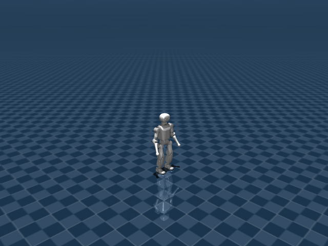

# K1 Walk Flat

## 任务目标

训练 K1 人形机器人在平地上跟踪速度命令，同时保持稳定步态和上身姿态。



> 图片由 `_tools/render_static_images.py` 使用 `src/unilab/assets/robots/k1/scene_flat.xml` 的 MuJoCo scene 离屏渲染生成；如果当前环境无法启用 EGL/OSMesa，生成 manifest 会记录失败原因。

## 证据索引

| 项目 | 内容 |
| --- | --- |
| 任务类别 | 运动控制 |
| 机器人 | k1 |
| 代表 scene | src/unilab/assets/robots/k1/scene_flat.xml |
| 代表源码 | src/unilab/envs/locomotion/k1/joystick.py |
| 代表 owner YAML | conf/appo/task/k1_walk_flat/mujoco.yaml |
| 动作维度 | 22 |

### Registry 与 Owner

| 注册名 | 后端 | 配置类 | 配置源码 |
| --- | --- | --- | --- |
| K1WalkFlat | mujoco, motrix | K1WalkFlatCfg | src/unilab/envs/locomotion/k1/joystick.py |

| 算法组 | 后端 | training.task_name | owner YAML |
| --- | --- | --- | --- |
| appo | motrix | K1WalkFlat | conf/appo/task/k1_walk_flat/motrix.yaml |
| appo | mujoco | K1WalkFlat | conf/appo/task/k1_walk_flat/mujoco.yaml |
| flashsac | motrix | K1WalkFlat | conf/offpolicy/task/flashsac/k1_walk_flat/motrix.yaml |
| ppo | motrix | K1WalkFlat | conf/ppo/task/k1_walk_flat/motrix.yaml |
| ppo | mujoco | K1WalkFlat | conf/ppo/task/k1_walk_flat/mujoco.yaml |

## 代码级执行流

这部分不再用通用关键词套模板，而是为 `k1_walk_flat` 单独写源码导读。源码片段只负责提供证据；每节说明都围绕本任务自己的配置、状态、观测、动作和 reward 语义展开。

| 阶段 | 证据位置 | 代码级说明 |
| --- | --- | --- |
| 1. Hydra owner | conf/appo/task/k1_walk_flat/mujoco.yaml | 训练命令先 compose owner YAML。这里确定 `training.task_name`、后端身份、obs_groups、reward scale 和 env override。 |
| 2. Registry 构造 Env | src/unilab/envs/locomotion/k1/joystick.py | `@registry.envcfg` 注册配置类，`@registry.env` 注册后端实现类；训练脚本只调用 registry，不直接 new 任务类。 |
| 3. Reset/初始状态 | src/unilab/assets/robots/k1/scene_flat.xml | env 从 scene keyframe 或 motion/grasp cache 取初态，再通过 reset randomization 改写 qpos/qvel/info。 |
| 4. Obs dict | src/unilab/envs/locomotion/k1/joystick.py | env 读取 backend 传感器和 info，返回 dict；learner 根据 `obs_groups_spec` 和 owner `algo.obs_groups` 选择 actor/critic 输入。 |
| 5. Action 到控制目标 | src/unilab/envs/locomotion/k1/joystick.py | policy 输出先按 action scale / 控制顺序映射到 actuator，再由 backend step 推进仿真。 |
| 6. Reward dispatch | src/unilab/envs/locomotion/k1/joystick.py | 源码把 reward key 映射到函数，owner YAML 的 scale 决定每项奖励/惩罚是否启用以及权重。 |
| 7. Termination | src/unilab/envs/locomotion/k1/joystick.py | env 根据高度、姿态、接触、参考轨迹误差、物体状态或能量阈值生成 done/terminated。 |

### 本任务阅读重点

| 阅读重点 |
| --- |
| K1 Walk 是 22 DoF 人形行走，obs 使用堆叠历史，和 G1 的 29 DoF 单帧结构不同。 |
| 动作包括头/臂/腿等 K1 actuator，但 reward 重点仍是行走稳定、脚相位和姿态。 |
| K1 的 `_compute_obs`、`_init_reward_functions` 和 `apply_action` 都应单独阅读。 |

### 本任务注册入口

| 注册名 | 配置类 | 可用后端 |
| --- | --- | --- |
| K1WalkFlat | K1WalkFlatCfg | mujoco, motrix |

### 本任务源码锚点

| 小节 | 源码文件 | 明确锚点 |
| --- | --- | --- |
| 配置：K1WalkFlat | src/unilab/envs/locomotion/k1/joystick.py | K1WalkFlatCfg, K1WalkEnvCfg |
| Obs：历史堆叠 | src/unilab/envs/locomotion/k1/joystick.py | obs_groups_spec, _compute_obs |
| Action：22 维 K1 目标 | src/unilab/envs/locomotion/k1/joystick.py | apply_action, default_angles |
| Reward：K1 步态 | src/unilab/envs/locomotion/k1/joystick.py | _init_reward_functions, feet_phase |
| Termination/DR | src/unilab/envs/locomotion/k1/joystick.py | update_state, K1WalkDomainRandomizationProvider |

## 关键源码逐段解释（按本任务手写）

### 配置：K1WalkFlat

| 本任务人工导读 |
| --- |
| cfg 指向 K1 flat scene，并绑定 K1RewardConfig。 |
| K1 使用自己的 actuator order 和 observation constants。 |

```python
# src/unilab/envs/locomotion/k1/joystick.py
# 注册名 K1WalkFlat 对应 owner YAML 中的 training.task_name。
@registry.envcfg("K1WalkFlat")
@dataclass
class K1WalkFlatCfg(K1WalkEnvCfg):
# reward_config 必须由 Hydra owner 注入；缺失时 env __init__ 会直接报错。
    reward_config: K1RewardConfig | None = None


# 同一个任务注册到 mujoco 和 motrix，训练脚本只通过 registry 选择后端实现。
registry.register_env("K1WalkFlat", K1WalkEnv, sim_backend="mujoco")
registry.register_env("K1WalkFlat", K1WalkEnv, sim_backend="motrix")
```

```python
# src/unilab/envs/locomotion/k1/joystick.py
@dataclass
class K1WalkEnvCfg(K1BaseCfg):
# 平地行走使用 K1 flat scene，初始站姿来自 scene 里的 stand keyframe。
    scene: SceneCfg = field(
        default_factory=lambda: SceneCfg(
            model_file=str(ASSETS_ROOT_PATH / "robots" / "k1" / "scene_flat.xml")
        )
    )
# episode horizon 为 20 秒。
    max_episode_seconds: float = 20.0
    init_state: InitState = field(default_factory=InitState)
# 速度命令包含前进/横移/yaw，且 10% env 会采样 standing command。
    commands: Commands = field(
        default_factory=lambda: Commands(
            vel_limit=[
                [-0.35, -0.25, -0.8],
                [0.35, 0.25, 0.8],
            ],
            rel_standing_envs=0.1,
        )
    )
# reward_config 是 K1 步态奖励的参数入口。
    reward_config: K1RewardConfig | None = None
# DomainRandConfig 由 common provider 使用，owner 当前保持默认空覆盖。
    domain_rand: DomainRandConfig = field(default_factory=DomainRandConfig)
# offset_phase 表示左右脚初始相位相差 pi，形成交替步态。
    gait_phase_init_mode: str = "offset_phase"
# reset 时 base qvel 的随机扰动上限。
    reset_base_qvel_limit: float = 0.05
# K1 默认堆叠 5 帧观测，增强速度/相位的时间上下文。
    obs_frame_stack: int = K1_OBS_FRAME_STACK


```
### Obs：历史堆叠

| 本任务人工导读 |
| --- |
| obs 为 K1_OBS_STACKED_DIM，来自多帧本体/命令/action history。 |
| critic 在堆叠 obs 外追加 base linvel。 |

```python
# src/unilab/envs/locomotion/k1/joystick.py
    @property
    def obs_groups_spec(self) -> dict[str, int]:
# actor 使用 5 帧堆叠 obs；critic 额外拿 3 维真实 base linvel。
        return {"obs": K1_OBS_STACKED_DIM, "critic": K1_OBS_STACKED_DIM + 3}

```

```python
# src/unilab/envs/locomotion/k1/joystick.py
    def _compute_obs(
        self,
        info: dict,
        linvel,
        gyro,
        gravity,
        dof_pos,
        dof_vel,
        *,
        env_ids: np.ndarray | None = None,
        is_reset: bool = False,
    ) -> dict[str, np.ndarray]:
# num_rows 是当前更新的 env 数，reset 时可能只是子集。
        num_rows = linvel.shape[0]
# 关节观测用相对默认站姿的偏差，而不是绝对 qpos。
        diff = dof_pos - self.default_angles
# K1 walk 使用 info 中的 velocity command，来源是 reset/provider 或后续 resampling。
        command = info["commands"]
# current_actions 作为动作历史输入；若刚 reset 尚无动作则补零。
        last_actions = info.get("current_actions", np.zeros((num_rows, self._num_action)))
# actor 单帧观测带噪声，用于策略鲁棒性。
        single_actor = self._build_single_frame_obs(
            command=command,
            gravity=-gravity,
            gyro=gyro,
            joint_diff=diff,
            dof_vel=dof_vel,
            last_actions=last_actions,
            noisy=True,
        )
# critic 单帧观测不加噪声，让 value 使用更干净的训练信号。
        single_critic = self._build_single_frame_obs(
            command=command,
            gravity=-gravity,
            gyro=gyro,
            joint_diff=diff,
            dof_vel=dof_vel,
            last_actions=last_actions,
            noisy=False,
        )
# 更新 5 帧 history；reset 时会用同一帧填满历史，避免冷启动空帧。
        actor, critic_base = self._update_obs_history(
            env_ids=env_ids,
            single_actor=single_actor,
            single_critic=single_critic,
            is_reset=is_reset,
        )
# critic 在堆叠本体观测后追加 local linvel * 2.0 的特权速度信息。
        critic = np.concatenate(
            (critic_base, np.asarray(linvel * 2.0, dtype=np.float32)),
            axis=1,
            dtype=np.float32,
        )
# 返回 obs dict，后续 wrapper/learner 根据 obs_groups_spec 对齐维度。
        return {"obs": actor, "critic": critic}

```
### Action：22 维 K1 目标

| 本任务人工导读 |
| --- |
| 动作缓存 last/current actions，并缩放到 22 个 actuator。 |
| 球或外物不在本任务中出现。 |

```python
# src/unilab/envs/locomotion/k1/joystick.py
    def apply_action(self, actions: np.ndarray, state: NpEnvState) -> np.ndarray:
# 缓存上一帧和当前帧动作，obs/action_rate reward 都依赖这两个字段。
        state.info["last_actions"] = state.info.get("current_actions", np.zeros_like(actions))
        state.info["current_actions"] = actions

# gait_phase 是左右脚相位，reset provider 会按 offset_phase 初始化。
        gait_phase = state.info.get(
            "gait_phase", np.zeros((self._num_envs, 2), dtype=get_global_dtype())
        )
# 每个控制步按 gait_frequency 和 ctrl_dt 前进一小段相位。
        gait_phase[:, 0] = (gait_phase[:, 0] + self._gait_phase_delta) % (2 * np.pi)
        gait_phase[:, 1] = (gait_phase[:, 1] + self._gait_phase_delta) % (2 * np.pi)
        state.info["gait_phase"] = gait_phase

# 22 维 action 直接缩放为 K1 actuator 目标角，并叠加 stand keyframe 默认角。
        return actions * self._cfg.control_config.action_scale + self.default_angles


```
### Reward：K1 步态

| 本任务人工导读 |
| --- |
| reward map 包含速度跟踪、pose、feet_phase、close feet、action_rate 等。 |
| 这些项约束 K1 以人形步态跟踪命令。 |

```python
# src/unilab/envs/locomotion/k1/joystick.py
    def _init_reward_functions(self) -> None:
# reward key 必须与 owner YAML 的 reward.scales 对齐。
        self._reward_fns: dict[str, Any] = {
# joystick 速度跟踪：线速度和 yaw 角速度分别奖励。
            "tracking_lin_vel": rewards.tracking_lin_vel,
            "tracking_ang_vel": rewards.tracking_ang_vel,
# forward_progress/under_speed 在 K1 walk map 中可用，当前 flat owner 没有启用。
            "forward_progress": rewards.forward_progress,
            "under_speed": rewards.under_speed,
# 基础稳定项抑制竖直速度、倾斜和横滚/俯仰角速度。
            "lin_vel_z": rewards.lin_vel_z,
            "orientation": rewards.orientation,
            "ang_vel_xy": rewards.ang_vel_xy,
            "action_rate": rewards.action_rate,
            "base_height": rewards.base_height,
# pose 使用 pose_weights 对 22 个关节偏离默认姿态加权惩罚。
            "pose": rewards.weighted_pose,
# feet_phase 系列用左右脚相位目标约束摆动高度、接触和交替节律。
            "feet_phase": self._reward_feet_phase,
            "feet_phase_contrast": self._reward_feet_phase_contrast,
            "feet_phase_contact": self._reward_feet_phase_contact,
            "feet_double_stance": self._reward_feet_double_stance,
# 防止左右脚在水平面过近，降低绊脚/交叉步风险。
            "penalty_close_feet_xy": self._reward_close_feet_xy,
# alive 提供存活 shaping，终止仍由 update_state 的高度/倾斜判断。
            "alive": rewards.alive,
        }

```

```python
# src/unilab/envs/locomotion/k1/joystick.py
    def _reward_feet_phase(self, ctx: RewardContext):
# 读取左右脚位置传感器，比较实际摆动高度和相位目标高度。
        left_foot = self._backend.get_sensor_data("left_foot_pos")
        right_foot = self._backend.get_sensor_data("right_foot_pos")
# gait_phase 在 apply_action 中推进，左右腿各一列。
        gait_phase = ctx.info.get(
            "gait_phase", np.zeros((self._num_envs, 2), dtype=get_global_dtype())
        )
        swing_height = self._reward_cfg.feet_phase_swing_height
# 公共 helper 根据相位给出左右脚期望高度，不在文档中手写数学公式。
        left_target, right_target = compute_feet_phase_height_targets(gait_phase, swing_height)
        left_error = np.square(left_foot[:, 2] - left_target)
        right_error = np.square(right_foot[:, 2] - right_target)
# 误差越小 reward 越高，并且只在前进速度足够时通过 gait gate。
        reward = np.exp(-(left_error + right_error) / self._reward_cfg.feet_phase_tracking_sigma)
        return np.asarray(reward * self._gait_reward_gate(ctx.linvel), dtype=get_global_dtype())
```
### Termination/DR

| 本任务人工导读 |
| --- |
| update_state 同步计算 done、reward 和 obs。 |
| domain randomization provider 负责 K1 reset/物理扰动。 |

```python
# src/unilab/envs/locomotion/k1/joystick.py
    def update_state(self, state: NpEnvState) -> NpEnvState:
# 每步先从 backend 读取 K1 躯干速度、IMU、关节状态。
        linvel = self.get_local_linvel()
        gyro = self.get_gyro()
        gravity = self._backend.get_sensor_data(self._cfg.sensor.upvector)
        dof_pos = self.get_dof_pos()
        dof_vel = self.get_dof_vel()

# max_tilt_deg 来自 owner reward config，转换为弧度后与当前倾角比较。
        max_tilt_rad = np.deg2rad(self._reward_cfg.max_tilt_deg)
# gravity[:, 2] 是躯干 upvector 的 z 分量，用 arccos 得到倾斜角。
        tilt = np.arccos(np.clip(gravity[:, 2], -1, 1))
# K1 walk 的 terminated 条件：倾斜过大或 base 高度低于 min_base_height。
        terminated = np.logical_or(
            tilt > max_tilt_rad,
            self._backend.get_base_pos()[:, 2] < self._reward_cfg.min_base_height,
        )

# reward 和 obs 使用同一帧 backend 状态，避免观测与奖励错帧。
        reward = self._compute_reward(state.info, linvel, gyro, gravity, dof_pos, dof_vel)
        obs = self._compute_obs(state.info, linvel, gyro, gravity, dof_pos, dof_vel)
        return state.replace(obs=obs, reward=reward, terminated=terminated)

```

```python
# src/unilab/envs/locomotion/k1/joystick.py
class K1WalkDomainRandomizationProvider(LocomotionDRProvider):
    def _get_qvel_limit(self, env: Any) -> float:
# reset_base_qvel_limit 控制 reset 初速度扰动上限，flat owner 设为 0.05。
        return float(env.cfg.reset_base_qvel_limit)

    def _build_extra_info_updates(self, env: Any, num_reset: int) -> dict[str, np.ndarray]:
# reset 时必须写入 gait_phase，否则 feet_phase reward 没有相位参考。
        updates: dict[str, np.ndarray] = {
            "gait_phase": self._sample_gait_phase(env, num_reset),
        }
# heading_command 任务才需要额外 heading command；K1 walk flat owner 当前未打开。
        if getattr(env.cfg.commands, "heading_command", False):
            updates["heading_commands"] = sample_heading_commands(env, num_reset)
        return updates

    def _sample_commands(self, env: Any, num_reset: int) -> np.ndarray:
# 基类按 Commands.vel_limit 采样速度命令。
        commands = super()._sample_commands(env, num_reset)
# 小幅 xy 命令归零，避免接近 0 的命令造成语义不清。
        zero_small_xy_commands(commands, threshold=0.05)
        standing_prob = float(getattr(env.cfg.commands, "rel_standing_envs", 0.0))
# owner 设置 rel_standing_envs=0.1，约 10% reset 命令为站立。
        if standing_prob > 0.0:
            standing = np.random.uniform(size=(num_reset,)) < min(standing_prob, 1.0)
            commands[standing] = 0.0
# heading command 模式下 yaw rate 先置零，后续由 heading feedback 生成。
        if getattr(env.cfg.commands, "heading_command", False):
            commands[:, 2] = 0.0
        return commands

    def _sample_gait_phase(self, env: Any, num_reset: int) -> np.ndarray:
# independent 表示左右脚完全独立随机相位。
        mode = env.cfg.gait_phase_init_mode
        if mode == "independent":
            left = np.random.uniform(0.0, 2.0 * np.pi, size=(num_reset,))
            right = np.random.uniform(0.0, 2.0 * np.pi, size=(num_reset,))
            return np.asarray(np.column_stack([left, right]), dtype=get_global_dtype())

# 默认 offset_phase：右脚相位比左脚相位错开 pi，形成交替步。
        phase = np.random.uniform(0.0, 2.0 * np.pi, size=(num_reset,))
        return np.asarray(np.column_stack([phase, phase + np.pi]), dtype=get_global_dtype())

    def _compute_reset_obs(
        self,
        env: Any,
        env_ids: Any,
        info_updates: Any,
        linvel: Any,
        gyro: Any,
        gravity: Any,
        dof_pos: Any,
        dof_vel: Any,
    ) -> dict[str, np.ndarray]:
# reset 观测走 env._compute_obs，并传入 env_ids/is_reset 让 history 被同一帧填满。
        return env._compute_obs(  # type: ignore[no-any-return]
            info_updates,
            linvel,
            gyro,
            gravity,
            dof_pos,
            dof_vel,
            env_ids=np.asarray(env_ids, dtype=np.intp),
            is_reset=True,
        )


```


## Agent

Agent 输出 22 维关节目标，覆盖头、双臂和双腿可控关节。

训练入口通过 owner YAML 决定注册 env、后端身份和算法参数；CLI 应使用 `--sim` 选择 backend owner，而不是单独 override `training.sim_backend`。

```yaml
# conf/appo/task/k1_walk_flat/mujoco.yaml
training:
  task_name: K1WalkFlat
  sim_backend: mujoco
algo:
  obs_groups: {}
  num_envs: 4096
  max_iterations: 5000
```

## Env

Env 使用 `K1WalkEnv` 与 K1 专用 observation constants，采用多帧 history。

Env 必须遵守 `NpEnv` contract：`reset()` 返回 `(obs_dict, info_dict)`，`obs` 是 dict，`obs_groups_spec` 决定 learner 使用哪些观测组。

```python
# src/unilab/envs/locomotion/k1/joystick.py
        state.info["gait_phase"] = gait_phase

        return actions * self._cfg.control_config.action_scale + self.default_angles


@registry.envcfg("K1WalkFlat")
@dataclass
class K1WalkFlatCfg(K1WalkEnvCfg):
    reward_config: K1RewardConfig | None = None


```

## Obs

观测单帧由命令、IMU、关节状态、动作历史和 gait phase 等组成，再按 history 堆叠。

### Obs 字段级拆解

下面的表格把源码里的观测拼接逻辑拆成语义字段。维度如果依赖 history、terrain scan 或 motion body 数量，文档会写成“规模”而不是硬编码，避免和配置漂移。

| 观测字段 | 维度/规模 | 代码来源 | 中文说明 |
| --- | --- | --- | --- |
| command | 3 维 | `Commands` | 期望前进、横移和转向速度。 |
| gait_phase | 2 或更多 | `gait_phase` / phase target | 左右腿步态相位，决定摆动脚和支撑脚的节律。 |
| gyro / gravity | 各 3 维 | IMU 传感器 | 反映躯干角速度和倾斜方向，是防摔核心输入。 |
| dof_pos - default | nu 维 | keyframe `stand` 差值 | 全身关节相对默认站姿的偏移。 |
| dof_vel | nu 维 | backend dof velocity | 全身关节速度。 |
| last_actions | nu 维 | 动作历史 | 让策略观察自身上一帧控制目标。 |
| critic base linvel | 3 维 | critic 特权观测 | 训练 critic 使用真实 base 线速度，提高 value 学习稳定性。 |

owner YAML 中的 `algo.obs_groups` 说明算法从 env obs dict 中读取哪些组。没有写入 owner 的字段保持 env cfg 默认值，文档不臆造未配置项。

```yaml
# conf/appo/task/k1_walk_flat/mujoco.yaml
algo:
  obs_groups:
    {}

```

代码侧观测通常在 `_get_obs`、`_build_obs`、`obs_groups_spec` 或 base env 中组装：

```python
# src/unilab/envs/locomotion/k1/joystick.py
        self._critic_obs_history = np.zeros((num_envs, stack, K1_OBS_SINGLE_DIM), dtype=np.float32)

        self._init_reward_functions()
        self._init_domain_randomization(K1WalkDomainRandomizationProvider())

    @property
    def obs_groups_spec(self) -> dict[str, int]:
        return {"obs": K1_OBS_STACKED_DIM, "critic": K1_OBS_STACKED_DIM + 3}

    def _init_reward_functions(self) -> None:
        self._reward_fns: dict[str, Any] = {
            "tracking_lin_vel": rewards.tracking_lin_vel,
            "tracking_ang_vel": rewards.tracking_ang_vel,
```

源码锚点拆解：

| 源码符号 | 中文说明 |
| --- | --- |
| obs_groups_spec | 声明 obs dict 中各观测组的维度，是 wrapper/learner 对齐观测的契约。 |
| _build_single_frame_obs | 读取 backend 传感器和 info 字段，拼接 actor/critic 观测。 |
| _compute_obs | 读取 backend 传感器和 info 字段，拼接 actor/critic 观测。 |

## Action

动作维度由 K1 actuator 数给出，scene 编译得到 `nu=22`。

### Action 逐维拆解

K1 的 action 覆盖 22 个可控关节。足球盘带任务不直接控制足球，球体运动完全来自脚与球的物理接触。

当前代表 scene 编译出的 action 维度为 `22`。下表来自 MuJoCo 编译模型的 actuator 顺序，也就是策略输出维度和执行器维度的对应关系。

| Action 维度 | 执行器 | 驱动关节 | 中文含义 | 控制/限制说明 |
| --- | --- | --- | --- | --- |
| 0 | AAHead_yaw | AAHead_yaw | 头部偏航关节 | XML 未显式限制，实际由 env 缩放/默认角和 backend 控制 |
| 1 | Head_pitch | Head_pitch | 头部俯仰关节 | XML 未显式限制，实际由 env 缩放/默认角和 backend 控制 |
| 2 | ALeft_Shoulder_Pitch | ALeft_Shoulder_Pitch | 肩俯仰关节 | XML 未显式限制，实际由 env 缩放/默认角和 backend 控制 |
| 3 | Left_Shoulder_Roll | Left_Shoulder_Roll | 左肩侧摆关节 | XML 未显式限制，实际由 env 缩放/默认角和 backend 控制 |
| 4 | Left_Elbow_Pitch | Left_Elbow_Pitch | 左肘俯仰关节 | XML 未显式限制，实际由 env 缩放/默认角和 backend 控制 |
| 5 | Left_Elbow_Yaw | Left_Elbow_Yaw | 左肘偏航关节 | XML 未显式限制，实际由 env 缩放/默认角和 backend 控制 |
| 6 | ARight_Shoulder_Pitch | ARight_Shoulder_Pitch | 肩俯仰关节 | XML 未显式限制，实际由 env 缩放/默认角和 backend 控制 |
| 7 | Right_Shoulder_Roll | Right_Shoulder_Roll | 右肩侧摆关节 | XML 未显式限制，实际由 env 缩放/默认角和 backend 控制 |
| 8 | Right_Elbow_Pitch | Right_Elbow_Pitch | 右肘俯仰关节 | XML 未显式限制，实际由 env 缩放/默认角和 backend 控制 |
| 9 | Right_Elbow_Yaw | Right_Elbow_Yaw | 右肘偏航关节 | XML 未显式限制，实际由 env 缩放/默认角和 backend 控制 |
| 10 | Left_Hip_Pitch | Left_Hip_Pitch | 左髋俯仰关节 | XML 未显式限制，实际由 env 缩放/默认角和 backend 控制 |
| 11 | Left_Hip_Roll | Left_Hip_Roll | 左髋侧摆关节 | XML 未显式限制，实际由 env 缩放/默认角和 backend 控制 |
| 12 | Left_Hip_Yaw | Left_Hip_Yaw | 左髋偏航关节 | XML 未显式限制，实际由 env 缩放/默认角和 backend 控制 |
| 13 | Left_Knee_Pitch | Left_Knee_Pitch | 左膝俯仰关节 | XML 未显式限制，实际由 env 缩放/默认角和 backend 控制 |
| 14 | Left_Ankle_Pitch | Left_Ankle_Pitch | 左踝俯仰关节 | XML 未显式限制，实际由 env 缩放/默认角和 backend 控制 |
| 15 | Left_Ankle_Roll | Left_Ankle_Roll | 左踝侧摆关节 | XML 未显式限制，实际由 env 缩放/默认角和 backend 控制 |
| 16 | Right_Hip_Pitch | Right_Hip_Pitch | 右髋俯仰关节 | XML 未显式限制，实际由 env 缩放/默认角和 backend 控制 |
| 17 | Right_Hip_Roll | Right_Hip_Roll | 右髋侧摆关节 | XML 未显式限制，实际由 env 缩放/默认角和 backend 控制 |
| 18 | Right_Hip_Yaw | Right_Hip_Yaw | 右髋偏航关节 | XML 未显式限制，实际由 env 缩放/默认角和 backend 控制 |
| 19 | Right_Knee_Pitch | Right_Knee_Pitch | 右膝俯仰关节 | XML 未显式限制，实际由 env 缩放/默认角和 backend 控制 |
| 20 | Right_Ankle_Pitch | Right_Ankle_Pitch | 右踝俯仰关节 | XML 未显式限制，实际由 env 缩放/默认角和 backend 控制 |
| 21 | Right_Ankle_Roll | Right_Ankle_Roll | 右踝侧摆关节 | XML 未显式限制，实际由 env 缩放/默认角和 backend 控制 |

控制参数来自 owner YAML 的 `env.control_config`，缺省值由对应 env cfg/dataclass 提供。

| 配置字段 | 当前值 | 中文说明 |
| --- | --- | --- |
| action_scale | 0.25 | 策略输出到目标关节角的缩放系数。 |

```yaml
# conf/appo/task/k1_walk_flat/mujoco.yaml
env:
  control_config:
    action_scale: 0.25

```

动作到执行器的实际映射由 backend 的 actuator control range 和 env 的 `apply_action`/控制函数完成：

```python
# src/unilab/envs/locomotion/k1/joystick.py
        return np.where(
            feet_dist < self._reward_cfg.close_feet_threshold,
            np.square(feet_dist - self._reward_cfg.close_feet_threshold),
            0.0,
        )

    def apply_action(self, actions: np.ndarray, state: NpEnvState) -> np.ndarray:
        state.info["last_actions"] = state.info.get("current_actions", np.zeros_like(actions))
        state.info["current_actions"] = actions

        gait_phase = state.info.get(
            "gait_phase", np.zeros((self._num_envs, 2), dtype=get_global_dtype())
        )
```

源码锚点拆解：

| 源码符号 | 中文说明 |
| --- | --- |
| apply_action | 把策略输出缩放为执行器控制目标。 |

## Reward

reward 包含速度跟踪、base height、feet phase、pose、close feet、动作平滑和终止惩罚。

### Reward 逐项拆解

reward scale 以 owner YAML 的 `reward.scales` 为真源；源码中的 `RewardConfig` 描述可用字段，训练脚本只做 Hydra 组装和注入。正数通常表示奖励，负数通常表示惩罚，0 表示该项在当前 owner 中关闭或仅保留接口。

| Reward key | Scale | 方向 | 中文含义 |
| --- | --- | --- | --- |
| tracking_lin_vel | 2.0 | 奖励 | 线速度命令跟踪奖励，鼓励机器人实际平面速度贴近 joystick/命令速度。 |
| tracking_ang_vel | 0.2 | 奖励 | 角速度命令跟踪奖励，鼓励 yaw 角速度贴近转向命令。 |
| feet_phase | 1.0 | 奖励 | 步态相位奖励，鼓励左右脚按期望相位摆动/支撑。 |
| lin_vel_z | -1.0 | 惩罚 | 竖直速度惩罚，限制 base 上下弹跳。 |
| ang_vel_xy | -0.25 | 惩罚 | 横滚/俯仰角速度惩罚，抑制身体剧烈摇摆。 |
| base_height | -500.0 | 惩罚 | 身体高度项，使 base 高度保持在任务目标附近。 |
| orientation | -5.0 | 惩罚 | 姿态项，通常基于重力投影或目标朝向惩罚倾斜。 |
| action_rate | -0.01 | 惩罚 | 动作变化惩罚，抑制相邻控制步之间的目标突变。 |
| pose | -0.1 | 惩罚 | 默认姿态或参考姿态约束，防止无关关节偏离可用构型。 |

```yaml
# conf/appo/task/k1_walk_flat/mujoco.yaml
reward:
  scales:
    tracking_lin_vel: 2.0
    tracking_ang_vel: 0.2
    feet_phase: 1.0
    lin_vel_z: -1.0
    ang_vel_xy: -0.25
    base_height: -500.0
    orientation: -5.0
    action_rate: -0.01
    pose: -0.1
  tracking_sigma: 0.25
  gait_frequency: 1.5
  feet_phase_swing_height: 0.06
  feet_phase_tracking_sigma: 0.008
  base_height_target: 0.55
  min_base_height: 0.35
  max_tilt_deg: 25.0
  pose_weights:
  - 1.0
  - 1.0
  - 1.0
  - 1.0
  - 1.0
  - 1.0
  - 1.0
  - 1.0
  - 1.0
  - 1.0
  - 5.0
  - 5.0
  - 5.0
  - 5.0
  - 5.0
  - 5.0
  - 5.0
  - 5.0
  - 5.0
  - 5.0
  - 5.0
  - 5.0

```

源码中的 reward 入口：

```python
# src/unilab/envs/locomotion/k1/joystick.py
        axis=1,
        dtype=get_global_dtype(),
    )


@dataclass
class K1RewardConfig:
    scales: dict[str, float]
    tracking_sigma: float
    gait_frequency: float
    feet_phase_swing_height: float
    feet_phase_tracking_sigma: float
    base_height_target: float
```

源码锚点拆解：

| 源码符号 | 中文说明 |
| --- | --- |
| K1RewardConfig: | 声明 reward 可用参数和默认 scale。 |
| _init_reward_functions | 把 reward 名称映射到源码函数，owner YAML 的 scale 会按这些 key 分发。 |
| _build_reward_context | 单个 reward 项的实现函数，通常返回每个 env 的 reward 向量。 |
| _compute_reward | reward 相关源码锚点。 |
| _gait_reward_gate | 单个 reward 项的实现函数，通常返回每个 env 的 reward 向量。 |
| _reward_feet_phase | 单个 reward 项的实现函数，通常返回每个 env 的 reward 向量。 |
| _reward_feet_phase_contrast | 单个 reward 项的实现函数，通常返回每个 env 的 reward 向量。 |
| _reward_feet_phase_contact | 单个 reward 项的实现函数，通常返回每个 env 的 reward 向量。 |
| _reward_feet_double_stance | 单个 reward 项的实现函数，通常返回每个 env 的 reward 向量。 |
| _reward_close_feet_xy | 单个 reward 项的实现函数，通常返回每个 env 的 reward 向量。 |

## 初始状态

初始状态来自 `stand` keyframe，reset 可扰动 base qvel 和 gait phase。

机器人默认姿态来自 scene/task fragment 中的 keyframe；任务 reset 在此基础上加入命令、motion reference、物体状态或随机化。

```xml
<!-- src/unilab/assets/robots/k1/scene_flat.xml -->
    <contact name="right_foot_contact_0" geom1="floor" geom2="right_foot_contact_0_geom" data="found" num="1" reduce="mindist"/>
  </sensor>

  <keyframe>
    <key name="stand"
      qpos="
      0 0 0.55
```

```python
# src/unilab/envs/locomotion/k1/joystick.py
            rel_standing_envs=0.1,
        )
    )
    reward_config: K1RewardConfig | None = None
    domain_rand: DomainRandConfig = field(default_factory=DomainRandConfig)
    gait_phase_init_mode: str = "offset_phase"
    reset_base_qvel_limit: float = 0.05
    obs_frame_stack: int = K1_OBS_FRAME_STACK


class K1WalkDomainRandomizationProvider(LocomotionDRProvider):
    def _get_qvel_limit(self, env: Any) -> float:
        return float(env.cfg.reset_base_qvel_limit)
```

## 终止条件

终止关注 base 高度、倾斜角和超时。

终止条件通常由 env 源码中的 `_compute_termination(s)`、reward config 阈值和 `max_episode_seconds` 共同决定。

```yaml
# conf/appo/task/k1_walk_flat/mujoco.yaml
env:
  {}

reward:
  min_base_height: 0.35
  max_tilt_deg: 25.0

```

```python
# src/unilab/envs/locomotion/k1/joystick.py
        linvel = self.get_local_linvel()
        gyro = self.get_gyro()
        gravity = self._backend.get_sensor_data(self._cfg.sensor.upvector)
        dof_pos = self.get_dof_pos()
        dof_vel = self.get_dof_vel()

        max_tilt_rad = np.deg2rad(self._reward_cfg.max_tilt_deg)
        tilt = np.arccos(np.clip(gravity[:, 2], -1, 1))
        terminated = np.logical_or(
            tilt > max_tilt_rad,
            self._backend.get_base_pos()[:, 2] < self._reward_cfg.min_base_height,
        )

        reward = self._compute_reward(state.info, linvel, gyro, gravity, dof_pos, dof_vel)
        obs = self._compute_obs(state.info, linvel, gyro, gravity, dof_pos, dof_vel)
        return state.replace(obs=obs, reward=reward, terminated=terminated)

```

## 域随机化

domain_rand 可随机质量、COM、摩擦、重力、推力和控制参数。

域随机化只在 reset/interval 等冷路径触发，不在 step 热路径解析资产或探测 backend 私有能力。

### 域随机化字段拆解

| 配置字段 | 当前值 | 中文说明 |
| --- | --- | --- |

```yaml
# conf/appo/task/k1_walk_flat/mujoco.yaml
env:
  domain_rand:
    {}

```

```python
# src/unilab/envs/locomotion/k1/joystick.py
from unilab.envs.locomotion.common import rewards
from unilab.envs.locomotion.common.commands import (
    Commands,
    sample_heading_commands,
    zero_small_xy_commands,
)
from unilab.envs.locomotion.common.domain_rand import DomainRandConfig
from unilab.envs.locomotion.common.dr_provider import LocomotionDRProvider
from unilab.envs.locomotion.common.rewards import RewardContext
from unilab.envs.locomotion.g1.joystick import (
    compute_aggregated_foot_contact,
    compute_feet_phase_contact_targets,
    compute_feet_phase_height_targets,
```
