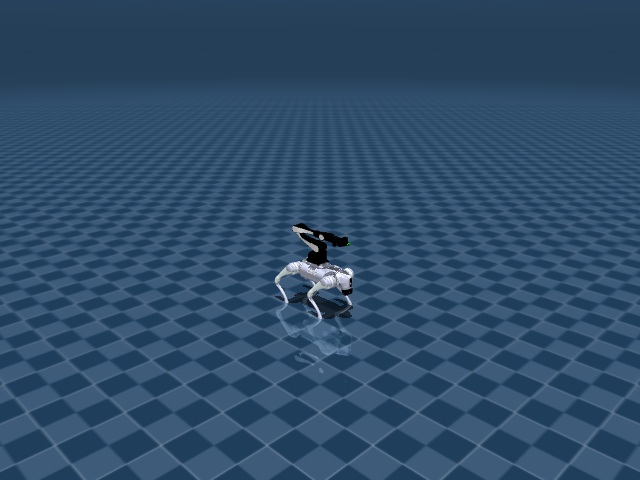

# Go2 Arm Manip-Loco

## 任务目标

训练带机械臂的 Go2 在移动中接近/操作目标，同时保持底盘稳定和机械臂安全。



> 图片由 `_tools/render_static_images.py` 使用 `src/unilab/assets/robots/go2_arm/scene_flat.xml` 的 MuJoCo scene 离屏渲染生成；如果当前环境无法启用 EGL/OSMesa，生成 manifest 会记录失败原因。

## 证据索引

| 项目 | 内容 |
| --- | --- |
| 任务类别 | 移动操作 |
| 机器人 | go2_arm |
| 代表 scene | src/unilab/assets/robots/go2_arm/scene_flat.xml |
| 代表源码 | src/unilab/envs/locomotion/go2_arm/manip_loco.py |
| 代表 owner YAML | conf/ppo/task/go2_arm_manip_loco/mujoco.yaml |
| 动作维度 | 18 |

### Registry 与 Owner

| 注册名 | 后端 | 配置类 | 配置源码 |
| --- | --- | --- | --- |
| Go2ArmManipLoco | mujoco, motrix | Go2ArmManipLocoCfg | src/unilab/envs/locomotion/go2_arm/manip_loco.py |

| 算法组 | 后端 | training.task_name | owner YAML |
| --- | --- | --- | --- |
| ppo | motrix | Go2ArmManipLoco | conf/ppo/task/go2_arm_manip_loco/motrix.yaml |
| ppo | mujoco | Go2ArmManipLoco | conf/ppo/task/go2_arm_manip_loco/mujoco.yaml |
| ppo_him | mujoco | Go2ArmManipLoco | conf/ppo_him/task/go2_arm_manip_loco/mujoco.yaml |

## 代码级执行流

这部分不再用通用关键词套模板，而是为 `go2_arm_manip_loco` 单独写源码导读。源码片段只负责提供证据；每节说明都围绕本任务自己的配置、状态、观测、动作和 reward 语义展开。

| 阶段 | 证据位置 | 代码级说明 |
| --- | --- | --- |
| 1. Hydra owner | conf/ppo/task/go2_arm_manip_loco/mujoco.yaml | 训练命令先 compose owner YAML。这里确定 `training.task_name`、后端身份、obs_groups、reward scale 和 env override。 |
| 2. Registry 构造 Env | src/unilab/envs/locomotion/go2_arm/manip_loco.py | `@registry.envcfg` 注册配置类，`@registry.env` 注册后端实现类；训练脚本只调用 registry，不直接 new 任务类。 |
| 3. Reset/初始状态 | src/unilab/assets/robots/go2_arm/scene_flat.xml | env 从 scene keyframe 或 motion/grasp cache 取初态，再通过 reset randomization 改写 qpos/qvel/info。 |
| 4. Obs dict | src/unilab/envs/locomotion/go2_arm/manip_loco.py | env 读取 backend 传感器和 info，返回 dict；learner 根据 `obs_groups_spec` 和 owner `algo.obs_groups` 选择 actor/critic 输入。 |
| 5. Action 到控制目标 | src/unilab/envs/locomotion/go2_arm/manip_loco.py | policy 输出先按 action scale / 控制顺序映射到 actuator，再由 backend step 推进仿真。 |
| 6. Reward dispatch | src/unilab/envs/locomotion/go2_arm/manip_loco.py | 源码把 reward key 映射到函数，owner YAML 的 scale 决定每项奖励/惩罚是否启用以及权重。 |
| 7. Termination | src/unilab/envs/locomotion/go2_arm/manip_loco.py | env 根据高度、姿态、接触、参考轨迹误差、物体状态或能量阈值生成 done/terminated。 |

### 本任务阅读重点

| 阅读重点 |
| --- |
| Go2Arm 是移动操作，不是简单 locomotion：action 同时覆盖 12 个腿关节和 6 个机械臂关节。 |
| obs 要区分底盘状态、机械臂状态、目标/物体相对信息和历史帧。 |
| reward 同时约束移动稳定、末端目标、碰撞和动作平滑，不能只按四足速度跟踪解释。 |

### 本任务注册入口

| 注册名 | 配置类 | 可用后端 |
| --- | --- | --- |
| Go2ArmManipLoco | Go2ArmManipLocoCfg | mujoco, motrix |

### 本任务源码锚点

| 小节 | 源码文件 | 明确锚点 |
| --- | --- | --- |
| 配置：底盘 + 机械臂 | src/unilab/envs/locomotion/go2_arm/manip_loco.py | Go2ArmManipLocoCfg, _default_go2_arm_scene |
| Reset：目标与历史 | src/unilab/envs/locomotion/go2_arm/manip_loco.py | build_reset_plan, target |
| Obs：移动操作输入 | src/unilab/envs/locomotion/go2_arm/manip_loco.py | obs_groups_spec, _compute_obs |
| Action：18 维混合控制 | src/unilab/envs/locomotion/go2_arm/manip_loco.py | apply_action, arm |
| Reward/Termination | src/unilab/envs/locomotion/go2_arm/manip_loco.py | _init_reward_functions, update_state |

## 关键源码逐段解释（按本任务手写）

### 配置：底盘 + 机械臂

| 本任务人工导读 |
| --- |
| cfg 指向组合 scene，robot 资产由 Go2 底盘和 Airbot arm 构成。 |
| 任务规则留在 manip_loco env，训练脚本只选择注册名。 |

```python
# src/unilab/envs/locomotion/go2_arm/manip_loco.py
# 注册组合移动操作任务，训练入口通过 task_name 选择这一套 env contract。
@registry.envcfg("Go2ArmManipLoco")
@dataclass
class Go2ArmManipLocoCfg(Go2ArmBaseCfg):
    # scene/model_file 指向 Go2 底盘 + Airbot arm 的组合场景。
    scene: SceneCfg = field(default_factory=_default_go2_arm_scene)
    model_file: str = field(default_factory=_default_go2_arm_model_file)
    max_episode_seconds: float = 20.0
    # init/commands/reward/sensor/domain_rand 分别控制底盘初态、速度命令、奖励和 DR。
    init_state: InitState = field(default_factory=InitState)
    commands: CommandsConfig = field(default_factory=CommandsConfig)  # type: ignore[assignment]
    reward_config: RewardConfig | None = None
    sensor: Go2ArmSensor = field(default_factory=Go2ArmSensor)  # type: ignore[assignment]
    domain_rand: Go2ArmDomainRandConfig = field(default_factory=Go2ArmDomainRandConfig)
    # goal_ee/history/arm_stage/curriculum 是移动操作区别于纯 locomotion 的关键字段。
    goal_ee: EEGoalConfig = field(default_factory=EEGoalConfig)
    history: HistoryConfig = field(default_factory=HistoryConfig)
    arm_stage: ArmStageConfig = field(default_factory=ArmStageConfig)
    curriculum: CurriculumConfig = field(default_factory=CurriculumConfig)


```

```python
# src/unilab/envs/locomotion/go2_arm/manip_loco.py
def _default_go2_arm_scene() -> SceneCfg:
    # 默认 scene 在冷路径解析，训练热路径只读已 materialized 的 backend 状态。
    return SceneCfg(model_file=_default_go2_arm_model_file())


```
### Reset：目标与历史

| 本任务人工导读 |
| --- |
| reset 在底盘 home 姿态上初始化 arm、目标和历史缓存。 |
| 目标/物体信息进入 info_updates，后续 obs/reward 共用。 |

```python
# src/unilab/envs/locomotion/go2_arm/manip_loco.py
    def build_reset_plan(self, env: Any, env_ids: np.ndarray) -> ResetPlan:
        # 先复用 locomotion reset：底盘 qpos/qvel、commands 和通用 DR 由父类生成。
        plan = super().build_reset_plan(env, env_ids)
        # 为被 reset 的 env 重新采样/初始化末端目标轨迹。
        env.reset_ee_goals(env_ids)
        # Update command curriculum at episode end before resetting timers.
        # episode 结束时根据上一段 tracking 表现扩展或保持速度命令范围。
        env._update_command_curriculum(env_ids)
        # Reset command timers. reset_ee_goals already clears _arm_goal_timer.
        # 重置底盘命令与机械臂目标计时器，保证新 episode 从统一时间相位开始。
        env._cmd_timer[env_ids] = 0
        env._arm_goal_timer[env_ids] = 0
        # Clear history buffers for reset environments.
        # actor/critic history 清零，避免旧轨迹影响新 episode 的 stacked obs。
        env._history_obs_buf[env_ids] = 0.0
        env._history_critic_buf[env_ids] = 0.0
        env.phase[env_ids] = 0.0
        # 根据 reset 后 commands 判断是否移动，写入四足步态相位目标。
        env._write_feet_phase(env_ids, env._command_is_moving(plan.info_updates["commands"]))
        return plan

```

```python
# src/unilab/envs/locomotion/go2_arm/manip_loco.py
@dataclass
class EEGoalConfig:
    """End-effector goal config in spherical coordinates."""

    # Spherical sampling ranges.
    # 末端目标先在球坐标中采样，之后转换为机械臂基座坐标系下的笛卡尔目标。
    sphere_l_range: list[float] = field(default_factory=lambda: [0.3, 0.6])
    sphere_phi_range: list[float] = field(default_factory=lambda: [-1.2566, 1.0472])
    sphere_theta_range: list[float] = field(default_factory=lambda: [-2.3562, 2.3562])
    # Trajectory timing.
    # 轨迹时间和保持时间共同决定末端目标多久更新一次。
    traj_time_range: list[float] = field(default_factory=lambda: [1.0, 3.0])
    hold_time_range: list[float] = field(default_factory=lambda: [0.5, 2.0])
    # Collision checks.
    # 采样目标会经过碰撞盒/地下限制检查，避免生成不可达或穿模目标。
    collision_upper_limits: list[float] = field(default_factory=lambda: [0.3, 0.15, 0.05 - 0.165])
    collision_lower_limits: list[float] = field(
        default_factory=lambda: [-0.2, -0.15, -0.35 - 0.165]
    )
    underground_limit: float = -0.57
    num_collision_check_samples: int = 10
    num_resample_attempts: int = 10
    # End-effector target orientation sampling (XYZ Euler to wxyz quaternion).
    # 末端朝向使用欧拉扰动采样，再转换成 wxyz 四元数供 IK 使用。
    default_orn_roll: float = float(np.pi / 2.0)
    arm_induced_pitch: float = 0.78
    delta_orn_r: list[float] = field(default_factory=lambda: [-0.5, 0.5])
    delta_orn_p: list[float] = field(default_factory=lambda: [-0.5, 0.5])
    delta_orn_y: list[float] = field(default_factory=lambda: [-0.5, 0.5])
    # Initial goal used as the reset-time start point.
    # reset 时的初始末端目标，后续轨迹从这里插值到新采样目标。
    init_ee_cart: list[float] = field(default_factory=lambda: [0.30, 0.0, 0.25])


```
### Obs：移动操作输入

| 本任务人工导读 |
| --- |
| obs 结合底盘本体、arm joint、目标相对量和 history。 |
| actor/critic 维度由 history 与目标字段共同决定。 |

```python
# src/unilab/envs/locomotion/go2_arm/manip_loco.py
    @property
    def obs_groups_spec(self) -> dict[str, int]:
        # actor/critic 可以使用不同 history 长度，维度由单步 obs 宽度乘 history。
        H_a = self._cfg.history.num_actor_history
        H_c = self._cfg.history.num_critic_history
        # obs 组给策略，critic 组保留含 linvel 的特权单步信息。
        return {"obs": H_a * self._actor_one_step_dim, "critic": H_c * self._critic_one_step_dim}

```

```python
# src/unilab/envs/locomotion/go2_arm/manip_loco.py
    def _compute_obs(
        self,
        info: dict,
        linvel: np.ndarray,
        gyro: np.ndarray,
        gravity: np.ndarray,
        dof_pos: np.ndarray,
        dof_vel: np.ndarray,
        ee_local_pos: np.ndarray,
        ee_goal_cart: np.ndarray,
        feet_phase: np.ndarray,
    ) -> dict[str, np.ndarray]:
        # raw obs 先拼接单步底盘、关节、末端目标和足端相位信息。
        raw = self._compute_raw_obs(
            info, linvel, gyro, gravity, dof_pos, dof_vel, ee_local_pos, ee_goal_cart, feet_phase
        )
        # 再写入 history buffer，输出符合 obs_groups_spec 的 actor/critic 观测。
        return self._update_history(raw)

```
### Action：18 维混合控制

| 本任务人工导读 |
| --- |
| 前 12 维用于腿部，后 6 维用于机械臂。 |
| 控制映射必须保持 actuator 顺序，不能在训练脚本里拆分业务规则。 |

```python
# src/unilab/envs/locomotion/go2_arm/manip_loco.py
    def apply_action(self, actions: np.ndarray, state: NpEnvState) -> np.ndarray:
        # 18 维动作：前 12 维腿部，后 6 维机械臂。
        state.info["last_actions"] = state.info.get("current_actions", np.zeros_like(actions))
        stage_cfg = self._cfg.arm_stage
        if stage_cfg.freeze_arm_joints:
            # 冻结机械臂阶段会强制后 6 维动作为零，只训练/验证底盘部分。
            effective_actions = actions.copy()
            effective_actions[:, 12:18] = 0.0
        else:
            effective_actions = actions
        state.info["current_actions"] = effective_actions
        # latency 打开时执行上一帧 effective_actions，保持实机控制口径。
        exec_actions = (
            state.info["last_actions"]
            if self._cfg.control_config.simulate_action_latency
            else effective_actions
        )

        # 当前末端位姿来自 backend sensor，用于计算目标到当前位姿的 IK 增量。
        ee_local_pos, ee_local_quat = self.get_ee_local_pose()
        dq_ik = self.compute_arm_ik_delta(
            self.curr_ee_goal_cart,
            ee_local_pos,
            self.ee_goal_orn_quat,
            ee_local_quat,
        )

        # 腿部仍按 Go2 position target：动作缩放后叠加默认站立角。
        leg_ctrl = (
            exec_actions[:, :12] * self._cfg.control_config.action_scale + self.default_angles[:12]
        )
        if stage_cfg.freeze_arm_joints:
            # 冻结时机械臂控制目标固定在默认角，保证 actuator 顺序仍为 18 维。
            arm_ctrl = np.broadcast_to(self.default_angles[12:18], (self._num_envs, 6)).astype(
                get_global_dtype(),
                copy=False,
            )
        else:
            # 机械臂目标由当前位置、策略增量和 IK 朝目标的修正量共同决定。
            arm_ctrl = (
                self.get_arm_dof_pos()
                + exec_actions[:, 12:18] * self._cfg.control_config.arm_action_scale
                + self._cfg.ik.gain * dq_ik
            )
        ctrl = np.concatenate([leg_ctrl, arm_ctrl], axis=1, dtype=get_global_dtype())
        # 最终裁剪到 backend action_space，避免越过 actuator 控制范围。
        return np.clip(ctrl, self.action_space.low, self.action_space.high)

```

```python
# src/unilab/envs/locomotion/go2_arm/manip_loco.py
    # create_backend 时传入该 helper，为 18 个 position actuator 设置 Go2Arm 增益。
    build_go2_arm_position_gains,
)


```
### Reward/Termination

| 本任务人工导读 |
| --- |
| reward 同时包含 locomotion 稳定项和 arm/object 距离项。 |
| 终止关注底盘跌倒、机械臂异常/碰撞和 episode horizon。 |

```python
# src/unilab/envs/locomotion/go2_arm/manip_loco.py
    def _init_reward_functions(self) -> None:
        # reward_config.scales 通过这些名字调度具体奖励/惩罚函数。
        self._reward_fns: dict[str, Any] = {
            # Tracking rewards.
            # 底盘线速度/角速度跟踪 commands。
            "tracking_lin_vel": rewards.tracking_lin_vel,
            "tracking_ang_vel": rewards.tracking_ang_vel,
            # Velocity and orientation penalties.
            # 抑制竖直速度、横滚/俯仰角速度和过大机身倾斜。
            "lin_vel_z": rewards.lin_vel_z,
            "ang_vel_xy": rewards.ang_vel_xy,
            "roll": rewards.roll,  # Requires ctx.gravity.
            # Height and joint-pose terms.
            # 约束机身高度、默认姿态相似度以及腿部软限位。
            "base_height": rewards.base_height,
            "similar_to_default": rewards.similar_to_default,  # Aligns with Go2 Joystick.
            "leg_pose": rewards.weighted_pose,  # Weighted leg L2 term.
            "dof_pos_limits": self._reward_dof_pos_limits,  # Leg soft limits.
            # Action and effort penalties.
            # 控制平滑、力矩、能耗、关节速度/加速度共同限制动作激烈程度。
            "action_rate": rewards.action_rate,
            "torques": rewards.torques,  # L1 torque over all 18 DOFs.
            "energy": rewards.energy,  # Requires ctx.dof_vel and info["torques"].
            "dof_vel": self._reward_dof_vel,  # L2 velocity over all 18 DOFs.
            "dof_acc": rewards.dof_acc,  # Requires info["qacc"].
            # Standing penalty.
            # 零速度命令下鼓励腿部回到站立姿态。
            "stand_still": self._reward_stand_still,  # Penalizes leg pose at zero command.
            # Survival.
            "alive": rewards.alive,
            # Gait terms.
            # 足端摆动高度、拖脚和接触相位约束四足步态。
            "swing_feet_z": self._reward_swing_feet_z,
            "foot_drag": self._reward_foot_drag,
            "contact": self._reward_contact,
            # Manipulation rewards.
            # 末端/物体距离项把机械臂目标跟踪纳入同一个 reward 表。
            "object_distance": self._reward_object_distance,
            "object_distance_l2": self._reward_object_distance_l2,
            # Arm collision penalty.
            # 机械臂碰撞作为独立惩罚，避免靠碰撞完成目标。
            "arm_collision": self._reward_arm_collision,
        }

```

```python
# src/unilab/envs/locomotion/go2_arm/manip_loco.py
    def update_state(self, state: NpEnvState) -> NpEnvState:
        # Mid-episode command resampling, enabled only when resample_time_s is set.
        if self._cmd_resample_steps is not None:
            # 底盘速度命令可在 episode 中途重采样，用于更丰富的移动操作组合。
            self._cmd_timer += 1
            resample_ids = np.where(self._cmd_timer >= self._cmd_resample_steps)[0].astype(np.int32)
            if len(resample_ids) > 0:
                self._resample_commands(resample_ids, state.info)
                self._cmd_timer[resample_ids] = 0

        # Gait phase update: zero commands reset the phase to a full-stance pattern.
        # This gives contact a four-feet contact target and naturally disables swing_feet_z.
        cmd = state.info.get("commands", np.zeros((self._num_envs, 3), dtype=np.float32))
        is_moving = self._command_is_moving(cmd)
        advanced = np.fmod(self.phase + self._cfg.ctrl_dt * self.gait_frequency, 1.0)
        # 有速度命令时推进步态相位，零命令时保持四足全支撑。
        self.phase = np.where(is_moving, advanced, 0.0)
        self._write_feet_phase(slice(None), is_moving)

        # EE goal trajectory update.
        stage_cfg = self._cfg.arm_stage
        if stage_cfg.disable_ee_goal_trajectory:
            # 固定目标阶段直接写入配置中的末端目标，便于分阶段训练/排错。
            fixed_goal = np.asarray(stage_cfg.fixed_ee_goal_cart, dtype=get_global_dtype())
            if fixed_goal.shape != (3,):
                raise ValueError(
                    f"env.arm_stage.fixed_ee_goal_cart must have shape (3,), got {fixed_goal.shape}"
                )
            self.curr_ee_goal_cart[:] = fixed_goal
            self.curr_ee_goal_sphere[:] = _cart2sphere(fixed_goal[None, :])[0]
        else:
            self._arm_goal_timer += 1
            expired = np.where(self._arm_goal_timer >= self._traj_total_steps)[0].astype(np.int32)
            if len(expired) > 0:
                # 目标轨迹到期后，从当前目标出发采样下一段球坐标目标。
                self._ee_start_sphere[expired] = self._ee_goal_sphere[expired].copy()
                self._sample_goal_spheres(expired, self._ee_start_sphere[expired])
                self._sample_ee_goal_orn_delta(expired, is_init=False)
                self._sample_timing(expired)
                self._arm_goal_timer[expired] = 0
            # Spherical interpolation, updated every step.
            # 球坐标插值后转笛卡尔，提供平滑的末端目标轨迹。
            t_frac = np.clip(self._arm_goal_timer / self._traj_steps, 0.0, 1.0).astype(
                get_global_dtype()
            )[:, None]  # (num_envs, 1)
            curr_sphere = (
                self._ee_start_sphere + (self._ee_goal_sphere - self._ee_start_sphere) * t_frac
            )
            self.curr_ee_goal_sphere[:] = curr_sphere
            self.curr_ee_goal_cart[:] = _sphere2cart(curr_sphere)
        self._update_curr_ee_goal_orientation(np.arange(self._num_envs, dtype=np.int32))
        # Compute the world-space goal position for render-time visualization.
        ab_pos = self._backend.get_sensor_data("armbasepoint_world_pos")  # (N, 3)
        ab_quat = self._backend.get_sensor_data("armbasepoint_world_quat")  # (N, 4)
        R = np_matrix_from_quat(ab_quat)  # (N, 3, 3)
        # 渲染用世界系目标点由 arm base 世界位姿和局部目标相乘得到。
        self.curr_ee_goal_world[:] = ab_pos + np.einsum("nij,nj->ni", R, self.curr_ee_goal_cart)

        # 读取当前仿真状态，作为 reward/termination/obs 的同一帧输入。
        linvel = self.get_local_linvel()
        gyro = self.get_gyro()
        gravity = self._backend.get_sensor_data("upvector")
        dof_pos = self.get_dof_pos()
        dof_vel = self.get_dof_vel()
        ee_local_pos, _ = self.get_ee_local_pose()
        self._current_ee_local_pos = ee_local_pos

        self.feet_force[:, :, :] = 0
        for i, sensor_name in enumerate(self._cfg.sensor.feet_force):
            self.feet_force[:, i, :] = self._backend.get_sensor_data(sensor_name)
        for i, sensor_name in enumerate(self._cfg.sensor.feet_pos):
            self.feet_pos[:, i, :] = self._backend.get_sensor_data(sensor_name)

        # upvector 的 z 分量过低表示机身倾倒，是主要终止条件。
        terminated = gravity[:, 2] <= 0.5
        # reward 同时评估底盘移动稳定性和机械臂末端目标。
        reward = self._compute_reward(
            state.info, linvel, gyro, gravity, dof_pos, dof_vel, ee_local_pos
        )
        # obs 输出 history 后的 actor/critic dict。
        obs = self._compute_obs(
            state.info,
            linvel,
            gyro,
            gravity,
            dof_pos,
            dof_vel,
            ee_local_pos,
            self.curr_ee_goal_cart,
            self.feet_phase,
        )
        return state.replace(obs=obs, reward=reward, terminated=terminated)

```


## Agent

Agent 输出 18 维动作，包括 12 个腿部 actuator 与 6 个机械臂关节 actuator。

训练入口通过 owner YAML 决定注册 env、后端身份和算法参数；CLI 应使用 `--sim` 选择 backend owner，而不是单独 override `training.sim_backend`。

```yaml
# conf/ppo/task/go2_arm_manip_loco/mujoco.yaml
training:
  task_name: Go2ArmManipLoco
  sim_backend: mujoco
algo:
  obs_groups:
    actor:
    - actor
  num_envs: 4096
  max_iterations: 151
```

## Env

Env 由 `Go2ArmManipLocoEnv` 管理底盘 locomotion 和 arm/object reward，不把任务规则放到训练脚本。

Env 必须遵守 `NpEnv` contract：`reset()` 返回 `(obs_dict, info_dict)`，`obs` 是 dict，`obs_groups_spec` 决定 learner 使用哪些观测组。

```python
# src/unilab/envs/locomotion/go2_arm/manip_loco.py
    freeze_arm_joints: bool = False
    disable_ee_goal_trajectory: bool = False
    fixed_ee_goal_cart: list[float] = field(default_factory=lambda: [0.30, 0.0, 0.25])


@registry.envcfg("Go2ArmManipLoco")
@dataclass
class Go2ArmManipLocoCfg(Go2ArmBaseCfg):
    scene: SceneCfg = field(default_factory=_default_go2_arm_scene)
    model_file: str = field(default_factory=_default_go2_arm_model_file)
    max_episode_seconds: float = 20.0
```

## Obs

观测包含底盘状态、命令、机械臂关节状态、目标/物体相对信息和动作历史。

### Obs 字段级拆解

下面的表格把源码里的观测拼接逻辑拆成语义字段。维度如果依赖 history、terrain scan 或 motion body 数量，文档会写成“规模”而不是硬编码，避免和配置漂移。

| 观测字段 | 维度/规模 | 代码来源 | 中文说明 |
| --- | --- | --- | --- |
| command | 通常 3 维 | `commands` / joystick 采样 | 期望 x/y 线速度和 yaw 角速度，是策略要跟踪的外部目标。 |
| gyro | 3 维 | `get_gyro()` / sensor.gyro | 机身角速度，帮助策略判断身体旋转和姿态变化。 |
| gravity | 3 维 | 局部重力投影 | 把世界重力投到 body 坐标系，用于表示 roll/pitch 倾斜。 |
| dof_pos - default | nu 维 | 关节角与 keyframe 默认角差 | 告诉策略每个关节离默认站姿有多远。 |
| dof_vel | nu 维 | backend dof velocity | 关节速度，用于阻尼和判断腿部摆动速度。 |
| last_actions | nu 维 | info['last_actions'] | 上一控制步动作，帮助策略形成平滑控制。 |
| critic privileged | 任务相关 | `critic` obs group | 训练 critic 可读取更多速度或地形信息，actor 不一定可见。 |

owner YAML 中的 `algo.obs_groups` 说明算法从 env obs dict 中读取哪些组。没有写入 owner 的字段保持 env cfg 默认值，文档不臆造未配置项。

```yaml
# conf/ppo/task/go2_arm_manip_loco/mujoco.yaml
algo:
  obs_groups:
    actor:
    - actor

```

代码侧观测通常在 `_get_obs`、`_build_obs`、`obs_groups_spec` 或 base env 中组装：

```python
# src/unilab/envs/locomotion/go2_arm/manip_loco.py
            ground_geom_id=ground_geom_id,
            base_dof_armature=base_dof_armature,
        )
        self._init_domain_randomization(dr_provider)

    @property
    def obs_groups_spec(self) -> dict[str, int]:
        H_a = self._cfg.history.num_actor_history
        H_c = self._cfg.history.num_critic_history
        return {"obs": H_a * self._actor_one_step_dim, "critic": H_c * self._critic_one_step_dim}

    def _init_ee_goal_buffers(self, num_envs: int) -> None:
        dtype = get_global_dtype()
```

源码锚点拆解：

| 源码符号 | 中文说明 |
| --- | --- |
| obs_groups_spec | 声明 obs dict 中各观测组的维度，是 wrapper/learner 对齐观测的契约。 |
| _compute_obs | 读取 backend 传感器和 info 字段，拼接 actor/critic 观测。 |

## Action

动作空间覆盖底盘与机械臂，scene 编译得到 `nu=18`。

### Action 逐维拆解

移动操作任务的 action 同时控制四足底盘和 6 DoF 机械臂，策略需要在移动稳定和末端目标之间折中。

当前代表 scene 编译出的 action 维度为 `18`。下表来自 MuJoCo 编译模型的 actuator 顺序，也就是策略输出维度和执行器维度的对应关系。

| Action 维度 | 执行器 | 驱动关节 | 中文含义 | 控制/限制说明 |
| --- | --- | --- | --- | --- |
| 0 | FL_hip | FL_hip_joint | 左前腿髋外展/内收关节 | -0.9472 ~ 0.9472 |
| 1 | FL_thigh | FL_thigh_joint | 左前腿髋俯仰（大腿）关节 | -1.4 ~ 2.5 |
| 2 | FL_calf | FL_calf_joint | 左前腿膝关节（小腿摆动） | -2.623 ~ -0.8478 |
| 3 | FR_hip | FR_hip_joint | 右前腿髋外展/内收关节 | -0.9472 ~ 0.9472 |
| 4 | FR_thigh | FR_thigh_joint | 右前腿髋俯仰（大腿）关节 | -1.4 ~ 2.5 |
| 5 | FR_calf | FR_calf_joint | 右前腿膝关节（小腿摆动） | -2.623 ~ -0.8478 |
| 6 | RL_hip | RL_hip_joint | 左后腿髋外展/内收关节 | -0.9472 ~ 0.9472 |
| 7 | RL_thigh | RL_thigh_joint | 左后腿髋俯仰（大腿）关节 | -1.4 ~ 2.5 |
| 8 | RL_calf | RL_calf_joint | 左后腿膝关节（小腿摆动） | -2.623 ~ -0.8478 |
| 9 | RR_hip | RR_hip_joint | 右后腿髋外展/内收关节 | -0.9472 ~ 0.9472 |
| 10 | RR_thigh | RR_thigh_joint | 右后腿髋俯仰（大腿）关节 | -1.4 ~ 2.5 |
| 11 | RR_calf | RR_calf_joint | 右后腿膝关节（小腿摆动） | -2.623 ~ -0.8478 |
| 12 | <unnamed:12> | joint1 | 机械臂第 1 轴关节 | -3.142 ~ 2.094 |
| 13 | <unnamed:13> | joint2 | 机械臂第 2 轴关节 | -2.967 ~ 0.1745 |
| 14 | <unnamed:14> | joint3 | 机械臂第 3 轴关节 | -0.08727 ~ 3.142 |
| 15 | <unnamed:15> | joint4 | 机械臂第 4 轴关节 | -3.011 ~ 3.011 |
| 16 | <unnamed:16> | joint5 | 机械臂第 5 轴关节 | -1.763 ~ 1.763 |
| 17 | <unnamed:17> | joint6 | 机械臂第 6 轴关节 | -3.011 ~ 3.011 |

控制参数来自 owner YAML 的 `env.control_config`，缺省值由对应 env cfg/dataclass 提供。

| 配置字段 | 当前值 | 中文说明 |
| --- | --- | --- |
| arm_action_scale | 0.0 | 策略输出到目标关节角的缩放系数。 |

```yaml
# conf/ppo/task/go2_arm_manip_loco/mujoco.yaml
env:
  control_config:
    arm_action_scale: 0.0

```

动作到执行器的实际映射由 backend 的 actuator control range 和 env 的 `apply_action`/控制函数完成：

```python
# src/unilab/envs/locomotion/go2_arm/manip_loco.py
            get_global_dtype()
        )
        new_cmds = self._postprocess_velocity_commands(new_cmds)
        if "commands" in info:
            info["commands"][env_ids] = new_cmds

    def apply_action(self, actions: np.ndarray, state: NpEnvState) -> np.ndarray:
        state.info["last_actions"] = state.info.get("current_actions", np.zeros_like(actions))
        stage_cfg = self._cfg.arm_stage
        if stage_cfg.freeze_arm_joints:
            effective_actions = actions.copy()
            effective_actions[:, 12:18] = 0.0
        else:
```

源码锚点拆解：

| 源码符号 | 中文说明 |
| --- | --- |
| apply_action | 把策略输出缩放为执行器控制目标。 |

## Reward

reward 结合 locomotion 跟踪项、object distance、arm collision、动作平滑和姿态稳定项。

### Reward 逐项拆解

reward scale 以 owner YAML 的 `reward.scales` 为真源；源码中的 `RewardConfig` 描述可用字段，训练脚本只做 Hydra 组装和注入。正数通常表示奖励，负数通常表示惩罚，0 表示该项在当前 owner 中关闭或仅保留接口。

| Reward key | Scale | 方向 | 中文含义 |
| --- | --- | --- | --- |
| tracking_lin_vel | 2.0 | 奖励 | 线速度命令跟踪奖励，鼓励机器人实际平面速度贴近 joystick/命令速度。 |
| tracking_ang_vel | 0.5 | 奖励 | 角速度命令跟踪奖励，鼓励 yaw 角速度贴近转向命令。 |
| lin_vel_z | -5.0 | 惩罚 | 竖直速度惩罚，限制 base 上下弹跳。 |
| ang_vel_xy | -0.1 | 惩罚 | 横滚/俯仰角速度惩罚，抑制身体剧烈摇摆。 |
| roll | -5.0 | 惩罚 | 仓库 owner YAML 中声明的奖励项；具体实现见本页源码片段和 env 的 reward dispatch。 |
| base_height | -100 | 惩罚 | 身体高度项，使 base 高度保持在任务目标附近。 |
| similar_to_default | -0.0 | 记录/关闭 | 仓库 owner YAML 中声明的奖励项；具体实现见本页源码片段和 env 的 reward dispatch。 |
| leg_pose | -0.1 | 惩罚 | 默认姿态或参考姿态约束，防止无关关节偏离可用构型。 |
| dof_pos_limits | 0.0 | 记录/关闭 | 关节位置限位惩罚，防止接近 XML joint range 边界。 |
| action_rate | -0.005 | 惩罚 | 动作变化惩罚，抑制相邻控制步之间的目标突变。 |
| torques | 0.0 | 记录/关闭 | 力矩惩罚，降低控制输出过大。 |
| energy | 0.0 | 记录/关闭 | 能量消耗惩罚，降低力矩与速度共同造成的控制代价。 |
| dof_vel | 0.0 | 记录/关闭 | 速度相关奖励/惩罚，用于跟踪目标速度或抑制不希望的运动。 |
| dof_acc | 0.0 | 记录/关闭 | 关节加速度惩罚，抑制高频振荡。 |
| stand_still | -0.5 | 惩罚 | 仓库 owner YAML 中声明的奖励项；具体实现见本页源码片段和 env 的 reward dispatch。 |
| contact | 0.24 | 奖励 | 接触项，约束指定足端或身体部位的接触模式。 |
| swing_feet_z | 4.0 | 奖励 | 仓库 owner YAML 中声明的奖励项；具体实现见本页源码片段和 env 的 reward dispatch。 |
| foot_drag | -0.1 | 惩罚 | 仓库 owner YAML 中声明的奖励项；具体实现见本页源码片段和 env 的 reward dispatch。 |
| object_distance | 2.0 | 奖励 | 移动操作中末端/目标物体距离项。 |
| object_distance_l2 | -0.5 | 惩罚 | 移动操作中目标距离 L2 项。 |
| arm_collision | -1.0 | 惩罚 | 机械臂碰撞惩罚。 |

```yaml
# conf/ppo/task/go2_arm_manip_loco/mujoco.yaml
reward:
  scales:
    tracking_lin_vel: 2.0
    tracking_ang_vel: 0.5
    lin_vel_z: -5.0
    ang_vel_xy: -0.1
    roll: -5.0
    base_height: -100
    similar_to_default: -0.0
    leg_pose: -0.1
    dof_pos_limits: 0.0
    action_rate: -0.005
    torques: 0.0
    energy: 0.0
    dof_vel: 0.0
    dof_acc: 0.0
    stand_still: -0.5
    contact: 0.24
    swing_feet_z: 4.0
    foot_drag: -0.1
    object_distance: 2.0
    object_distance_l2: -0.5
    arm_collision: -1.0
  tracking_sigma: 0.25
  base_height_target: 0.3
  object_sigma: 0.1

```

源码中的 reward 入口：

```python
# src/unilab/envs/locomotion/go2_arm/manip_loco.py
    step_size: list[float] = field(default_factory=lambda: [0.1, 0.05, 0.1])
    # Absolute velocity-range limits to prevent unbounded expansion.
    max_vel_limit: list[float] = field(default_factory=lambda: [1.0, 0.4, 0.8])


@dataclass
class RewardConfig:
    scales: dict[str, float]
    tracking_sigma: float
    base_height_target: float
    target_foot_height: float = 0.1
    object_sigma: float = 0.1
    # Soft limits for 12 leg joints in radians. Empty lists disable the reward term.
```

源码锚点拆解：

| 源码符号 | 中文说明 |
| --- | --- |
| RewardConfig: | 声明 reward 可用参数和默认 scale。 |
| _init_reward_functions | 把 reward 名称映射到源码函数，owner YAML 的 scale 会按这些 key 分发。 |
| _compute_reward | reward 相关源码锚点。 |
| _reward_swing_feet_z | 单个 reward 项的实现函数，通常返回每个 env 的 reward 向量。 |
| _reward_foot_drag | 单个 reward 项的实现函数，通常返回每个 env 的 reward 向量。 |
| _reward_contact | 单个 reward 项的实现函数，通常返回每个 env 的 reward 向量。 |
| _reward_object_distance | 单个 reward 项的实现函数，通常返回每个 env 的 reward 向量。 |
| _reward_object_distance_l2 | 单个 reward 项的实现函数，通常返回每个 env 的 reward 向量。 |
| _reward_stand_still | 单个 reward 项的实现函数，通常返回每个 env 的 reward 向量。 |
| _reward_dof_vel | 单个 reward 项的实现函数，通常返回每个 env 的 reward 向量。 |
| _reward_dof_pos_limits | 单个 reward 项的实现函数，通常返回每个 env 的 reward 向量。 |
| _reward_arm_collision | 单个 reward 项的实现函数，通常返回每个 env 的 reward 向量。 |

## 初始状态

初始状态来自 `home` keyframe，机械臂和底盘默认姿态一起复位。

机器人默认姿态来自 scene/task fragment 中的 keyframe；任务 reset 在此基础上加入命令、motion reference、物体状态或随机化。

```xml
<!-- src/unilab/assets/robots/go2_arm/scene_flat.xml -->
    <contact name="RR_calf_contact2" geom1="floor" geom2="rr_calf_1" data="found" num="1" reduce="mindist"/>
  </sensor>

  <keyframe>
    <key name="home" qpos="
    0 0 0.278
    1 0 0 0
```

```python
# src/unilab/envs/locomotion/go2_arm/manip_loco.py
    # End-effector target orientation sampling (XYZ Euler to wxyz quaternion).
    default_orn_roll: float = float(np.pi / 2.0)
    arm_induced_pitch: float = 0.78
    delta_orn_r: list[float] = field(default_factory=lambda: [-0.5, 0.5])
    delta_orn_p: list[float] = field(default_factory=lambda: [-0.5, 0.5])
    delta_orn_y: list[float] = field(default_factory=lambda: [-0.5, 0.5])
    # Initial goal used as the reset-time start point.
    init_ee_cart: list[float] = field(default_factory=lambda: [0.30, 0.0, 0.25])


@dataclass
class CommandsConfig(Commands):
    # Periodic command resampling time in seconds. None disables mid-episode resampling.
```

## 终止条件

终止关注底盘跌倒、机械臂碰撞/异常和 episode horizon。

终止条件通常由 env 源码中的 `_compute_termination(s)`、reward config 阈值和 `max_episode_seconds` 共同决定。

```yaml
# conf/ppo/task/go2_arm_manip_loco/mujoco.yaml
env:
  {}

reward:
  {}

```

```python
# src/unilab/envs/locomotion/go2_arm/manip_loco.py
        self._current_ee_local_pos = ee_local_pos

        self.feet_force[:, :, :] = 0
        for i, sensor_name in enumerate(self._cfg.sensor.feet_force):
            self.feet_force[:, i, :] = self._backend.get_sensor_data(sensor_name)
        for i, sensor_name in enumerate(self._cfg.sensor.feet_pos):
            self.feet_pos[:, i, :] = self._backend.get_sensor_data(sensor_name)

        terminated = gravity[:, 2] <= 0.5
        reward = self._compute_reward(
            state.info, linvel, gyro, gravity, dof_pos, dof_vel, ee_local_pos
        )
        obs = self._compute_obs(
            state.info,
            linvel,
            gyro,
            gravity,
```

## 域随机化

domain_rand 覆盖底盘物理参数、摩擦、推力以及移动操作相关扰动。

域随机化只在 reset/interval 等冷路径触发，不在 step 热路径解析资产或探测 backend 私有能力。

### 域随机化字段拆解

| 配置字段 | 当前值 | 中文说明 |
| --- | --- | --- |
| added_mass_range | [-1.0, 1.0] | 随机采样范围或控制范围。 |
| body_mass_multiplier_range | [0.9, 1.1] | 随机采样范围或控制范围。 |
| com_offset_x | [-0.03, 0.03] | 任务 owner YAML 中的配置字段。 |
| dof_armature_multiplier_range | [0.8, 1.2] | 随机采样范围或控制范围。 |
| ground_friction_multiplier_range | [0.8, 1.2] | 随机采样范围或控制范围。 |
| kd_multiplier_range | [0.9, 1.1] | 随机采样范围或控制范围。 |
| kp_multiplier_range | [0.9, 1.1] | 随机采样范围或控制范围。 |
| max_force | [1.2, 1.2, 0.6] | 任务 owner YAML 中的配置字段。 |
| push_body_name | base | 任务 owner YAML 中的配置字段。 |
| push_interval | 500 | 任务 owner YAML 中的配置字段。 |
| push_robots | True | 布尔开关。 |
| random_com | True | 布尔开关。 |
| randomize_base_mass | False | 域随机化开关。 |
| randomize_body_mass | True | 域随机化开关。 |
| randomize_dof_armature | True | 域随机化开关。 |
| randomize_gravity | False | 域随机化开关。 |
| randomize_ground_friction | True | 域随机化开关。 |
| randomize_kd | True | 域随机化开关。 |
| randomize_kp | True | 域随机化开关。 |

```yaml
# conf/ppo/task/go2_arm_manip_loco/mujoco.yaml
env:
  domain_rand:
    randomize_base_mass: false
    added_mass_range:
    - -1.0
    - 1.0
    randomize_body_mass: true
    body_mass_multiplier_range:
    - 0.9
    - 1.1
    random_com: true
    com_offset_x:
    - -0.03
    - 0.03
    randomize_gravity: false
    randomize_ground_friction: true
    ground_friction_multiplier_range:
    - 0.8
    - 1.2
    randomize_dof_armature: true
    dof_armature_multiplier_range:
    - 0.8
    - 1.2
    push_robots: true
    push_interval: 500
    max_force:
    - 1.2
    - 1.2
    - 0.6
    push_body_name: base
    randomize_kp: true
    kp_multiplier_range:
    - 0.9
    - 1.1
    randomize_kd: true
    kd_multiplier_range:
    - 0.9
    - 1.1

```

```python
# src/unilab/envs/locomotion/go2_arm/manip_loco.py
from unilab.base.scene import SceneCfg
from unilab.dr.types import ResetPlan
from unilab.dtype_config import get_global_dtype
from unilab.envs.common.rotation import np_matrix_from_quat, np_quat_from_euler_xyz
from unilab.envs.locomotion.common import rewards
from unilab.envs.locomotion.common.commands import Commands
from unilab.envs.locomotion.common.domain_rand import DomainRandConfig
from unilab.envs.locomotion.common.dr_provider import LocomotionDRProvider
from unilab.envs.locomotion.common.rewards import RewardContext
from unilab.envs.locomotion.go2_arm.base import (
    DEFAULT_LEG_ANGLES,
    Go2ArmBaseCfg,
    Go2ArmBaseEnv,
```
