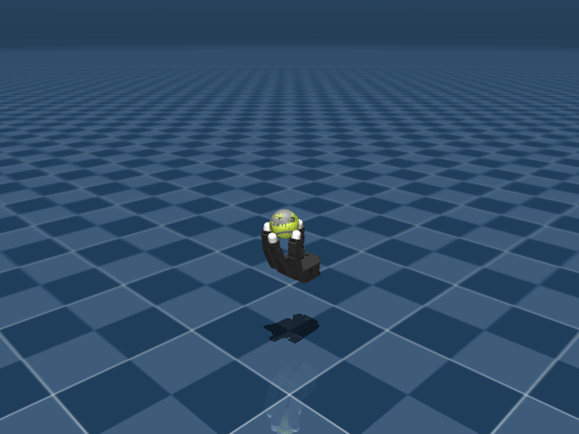

# Allegro In-Hand Grasp

## 任务目标

生成或训练 Allegro Hand 的抓取初始化姿态，为后续手内旋转提供稳定初态。



> 图片由 `_tools/render_static_images.py` 使用 `src/unilab/assets/robots/allegro_hand/scene.xml` 的 MuJoCo scene 离屏渲染生成；如果当前环境无法启用 EGL/OSMesa，生成 manifest 会记录失败原因。

## 证据索引

| 项目 | 内容 |
| --- | --- |
| 任务类别 | 灵巧操作 |
| 机器人 | allegro_hand |
| 代表 scene | src/unilab/assets/robots/allegro_hand/scene.xml |
| 代表源码 | src/unilab/envs/manipulation/allegro_inhand/grasp_gen.py |
| 代表 owner YAML | conf/ppo/task/allegro_inhand_grasp/mujoco.yaml |
| 动作维度 | 16 |

### Registry 与 Owner

| 注册名 | 后端 | 配置类 | 配置源码 |
| --- | --- | --- | --- |
| AllegroInhandRotationGrasp | motrix, mujoco | AllegroRotationGraspCfg | src/unilab/envs/manipulation/allegro_inhand/grasp_gen.py |

| 算法组 | 后端 | training.task_name | owner YAML |
| --- | --- | --- | --- |
| ppo | motrix | AllegroInhandRotationGrasp | conf/ppo/task/allegro_inhand_grasp/motrix.yaml |
| ppo | mujoco | AllegroInhandRotationGrasp | conf/ppo/task/allegro_inhand_grasp/mujoco.yaml |

## 代码级执行流

这部分不再用通用关键词套模板，而是为 `allegro_inhand_grasp` 单独写源码导读。源码片段只负责提供证据；每节说明都围绕本任务自己的配置、状态、观测、动作和 reward 语义展开。

| 阶段 | 证据位置 | 代码级说明 |
| --- | --- | --- |
| 1. Hydra owner | conf/ppo/task/allegro_inhand_grasp/mujoco.yaml | 训练命令先 compose owner YAML。这里确定 `training.task_name`、后端身份、obs_groups、reward scale 和 env override。 |
| 2. Registry 构造 Env | src/unilab/envs/manipulation/allegro_inhand/grasp_gen.py | `@registry.envcfg` 注册配置类，`@registry.env` 注册后端实现类；训练脚本只调用 registry，不直接 new 任务类。 |
| 3. Reset/初始状态 | src/unilab/assets/robots/allegro_hand/scene.xml | env 从 scene keyframe 或 motion/grasp cache 取初态，再通过 reset randomization 改写 qpos/qvel/info。 |
| 4. Obs dict | src/unilab/envs/manipulation/allegro_inhand/grasp_gen.py | env 读取 backend 传感器和 info，返回 dict；learner 根据 `obs_groups_spec` 和 owner `algo.obs_groups` 选择 actor/critic 输入。 |
| 5. Action 到控制目标 | src/unilab/envs/manipulation/allegro_inhand/grasp_gen.py | policy 输出先按 action scale / 控制顺序映射到 actuator，再由 backend step 推进仿真。 |
| 6. Reward dispatch | src/unilab/envs/manipulation/allegro_inhand/grasp_gen.py | 源码把 reward key 映射到函数，owner YAML 的 scale 决定每项奖励/惩罚是否启用以及权重。 |
| 7. Termination | src/unilab/envs/manipulation/allegro_inhand/grasp_gen.py | env 根据高度、姿态、接触、参考轨迹误差、物体状态或能量阈值生成 done/terminated。 |

### 本任务阅读重点

| 阅读重点 |
| --- |
| Allegro grasp generation 的目标是得到稳定抓取初态，而不是高速旋转。 |
| 它继承 rotation 基础设施，但 apply_action/update_state 有抓取生成专用行为。 |
| 文档要强调抓取稳定、球体保持和 cache/procedural reset，而不是照抄 rotation reward。 |

### 本任务注册入口

| 注册名 | 配置类 | 可用后端 |
| --- | --- | --- |
| AllegroInhandRotationGrasp | AllegroRotationGraspCfg | motrix, mujoco |

### 本任务源码锚点

| 小节 | 源码文件 | 明确锚点 |
| --- | --- | --- |
| 配置：Grasp cfg | src/unilab/envs/manipulation/allegro_inhand/grasp_gen.py | AllegroRotationGraspCfg, AllegroInhandRotationGrasp |
| Reset：抓取初态 | src/unilab/envs/manipulation/allegro_inhand/rotation.py | build_reset_plan, grasp |
| Obs：沿用手/球状态 | src/unilab/envs/manipulation/allegro_inhand/rotation.py | obs_groups_spec, _compute_obs |
| Action：抓取生成控制 | src/unilab/envs/manipulation/allegro_inhand/grasp_gen.py | apply_action, del actions |
| Reward/Termination | src/unilab/envs/manipulation/allegro_inhand/grasp_gen.py | update_state, grasp |

## 关键源码逐段解释（按本任务手写）

### 配置：Grasp cfg

| 本任务人工导读 |
| --- |
| grasp cfg 覆盖 rotation 默认参数，用于抓取生成。 |
| 注册名单独存在，便于 owner YAML 选择 grasp 任务。 |

```python
# src/unilab/envs/manipulation/allegro_inhand/grasp_gen.py
# 抓取生成任务使用独立注册名，区别于普通 Allegro rotation。
@registry.envcfg("AllegroInhandRotationGrasp")
@dataclass
class AllegroRotationGraspCfg(AllegroRotationPPOCfg):
    # These are fallback defaults. Hydra task env overrides (e.g.
    # conf/ppo/task/allegro_inhand_grasp/mujoco.yaml and CLI env.*)
    # are applied at env construction and take precedence.
    # grasp episode 很短，只用于验证/采集稳定抓取初态。
    max_episode_seconds: float = 2.0
    reward_config: RewardConfigPPO = field(
        default_factory=lambda: RewardConfigPPO(
            scales={
                # 抓取采集不优化旋转速度，所有 rotation reward 默认关闭。
                "rotate": 0.0,
                "obj_linvel": 0.0,
                "pose_diff": 0.0,
                "torque": 0.0,
                "work": 0.0,
                "drop": 0.0,
            },
            # 保留角速度 clip/reset 高度阈值，供父类状态更新和终止逻辑使用。
            angvel_clip_min=-0.5,
            angvel_clip_max=0.5,
            reset_z_threshold=0.125,
        )
    )
    # gen_grasp=True 让 rotation reset 不强依赖已有 cache，而服务新 cache 生成。
    gen_grasp: bool = True
    # 抓取采集目标数量和自动保存开关。
    grasp_collection_target: int = 50_000
    grasp_auto_save: bool = True
    # 质量检查要求最少接触等条件，过滤不稳定抓取。
    grasp_quality_check: bool = True
    grasp_min_contacts: int = 2


```
### Reset：抓取初态

| 本任务人工导读 |
| --- |
| reset 复用/生成抓取状态。 |
| 核心是让球从稳定可控姿态开始，而不是追求旋转速度。 |

```python
# src/unilab/envs/manipulation/allegro_inhand/rotation.py
    def build_reset_plan(self, env: Any, env_ids: np.ndarray) -> ResetPlan:
        num_reset = len(env_ids)
        # grasp 任务复用 rotation reset provider，初态来自默认姿态或已采样状态。
        hand_qpos, ball_pos, ball_quat, qvel = self._sample_reset_state(env, num_reset)
        # qpos 顺序固定：16 维手指角 + 球位置 + 球四元数。
        qpos = np.concatenate([hand_qpos, ball_pos, ball_quat], axis=1, dtype=np.float64)
        # 初始化 prev_ctrl、球体上一帧 pose 和 obs history。
        info_updates = self._build_info_updates(env, hand_qpos, ball_pos, ball_quat)

        # reset 随机化仍走 common DR，不在 grasp_gen 里绕过 backend contract。
        return ResetPlan(
            env_ids=env_ids,
            qpos=qpos,
            qvel=qvel,
            info_updates=info_updates,
            randomization=build_common_reset_randomization(env, num_reset),
        )

```

```python
# src/unilab/envs/manipulation/allegro_inhand/rotation.py
def sample_cached_grasps(
    grasp_cache: np.ndarray, num_reset: int
) -> tuple[np.ndarray, np.ndarray, np.ndarray]:
    # 若使用已有 cache，则随机抽取若干稳定抓取样本作为初态。
    idx = np.random.randint(0, len(grasp_cache), size=num_reset)
    sampled = grasp_cache[idx]
    # cache 布局与 qpos 一致：手指 16 维、球位置 3 维、球姿态 4 维。
    return sampled[:, :16], sampled[:, 16:19], sampled[:, 19:23]


```
### Obs：沿用手/球状态

| 本任务人工导读 |
| --- |
| obs 仍包含手指和球体状态。 |
| 抓取任务更关注球是否保持在手内。 |

```python
# src/unilab/envs/manipulation/allegro_inhand/rotation.py
    @property
    def obs_groups_spec(self) -> dict[str, int]:
        # grasp_gen 沿用 rotation 的单 obs 组和 3 帧 lag history。
        return {"obs": self._NUM_OBS_PER_STEP * self._NUM_LAG_STEPS}

```

```python
# src/unilab/envs/manipulation/allegro_inhand/rotation.py
    def _compute_obs(
        self, info: dict[str, Any], dof_pos: np.ndarray, ball_pos: np.ndarray
    ) -> dict[str, np.ndarray]:
        dtype = get_global_dtype()
        # prev_ctrl 表示当前保持的手指目标角，抓取稳定性依赖它。
        targets = info["prev_ctrl"]
        # 手指角归一化后进入策略输入，便于不同关节范围统一尺度。
        dof_pos_norm = 2.0 * (dof_pos - self._dof_mid) / (self._dof_range + 1e-8)

        noise_cfg = self._cfg.noise_config
        if noise_cfg.level > 0.0:
            # 观测噪声模拟手指编码器误差，但不改变真实仿真状态。
            dof_pos_norm += (
                np.random.uniform(-1.0, 1.0, dof_pos_norm.shape).astype(dtype)
                * noise_cfg.level
                * noise_cfg.scale_joint_angle
            )

        # 抓取任务的单帧观测仍是手指角、控制目标和球位置。
        current_obs = np.concatenate(
            [dof_pos_norm, targets, ball_pos.astype(dtype)], axis=1, dtype=dtype
        )

        num_envs = dof_pos.shape[0]
        # lag history 让策略/质量判断看到短时间内球是否稳定留在手内。
        obs_lag_history = info.get(
            "obs_lag_history",
            np.zeros(
                (num_envs, self._NUM_LAG_STEPS, self._NUM_OBS_PER_STEP),
                dtype=dtype,
            ),
        )
        # 更新时间历史，最新帧写入最后一格。
        obs_lag_history[:, :-1] = obs_lag_history[:, 1:]
        obs_lag_history[:, -1] = current_obs
        info["obs_lag_history"] = obs_lag_history

        return {
            "obs": np.asarray(obs_lag_history.reshape(num_envs, -1), dtype=dtype),
        }


RewardConfig = RewardConfigPPO
Domain_Rand = DomainRandConfig
AllegroRotationCfg = AllegroRotationPPOCfg
AllegroRotationMj = AllegroRotationPPO
```
### Action：抓取生成控制

| 本任务人工导读 |
| --- |
| grasp_gen 中 action 逻辑不同于普通 PPO rotation。 |
| 需要看它如何处理/忽略策略动作以服务 cache 生成。 |

```python
# src/unilab/envs/manipulation/allegro_inhand/grasp_gen.py
    def apply_action(self, actions: np.ndarray, state: NpEnvState) -> np.ndarray:
        # 抓取 cache 生成不使用外部策略动作，因此显式丢弃输入 actions。
        del actions
        # 使用零动作调用父类，让手指目标保持 reset 时的抓取姿态。
        zero_actions = np.zeros((self._num_envs, self._NUM_HAND_DOF), dtype=self._np_dtype)
        return super().apply_action(zero_actions, state)

    @staticmethod
```
### Reward/Termination

| 本任务人工导读 |
| --- |
| update_state 在父类 rotation 后追加抓取生成判断。 |
| 终止关注球体丢失、抓取失败和 horizon。 |

```python
# src/unilab/envs/manipulation/allegro_inhand/grasp_gen.py
    def update_state(self, state: NpEnvState) -> NpEnvState:
        # 先执行 rotation 父类更新，拿到球位置、终止和基础 obs/info。
        next_state = super().update_state(state)
        # grasp generation 不以 reward 学习为主，奖励显式置零。
        reward = np.zeros((self._num_envs,), dtype=self._np_dtype)

        # 三个抓取质量条件通常覆盖距离、接触和姿态稳定性。
        cond1, cond2, cond3 = self._compute_grasp_conditions()
        if self._cfg.grasp_quality_check:
            grasp_valid = cond1 & cond2 & cond3
            # 父类掉落终止或任一抓取质量失败都会终止该 env。
            terminated = np.asarray(next_state.terminated | (~grasp_valid), dtype=bool)
        else:
            # 关闭质量检查时只继承父类 termination，用于调试采集流程。
            grasp_valid = np.ones((self._num_envs,), dtype=bool)
            terminated = np.asarray(next_state.terminated, dtype=bool)

        step_count = next_state.info.get("steps", np.zeros((self._num_envs,), dtype=np.uint32))
        should_log = self._enable_reward_log and (int(step_count[0]) % 4 == 0)
        if should_log:
            log = next_state.info.get("log", {})
            # 日志记录各条件通过率和当前 cache 大小，方便判断采集瓶颈。
            log["grasp/cond1"] = float(np.mean(cond1.astype(np.float32)))
            log["grasp/cond2"] = float(np.mean(cond2.astype(np.float32)))
            log["grasp/cond3"] = float(np.mean(cond3.astype(np.float32)))
            log["grasp/valid"] = float(np.mean(grasp_valid.astype(np.float32)))
            log["grasp/cache_size"] = float(self._total_saved_grasps())
            next_state.info["log"] = log

        return next_state.replace(reward=reward, terminated=terminated)

```

```python
# src/unilab/envs/manipulation/allegro_inhand/grasp_gen.py
"""Allegro grasp-generation task built on top of rotation env."""

from __future__ import annotations

# grasp_gen 只在 rotation env 之上覆盖 cfg、action 和 update_state 采集逻辑。
from dataclasses import dataclass, field
from pathlib import Path

import numpy as np

from unilab.base import registry
from unilab.base.np_env import NpEnvState

from .rotation import AllegroRotationPPO, AllegroRotationPPOCfg, RewardConfigPPO


```


## Agent

Agent 控制 16 个手指关节，使球体保持在可旋转抓持区域。

训练入口通过 owner YAML 决定注册 env、后端身份和算法参数；CLI 应使用 `--sim` 选择 backend owner，而不是单独 override `training.sim_backend`。

```yaml
# conf/ppo/task/allegro_inhand_grasp/mujoco.yaml
training:
  task_name: AllegroInhandRotationGrasp
  sim_backend: mujoco
  no_play: true
algo:
  obs_groups: {}
  num_envs: null
  max_iterations: 1000
```

## Env

Env 继承 Allegro rotation 基础设施，但使用 grasp generation 任务逻辑。

Env 必须遵守 `NpEnv` contract：`reset()` 返回 `(obs_dict, info_dict)`，`obs` 是 dict，`obs_groups_spec` 决定 learner 使用哪些观测组。

```python
# src/unilab/envs/manipulation/allegro_inhand/grasp_gen.py
from unilab.base.np_env import NpEnvState

from .rotation import AllegroRotationPPO, AllegroRotationPPOCfg, RewardConfigPPO


@registry.envcfg("AllegroInhandRotationGrasp")
@dataclass
class AllegroRotationGraspCfg(AllegroRotationPPOCfg):
    # These are fallback defaults. Hydra task env overrides (e.g.
    # conf/ppo/task/allegro_inhand_grasp/mujoco.yaml and CLI env.*)
    # are applied at env construction and take precedence.
```

## Obs

观测沿用手指状态、球状态和历史帧结构。

### Obs 字段级拆解

下面的表格把源码里的观测拼接逻辑拆成语义字段。维度如果依赖 history、terrain scan 或 motion body 数量，文档会写成“规模”而不是硬编码，避免和配置漂移。

| 观测字段 | 维度/规模 | 代码来源 | 中文说明 |
| --- | --- | --- | --- |
| hand dof pos | nu 维 | 手部关节角 | 表示每根手指当前弯曲/张开状态。 |
| target / prev ctrl | nu 维 | 上一帧控制目标 | 让策略知道当前 actuator 目标和动作历史。 |
| object pose | 3+4 维 | 物体位置与四元数 | 被操作物体在手中的位置和朝向。 |
| object velocity | 3 或 6 维 | 物体线速度/角速度 | 判断旋转速度和是否被甩出。 |
| contact / tactile | 任务相关 | contact sensors / tactile obs | 手指接触和触觉信息，帮助稳定抓持。 |
| obs history | lag steps × frame | `obs_lag_steps` | 把短时间内手-物体状态串起来，改善部分可观测问题。 |
| critic info | 任务相关 | `critic_info_dim` / priv_info | 训练 critic 使用的特权状态，例如物体误差、摩擦或 scale 信息。 |

owner YAML 中的 `algo.obs_groups` 说明算法从 env obs dict 中读取哪些组。没有写入 owner 的字段保持 env cfg 默认值，文档不臆造未配置项。

```yaml
# conf/ppo/task/allegro_inhand_grasp/mujoco.yaml
algo:
  obs_groups:
    {}

```

代码侧观测通常在 `_get_obs`、`_build_obs`、`obs_groups_spec` 或 base env 中组装：

```text
# 未在 src/unilab/envs/manipulation/allegro_inhand/grasp_gen.py 中找到片段：obs_groups_spec, _get_obs, build_obs, get_obs
```

源码锚点拆解：

| 源码符号 | 中文说明 |
| --- | --- |

## Action

动作空间与 Allegro rotation 一致。

### Action 逐维拆解

灵巧手任务的 action 逐维对应手指 actuator，物体自由关节不在 action 中，由接触动力学被动演化。

当前代表 scene 编译出的 action 维度为 `16`。下表来自 MuJoCo 编译模型的 actuator 顺序，也就是策略输出维度和执行器维度的对应关系。

| Action 维度 | 执行器 | 驱动关节 | 中文含义 | 控制/限制说明 |
| --- | --- | --- | --- | --- |
| 0 | ffa0 | ffj0 | 食指第 1 个弯曲/展开关节 | -0.47 ~ 0.47 |
| 1 | ffa1 | ffj1 | 食指第 2 个弯曲/展开关节 | -0.196 ~ 1.61 |
| 2 | ffa2 | ffj2 | 食指第 3 个弯曲/展开关节 | -0.174 ~ 1.709 |
| 3 | ffa3 | ffj3 | 食指第 4 个弯曲/展开关节 | -0.227 ~ 1.618 |
| 4 | mfa0 | mfj0 | 中指第 1 个弯曲/展开关节 | -0.47 ~ 0.47 |
| 5 | mfa1 | mfj1 | 中指第 2 个弯曲/展开关节 | -0.196 ~ 1.61 |
| 6 | mfa2 | mfj2 | 中指第 3 个弯曲/展开关节 | -0.174 ~ 1.709 |
| 7 | mfa3 | mfj3 | 中指第 4 个弯曲/展开关节 | -0.227 ~ 1.618 |
| 8 | rfa0 | rfj0 | 无名指第 1 个弯曲/展开关节 | -0.47 ~ 0.47 |
| 9 | rfa1 | rfj1 | 无名指第 2 个弯曲/展开关节 | -0.196 ~ 1.61 |
| 10 | rfa2 | rfj2 | 无名指第 3 个弯曲/展开关节 | -0.174 ~ 1.709 |
| 11 | rfa3 | rfj3 | 无名指第 4 个弯曲/展开关节 | -0.227 ~ 1.618 |
| 12 | tha0 | thj0 | 拇指第 1 个弯曲/展开关节 | 0.263 ~ 1.396 |
| 13 | tha1 | thj1 | 拇指第 2 个弯曲/展开关节 | -0.105 ~ 1.163 |
| 14 | tha2 | thj2 | 拇指第 3 个弯曲/展开关节 | -0.189 ~ 1.644 |
| 15 | tha3 | thj3 | 拇指第 4 个弯曲/展开关节 | -0.162 ~ 1.719 |

控制参数来自 owner YAML 的 `env.control_config`，缺省值由对应 env cfg/dataclass 提供。

| 配置字段 | 当前值 | 中文说明 |
| --- | --- | --- |

```yaml
# conf/ppo/task/allegro_inhand_grasp/mujoco.yaml
env:
  control_config:
    {}

```

动作到执行器的实际映射由 backend 的 actuator control range 和 env 的 `apply_action`/控制函数完成：

```python
# src/unilab/envs/manipulation/allegro_inhand/grasp_gen.py
    ) -> None:
        super().__init__(cfg, num_envs=num_envs, backend_type=backend_type)
        self._saved_grasping_states: list[np.ndarray] = []
        self._grasp_cache_saved = False
        self._grasp_target_reached_notified = False

    def apply_action(self, actions: np.ndarray, state: NpEnvState) -> np.ndarray:
        del actions
        zero_actions = np.zeros((self._num_envs, self._NUM_HAND_DOF), dtype=self._np_dtype)
        return super().apply_action(zero_actions, state)

    @staticmethod
    def _sensor_scalar(sensor_data: np.ndarray) -> np.ndarray:
```

源码锚点拆解：

| 源码符号 | 中文说明 |
| --- | --- |
| apply_action | 把策略输出缩放为执行器控制目标。 |

## Reward

reward 侧重抓持稳定、球体保持和动作/力矩约束。

### Reward 逐项拆解

reward scale 以 owner YAML 的 `reward.scales` 为真源；源码中的 `RewardConfig` 描述可用字段，训练脚本只做 Hydra 组装和注入。正数通常表示奖励，负数通常表示惩罚，0 表示该项在当前 owner 中关闭或仅保留接口。

| Reward key | Scale | 方向 | 中文含义 |
| --- | --- | --- | --- |
| rotate | 0.0 | 记录/关闭 | 手内旋转主奖励，鼓励物体沿目标轴旋转。 |
| obj_linvel | 0.0 | 记录/关闭 | 物体线速度惩罚，避免物体被甩飞或平移过大。 |
| pose_diff | 0.0 | 记录/关闭 | 手部姿态偏差惩罚，保持抓持构型稳定。 |
| torque | 0.0 | 记录/关闭 | 手部力矩惩罚，降低过大的执行器输出。 |
| work | 0.0 | 记录/关闭 | 机械功惩罚，约束力矩与运动共同造成的能耗。 |
| drop | 0.0 | 记录/关闭 | 仓库 owner YAML 中声明的奖励项；具体实现见本页源码片段和 env 的 reward dispatch。 |

```yaml
# conf/ppo/task/allegro_inhand_grasp/mujoco.yaml
reward:
  scales:
    rotate: 0.0
    obj_linvel: 0.0
    pose_diff: 0.0
    torque: 0.0
    work: 0.0
    drop: 0.0

```

源码中的 reward 入口：

```python
# src/unilab/envs/manipulation/allegro_inhand/grasp_gen.py

import numpy as np

from unilab.base import registry
from unilab.base.np_env import NpEnvState

from .rotation import AllegroRotationPPO, AllegroRotationPPOCfg, RewardConfigPPO


@registry.envcfg("AllegroInhandRotationGrasp")
@dataclass
class AllegroRotationGraspCfg(AllegroRotationPPOCfg):
    # These are fallback defaults. Hydra task env overrides (e.g.
```

源码锚点拆解：

| 源码符号 | 中文说明 |
| --- | --- |

## 初始状态

reset 用 grasp cache 或 procedural reset 构造初始抓取。

机器人默认姿态来自 scene/task fragment 中的 keyframe；任务 reset 在此基础上加入命令、motion reference、物体状态或随机化。

```xml
<!-- src/unilab/assets/robots/allegro_hand/scene.xml -->
      [19:23] ball quaternion: qw qx qy qz  (MuJoCo w-first convention)
    ctrl[0:16] = position targets for the 16 hand actuators
  -->
  <keyframe>
    <key name="home"
      qpos="0.082 1.244 0.265 0.298
            0.005 1.096 0.080 0.150
```

```python
# src/unilab/envs/manipulation/allegro_inhand/grasp_gen.py
                "torque": 0.0,
                "work": 0.0,
                "drop": 0.0,
            },
            angvel_clip_min=-0.5,
            angvel_clip_max=0.5,
            reset_z_threshold=0.125,
        )
    )
    gen_grasp: bool = True
    grasp_collection_target: int = 50_000
    grasp_auto_save: bool = True
    grasp_quality_check: bool = True
```

## 终止条件

终止关注球体丢失、高度阈值和超时。

终止条件通常由 env 源码中的 `_compute_termination(s)`、reward config 阈值和 `max_episode_seconds` 共同决定。

```yaml
# conf/ppo/task/allegro_inhand_grasp/mujoco.yaml
env:
  max_episode_seconds: 3.0

reward:
  {}

```

```python
# src/unilab/envs/manipulation/allegro_inhand/grasp_gen.py
            log["grasp_cache/saved"] = 1.0
            log["grasp_cache/num_states"] = float(all_states.shape[0])
            self.state.info["log"] = log

    def _collect_successful_grasps(self, env_ids: np.ndarray) -> None:
        if self.state is None or env_ids.size == 0:
            return

        success_mask = self.state.truncated[env_ids] & ~self.state.terminated[env_ids]
        if not np.any(success_mask):
            return

        success_env_ids = env_ids[np.flatnonzero(success_mask)]
        if self._cfg.grasp_quality_check:
            quality_mask = self._check_grasp_quality(success_env_ids)
            success_env_ids = success_env_ids[np.flatnonzero(quality_mask)]

```

## 域随机化

domain_rand 与 Allegro rotation 共享，具体开关由 owner YAML 控制。

域随机化只在 reset/interval 等冷路径触发，不在 step 热路径解析资产或探测 backend 私有能力。

### 域随机化字段拆解

| 配置字段 | 当前值 | 中文说明 |
| --- | --- | --- |
| ball_vel_noise | 0.0 | 观测噪声或传感器噪声缩放，用于提升鲁棒性。 |
| joint_noise | 0.25 | 观测噪声或传感器噪声缩放，用于提升鲁棒性。 |
| push_robots | False | 布尔开关。 |
| random_com | False | 布尔开关。 |
| randomize_base_mass | False | 域随机化开关。 |

```yaml
# conf/ppo/task/allegro_inhand_grasp/mujoco.yaml
env:
  domain_rand:
    randomize_base_mass: false
    random_com: false
    push_robots: false
    ball_vel_noise: 0.0
    joint_noise: 0.25

```

```text
# 未在 src/unilab/envs/manipulation/allegro_inhand/grasp_gen.py 中找到片段：DomainRand, DomainRandomization, build_reset_plan, domain_rand
```
