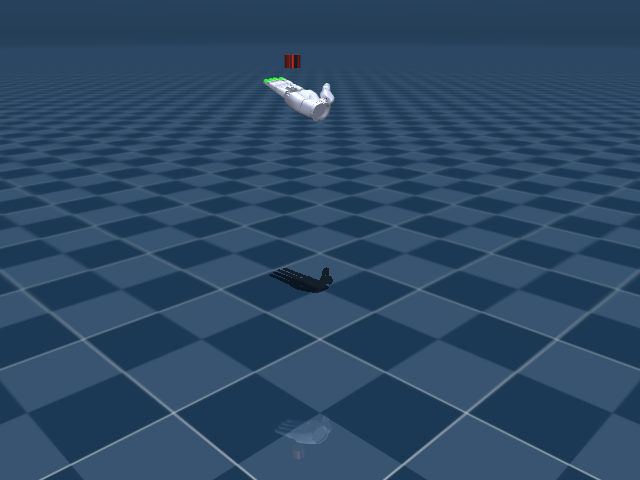

# Sharpa In-Hand Grasp

## 任务目标

为 Sharpa Wave 生成稳定抓取状态，使后续旋转任务能从可控接触构型开始。



> 图片由 `_tools/render_static_images.py` 使用 `src/unilab/assets/robots/sharpa_wave/scene.xml` 的 MuJoCo scene 离屏渲染生成；如果当前环境无法启用 EGL/OSMesa，生成 manifest 会记录失败原因。

## 证据索引

| 项目 | 内容 |
| --- | --- |
| 任务类别 | 灵巧操作 |
| 机器人 | sharpa_wave |
| 代表 scene | src/unilab/assets/robots/sharpa_wave/scene.xml |
| 代表源码 | src/unilab/envs/manipulation/sharpa_inhand/grasp_gen.py |
| 代表 owner YAML | conf/ppo/task/sharpa_inhand_grasp/mujoco.yaml |
| 动作维度 | 22 |

### Registry 与 Owner

| 注册名 | 后端 | 配置类 | 配置源码 |
| --- | --- | --- | --- |
| SharpaInhandRotationGrasp | motrix, mujoco | SharpaInhandGraspEnvCfg | src/unilab/envs/manipulation/sharpa_inhand/grasp_gen.py |

| 算法组 | 后端 | training.task_name | owner YAML |
| --- | --- | --- | --- |
| ppo | motrix | SharpaInhandRotationGrasp | conf/ppo/task/sharpa_inhand_grasp/motrix.yaml |
| ppo | mujoco | SharpaInhandRotationGrasp | conf/ppo/task/sharpa_inhand_grasp/mujoco.yaml |

## 代码级执行流

这部分不再用通用关键词套模板，而是为 `sharpa_inhand_grasp` 单独写源码导读。源码片段只负责提供证据；每节说明都围绕本任务自己的配置、状态、观测、动作和 reward 语义展开。

| 阶段 | 证据位置 | 代码级说明 |
| --- | --- | --- |
| 1. Hydra owner | conf/ppo/task/sharpa_inhand_grasp/mujoco.yaml | 训练命令先 compose owner YAML。这里确定 `training.task_name`、后端身份、obs_groups、reward scale 和 env override。 |
| 2. Registry 构造 Env | src/unilab/envs/manipulation/sharpa_inhand/grasp_gen.py | `@registry.envcfg` 注册配置类，`@registry.env` 注册后端实现类；训练脚本只调用 registry，不直接 new 任务类。 |
| 3. Reset/初始状态 | src/unilab/assets/robots/sharpa_wave/scene.xml | env 从 scene keyframe 或 motion/grasp cache 取初态，再通过 reset randomization 改写 qpos/qvel/info。 |
| 4. Obs dict | src/unilab/envs/manipulation/sharpa_inhand/grasp_gen.py | env 读取 backend 传感器和 info，返回 dict；learner 根据 `obs_groups_spec` 和 owner `algo.obs_groups` 选择 actor/critic 输入。 |
| 5. Action 到控制目标 | src/unilab/envs/manipulation/sharpa_inhand/grasp_gen.py | policy 输出先按 action scale / 控制顺序映射到 actuator，再由 backend step 推进仿真。 |
| 6. Reward dispatch | src/unilab/envs/manipulation/sharpa_inhand/grasp_gen.py | 源码把 reward key 映射到函数，owner YAML 的 scale 决定每项奖励/惩罚是否启用以及权重。 |
| 7. Termination | src/unilab/envs/manipulation/sharpa_inhand/grasp_gen.py | env 根据高度、姿态、接触、参考轨迹误差、物体状态或能量阈值生成 done/terminated。 |

### 本任务阅读重点

| 阅读重点 |
| --- |
| Sharpa grasp generation 的目标是收集/保持稳定抓取状态，为 rotation 提供可用初态。 |
| 它有自己的 grasp DR provider 和 apply_action/update_state 覆盖，不能只沿用 rotation 文案。 |
| 文档应强调 cache 收集、物体保持和接触稳定，而不是旋转速度。 |

### 本任务注册入口

| 注册名 | 配置类 | 可用后端 |
| --- | --- | --- |
| SharpaInhandRotationGrasp | SharpaInhandGraspEnvCfg | motrix, mujoco |

### 本任务源码锚点

| 小节 | 源码文件 | 明确锚点 |
| --- | --- | --- |
| 配置：Sharpa grasp | src/unilab/envs/manipulation/sharpa_inhand/grasp_gen.py | SharpaInhandGraspEnvCfg, SharpaInhandRotationGraspCfg |
| Reset：grasp cache | src/unilab/envs/manipulation/sharpa_inhand/grasp_gen.py | build_reset_plan, SharpaInhandGraspDRProvider |
| Obs：抓取质量输入 | src/unilab/envs/manipulation/sharpa_inhand/rotation.py | obs_groups_spec, _compute_obs_from_inputs |
| Action：抓取生成动作 | src/unilab/envs/manipulation/sharpa_inhand/grasp_gen.py | apply_action, Grasp-cache |
| Reward/Termination | src/unilab/envs/manipulation/sharpa_inhand/grasp_gen.py | update_state, success |

## 关键源码逐段解释（按本任务手写）

### 配置：Sharpa grasp

| 本任务人工导读 |
| --- |
| grasp cfg 缩短 episode 并调整抓取生成参数。 |
| 注册名 SharpaInhandRotationGrasp 指向抓取任务。 |

```python
# src/unilab/envs/manipulation/sharpa_inhand/grasp_gen.py
# Sharpa 抓取生成任务用独立注册名选择。
@registry.envcfg("SharpaInhandRotationGrasp")
@dataclass
class SharpaInhandGraspEnvCfg(SharpaInhandRotationGraspCfg):
    # 注册类本身不改字段，具体抓取参数来自父类 SharpaInhandRotationGraspCfg。
    pass


```

```python
# src/unilab/envs/manipulation/sharpa_inhand/grasp_gen.py
@dataclass
class SharpaInhandRotationGraspCfg(SharpaInhandRotationCfg):
    # 抓取采集 episode 较短，主要验证初态是否能稳定保持。
    max_episode_seconds: float = 3.0  # 12.0

    # 物体高度终止窗口很窄，用于过滤掉落或抬离手心的抓取。
    reset_height_lower: float = 0.61406
    reset_height_upper: float = 0.62406
    # 物体姿态偏差超过该角度时认为抓取不稳定。
    reset_angle_diff: float = 30.0 / 180.0 * np.pi

    # grasp 生成从默认姿态随机扰动采集，因此不要求已有 cache。
    grasp_cache_path: str = ""
    # 使用抓取任务专用 DR，避免 rotation 训练的 scale cache 依赖。
    domain_rand: SharpaDomainRandConfig = field(default_factory=_default_sharpa_grasp_domain_rand)

    reward_config: RewardConfig = field(
        default_factory=lambda: RewardConfig(
            scales={
                # 抓取采集不优化旋转/能耗 reward，成功与否由质量条件和 termination 决定。
                "rotate": 0.0,
                "obj_linvel": 0.0,
                "pose_diff": 0.0,
                "torque": 0.0,
                "work": 0.0,
                "object_pos": 0.0,
            }
        )
    )

    # 成功抓取 cache 的目标样本数和自动保存开关。
    grasp_collection_target: int = 50_000
    grasp_auto_save: bool = True


```
### Reset：grasp cache

| 本任务人工导读 |
| --- |
| reset provider 会保留原抓取任务行为并收集成功 pre-reset 状态。 |
| 这和 rotation 的普通随机初态不同。 |

```python
# src/unilab/envs/manipulation/sharpa_inhand/grasp_gen.py
    def build_reset_plan(self, env: Any, env_ids: np.ndarray) -> ResetPlan:
        # Keep original grasp task behavior: collect successful pre-reset states on each reset.
        # reset 前先收集刚结束 episode 中满足成功条件的手/物体状态。
        env._collect_successful_grasps(env_ids)

        num_reset = len(env_ids)
        if num_reset == 0:
            # 没有 env 需要 reset 时返回空计划，保持 DR contract。
            return ResetPlan(
                env_ids=env_ids,
                qpos=np.zeros((0, env.nq), dtype=np.float64),
                qvel=np.zeros((0, env.nv), dtype=np.float64),
                info_updates={},
                randomization=None,
            )

        # 围绕抓取默认手型随机扰动 22 个手部关节，生成候选初态。
        rand = 2.0 * np.random.rand(num_reset, env._num_action) - 1.0
        hand_qpos = np.broadcast_to(env._grasp_default_angles, (num_reset, env._num_action)).copy()
        hand_qpos += 0.15 * rand
        # 候选手型裁剪到 actuator 合法控制范围。
        hand_qpos = np.clip(hand_qpos, env._ctrl_lower, env._ctrl_upper)

        # 物体位置/姿态使用 scene keyframe 的初始 free-joint pose。
        object_pos = np.broadcast_to(env._init_qpos[env._obj_pos_slice], (num_reset, 3)).copy()
        object_quat = np.broadcast_to(env._init_qpos[env._obj_quat_slice], (num_reset, 4)).copy()

        # qpos 分别写入手部关节、物体位置和物体四元数 slice。
        qpos = np.zeros((num_reset, env.nq), dtype=np.float64)
        qpos[:, : env._num_action] = hand_qpos
        qpos[:, env._obj_pos_slice] = object_pos
        qpos[:, env._obj_quat_slice] = object_quat

        qvel = np.zeros((num_reset, env.nv), dtype=np.float64)
        # 抓取任务仍可随机化 PD 增益，并写入 info/ResetPlan。
        p_gain, d_gain = self._sample_reset_pd_gains(env, num_reset, dtype=env._np_dtype)

        # 初始化 obs history、critic info、终止高度窗口和默认物体姿态。
        info_updates = self._build_info_updates(
            env,
            env_ids=env_ids,
            hand_qpos=hand_qpos,
            object_pos=object_pos,
            object_quat=object_quat,
            reset_height_lower=np.full((num_reset,), env.cfg.reset_height_lower, dtype=np.float64),
            reset_height_upper=np.full((num_reset,), env.cfg.reset_height_upper, dtype=np.float64),
            rot_axis=np.broadcast_to(env._rot_axis, (num_reset, 3)).astype(np.float64),
            p_gain=p_gain,
            d_gain=d_gain,
            friction_scale=None,
            randomized_mass=None,
            randomized_com_offset=None,
            gravity=None,
        )
        # 触觉 history 清空，保证新候选抓取从无旧接触状态开始。
        env._clear_tactile_history(env_ids)

        # 这里使用 common reset randomization，不加载 rotation 的 scale grasp cache。
        return ResetPlan(
            env_ids=env_ids,
            qpos=qpos,
            qvel=qvel,
            info_updates=info_updates,
            randomization=build_common_reset_randomization(env, num_reset),
        )


```

```python
# src/unilab/envs/manipulation/sharpa_inhand/grasp_gen.py
class SharpaInhandGraspDRProvider(SharpaInhandRotationDRProvider):
    def build_reset_plan(self, env: Any, env_ids: np.ndarray) -> ResetPlan:
        # Keep original grasp task behavior: collect successful pre-reset states on each reset.
        # DR provider 覆盖 reset：每次 reset 前先把成功抓取写入 cache。
        env._collect_successful_grasps(env_ids)

        num_reset = len(env_ids)
        if num_reset == 0:
            # 空 reset 分支返回形状正确的空 qpos/qvel。
            return ResetPlan(
                env_ids=env_ids,
                qpos=np.zeros((0, env.nq), dtype=np.float64),
                qvel=np.zeros((0, env.nv), dtype=np.float64),
                info_updates={},
                randomization=None,
            )

        # 从抓取默认角加随机扰动生成候选手型。
        rand = 2.0 * np.random.rand(num_reset, env._num_action) - 1.0
        hand_qpos = np.broadcast_to(env._grasp_default_angles, (num_reset, env._num_action)).copy()
        hand_qpos += 0.15 * rand
        hand_qpos = np.clip(hand_qpos, env._ctrl_lower, env._ctrl_upper)

        # 物体初态固定在 scene keyframe 的位置/姿态，便于比较抓取稳定性。
        object_pos = np.broadcast_to(env._init_qpos[env._obj_pos_slice], (num_reset, 3)).copy()
        object_quat = np.broadcast_to(env._init_qpos[env._obj_quat_slice], (num_reset, 4)).copy()

        qpos = np.zeros((num_reset, env.nq), dtype=np.float64)
        qpos[:, : env._num_action] = hand_qpos
        qpos[:, env._obj_pos_slice] = object_pos
        qpos[:, env._obj_quat_slice] = object_quat

        qvel = np.zeros((num_reset, env.nv), dtype=np.float64)
        # 采样 reset-time PD 增益，后续虚拟 torque reward/诊断读取同一组增益。
        p_gain, d_gain = self._sample_reset_pd_gains(env, num_reset, dtype=env._np_dtype)

        # info 中记录目标、history、reset 高度窗口和物体默认 pose。
        info_updates = self._build_info_updates(
            env,
            env_ids=env_ids,
            hand_qpos=hand_qpos,
            object_pos=object_pos,
            object_quat=object_quat,
            reset_height_lower=np.full((num_reset,), env.cfg.reset_height_lower, dtype=np.float64),
            reset_height_upper=np.full((num_reset,), env.cfg.reset_height_upper, dtype=np.float64),
            rot_axis=np.broadcast_to(env._rot_axis, (num_reset, 3)).astype(np.float64),
            p_gain=p_gain,
            d_gain=d_gain,
            friction_scale=None,
            randomized_mass=None,
            randomized_com_offset=None,
            gravity=None,
        )
        env._clear_tactile_history(env_ids)

        # 返回候选抓取初态；成功与否由 update_state 的质量条件判断。
        return ResetPlan(
            env_ids=env_ids,
            qpos=qpos,
            qvel=qvel,
            info_updates=info_updates,
            randomization=build_common_reset_randomization(env, num_reset),
        )


```
### Obs：抓取质量输入

| 本任务人工导读 |
| --- |
| obs 沿用 Sharpa 手/物体/history 结构。 |
| 抓取任务更关注物体是否在稳定接触区域。 |

```python
# src/unilab/envs/manipulation/sharpa_inhand/rotation.py
    @property
    def obs_groups_spec(self) -> dict[str, int]:
        # 抓取任务沿用 Sharpa rotation 的 obs/history 结构。
        policy_obs_dim = self._cfg.obs_lag_steps * self._policy_frame_dim()
        if self._observation_mode == "flattened":
            # flattened 模式把 critic 信息并入 obs 单组。
            return {"obs": policy_obs_dim + self._cfg.critic_info_dim}
        # separated 模式保留 actor obs 和 critic 特权组。
        return {"obs": policy_obs_dim, "critic": policy_obs_dim + self._cfg.critic_info_dim}

```

```python
# src/unilab/envs/manipulation/sharpa_inhand/rotation.py
    def _compute_obs_from_inputs(
        self,
        info: dict[str, Any],
        dof_pos: np.ndarray,
        object_pos: np.ndarray,
        tactile: np.ndarray,
        contact_pos: np.ndarray,
    ) -> dict[str, np.ndarray]:
        # prev_targets 是抓取时保持的手部 position target。
        targets = np.asarray(info.get("prev_targets", dof_pos), dtype=self._np_dtype)
        # policy frame 包含手部关节、目标、触觉和接触位置。
        frame = self._build_policy_frame(
            dof_pos=dof_pos,
            targets=targets,
            tactile=tactile,
            contact_pos=contact_pos,
        )
        batch_size = int(frame.shape[0])

        history = info.get("obs_lag_history")
        if history is None:
            # reset 首帧用同一 frame 填满 history。
            history = repeat_obs_history(frame, self._cfg.obs_history_len).astype(self._np_dtype)
        else:
            history = np.asarray(history, dtype=self._np_dtype)
            # 常规 step 左移历史并写入最新触觉/接触状态。
            history[:, :-1] = history[:, 1:]
            history[:, -1] = frame

        info["obs_lag_history"] = history
        # proprio_hist 供部署/critic 相关组件复用更长历史。
        info["proprio_hist"] = self._update_proprio_history(history)

        # actor 读取最近 obs_lag_steps 帧的展平结果。
        obs = np.asarray(
            history[:, -self._cfg.obs_lag_steps :].reshape(batch_size, -1),
            dtype=self._np_dtype,
        )
        # critic_info 保留物体位置和 reset 随机化相关特权信息。
        critic_info = self._build_critic_info(info, batch_size=batch_size, object_pos=object_pos)
        return self._pack_observations(obs, critic_info)

```
### Action：抓取生成动作

| 本任务人工导读 |
| --- |
| grasp_gen 覆盖 apply_action，不使用普通策略随机动作收集 cache。 |
| 这是生成稳定抓取初态的关键差异。 |

```python
# src/unilab/envs/manipulation/sharpa_inhand/grasp_gen.py
    def apply_action(self, actions: np.ndarray, state: NpEnvState) -> np.ndarray:
        # Grasp-cache collection should not use policy/random actions.
        # Keep controls fixed at reset targets by forcing zero action input.
        # 抓取 cache 采集阶段不让策略扰动手型，只验证 reset 候选是否稳定。
        zero_actions = np.zeros_like(actions, dtype=self._np_dtype)
        return super().apply_action(zero_actions, state)

```
### Reward/Termination

| 本任务人工导读 |
| --- |
| update_state 在父类基础上追加成功抓取记录/终止逻辑。 |
| termination 关注物体掉落、接触失败和 horizon。 |

```python
# src/unilab/envs/manipulation/sharpa_inhand/grasp_gen.py
    def update_state(self, state: NpEnvState) -> NpEnvState:
        # 先执行 rotation 父类更新，得到基础 obs/reward/termination 和物体状态记录。
        next_state = super().update_state(state)

        # 抓取质量判断需要 fingertip、物体位置和物体姿态。
        fingertip_pos = self.get_fingertip_pos()
        object_pos = self.get_object_pos()
        object_quat = self.get_object_quat()
        # reset 时记录的物体默认 pose 用于计算姿态偏差。
        object_default_pose = np.asarray(
            next_state.info.get(
                "object_default_pose", np.zeros((self._num_envs, 7), dtype=self._np_dtype)
            ),
            dtype=self._np_dtype,
        )

        # 条件 1：所有指尖都靠近物体，说明手指包围住目标。
        cond1 = np.all(
            np.linalg.norm(fingertip_pos - object_pos[:, None, :], axis=-1) < 0.1, axis=1
        )
        tactile = np.asarray(self.last_contacts, dtype=self._np_dtype)
        # 条件 2：至少 3 个触觉通道有接触，避免单点碰撞被当成成功抓取。
        cond2 = np.sum(tactile > 0.5, axis=1) >= 3
        # 条件 3：物体姿态与 reset 姿态偏差不超过阈值。
        quat_error = np_quat_error_magnitude(object_default_pose[:, 3:7], object_quat)
        cond3 = quat_error < self._cfg.reset_angle_diff

        # 任一条件失败或父类已终止，都结束该候选抓取。
        grasp_valid = cond1 & cond2 & cond3
        terminated = np.asarray(next_state.terminated | (~grasp_valid), dtype=bool)

        # 抓取生成任务不通过 reward 学习，成功样本通过 reset 前收集写入 cache。
        reward = np.zeros((self._num_envs,), dtype=self._np_dtype)

        step_count = next_state.info.get("steps", np.zeros((self._num_envs,), dtype=np.uint32))
        should_log = self._enable_reward_log and (int(step_count[0]) % 4 == 0)
        if should_log:
            log = next_state.info.get("log", {})
            # 日志记录每个条件通过率和分 scale cache 数量，方便判断采集覆盖度。
            log["grasp/cond1"] = float(np.mean(cond1.astype(np.float32)))
            log["grasp/cond2"] = float(np.mean(cond2.astype(np.float32)))
            log["grasp/cond3"] = float(np.mean(cond3.astype(np.float32)))
            log["grasp/valid"] = float(np.mean(grasp_valid.astype(np.float32)))
            per_scale_counts = self._get_per_scale_grasp_counts()
            log["grasp/target_cache_size"] = float(self._cfg.grasp_collection_target)
            for scale_idx, count in enumerate(per_scale_counts):
                scale_value = float(self.scale_values[scale_idx])
                log[f"grasp/cache_size_scale_{scale_value:g}"] = float(count)
            next_state.info["log"] = log

        return next_state.replace(reward=reward, terminated=terminated)


SharpaWaveGraspCfg = SharpaInhandGraspEnvCfg
```


## Agent

Agent 输出 22 维手部关节目标，优化稳定接触而非高速旋转。

训练入口通过 owner YAML 决定注册 env、后端身份和算法参数；CLI 应使用 `--sim` 选择 backend owner，而不是单独 override `training.sim_backend`。

```yaml
# conf/ppo/task/sharpa_inhand_grasp/mujoco.yaml
training:
  task_name: SharpaInhandRotationGrasp
  sim_backend: mujoco
  render_spacing: 0.5
  cam_distance: 1.5
  cam_lookat:
  - 0.75
  - 0.75
  - 0.4
  cam_elevation: -20.0
algo:
  obs_groups: {}
  num_envs: 2048
  max_iterations: 2290
```

## Env

Env 使用 Sharpa grasp generation 逻辑，复用 Sharpa base 与 scene。

Env 必须遵守 `NpEnv` contract：`reset()` 返回 `(obs_dict, info_dict)`，`obs` 是 dict，`obs_groups_spec` 决定 learner 使用哪些观测组。

```python
# src/unilab/envs/manipulation/sharpa_inhand/grasp_gen.py

    grasp_collection_target: int = 50_000
    grasp_auto_save: bool = True


@registry.envcfg("SharpaInhandRotationGrasp")
@dataclass
class SharpaInhandGraspEnvCfg(SharpaInhandRotationGraspCfg):
    pass


```

## Obs

观测沿用 Sharpa 手部/物体状态，并强调抓取质量相关信息。

### Obs 字段级拆解

下面的表格把源码里的观测拼接逻辑拆成语义字段。维度如果依赖 history、terrain scan 或 motion body 数量，文档会写成“规模”而不是硬编码，避免和配置漂移。

| 观测字段 | 维度/规模 | 代码来源 | 中文说明 |
| --- | --- | --- | --- |
| hand dof pos | nu 维 | 手部关节角 | 表示每根手指当前弯曲/张开状态。 |
| target / prev ctrl | nu 维 | 上一帧控制目标 | 让策略知道当前 actuator 目标和动作历史。 |
| object pose | 3+4 维 | 物体位置与四元数 | 被操作物体在手中的位置和朝向。 |
| object velocity | 3 或 6 维 | 物体线速度/角速度 | 判断旋转速度和是否被甩出。 |
| contact / tactile | 任务相关 | contact sensors / tactile obs | 手指接触和触觉信息，帮助稳定抓持。 |
| obs history | lag steps × frame | `obs_lag_steps` | 把短时间内手-物体状态串起来，改善部分可观测问题。 |
| critic info | 任务相关 | `critic_info_dim` / priv_info | 训练 critic 使用的特权状态，例如物体误差、摩擦或 scale 信息。 |

owner YAML 中的 `algo.obs_groups` 说明算法从 env obs dict 中读取哪些组。没有写入 owner 的字段保持 env cfg 默认值，文档不臆造未配置项。

```yaml
# conf/ppo/task/sharpa_inhand_grasp/mujoco.yaml
algo:
  obs_groups:
    {}

```

代码侧观测通常在 `_get_obs`、`_build_obs`、`obs_groups_spec` 或 base env 中组装：

```text
# 未在 src/unilab/envs/manipulation/sharpa_inhand/grasp_gen.py 中找到片段：obs_groups_spec, _get_obs, build_obs, get_obs
```

源码锚点拆解：

| 源码符号 | 中文说明 |
| --- | --- |

## Action

动作空间与 Sharpa rotation 一致。

### Action 逐维拆解

灵巧手任务的 action 逐维对应手指 actuator，物体自由关节不在 action 中，由接触动力学被动演化。

当前代表 scene 编译出的 action 维度为 `22`。下表来自 MuJoCo 编译模型的 actuator 顺序，也就是策略输出维度和执行器维度的对应关系。

| Action 维度 | 执行器 | 驱动关节 | 中文含义 | 控制/限制说明 |
| --- | --- | --- | --- | --- |
| 0 | right_thumb_CMC_FE_ctrl | right_thumb_CMC_FE | 右拇指腕掌屈伸关节 | -0.1745 ~ 1.92 |
| 1 | right_thumb_CMC_AA_ctrl | right_thumb_CMC_AA | 右拇指腕掌外展/内收关节 | -0.3491 ~ 0.3491 |
| 2 | right_thumb_MCP_FE_ctrl | right_thumb_MCP_FE | 右拇指掌指屈伸关节 | -0.5236 ~ 1.396 |
| 3 | right_thumb_MCP_AA_ctrl | right_thumb_MCP_AA | 右拇指掌指外展/内收关节 | -0.3491 ~ 0.3491 |
| 4 | right_thumb_IP_ctrl | right_thumb_IP | 右拇指指间关节 | 0 ~ 1.745 |
| 5 | right_index_MCP_FE_ctrl | right_index_MCP_FE | 右食指掌指屈伸关节 | -0.1745 ~ 1.571 |
| 6 | right_index_MCP_AA_ctrl | right_index_MCP_AA | 右食指掌指外展/内收关节 | -0.3491 ~ 0.3491 |
| 7 | right_index_PIP_ctrl | right_index_PIP | 右食指近端指间关节 | 0 ~ 1.745 |
| 8 | right_index_DIP_ctrl | right_index_DIP | 右食指远端指间关节 | 0 ~ 1.396 |
| 9 | right_middle_MCP_FE_ctrl | right_middle_MCP_FE | 右中指掌指屈伸关节 | -0.1745 ~ 1.571 |
| 10 | right_middle_MCP_AA_ctrl | right_middle_MCP_AA | 右中指掌指外展/内收关节 | -0.3491 ~ 0.3491 |
| 11 | right_middle_PIP_ctrl | right_middle_PIP | 右中指近端指间关节 | 0 ~ 1.745 |
| 12 | right_middle_DIP_ctrl | right_middle_DIP | 右中指远端指间关节 | 0 ~ 1.396 |
| 13 | right_ring_MCP_FE_ctrl | right_ring_MCP_FE | 右无名指掌指屈伸关节 | -0.1745 ~ 1.571 |
| 14 | right_ring_MCP_AA_ctrl | right_ring_MCP_AA | 右无名指掌指外展/内收关节 | -0.3491 ~ 0.3491 |
| 15 | right_ring_PIP_ctrl | right_ring_PIP | 右无名指近端指间关节 | 0 ~ 1.745 |
| 16 | right_ring_DIP_ctrl | right_ring_DIP | 右无名指远端指间关节 | 0 ~ 1.396 |
| 17 | right_pinky_CMC_ctrl | right_pinky_CMC | 右小指腕掌关节 | 0 ~ 0.2618 |
| 18 | right_pinky_MCP_FE_ctrl | right_pinky_MCP_FE | 右小指掌指屈伸关节 | -0.1745 ~ 1.571 |
| 19 | right_pinky_MCP_AA_ctrl | right_pinky_MCP_AA | 右小指掌指外展/内收关节 | -0.3491 ~ 0.3491 |
| 20 | right_pinky_PIP_ctrl | right_pinky_PIP | 右小指近端指间关节 | 0 ~ 1.745 |
| 21 | right_pinky_DIP_ctrl | right_pinky_DIP | 右小指远端指间关节 | 0 ~ 1.396 |

控制参数来自 owner YAML 的 `env.control_config`，缺省值由对应 env cfg/dataclass 提供。

| 配置字段 | 当前值 | 中文说明 |
| --- | --- | --- |
| action_scale | 0.041666666666666664 | 策略输出到目标关节角的缩放系数。 |
| d_gain | 0.1 | 任务 owner YAML 中的配置字段。 |
| dof_limits_scale | 0.9 | 任务 owner YAML 中的配置字段。 |
| p_gain | 1.0 | 任务 owner YAML 中的配置字段。 |
| torque_control | False | 布尔开关。 |

```yaml
# conf/ppo/task/sharpa_inhand_grasp/mujoco.yaml
env:
  control_config:
    action_scale: 0.041666666666666664
    p_gain: 1.0
    d_gain: 0.1
    torque_control: false
    dof_limits_scale: 0.9

```

动作到执行器的实际映射由 backend 的 actuator control range 和 env 的 `apply_action`/控制函数完成：

```python
# src/unilab/envs/manipulation/sharpa_inhand/grasp_gen.py
        if np.any(np.bincount(self.scale_ids, minlength=self._num_scales) == 0):
            raise ValueError(
                "Sharpa grasp generation requires at least one environment for the configured scale; "
                f"got num_envs={num_envs}, num_scales={self._num_scales}"
            )

    def apply_action(self, actions: np.ndarray, state: NpEnvState) -> np.ndarray:
        # Grasp-cache collection should not use policy/random actions.
        # Keep controls fixed at reset targets by forcing zero action input.
        zero_actions = np.zeros_like(actions, dtype=self._np_dtype)
        return super().apply_action(zero_actions, state)

    def _total_saved_grasps(self) -> int:
```

源码锚点拆解：

| 源码符号 | 中文说明 |
| --- | --- |
| apply_action | 把策略输出缩放为执行器控制目标。 |

## Reward

reward 聚焦物体保持、接触稳定和动作平滑。

### Reward 逐项拆解

reward scale 以 owner YAML 的 `reward.scales` 为真源；源码中的 `RewardConfig` 描述可用字段，训练脚本只做 Hydra 组装和注入。正数通常表示奖励，负数通常表示惩罚，0 表示该项在当前 owner 中关闭或仅保留接口。

| Reward key | Scale | 方向 | 中文含义 |
| --- | --- | --- | --- |
| rotate | 0.0 | 记录/关闭 | 手内旋转主奖励，鼓励物体沿目标轴旋转。 |
| obj_linvel | 0.0 | 记录/关闭 | 物体线速度惩罚，避免物体被甩飞或平移过大。 |
| pose_diff | 0.0 | 记录/关闭 | 手部姿态偏差惩罚，保持抓持构型稳定。 |
| torque | 0.0 | 记录/关闭 | 手部力矩惩罚，降低过大的执行器输出。 |
| work | 0.0 | 记录/关闭 | 机械功惩罚，约束力矩与运动共同造成的能耗。 |
| object_pos | 0.0 | 记录/关闭 | 物体位置保持奖励/惩罚，防止被操作物体偏离手心。 |

```yaml
# conf/ppo/task/sharpa_inhand_grasp/mujoco.yaml
reward:
  scales:
    rotate: 0.0
    obj_linvel: 0.0
    pose_diff: 0.0
    torque: 0.0
    work: 0.0
    object_pos: 0.0
  angvel_clip_min: -0.5
  angvel_clip_max: 0.5

```

源码中的 reward 入口：

```python
# src/unilab/envs/manipulation/sharpa_inhand/grasp_gen.py
from unilab.envs.manipulation.sharpa_inhand.base import (
    SOURCE_DEFAULT_HAND_JOINT_POS_DEG,
    SharpaDomainRandConfig,
    resolve_grasp_cache_file,
)
from unilab.envs.manipulation.sharpa_inhand.rotation import (
    RewardConfig,
    SharpaInhandRotationCfg,
    SharpaInhandRotationDRProvider,
    SharpaInhandRotationEnv,
)


```

源码锚点拆解：

| 源码符号 | 中文说明 |
| --- | --- |
| _compute_reward | reward 相关源码锚点。 |

## 初始状态

reset 采样手指和物体初态，必要时写入/读取 grasp cache。

机器人默认姿态来自 scene/task fragment 中的 keyframe；任务 reset 在此基础上加入命令、motion reference、物体状态或随机化。

```xml
<!-- src/unilab/assets/robots/sharpa_wave/scene.xml -->
      [22:25] object position xyz
      [25:29] object quaternion wxyz
  -->
  <keyframe>
    <key
      name="home"
      qpos="0 0 0 0 0 0 0 0 0 0 0 0 0 0 0 0 0 0 0 0 0 0 -0.09559 -0.00517 0.61906 1 0 0 0"
```

```python
# src/unilab/envs/manipulation/sharpa_inhand/grasp_gen.py

import numpy as np

from unilab.base import registry
from unilab.base.np_env import NpEnvState
from unilab.dr import ResetPlan
from unilab.dr.dr_utils import build_common_reset_randomization
from unilab.envs.common.rotation import np_quat_error_magnitude
from unilab.envs.manipulation.sharpa_inhand.base import (
    SOURCE_DEFAULT_HAND_JOINT_POS_DEG,
    SharpaDomainRandConfig,
    resolve_grasp_cache_file,
)
```

## 终止条件

终止关注物体掉落、过大姿态误差和超时。

终止条件通常由 env 源码中的 `_compute_termination(s)`、reward config 阈值和 `max_episode_seconds` 共同决定。

```yaml
# conf/ppo/task/sharpa_inhand_grasp/mujoco.yaml
env:
  max_episode_seconds: 3.0

reward:
  {}

```

```python
# src/unilab/envs/manipulation/sharpa_inhand/grasp_gen.py
            self.state.info["log"] = log

        exit(0)

    def _collect_successful_grasps(self, env_ids: np.ndarray) -> None:
        if self.state is None or len(env_ids) == 0:
            return

        success_mask = self.state.truncated[env_ids] & ~self.state.terminated[env_ids]
        if not np.any(success_mask):
            return

        success_env_ids = env_ids[np.flatnonzero(success_mask)]
        hand_qpos = self.get_hand_dof_pos()[success_env_ids]
        object_pos = self.get_object_pos()[success_env_ids]
        object_quat = self.get_object_quat()[success_env_ids]
        all_states = np.concatenate([hand_qpos, object_pos, object_quat], axis=1).astype(np.float32)
```

## 域随机化

domain_rand 与 Sharpa rotation 共享。

域随机化只在 reset/interval 等冷路径触发，不在 step 热路径解析资产或探测 backend 私有能力。

### 域随机化字段拆解

| 配置字段 | 当前值 | 中文说明 |
| --- | --- | --- |
| contact_latency | 0.005 | 任务 owner YAML 中的配置字段。 |
| contact_sensor_noise | 0.01 | 观测噪声或传感器噪声缩放，用于提升鲁棒性。 |
| elastomer_base_friction | 0.8 | 任务 owner YAML 中的配置字段。 |
| force_decay | 0.9 | 任务 owner YAML 中的配置字段。 |
| force_decay_interval | 0.08 | 任务 owner YAML 中的配置字段。 |
| force_scale | 0.0 | 任务 owner YAML 中的配置字段。 |
| gravity_direction_magnitude | 9.81 | 任务 owner YAML 中的配置字段。 |
| gravity_range | [[0.0, 0.0, -9.81], [0.0, 0.0, -9.81]] | 随机采样范围或控制范围。 |
| joint_noise_scale | 0.02 | 观测噪声或传感器噪声缩放，用于提升鲁棒性。 |
| metal_base_friction | 0.1 | 任务 owner YAML 中的配置字段。 |
| object_base_friction | 0.5 | 任务 owner YAML 中的配置字段。 |
| random_force_prob_scalar | 0.0 | 任务 owner YAML 中的配置字段。 |
| randomize_com | False | 域随机化开关。 |
| randomize_com_lower | -0.01 | 域随机化开关。 |
| randomize_com_upper | 0.01 | 域随机化开关。 |
| randomize_d_gain_scale_lower | 0.5 | 观测噪声或传感器噪声缩放，用于提升鲁棒性。 |
| randomize_d_gain_scale_upper | 2.0 | 观测噪声或传感器噪声缩放，用于提升鲁棒性。 |
| randomize_friction | False | 域随机化开关。 |
| randomize_friction_scale_lower | 0.5 | 观测噪声或传感器噪声缩放，用于提升鲁棒性。 |
| randomize_friction_scale_upper | 2.0 | 观测噪声或传感器噪声缩放，用于提升鲁棒性。 |
| randomize_gravity | False | 域随机化开关。 |
| randomize_gravity_direction | False | 域随机化开关。 |
| randomize_mass | True | 域随机化开关。 |
| randomize_mass_lower | 0.05 | 域随机化开关。 |
| randomize_mass_upper | 0.051 | 域随机化开关。 |
| randomize_p_gain_scale_lower | 0.5 | 观测噪声或传感器噪声缩放，用于提升鲁棒性。 |
| randomize_p_gain_scale_upper | 2.0 | 观测噪声或传感器噪声缩放，用于提升鲁棒性。 |
| randomize_pd_gains | False | 域随机化开关。 |
| scale_list | [0.8] | 观测噪声或传感器噪声缩放，用于提升鲁棒性。 |

```yaml
# conf/ppo/task/sharpa_inhand_grasp/mujoco.yaml
env:
  domain_rand:
    scale_list:
    - 0.8
    randomize_gravity: false
    gravity_range:
    - - 0.0
      - 0.0
      - -9.81
    - - 0.0
      - 0.0
      - -9.81
    randomize_gravity_direction: false
    gravity_direction_magnitude: 9.81
    randomize_pd_gains: false
    randomize_p_gain_scale_lower: 0.5
    randomize_p_gain_scale_upper: 2.0
    randomize_d_gain_scale_lower: 0.5
    randomize_d_gain_scale_upper: 2.0
    randomize_friction: false
    randomize_friction_scale_lower: 0.5
    randomize_friction_scale_upper: 2.0
    elastomer_base_friction: 0.8
    metal_base_friction: 0.1
    object_base_friction: 0.5
    randomize_com: false
    randomize_com_lower: -0.01
    randomize_com_upper: 0.01
    randomize_mass: true
    randomize_mass_lower: 0.05
    randomize_mass_upper: 0.051
    force_scale: 0.0
    random_force_prob_scalar: 0.0
    force_decay: 0.9
    force_decay_interval: 0.08
    joint_noise_scale: 0.02
    contact_latency: 0.005
    contact_sensor_noise: 0.01

```

```python
# src/unilab/envs/manipulation/sharpa_inhand/grasp_gen.py
from unilab.base.np_env import NpEnvState
from unilab.dr import ResetPlan
from unilab.dr.dr_utils import build_common_reset_randomization
from unilab.envs.common.rotation import np_quat_error_magnitude
from unilab.envs.manipulation.sharpa_inhand.base import (
    SOURCE_DEFAULT_HAND_JOINT_POS_DEG,
    SharpaDomainRandConfig,
    resolve_grasp_cache_file,
)
from unilab.envs.manipulation.sharpa_inhand.rotation import (
    RewardConfig,
    SharpaInhandRotationCfg,
    SharpaInhandRotationDRProvider,
```
