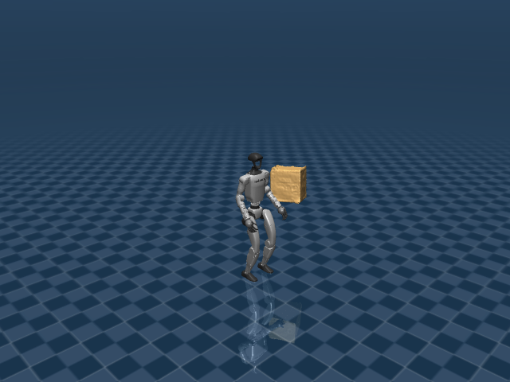

# G1 Box Tracking

## 任务目标

训练 G1 在全身 motion tracking 中同时处理大箱体物体状态，使人体动作和物体轨迹共同满足参考。



> 图片由 `_tools/render_static_images.py` 使用 `src/unilab/assets/robots/g1/scene_flat_with_largebox.xml` 的 MuJoCo scene 离屏渲染生成；如果当前环境无法启用 EGL/OSMesa，生成 manifest 会记录失败原因。

## 证据索引

| 项目 | 内容 |
| --- | --- |
| 任务类别 | 动作追踪 |
| 机器人 | g1 |
| 代表 scene | src/unilab/assets/robots/g1/scene_flat_with_largebox.xml |
| 代表源码 | src/unilab/envs/motion_tracking/g1/box_tracking.py |
| 代表 owner YAML | conf/ppo/task/g1_box_tracking/mujoco.yaml |
| 动作维度 | 29 |

### Registry 与 Owner

| 注册名 | 后端 | 配置类 | 配置源码 |
| --- | --- | --- | --- |
| G1BoxTracking | motrix, mujoco | G1BoxTrackingEnvCfg | src/unilab/envs/motion_tracking/g1/box_tracking.py |

| 算法组 | 后端 | training.task_name | owner YAML |
| --- | --- | --- | --- |
| ppo | motrix | G1BoxTracking | conf/ppo/task/g1_box_tracking/motrix.yaml |
| ppo | mujoco | G1BoxTracking | conf/ppo/task/g1_box_tracking/mujoco.yaml |

## 代码级执行流

这部分不再用通用关键词套模板，而是为 `g1_box_tracking` 单独写源码导读。源码片段只负责提供证据；每节说明都围绕本任务自己的配置、状态、观测、动作和 reward 语义展开。

| 阶段 | 证据位置 | 代码级说明 |
| --- | --- | --- |
| 1. Hydra owner | conf/ppo/task/g1_box_tracking/mujoco.yaml | 训练命令先 compose owner YAML。这里确定 `training.task_name`、后端身份、obs_groups、reward scale 和 env override。 |
| 2. Registry 构造 Env | src/unilab/envs/motion_tracking/g1/box_tracking.py | `@registry.envcfg` 注册配置类，`@registry.env` 注册后端实现类；训练脚本只调用 registry，不直接 new 任务类。 |
| 3. Reset/初始状态 | src/unilab/assets/robots/g1/scene_flat_with_largebox.xml | env 从 scene keyframe 或 motion/grasp cache 取初态，再通过 reset randomization 改写 qpos/qvel/info。 |
| 4. Obs dict | src/unilab/envs/motion_tracking/g1/box_tracking.py | env 读取 backend 传感器和 info，返回 dict；learner 根据 `obs_groups_spec` 和 owner `algo.obs_groups` 选择 actor/critic 输入。 |
| 5. Action 到控制目标 | src/unilab/envs/motion_tracking/g1/box_tracking.py | policy 输出先按 action scale / 控制顺序映射到 actuator，再由 backend step 推进仿真。 |
| 6. Reward dispatch | src/unilab/envs/motion_tracking/g1/box_tracking.py | 源码把 reward key 映射到函数，owner YAML 的 scale 决定每项奖励/惩罚是否启用以及权重。 |
| 7. Termination | src/unilab/envs/motion_tracking/g1/box_tracking.py | env 根据高度、姿态、接触、参考轨迹误差、物体状态或能量阈值生成 done/terminated。 |

### 本任务阅读重点

| 阅读重点 |
| --- |
| Box tracking 在 G1 motion tracking 外加入 largebox 物体状态，物体不是 action 控制对象。 |
| obs/reward/termination 都要看 box 扩展：object pos/ori/velocity 如何进入学习目标。 |
| reset 需要同时初始化机器人 reference 和 box reference，这是和普通 tracking 最大的不同。 |

### 本任务注册入口

| 注册名 | 配置类 | 可用后端 |
| --- | --- | --- |
| G1BoxTracking | G1BoxTrackingEnvCfg | motrix, mujoco |

### 本任务源码锚点

| 小节 | 源码文件 | 明确锚点 |
| --- | --- | --- |
| 配置：large box | src/unilab/envs/motion_tracking/g1/box_tracking.py | G1BoxTrackingEnvCfg, G1BoxTrackingCfg |
| Reset：机器人 + 箱体 | src/unilab/envs/motion_tracking/g1/box_tracking.py | build_reset_plan, BoxMotionLoader |
| Obs：加入物体状态 | src/unilab/envs/motion_tracking/g1/box_tracking.py | obs_groups_spec, _compute_obs |
| Action：只控 G1 | src/unilab/envs/motion_tracking/g1/tracking.py | apply_action, simulate_action_latency |
| Reward/Termination：物体误差 | src/unilab/envs/motion_tracking/g1/box_tracking.py | _init_reward_functions, _reward_object |

## 关键源码逐段解释（按本任务手写）

### 配置：large box

这一段不是普通 G1 motion tracking 的配置改名。它明确把 scene 切到带 `largebox` 的任务场景，并把 motion loader 切到包含物体轨迹的 box motion 文件。`G1BoxTrackingEnvCfg` 自身没有新增字段，`pass` 的含义是“注册用配置类只继承任务配置”，不是运行逻辑。

```python
# src/unilab/envs/motion_tracking/g1/box_tracking.py
@dataclass
# dataclass 让 Hydra/registry 能把这些字段当作结构化配置组合和覆盖。
class G1BoxTrackingCfg(G1MotionTrackingCfg):
    # 继承 G1MotionTrackingCfg，说明 box tracking 仍然复用 motion tracking 的 body/joint/root 跟踪主框架。
    """Configuration for the G1 large-box tracking task."""
    # 这句 docstring 只是说明配置用途：这是“带大箱体”的 G1 tracking 配置。

    scene: SceneCfg = field(
        # scene 字段覆盖父类默认场景，任务必须加载包含 largebox 的 XML。
        default_factory=lambda: SceneCfg(
            # default_factory 避免 dataclass 共享可变对象，同时延迟构造 SceneCfg。
            model_file=str(ASSETS_ROOT_PATH / "robots" / "g1" / "scene_flat_with_largebox.xml")
            # 这里选择 task-level scene；largebox 属于任务场景，不写进 G1 robot.xml。
        )
    )
    motion_file: str | list[str] = str(
        # motion_file 指向包含机器人轨迹和箱体轨迹的 npz，而不是普通 G1 motion clip。
        ASSETS_ROOT_PATH / "motions" / "g1" / "sub3_largebox_003_boxconverted.npz"
        # 后续 BoxMotionLoader 会从这个文件里读取 object_pos_w/object_quat_w 等物体参考状态。
    )
    object_body_name: str = "largebox"
    # backend 通过这个 body name 找到仿真里的箱体刚体，用于 obs/reward/termination。
    object_pos_threshold: float = 0.25
    # 箱体当前位置偏离参考位置超过该阈值时，任务认为物体跟踪失败。
    object_ori_threshold: float = 0.8
    # 箱体姿态误差超过该阈值时终止，避免机器人跟上了但箱体姿态已经失控。
    reward_config: BoxRewardConfig = field(default_factory=BoxRewardConfig)
    # 使用 BoxRewardConfig，给普通 motion tracking reward 追加物体位置/姿态跟踪权重。


@registry.envcfg("G1BoxTracking")
# 把配置类注册成 G1BoxTracking；owner YAML 的 training.task_name 会用这个名字找到它。
@dataclass
# 注册配置仍然是 dataclass，保持和其他 UniLab EnvCfg 一致。
class G1BoxTrackingEnvCfg(G1BoxTrackingCfg):
    # 这个类只作为 registry 暴露的最终配置入口，实际字段都来自 G1BoxTrackingCfg。
    """Registered config for G1 box tracking."""
    # docstring 说明它是注册入口，不代表额外业务逻辑。

    pass
    # 不新增字段：当前注册配置完全采用 G1BoxTrackingCfg 的 scene、motion_file、阈值和 reward_config。
```
### Reset：机器人 + 箱体

Reset 的关键不是“把机器人放回 stand”，而是从同一个 motion frame 同时恢复机器人和箱体。`BoxMotionData` 里保存了 robot body/joint 轨迹，也保存了 `object_pos_w`、`object_quat_w`、`object_lin_vel_w`、`object_ang_vel_w`。因此 reset 需要构造完整 qpos/qvel：前半部分写机器人，末尾 free joint 写箱体。

```python
# src/unilab/envs/motion_tracking/g1/box_tracking.py
def _build_box_motion_reference_state(
    # 这个 helper 专门负责把 BoxMotionData 转成 backend 可以 set_state 的 qpos/qvel。
    env: Any, env_ids: np.ndarray, motion_data: BoxMotionData
    # env 提供初始 qpos/qvel、joint range 和随机化配置；motion_data 提供参考帧。
) -> tuple[np.ndarray, np.ndarray]:
    # 返回值固定是 qpos/qvel，直接进入 ResetPlan 或 backend.set_state。
    dtype = get_global_dtype()
    # 统一使用 UniLab 全局 dtype，避免 reset 数组和 env 数值类型不一致。
    num_reset = len(env_ids)
    # 当前批次需要 reset 的并行环境数量。

    root_pos = motion_data.body_pos_w[:, 0].copy()
    # 取参考 motion 中 root body 的世界坐标位置，copy 后才能安全叠加随机扰动。
    root_ori = motion_data.body_quat_w[:, 0].copy()
    # 取参考 root 四元数，后面会乘上随机姿态扰动。
    joint_pos = motion_data.joint_pos.copy()
    # 取参考关节角；这里只是机器人关节，不包含箱体 free joint。
    joint_vel = motion_data.joint_vel.copy()
    # 取参考关节速度，写入 qvel 的机器人关节段。

    qpos = np.tile(env._init_qpos, (num_reset, 1))
    # 先复制完整模型初始 qpos；这样末尾箱体 free joint 的切片位置仍然保持模型布局。
    qvel = np.tile(env._init_qvel, (num_reset, 1))
    # 同理复制完整 qvel，随后只覆盖 robot 和 object 对应片段。

    qpos[:, 0:3] = root_pos
    # qpos 前 3 维是 G1 root 平移，写入 motion reference 的 root 位置。
    qpos[:, 3:7] = root_ori
    # qpos 第 3 到 7 维是 root 四元数，写入参考姿态。
    qpos[:, 7 : 7 + joint_pos.shape[1]] = joint_pos
    # root 之后的连续片段是 G1 可跟踪关节，写入参考关节角。

    qvel[:, 6 : 6 + joint_vel.shape[1]] = joint_vel
    # qvel 前 6 维是 root 速度，之后是关节速度；这里写入参考 joint velocity。

    if motion_data.object_pos_w is not None:
        # BoxMotionLoader 成功读到箱体位置时，才写入箱体 free joint。
        qpos[:, env._obj_pos_slice] = motion_data.object_pos_w
        # 箱体 free joint 的位置片段写世界坐标 object_pos_w。
        qpos[:, env._obj_quat_slice] = motion_data.object_quat_w
        # 箱体 free joint 的姿态片段写世界坐标 object_quat_w。
        qvel[:, env._obj_lin_vel_slice] = motion_data.object_lin_vel_w
        # 箱体线速度写入 qvel 末尾的 object linear velocity slice。
        qvel[:, env._obj_ang_vel_slice] = motion_data.object_ang_vel_w
        # 箱体角速度写入 qvel 末尾的 object angular velocity slice。

    return qpos, qvel
    # reset 返回的是机器人和箱体都对齐参考帧后的完整仿真状态。
```

```python
# src/unilab/envs/motion_tracking/g1/box_tracking.py
def build_reset_plan(self, env: Any, env_ids: np.ndarray) -> ResetPlan:
    # DomainRandomizationProvider 的 reset 入口：给 runner/backend 一次性返回 reset 方案。
    num_reset = len(env_ids)
    # 记录本次 reset 的环境数量，后续 zero_actions 和随机化都需要这个 batch size。
    motion_frames = env.motion_sampler.sample_frames(env_ids)
    # 为每个 env 采样一个参考 motion 帧，机器人和箱体都从同一帧恢复。
    motion_data = cast(BoxMotionData, env.motion_loader.get_motion_at_frame(motion_frames))
    # 用 BoxMotionLoader 读取该帧数据，并明确类型为包含 object 字段的 BoxMotionData。
    qpos, qvel = _build_box_motion_reference_state(env, env_ids, motion_data)
    # 把参考 motion 转成完整 qpos/qvel，其中包含 G1 root、G1 joints 和 largebox free joint。

    info_updates = {
        # reset 时同步清空动作历史，避免上一 episode 的动作泄漏到新 episode。
        "current_actions": zero_actions(num_reset, env._num_action),
        # 当前动作缓存置零，shape 与 G1 29 维 action 对齐。
        "last_actions": zero_actions(num_reset, env._num_action),
        # 上一帧动作缓存也置零，供 action_rate reward 和 obs history 使用。
    }
    return ResetPlan(
        # ResetPlan 是 UniLab reset contract，runner/backend 会统一应用它。
        env_ids=env_ids,
        # 指定哪些并行环境需要 reset。
        qpos=qpos,
        # 写入机器人和箱体的完整初始位置状态。
        qvel=qvel,
        # 写入机器人和箱体的完整初始速度状态。
        info_updates=info_updates,
        # 写入动作历史等 episode 级缓存。
        randomization=build_common_reset_randomization(
            # 物理随机化仍复用 motion tracking common reset randomization。
            env, num_reset, base_kp=self._base_kp, base_kd=self._base_kd
            # 如果启用 kp/kd 随机化，这里以初始化时保存的 actuator gain 为基准采样。
        ),
    )
    # 返回后由 reset lifecycle 应用，不在训练脚本里直接操作 backend 状态。
```
### Obs：加入物体状态

Actor 仍然沿用 G1 motion tracking 的输入，物体信息只追加到 critic。这是一个很重要的设计：策略不直接“看到完整箱体特权状态”，但 value function 可以用箱体误差学习更稳定的评估。

```python
# src/unilab/envs/motion_tracking/g1/box_tracking.py
@property
# obs_groups_spec 是 env contract，wrapper/learner 会用它检查 obs dict 的维度。
def obs_groups_spec(self) -> dict[str, int]:
    # Box tracking 先拿父类 motion tracking 的 actor/critic 维度。
    spec = super().obs_groups_spec
    # 父类 critic 已包含机器人 root/body/joint tracking 特权观测。
    return {**spec, "critic": spec["critic"] + 12}
    # 额外 12 维来自箱体：位置 3 + 姿态前两列 6 + 线速度 3。
```

```python
# src/unilab/envs/motion_tracking/g1/box_tracking.py
def _compute_obs(
    # BoxTrackingEnv 覆写 obs 构造，只为了给 critic 追加 object_obs。
    self,
    # 当前 env 实例，提供 backend、anchor_body_idx 和 object body id。
    info: dict,
    # episode 缓存，reset 或 step 中可能携带 env_ids。
    motion_data: BoxMotionData,
    # 当前参考 motion 帧，父类 obs 需要它构造机器人 tracking 目标。
    linvel: np.ndarray,
    # 机器人 base 局部线速度，父类 obs/critic 会用。
    gyro: np.ndarray,
    # IMU 角速度，父类 actor/critic 观测会用。
    dof_pos: np.ndarray,
    # 当前 G1 关节位置。
    dof_vel: np.ndarray,
    # 当前 G1 关节速度。
    robot_body_pos_w: np.ndarray,
    # 机器人各 tracked body 的世界系位置。
    robot_body_quat_w: np.ndarray,
    # 机器人各 tracked body 的世界系四元数。
) -> dict[str, np.ndarray]:
    # 返回 obs dict，至少包含 "obs" 和 "critic" 两组。
    obs = super()._compute_obs(
        # 先让父类生成普通 motion tracking 的 actor/critic 观测。
        info, motion_data, linvel, gyro, dof_pos, dof_vel, robot_body_pos_w, robot_body_quat_w
        # 这些参数和普通 G1MotionTrackingEnv 完全一致，保证机器人跟踪部分不分叉。
    )

    anchor_pos_w = robot_body_pos_w[:, self.anchor_body_idx]
    # 取 anchor body 的世界位置，作为把箱体状态转到机器人局部系的参考原点。
    anchor_quat_w = robot_body_quat_w[:, self.anchor_body_idx]
    # 取 anchor body 的世界姿态，作为局部坐标系朝向。
    obj_pos_w = self._backend.get_body_pos_w(self._object_body_ids)[:, 0, :]
    # 从 backend 读取当前仿真箱体位置，而不是直接使用 reference。
    obj_quat_w = self._backend.get_body_quat_w(self._object_body_ids)[:, 0, :]
    # 从 backend 读取当前仿真箱体姿态。
    obj_lin_vel_w = self._backend.get_body_lin_vel_w(self._object_body_ids)[:, 0, :]
    # 从 backend 读取当前仿真箱体线速度。

    obj_pos_b, obj_ori_rel = np_subtract_frame_transforms(
        # 将箱体 pose 从世界系变换到 anchor body 局部系。
        anchor_pos_w, anchor_quat_w, obj_pos_w, obj_quat_w
        # 输入顺序是父坐标系 pose + 子坐标系 pose，输出是相对位置和相对姿态。
    )
    obj_ori_mat = np_matrix_from_quat(obj_ori_rel)
    # 相对四元数转旋转矩阵，方便使用连续 6D 姿态表示。
    num_envs = linvel.shape[0]
    # 当前 batch 大小，用来 reshape 物体姿态特征。
    obj_ori_b = obj_ori_mat[:, :, :2].reshape(num_envs, 6)
    # 取旋转矩阵前两列作为 6D orientation representation，避免四元数符号二义性。
    obj_lin_vel_b = np_quat_apply(np_quat_inv(anchor_quat_w), obj_lin_vel_w)
    # 把箱体世界系线速度旋到 anchor 局部系，让 critic 看到相对运动。

    object_obs = np.concatenate(
        # 拼出 12 维箱体特权观测。
        [obj_pos_b, obj_ori_b, obj_lin_vel_b],
        # 3 维相对位置 + 6 维相对姿态 + 3 维局部线速度。
        axis=1,
        # 沿特征维拼接，保持 batch 维不变。
        dtype=get_global_dtype(),
        # 输出 dtype 对齐 UniLab 全局数值类型。
    )
    obs["critic"] = np.concatenate(
        # 只把箱体特权观测追加到 critic，不污染 actor policy obs。
        [obs["critic"], object_obs], axis=1, dtype=get_global_dtype()
        # 这正好对应 obs_groups_spec 中 critic 额外增加的 12 维。
    )
    return obs
    # 返回扩展后的 obs dict；actor obs 不变，critic obs 多了箱体状态。
```
### Action：只控 G1

| 本任务人工导读 |
| --- |
| action 仍为 29 DoF 关节目标。 |
| 箱体运动来自接触动力学和参考跟踪，不在 action 中。 |

```python
# src/unilab/envs/motion_tracking/g1/tracking.py
def apply_action(self, actions: np.ndarray, state: NpEnvState) -> np.ndarray:
    # BoxTracking 没有覆写 action，说明 action 仍然只是 G1 29 个关节目标。
    state.info["last_actions"] = state.info.get("current_actions", np.zeros_like(actions))
    # 保存上一帧动作，供 action_rate reward 和 actor/critic obs 使用。
    state.info["current_actions"] = actions
    # 缓存当前策略输出；它仍然不包含箱体控制维度。
    exec_actions = (
        # 如果启用动作延迟，实际执行上一帧动作。
        state.info["last_actions"]
        # 延迟控制时使用 last_actions 模拟真实控制链路延迟。
        if self._cfg.control_config.simulate_action_latency
        # 这个开关来自 env.control_config。
        else actions
        # 不模拟延迟时直接执行当前策略输出。
    )
    bias = state.info.get("default_dof_pos_bias")
    # reset randomization 可能给默认关节角加 bias，用来提升鲁棒性。
    base = self.default_angles + bias if bias is not None else self.default_angles
    # action 始终是相对默认姿态的偏移；bias 存在时默认姿态也一起偏移。
    ctrl: np.ndarray = exec_actions * self._cfg.control_config.action_scale + base
    # 归一化 action 乘 action_scale 后加到 base 上，得到 actuator position target。
    return ctrl
    # 返回给 backend 的控制目标仍是 G1 关节控制，不包含 largebox。
```
### Reward/Termination：物体误差

```python
# src/unilab/envs/motion_tracking/g1/box_tracking.py
def _init_reward_functions(self):
    # 先注册父类 G1 motion tracking 的 root/body/joint/action reward。
    super()._init_reward_functions()
    # 追加箱体位置误差 reward；key 必须和 owner YAML 的 reward.scales 对齐。
    self._reward_fns["object_global_ref_position_error_exp"] = self._reward_object_position
    # 追加箱体姿态误差 reward；如果 owner YAML scale 为 0，则 dispatch 会跳过它。
    self._reward_fns["object_global_ref_orientation_error_exp"] = (
        # 多行只是格式化，实际函数是 self._reward_object_orientation。
        self._reward_object_orientation
        # 该函数比较当前箱体姿态和 motion reference 中的 object_quat_w。
    )
```

```python
# src/unilab/envs/motion_tracking/g1/box_tracking.py
def _reward_object_position(self, info: dict) -> np.ndarray:
    # 单项 reward：衡量当前箱体位置是否跟上 reference motion。
    motion_data: BoxMotionData = info["motion_data"]
    # reward 使用 update_state 写入 info 的当前参考帧数据。
    if motion_data.object_pos_w is None:
        # 如果 motion 文件没有 object_pos_w，说明无法计算物体位置 reward。
        return np.zeros((self._num_envs,), dtype=get_global_dtype())
        # 返回 0 而不是猜测奖励，保持 reward contract 可执行。
    obj_pos_w = self._backend.get_body_pos_w(self._object_body_ids)[:, 0, :]
    # 从仿真 backend 读取当前箱体世界坐标位置。
    error = np.sum(np.square(obj_pos_w - motion_data.object_pos_w), axis=-1)
    # 计算当前位置和参考位置的平方误差，每个并行 env 一个标量。
    return np.asarray(
        # 指数型 reward：误差越小越接近 1，误差越大越接近 0。
        np.exp(-error / self._cfg.reward_config.std_object_pos**2), dtype=get_global_dtype()
        # std_object_pos 控制容忍宽度；dtype 对齐全局数值类型。
    )
```


## Agent

Agent 输出 29 维动作；物体状态进入 obs/reward，但不由 action 直接控制。

训练入口通过 owner YAML 决定注册 env、后端身份和算法参数；CLI 应使用 `--sim` 选择 backend owner，而不是单独 override `training.sim_backend`。

```yaml
# conf/ppo/task/g1_box_tracking/mujoco.yaml
training:
  task_name: G1BoxTracking
  sim_backend: mujoco
  play_steps: 1000
algo:
  obs_groups:
    actor:
    - actor
  num_envs: 1024
  max_iterations: 30000
```

## Env

Env 使用 `G1BoxTrackingEnv` 和 `BoxMotionLoader`，场景包含 largebox。

Env 必须遵守 `NpEnv` contract：`reset()` 返回 `(obs_dict, info_dict)`，`obs` 是 dict，`obs_groups_spec` 决定 learner 使用哪些观测组。

```python
# src/unilab/envs/motion_tracking/g1/box_tracking.py
    object_pos_threshold: float = 0.25
    object_ori_threshold: float = 0.8
    reward_config: BoxRewardConfig = field(default_factory=BoxRewardConfig)


@registry.envcfg("G1BoxTracking")
@dataclass
class G1BoxTrackingEnvCfg(G1BoxTrackingCfg):
    """Registered config for G1 box tracking."""

    pass
```

## Obs

观测在 tracking 基础上加入物体位置/姿态/速度相关信息。

### Obs 字段级拆解

下面的表格把源码里的观测拼接逻辑拆成语义字段。维度如果依赖 history、terrain scan 或 motion body 数量，文档会写成“规模”而不是硬编码，避免和配置漂移。

| 观测字段 | 维度/规模 | 代码来源 | 中文说明 |
| --- | --- | --- | --- |
| current robot state | 随 G1 nu 变化 | `G1MotionTrackingEnv` | 当前 root、关节、末端和 body 状态。 |
| reference root | 位置/朝向/速度 | `MotionLoader` | 参考 motion 中 root 的目标位置、朝向和速度。 |
| reference body | body_names × 状态 | `body_names` | 参考 motion 中关键 body 的位置、朝向、线速度和角速度。 |
| reference joints | nu 维 | `motion_data.joint_pos` | 参考 motion 的关节角。 |
| phase / sampling | clip 时间相关 | `MotionSampler` | 当前 episode 对应 motion clip 的时间位置。 |
| last_actions | nu 维 | info 动作历史 | 帮助策略保持动作连续。 |
| critic extras | 任务相关 | SAC/Deploy 变体 | SAC 变体可给 critic 额外 base linvel 或全身特权信息。 |

owner YAML 中的 `algo.obs_groups` 说明算法从 env obs dict 中读取哪些组。没有写入 owner 的字段保持 env cfg 默认值，文档不臆造未配置项。

```yaml
# conf/ppo/task/g1_box_tracking/mujoco.yaml
algo:
  obs_groups:
    actor:
    - actor

```

代码侧观测通常在 `_get_obs`、`_build_obs`、`obs_groups_spec` 或 base env 中组装：

```python
# src/unilab/envs/motion_tracking/g1/box_tracking.py

    def get_dof_vel(self) -> np.ndarray:
        dof_vel = super().get_dof_vel()
        return dof_vel[:, : self.motion_loader.num_joints]

    @property
    def obs_groups_spec(self) -> dict[str, int]:
        spec = super().obs_groups_spec
        return {**spec, "critic": spec["critic"] + 12}

    def _actor_obs_dim(self, n: int) -> int:
        return 6 + 3 + n * 5

```

源码锚点拆解：

| 源码符号 | 中文说明 |
| --- | --- |
| obs_groups_spec | 声明 obs dict 中各观测组的维度，是 wrapper/learner 对齐观测的契约。 |
| _compute_obs | 读取 backend 传感器和 info 字段，拼接 actor/critic 观测。 |

## Action

动作空间仍为 G1 关节 actuator。

### Action 逐维拆解

G1 的 action 覆盖 29 个可控关节：腿、腰和双臂都参与控制。行走任务更强调腿部和腰部稳定，motion tracking 则让上肢也跟随参考动作。

当前代表 scene 编译出的 action 维度为 `29`。下表来自 MuJoCo 编译模型的 actuator 顺序，也就是策略输出维度和执行器维度的对应关系。

| Action 维度 | 执行器 | 驱动关节 | 中文含义 | 控制/限制说明 |
| --- | --- | --- | --- | --- |
| 0 | left_hip_pitch_joint | left_hip_pitch_joint | 左髋俯仰关节 | XML 未显式限制，实际由 env 缩放/默认角和 backend 控制 |
| 1 | left_hip_roll_joint | left_hip_roll_joint | 左髋侧摆关节 | XML 未显式限制，实际由 env 缩放/默认角和 backend 控制 |
| 2 | left_hip_yaw_joint | left_hip_yaw_joint | 左髋偏航关节 | XML 未显式限制，实际由 env 缩放/默认角和 backend 控制 |
| 3 | left_knee_joint | left_knee_joint | 左膝关节 | XML 未显式限制，实际由 env 缩放/默认角和 backend 控制 |
| 4 | left_ankle_pitch_joint | left_ankle_pitch_joint | 左踝俯仰关节 | XML 未显式限制，实际由 env 缩放/默认角和 backend 控制 |
| 5 | left_ankle_roll_joint | left_ankle_roll_joint | 左踝侧摆关节 | XML 未显式限制，实际由 env 缩放/默认角和 backend 控制 |
| 6 | right_hip_pitch_joint | right_hip_pitch_joint | 右髋俯仰关节 | XML 未显式限制，实际由 env 缩放/默认角和 backend 控制 |
| 7 | right_hip_roll_joint | right_hip_roll_joint | 右髋侧摆关节 | XML 未显式限制，实际由 env 缩放/默认角和 backend 控制 |
| 8 | right_hip_yaw_joint | right_hip_yaw_joint | 右髋偏航关节 | XML 未显式限制，实际由 env 缩放/默认角和 backend 控制 |
| 9 | right_knee_joint | right_knee_joint | 右膝关节 | XML 未显式限制，实际由 env 缩放/默认角和 backend 控制 |
| 10 | right_ankle_pitch_joint | right_ankle_pitch_joint | 右踝俯仰关节 | XML 未显式限制，实际由 env 缩放/默认角和 backend 控制 |
| 11 | right_ankle_roll_joint | right_ankle_roll_joint | 右踝侧摆关节 | XML 未显式限制，实际由 env 缩放/默认角和 backend 控制 |
| 12 | waist_yaw_joint | waist_yaw_joint | 腰偏航关节 | XML 未显式限制，实际由 env 缩放/默认角和 backend 控制 |
| 13 | waist_roll_joint | waist_roll_joint | 腰侧摆关节 | XML 未显式限制，实际由 env 缩放/默认角和 backend 控制 |
| 14 | waist_pitch_joint | waist_pitch_joint | 腰俯仰关节 | XML 未显式限制，实际由 env 缩放/默认角和 backend 控制 |
| 15 | left_shoulder_pitch_joint | left_shoulder_pitch_joint | 左肩俯仰关节 | XML 未显式限制，实际由 env 缩放/默认角和 backend 控制 |
| 16 | left_shoulder_roll_joint | left_shoulder_roll_joint | 左肩侧摆关节 | XML 未显式限制，实际由 env 缩放/默认角和 backend 控制 |
| 17 | left_shoulder_yaw_joint | left_shoulder_yaw_joint | 左肩偏航关节 | XML 未显式限制，实际由 env 缩放/默认角和 backend 控制 |
| 18 | left_elbow_joint | left_elbow_joint | 左肘关节 | XML 未显式限制，实际由 env 缩放/默认角和 backend 控制 |
| 19 | left_wrist_roll_joint | left_wrist_roll_joint | 左腕侧摆关节 | XML 未显式限制，实际由 env 缩放/默认角和 backend 控制 |
| 20 | left_wrist_pitch_joint | left_wrist_pitch_joint | 左腕俯仰关节 | XML 未显式限制，实际由 env 缩放/默认角和 backend 控制 |
| 21 | left_wrist_yaw_joint | left_wrist_yaw_joint | 左腕偏航关节 | XML 未显式限制，实际由 env 缩放/默认角和 backend 控制 |
| 22 | right_shoulder_pitch_joint | right_shoulder_pitch_joint | 右肩俯仰关节 | XML 未显式限制，实际由 env 缩放/默认角和 backend 控制 |
| 23 | right_shoulder_roll_joint | right_shoulder_roll_joint | 右肩侧摆关节 | XML 未显式限制，实际由 env 缩放/默认角和 backend 控制 |
| 24 | right_shoulder_yaw_joint | right_shoulder_yaw_joint | 右肩偏航关节 | XML 未显式限制，实际由 env 缩放/默认角和 backend 控制 |
| 25 | right_elbow_joint | right_elbow_joint | 右肘关节 | XML 未显式限制，实际由 env 缩放/默认角和 backend 控制 |
| 26 | right_wrist_roll_joint | right_wrist_roll_joint | 右腕侧摆关节 | XML 未显式限制，实际由 env 缩放/默认角和 backend 控制 |
| 27 | right_wrist_pitch_joint | right_wrist_pitch_joint | 右腕俯仰关节 | XML 未显式限制，实际由 env 缩放/默认角和 backend 控制 |
| 28 | right_wrist_yaw_joint | right_wrist_yaw_joint | 右腕偏航关节 | XML 未显式限制，实际由 env 缩放/默认角和 backend 控制 |

控制参数来自 owner YAML 的 `env.control_config`，缺省值由对应 env cfg/dataclass 提供。

| 配置字段 | 当前值 | 中文说明 |
| --- | --- | --- |

```yaml
# conf/ppo/task/g1_box_tracking/mujoco.yaml
env:
  control_config:
    {}

```

动作到执行器的实际映射由 backend 的 actuator control range 和 env 的 `apply_action`/控制函数完成：

```text
# 未在 src/unilab/envs/motion_tracking/g1/box_tracking.py 中找到片段：apply_action, action_scale, compute_go2w_motor_ctrl, _init_action_space
```

源码锚点拆解：

| 源码符号 | 中文说明 |
| --- | --- |

## Reward

reward 除 tracking 项外增加 object pos/ori 等物体误差项。

### Reward 逐项拆解

reward scale 以 owner YAML 的 `reward.scales` 为真源；源码中的 `RewardConfig` 描述可用字段，训练脚本只做 Hydra 组装和注入。正数通常表示奖励，负数通常表示惩罚，0 表示该项在当前 owner 中关闭或仅保留接口。

| Reward key | Scale | 方向 | 中文含义 |
| --- | --- | --- | --- |
| motion_global_root_pos | 0.5 | 奖励 | 参考 motion 的 root 全局位置跟踪奖励。 |
| motion_global_root_ori | 0.5 | 奖励 | 参考 motion 的 root 全局朝向跟踪奖励。 |
| motion_body_pos | 1.0 | 奖励 | 参考 motion 的各 body 位置跟踪奖励。 |
| motion_body_ori | 1.0 | 奖励 | 参考 motion 的各 body 朝向跟踪奖励。 |
| motion_body_lin_vel | 1.0 | 奖励 | 参考 motion 的 body 线速度跟踪奖励。 |
| motion_body_ang_vel | 1.0 | 奖励 | 参考 motion 的 body 角速度跟踪奖励。 |
| motion_joint_pos | 0.0 | 记录/关闭 | 参考 motion 的关节位置跟踪奖励。 |
| motion_joint_vel | 0.0 | 记录/关闭 | 参考 motion 的关节速度跟踪奖励。 |
| action_rate_l2 | -0.1 | 惩罚 | 动作变化 L2 惩罚， motion tracking 中用于约束动作平滑。 |
| joint_limit | -10.0 | 惩罚 | 关节限位惩罚，避免追踪动作时撞到机械限位。 |
| undesired_contacts | -0.1 | 惩罚 | 非期望接触惩罚，例如手、膝、身体等部位异常触地。 |
| object_global_ref_position_error_exp | 2.0 | 奖励 | 位置相关奖励/惩罚，用于跟踪目标位置或避免偏离安全区域。 |
| object_global_ref_orientation_error_exp | 2.0 | 奖励 | 姿态项，通常基于重力投影或目标朝向惩罚倾斜。 |

```yaml
# conf/ppo/task/g1_box_tracking/mujoco.yaml
reward:
  scales:
    motion_global_root_pos: 0.5
    motion_global_root_ori: 0.5
    motion_body_pos: 1.0
    motion_body_ori: 1.0
    motion_body_lin_vel: 1.0
    motion_body_ang_vel: 1.0
    motion_joint_pos: 0.0
    motion_joint_vel: 0.0
    action_rate_l2: -0.1
    joint_limit: -10.0
    undesired_contacts: -0.1
    object_global_ref_position_error_exp: 2.0
    object_global_ref_orientation_error_exp: 2.0
  std_root_pos: 0.3
  std_root_ori: 0.4
  std_body_pos: 0.3
  std_body_ori: 0.4
  std_body_lin_vel: 1.0
  std_body_ang_vel: 3.14
  std_joint_pos: 0.2
  std_joint_vel: 1.0
  std_object_pos: 0.2
  std_object_ori: 0.3

```

源码中的 reward 入口：

```python
# src/unilab/envs/motion_tracking/g1/box_tracking.py

from .motion_box_loader import BoxMotionData, BoxMotionLoader
from .tracking import (
    G1MotionTrackingCfg,
    G1MotionTrackingDomainRandomizationProvider,
    G1MotionTrackingEnv,
    RewardConfig,
)


@dataclass
class BoxRewardConfig(RewardConfig):
    """Reward config extended with object-tracking terms."""
```

源码锚点拆解：

| 源码符号 | 中文说明 |
| --- | --- |
| BoxRewardConfig | 声明 reward 可用参数和默认 scale。 |
| _init_reward_functions | 把 reward 名称映射到源码函数，owner YAML 的 scale 会按这些 key 分发。 |
| _reward_object_position | 单个 reward 项的实现函数，通常返回每个 env 的 reward 向量。 |
| _reward_object_orientation | 单个 reward 项的实现函数，通常返回每个 env 的 reward 向量。 |

## 初始状态

reset 从 box motion 初始化机器人与物体状态。

机器人默认姿态来自 scene/task fragment 中的 keyframe；任务 reset 在此基础上加入命令、motion reference、物体状态或随机化。

```xml
<!-- src/unilab/assets/robots/g1/scene_flat_with_largebox.xml -->
    <contact name="right_foot_contact_3" geom1="floor" geom2="right_foot_contact_3_geom" data="found" num="1" reduce="mindist"/>
  </sensor>

  <keyframe>
    <key name="stand"
      qpos="
      0 0 0.754
```

```python
# src/unilab/envs/motion_tracking/g1/box_tracking.py
import numpy as np

from unilab.assets import ASSETS_ROOT_PATH
from unilab.base import registry
from unilab.base.scene import SceneCfg
from unilab.dr import DomainRandomizationManager, ResetPlan
from unilab.dr.dr_utils import build_common_reset_randomization, zero_actions
from unilab.dtype_config import get_global_dtype
from unilab.envs.common.math import np_sample_uniform
from unilab.envs.common.rotation import (
    np_matrix_from_quat,
    np_quat_apply,
    np_quat_error_magnitude,
```

## 终止条件

终止增加物体位置/姿态误差阈值。

终止条件通常由 env 源码中的 `_compute_termination(s)`、reward config 阈值和 `max_episode_seconds` 共同决定。

```yaml
# conf/ppo/task/g1_box_tracking/mujoco.yaml
env:
  {}

reward:
  {}

```

```python
# src/unilab/envs/motion_tracking/g1/box_tracking.py

    def _init_reward_functions(self):
        super()._init_reward_functions()
        self._reward_fns["object_global_ref_position_error_exp"] = self._reward_object_position
        self._reward_fns["object_global_ref_orientation_error_exp"] = (
            self._reward_object_orientation
        )

    def _compute_terminations(
        self,
        motion_data: BoxMotionData,
        robot_body_pos_w: np.ndarray,
        robot_body_quat_w: np.ndarray,
    ) -> np.ndarray:
        terminated = super()._compute_terminations(motion_data, robot_body_pos_w, robot_body_quat_w)

        if motion_data.object_pos_w is not None:
```

## 域随机化

`conf/ppo/task/g1_box_tracking/mujoco.yaml` 没有显式写 `env.domain_rand`，这不等于任务没有域随机化字段；它表示当前 owner 不覆盖父类默认值。真实字段来自 `G1MotionTrackingCfg.domain_rand: Domain_Rand = field(default_factory=Domain_Rand)`。因此这个 owner 的实际状态是：保留 tracking 系列默认 DR 配置，但所有默认开关都是关闭态，除非换 owner 或在命令行/配置中显式打开。

### 当前 owner 的 DR 状态

| 层级 | 当前状态 | 说明 |
| --- | --- | --- |
| owner YAML | 未写 `env.domain_rand` | `mujoco.yaml` 只覆盖 `sim_dt` 和 sensor，没有覆盖 DR。 |
| 配置默认值 | 继承 `G1MotionTrackingCfg.domain_rand` | 字段存在，但默认不开启 mass/COM/gravity/push/kp/kd/friction/joint bias。 |
| Box 扩展 | 使用 `G1BoxTrackingDomainRandomizationProvider` | reset 时恢复机器人和箱体参考状态，然后叠加 common reset randomization。 |
| interval 随机化 | 继承 tracking provider 能力 | 如果 `push_robots`、`push_interval`、`push_body_name` 等字段显式启用，仍由 DR lifecycle 管理。 |
| 物体随机化 | 当前代码没有独立 object mass/friction 随机化字段 | 箱体状态来自 motion reference；物体相关扩展主要是 reset/obs/reward/termination，不是额外物体 DR。 |

```yaml
# conf/ppo/task/g1_box_tracking/mujoco.yaml
env:
  sim_dt: 0.005
  sensor:
    gyro: pelvis_gyro
    upvector: pelvis_upvector
# 这里没有 env.domain_rand。
# 含义：不覆盖 G1MotionTrackingCfg.domain_rand，继续使用 Domain_Rand 的默认字段和默认关闭状态。
```

```python
# src/unilab/envs/motion_tracking/g1/tracking.py
@dataclass
class Domain_Rand:
    # tracking 系列可用的 DR 字段定义在父类配置中，G1BoxTracking 继承这些字段。
    randomize_base_mass: bool = False
    # 默认不随机 base mass；打开后由 common reset randomization 生成质量扰动。
    random_com: bool = False
    # 默认不随机 COM；打开后在 reset payload 中写入 COM offset。
    randomize_gravity: bool = False
    # 默认不随机重力；打开后 reset 随机化会给 backend 设置 gravity。
    push_robots: bool = False
    # 默认不做 interval push；打开后才允许按间隔推机器人。
    push_interval: int = 750
    # push 的 step 间隔；只有 push_robots 启用时才参与 interval randomization plan。
    push_body_name: str | None = None
    # 指定被推的 body 名；传给 backend 配置，不在 step 热路径探测私有能力。
    randomize_kp: bool = False
    # 默认不随机 PD kp；打开时 provider 会先保存 backend 原始 actuator kp。
    randomize_kd: bool = False
    # 默认不随机 PD kd；打开时和 kp 一样以原始 gain 为基准缩放。
    randomize_geom_friction: bool = False
    # 默认不随机足端 geom friction；打开时需要 backend 支持 geom-friction reset term。
    randomize_joint_default_pos: bool = False
    # 默认不随机默认关节角偏置；打开后 info_updates 会写 default_dof_pos_bias。
```

```python
# src/unilab/envs/motion_tracking/g1/box_tracking.py
class G1BoxTrackingDomainRandomizationProvider(G1MotionTrackingDomainRandomizationProvider):
    # Box tracking 复用 tracking DR provider 的校验和 interval push 能力。
    """Reset provider that restores both robot and object state from motion data."""
    # 这个 provider 的特殊点是 reset 初态包含 largebox，不只是机器人。

    def build_reset_plan(self, env: Any, env_ids: np.ndarray) -> ResetPlan:
        # 每次 reset 都从 motion sampler 取参考帧。
        num_reset = len(env_ids)
        # 本次 reset 的并行环境数量。
        motion_frames = env.motion_sampler.sample_frames(env_ids)
        # 为每个 env 采样对应的 motion frame。
        motion_data = cast(BoxMotionData, env.motion_loader.get_motion_at_frame(motion_frames))
        # 读取带 object 字段的 BoxMotionData。
        qpos, qvel = _build_box_motion_reference_state(env, env_ids, motion_data)
        # 构造同时包含机器人和箱体 free joint 的完整初态。

        info_updates = {
            "current_actions": zero_actions(num_reset, env._num_action),
            # reset 后清空当前动作缓存。
            "last_actions": zero_actions(num_reset, env._num_action),
            # reset 后清空上一帧动作缓存，避免 action history 跨 episode 泄漏。
        }
        return ResetPlan(
            env_ids=env_ids,
            # 指定被 reset 的 env。
            qpos=qpos,
            # 写入 motion reference 对齐后的机器人 + 箱体位置状态。
            qvel=qvel,
            # 写入 motion reference 对齐后的机器人 + 箱体速度状态。
            info_updates=info_updates,
            # 写入动作历史等 info 字段。
            randomization=build_common_reset_randomization(
                # 这里才叠加父类 common DR：mass/COM/gravity/kp/kd 等都从 env.cfg.domain_rand 读取。
                env, num_reset, base_kp=self._base_kp, base_kd=self._base_kd
                # 如果当前 owner 没打开 randomize_kp/kd，则 base_kp/base_kd 为 None，不会生成 gain 随机化。
            ),
        )
        # 返回给 DR manager；backend 状态和随机化 payload 由 reset lifecycle 统一应用。
```

```python
# src/unilab/envs/motion_tracking/g1/box_tracking.py
def __init__(self, cfg: G1BoxTrackingCfg, num_envs=1, backend_type="mujoco"):
    # 初始化时先让父类完成普通 motion tracking backend/materialization/DR 初始化。
    super().__init__(cfg, num_envs, backend_type)

    if cfg.domain_rand.randomize_kp or cfg.domain_rand.randomize_kd:
        # 只有显式打开 kp/kd 随机化时，才从 backend 保存原始 actuator gain。
        base_kp, base_kd = self._backend.get_actuator_gains()
        # 原始 gain 后续作为缩放随机化的基准。
        dr_provider = G1BoxTrackingDomainRandomizationProvider(base_kp=base_kp, base_kd=base_kd)
        # 使用 box-aware provider，并携带 gain 基准。
    else:
        # 当前 owner 默认走这里：kp/kd 随机化关闭。
        dr_provider = G1BoxTrackingDomainRandomizationProvider()
        # provider 仍然负责 box-aware reset，只是不携带 gain 随机化基准。

    # Parent init already applied init randomization and materialized the backend.
    # Box tracking only needs to swap in a box-aware reset/obs provider for future resets.
    self._dr_manager = DomainRandomizationManager(self, dr_provider)
    # 替换后续 reset 使用的 DR manager，让 reset 能恢复 largebox 状态。
```
