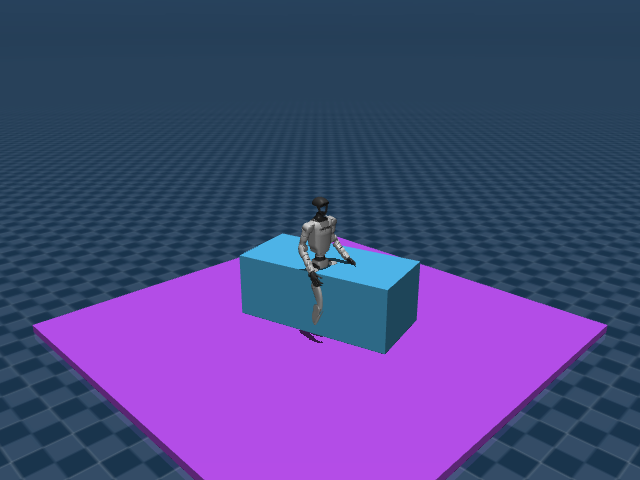

# G1 Climb Tracking

## 任务目标

训练 G1 跟踪爬箱/攀爬 motion，在包含台阶/箱体的 scene 中完成参考动作。



> 图片由 `_tools/render_static_images.py` 使用 `src/unilab/assets/robots/g1/scene_climb_20_z_scale_1.xml` 的 MuJoCo scene 离屏渲染生成；如果当前环境无法启用 EGL/OSMesa，生成 manifest 会记录失败原因。

## 证据索引

| 项目 | 内容 |
| --- | --- |
| 任务类别 | 动作追踪 |
| 机器人 | g1 |
| 代表 scene | src/unilab/assets/robots/g1/scene_climb_20_z_scale_1.xml |
| 代表源码 | src/unilab/envs/motion_tracking/g1/flip_tracking.py |
| 代表 owner YAML | conf/appo/task/g1_climb_tracking/mujoco.yaml |
| 动作维度 | 29 |

### Registry 与 Owner

| 注册名 | 后端 | 配置类 | 配置源码 |
| --- | --- | --- | --- |
| G1ClimbTracking | motrix, mujoco | G1ClimbTrackingEnvCfg | src/unilab/envs/motion_tracking/g1/flip_tracking.py |

| 算法组 | 后端 | training.task_name | owner YAML |
| --- | --- | --- | --- |
| appo | motrix | G1ClimbTracking | conf/appo/task/g1_climb_tracking/motrix.yaml |
| appo | mujoco | G1ClimbTracking | conf/appo/task/g1_climb_tracking/mujoco.yaml |
| ppo | motrix | G1ClimbTracking | conf/ppo/task/g1_climb_tracking/motrix.yaml |
| ppo | mujoco | G1ClimbTracking | conf/ppo/task/g1_climb_tracking/mujoco.yaml |

## 代码级执行流

这部分不再用通用关键词套模板，而是为 `g1_climb_tracking` 单独写源码导读。源码片段只负责提供证据；每节说明都围绕本任务自己的配置、状态、观测、动作和 reward 语义展开。

| 阶段 | 证据位置 | 代码级说明 |
| --- | --- | --- |
| 1. Hydra owner | conf/appo/task/g1_climb_tracking/mujoco.yaml | 训练命令先 compose owner YAML。这里确定 `training.task_name`、后端身份、obs_groups、reward scale 和 env override。 |
| 2. Registry 构造 Env | src/unilab/envs/motion_tracking/g1/flip_tracking.py | `@registry.envcfg` 注册配置类，`@registry.env` 注册后端实现类；训练脚本只调用 registry，不直接 new 任务类。 |
| 3. Reset/初始状态 | src/unilab/assets/robots/g1/scene_climb_20_z_scale_1.xml | env 从 scene keyframe 或 motion/grasp cache 取初态，再通过 reset randomization 改写 qpos/qvel/info。 |
| 4. Obs dict | src/unilab/envs/motion_tracking/g1/flip_tracking.py | env 读取 backend 传感器和 info，返回 dict；learner 根据 `obs_groups_spec` 和 owner `algo.obs_groups` 选择 actor/critic 输入。 |
| 5. Action 到控制目标 | src/unilab/envs/motion_tracking/g1/flip_tracking.py | policy 输出先按 action scale / 控制顺序映射到 actuator，再由 backend step 推进仿真。 |
| 6. Reward dispatch | src/unilab/envs/motion_tracking/g1/flip_tracking.py | 源码把 reward key 映射到函数，owner YAML 的 scale 决定每项奖励/惩罚是否启用以及权重。 |
| 7. Termination | src/unilab/envs/motion_tracking/g1/flip_tracking.py | env 根据高度、姿态、接触、参考轨迹误差、物体状态或能量阈值生成 done/terminated。 |

### 本任务阅读重点

| 阅读重点 |
| --- |
| Climb tracking 使用 climb scene 和爬箱 motion，任务目标是跟踪上升过程，不是平地或翻转。 |
| 配置 profile 决定 scene_climb、motion clip 和 episode 长度。 |
| 执行主体复用 tracking env，因此文档应重点写 climb profile 带来的参考动作/场景差异。 |

### 本任务注册入口

| 注册名 | 配置类 | 可用后端 |
| --- | --- | --- |
| G1ClimbTracking | G1ClimbTrackingEnvCfg | motrix, mujoco |

### 本任务源码锚点

| 小节 | 源码文件 | 明确锚点 |
| --- | --- | --- |
| 配置：爬箱 profile | src/unilab/envs/motion_tracking/g1/flip_tracking.py | G1ClimbTrackingEnvCfg, G1ClimbTrackingCfg |
| Reset：爬升参考状态 | src/unilab/envs/motion_tracking/g1/tracking.py | build_reset_plan, motion_frames |
| Obs：爬升目标 | src/unilab/envs/motion_tracking/g1/tracking.py | obs_groups_spec, _compute_obs |
| Action：29 DoF 爬升控制 | src/unilab/envs/motion_tracking/g1/tracking.py | apply_action, default_dof_pos_bias |
| Reward/Termination | src/unilab/envs/motion_tracking/g1/tracking.py | _init_reward_functions, update_state |

## 关键源码逐段解释（按本任务手写）

### 配置：爬箱 profile

| 本任务人工导读 |
| --- |
| cfg 指向 climb_20_z_scale_1 motion/scene。 |
| 爬箱几何在 task scene 中表达。 |

```python
# src/unilab/envs/motion_tracking/g1/flip_tracking.py
# 爬箱任务以独立注册名暴露，训练配置可直接选择 G1ClimbTracking。
@registry.envcfg("G1ClimbTracking")
@dataclass
class G1ClimbTrackingEnvCfg(G1ClimbTrackingCfg):
    """Registered configuration for G1 box-climb motion tracking."""

    # env 逻辑继承通用 motion tracking，爬箱差异由 cfg 的 scene/motion/阈值描述。
    pass


```

```python
# src/unilab/envs/motion_tracking/g1/flip_tracking.py
@dataclass
class G1ClimbTrackingCfg(G1MotionTrackingCfg):
    """Config profile for the climb_20_z_scale_1 motion clip."""

    # 使用带箱体的 task scene；箱子几何属于场景资源，不放入 robot.xml。
    scene: SceneCfg = field(
        default_factory=lambda: SceneCfg(
            model_file=str(ASSETS_ROOT_PATH / "robots" / "g1" / "scene_climb_20_z_scale_1.xml")
        )
    )
    # 参考动作切换为 climb_20_z_scale_1，全身 tracking 围绕爬升轨迹展开。
    motion_file: str | list[str] = str(
        ASSETS_ROOT_PATH / "motions" / "g1" / "climb_20_z_scale_1.0.npz"
    )
    # 爬箱序列较长，episode 上限放到 15 秒。
    max_episode_seconds: float = 15.0
    # 爬升过程中 anchor/末端高度误差更大，因此放宽 z 方向终止阈值。
    anchor_pos_z_threshold: float = 0.5
    ee_body_pos_z_threshold: float = 0.5


```
### Reset：爬升参考状态

| 本任务人工导读 |
| --- |
| reset 从爬箱 motion 采样初态。 |
| qpos/qvel 反映爬升阶段，而非普通站立。 |

```python
# src/unilab/envs/motion_tracking/g1/tracking.py
    def build_reset_plan(self, env: Any, env_ids: np.ndarray) -> ResetPlan:
        num_reset = len(env_ids)
        # 从爬箱 motion sampler 中选择 reset 参考帧。
        motion_frames = env.motion_sampler.sample_frames(env_ids)
        # 该帧包含机器人处在爬升不同阶段的 root/body/joint 参考。
        motion_data = env.motion_loader.get_motion_at_frame(motion_frames)
        # qpos/qvel 按爬箱参考状态构造，再叠加配置允许的随机化。
        qpos, qvel = _build_motion_reference_state(env, env_ids, motion_data)

        # 动作历史清零，避免上一段爬升控制影响 reset 后首步。
        info_updates = {
            "current_actions": zero_actions(num_reset, env._num_action),
            "last_actions": zero_actions(num_reset, env._num_action),
        }
        # 通用 DR 在 reset 冷路径生成质量、COM、增益等 payload。
        randomization = build_common_reset_randomization(
            env, num_reset, base_kp=self._base_kp, base_kd=self._base_kd
        )

        dr_cfg = env.cfg.domain_rand
        if getattr(dr_cfg, "randomize_geom_friction", False):
            assert self._base_geom_friction is not None
            assert self._foot_geom_ids is not None
            payload = randomization or ResetRandomizationPayload()
            low, high = dr_cfg.friction_range
            # 足底摩擦影响踩箱和支撑稳定性，按 env 采样后写入 foot geoms。
            scale = np.random.uniform(low, high, size=(num_reset, 1)).astype(np.float64)
            geom_friction = np.broadcast_to(
                self._base_geom_friction,
                (num_reset, *self._base_geom_friction.shape),
            ).copy()
            geom_friction[:, self._foot_geom_ids, 0] = scale * np.ones(
                (1, self._foot_geom_ids.size)
            )
            payload.geom_friction = geom_friction
            randomization = payload

        if getattr(dr_cfg, "randomize_joint_default_pos", False):
            low, high = dr_cfg.joint_default_pos_range
            # 关节默认角偏置会被 obs 和 action 同时读取，保持控制基准一致。
            info_updates["default_dof_pos_bias"] = np.random.uniform(
                low, high, size=(num_reset, env._num_action)
            ).astype(get_global_dtype())

        # ResetPlan 将爬箱参考初态和随机化参数一次性交给 env reset。
        return ResetPlan(
            env_ids=env_ids,
            qpos=qpos,
            qvel=qvel,
            info_updates=info_updates,
            randomization=randomization,
        )

```
### Obs：爬升目标

| 本任务人工导读 |
| --- |
| obs 包含 reference anchor/body target，使策略知道当前应处于爬升哪一段。 |
| critic 使用 body 特权信息衡量整体跟踪误差。 |

```python
# src/unilab/envs/motion_tracking/g1/tracking.py
    @property
    def obs_groups_spec(self) -> dict[str, int]:
        # Actor: command(2n) + motion_anchor_pos_b(3) + motion_anchor_ori_b(6)
        #        + linvel(3) + gyro(3) + joint_pos(n) + joint_vel(n) + actions(n)
        # Critic mirrors BeyondMimic physical terms without actor observation noise:
        #        command, motion anchor, robot body pos/ori, linvel, gyro, joints, actions.
        n = self._num_action
        # actor 宽度覆盖参考 command、anchor 误差、本体状态和动作历史。
        actor_width = getattr(self, "_actor_obs_width", self._actor_obs_dim(n))
        # critic 宽度额外加入每个 tracked body 的位姿特权信息。
        critic_width = getattr(
            self,
            "_critic_obs_width",
            self._critic_base_obs_dim(n) + len(self._cfg.body_names) * 9,
        )
        return {"obs": actor_width, "critic": critic_width}

```

```python
# src/unilab/envs/motion_tracking/g1/tracking.py
    def _compute_obs(
        self,
        info: dict,
        motion_data,
        linvel: np.ndarray,
        gyro: np.ndarray,
        dof_pos: np.ndarray,
        dof_vel: np.ndarray,
        robot_body_pos_w: np.ndarray,
        robot_body_quat_w: np.ndarray,
    ) -> dict[str, np.ndarray]:
        """Compute observations as dict with actor and critic groups."""
        num_envs = linvel.shape[0]
        dtype = get_global_dtype()
        n_action = dof_pos.shape[1]
        # body 数量决定 body-level tracking obs/reward 的规模。
        n_body = self._n_motion_bodies

        # Get anchor states
        # 参考 anchor 来自爬箱 motion，当前 anchor 来自仿真躯干。
        anchor_pos_w = motion_data.body_pos_w[:, self.anchor_body_idx]
        anchor_quat_w = motion_data.body_quat_w[:, self.anchor_body_idx]
        robot_anchor_pos_w = robot_body_pos_w[:, self.anchor_body_idx]
        robot_anchor_quat_w = robot_body_quat_w[:, self.anchor_body_idx]

        # Motion anchor pose in robot frame
        if num_envs == self._num_envs:
            # step 热路径复用缓存，避免每帧重复分配。
            motion_anchor_pos_b = self._motion_anchor_pos_b
            motion_anchor_ori_b = self._motion_anchor_ori_b
            joint_pos_rel = self._joint_pos_rel
            zero_actions = self._zero_actions
        else:
            motion_anchor_pos_b = np.empty((num_envs, 3), dtype=dtype)
            motion_anchor_ori_b = np.empty((num_envs, 6), dtype=dtype)
            joint_pos_rel = np.empty((num_envs, n_action), dtype=dtype)
            zero_actions = np.zeros((num_envs, n_action), dtype=dtype)
        _write_motion_anchor_transform(
            robot_anchor_pos_w,
            robot_anchor_quat_w,
            anchor_pos_w,
            anchor_quat_w,
            motion_anchor_pos_b,
            motion_anchor_ori_b,
        )

        # Joint positions and velocities
        bias = info.get("default_dof_pos_bias")
        # 关节位置转成相对默认角，爬升时策略看到的是偏离默认姿态多少。
        effective_default = self.default_angles + bias if bias is not None else self.default_angles
        np.subtract(dof_pos, effective_default, out=joint_pos_rel)
        last_actions = info.get("current_actions")
        if not isinstance(last_actions, np.ndarray):
            last_actions = zero_actions

        if num_envs == self._num_envs:
            command = self._motion_command
        else:
            command = np.empty((num_envs, n_action * 2), dtype=dtype)
        # command 由爬箱参考关节角和速度拼接，指导当前应处在的爬升阶段。
        command[:, :n_action] = motion_data.joint_pos
        command[:, n_action : n_action * 2] = motion_data.joint_vel

        # Per-step observation noise on sensor channels (actor only).
        # Critic uses the clean originals — asymmetric actor–critic contract.
        noise_cfg = self._cfg.noise_config
        noise_enabled = noise_cfg.level > 0.0
        if noise_enabled:
            # 观测噪声只作用 actor，critic 保留干净状态用于稳定训练。
            linvel_actor = self._obs_noise(linvel, noise_cfg.scale_linvel)
            gyro_actor = self._obs_noise(gyro, noise_cfg.scale_gyro)
            joint_pos_actor = self._obs_noise(joint_pos_rel, noise_cfg.scale_joint_angle)
            dof_vel_actor = self._obs_noise(dof_vel, noise_cfg.scale_joint_vel)
        else:
            linvel_actor = linvel
            gyro_actor = gyro
            joint_pos_actor = joint_pos_rel
            dof_vel_actor = dof_vel

        # Actor observations (noisy proprioception)
        # actor_obs 给策略提供爬箱参考、躯干误差、关节状态和上一步动作。
        actor_obs = self._build_actor_obs(
            command=command,
            motion_anchor_pos_b=motion_anchor_pos_b,
            motion_anchor_ori_b=motion_anchor_ori_b,
            noisy_linvel=linvel_actor,
            noisy_gyro=gyro_actor,
            noisy_joint_pos_rel=joint_pos_actor,
            noisy_dof_vel=dof_vel_actor,
            last_actions=last_actions,
        )

        # Critic observations (clean proprioception + privileged body transforms)
        # critic_obs 通过 body 特权项判断全身是否贴合爬升参考。
        critic_obs = np.empty((num_envs, self._critic_obs_width), dtype=dtype)
        offset = 0
        critic_obs[:, offset : offset + command.shape[1]] = command
        offset += command.shape[1]
```
### Action：29 DoF 爬升控制

| 本任务人工导读 |
| --- |
| 动作仍控制 G1 29 个关节。 |
| 爬升高度来自参考轨迹和物理接触，不是 action 中的额外维度。 |

```python
# src/unilab/envs/motion_tracking/g1/tracking.py
    def apply_action(self, actions: np.ndarray, state: NpEnvState) -> np.ndarray:
        # 29 维动作对应 G1 关节目标，不包含“箱子高度”之类额外控制量。
        state.info["last_actions"] = state.info.get("current_actions", np.zeros_like(actions))
        state.info["current_actions"] = actions
        # 可选 latency 用上一帧动作下发，模拟实机执行延迟。
        exec_actions = (
            state.info["last_actions"]
            if self._cfg.control_config.simulate_action_latency
            else actions
        )
        bias = state.info.get("default_dof_pos_bias")
        base = self.default_angles + bias if bias is not None else self.default_angles
        # action_scale 将策略输出映射到 position actuator 的目标角。
        ctrl: np.ndarray = exec_actions * self._cfg.control_config.action_scale + base
        return ctrl

```

```python
# src/unilab/envs/motion_tracking/g1/tracking.py
    def build_reset_plan(self, env: Any, env_ids: np.ndarray) -> ResetPlan:
        num_reset = len(env_ids)
        # 这里再次展示 reset 参考帧和动作基准来自同一套爬箱 motion。
        motion_frames = env.motion_sampler.sample_frames(env_ids)
        motion_data = env.motion_loader.get_motion_at_frame(motion_frames)
        qpos, qvel = _build_motion_reference_state(env, env_ids, motion_data)

        info_updates = {
            "current_actions": zero_actions(num_reset, env._num_action),
            "last_actions": zero_actions(num_reset, env._num_action),
        }
        randomization = build_common_reset_randomization(
            env, num_reset, base_kp=self._base_kp, base_kd=self._base_kd
        )

        dr_cfg = env.cfg.domain_rand
        if getattr(dr_cfg, "randomize_geom_friction", False):
            assert self._base_geom_friction is not None
            assert self._foot_geom_ids is not None
            payload = randomization or ResetRandomizationPayload()
            low, high = dr_cfg.friction_range
            scale = np.random.uniform(low, high, size=(num_reset, 1)).astype(np.float64)
            geom_friction = np.broadcast_to(
                self._base_geom_friction,
                (num_reset, *self._base_geom_friction.shape),
            ).copy()
            geom_friction[:, self._foot_geom_ids, 0] = scale * np.ones(
                (1, self._foot_geom_ids.size)
            )
            payload.geom_friction = geom_friction
            randomization = payload

        if getattr(dr_cfg, "randomize_joint_default_pos", False):
            low, high = dr_cfg.joint_default_pos_range
            info_updates["default_dof_pos_bias"] = np.random.uniform(
                low, high, size=(num_reset, env._num_action)
            ).astype(get_global_dtype())

        return ResetPlan(
            env_ids=env_ids,
            qpos=qpos,
            qvel=qvel,
            info_updates=info_updates,
            randomization=randomization,
        )

```
### Reward/Termination

| 本任务人工导读 |
| --- |
| reward 以 tracking 误差约束 root/body/joint。 |
| 终止关注 anchor/末端误差和不期望接触。 |

```python
# src/unilab/envs/motion_tracking/g1/tracking.py
    def _init_reward_functions(self):
        # 爬箱复用通用 motion tracking reward 表，权重在 owner YAML 中配置。
        self._reward_fns = {
            # root/body 项确保机器人整体姿态和速度跟随爬升参考。
            "motion_global_root_pos": self._reward_motion_global_root_pos,
            "motion_global_root_ori": self._reward_motion_global_root_ori,
            "motion_body_pos": self._reward_motion_body_pos,
            "motion_body_ori": self._reward_motion_body_ori,
            "motion_body_lin_vel": self._reward_motion_body_lin_vel,
            "motion_body_ang_vel": self._reward_motion_body_ang_vel,
            "motion_ee_body_pos_z": self._reward_motion_ee_body_pos_z,
            "motion_joint_pos": self._reward_motion_joint_pos,
            "motion_joint_vel": self._reward_motion_joint_vel,
            # action 平滑、关节限位和异常接触约束爬箱过程的稳定性。
            "action_rate_l2": self._reward_action_rate_l2,
            "joint_limit": self._reward_joint_limit,
            "undesired_contacts": self._reward_undesired_contacts,
        }

```

```python
# src/unilab/envs/motion_tracking/g1/tracking.py
    def update_state(self, state: NpEnvState) -> NpEnvState:
        # 每步重新计算 clip-end 标记，防止旧 episode 状态残留。
        self._clip_end_truncated.fill(False)

        # Get current motion data
        # 当前爬箱参考帧是 reward、obs 和 termination 的共同依据。
        motion_data = self._get_current_motion()

        # Get robot state
        # backend 状态包含躯干速度、IMU、关节角速度等实时仿真信息。
        linvel = self.get_local_linvel()
        gyro = self.get_gyro()
        dof_pos = self.get_dof_pos()
        dof_vel = self.get_dof_vel()

        # Get body states
        (
            robot_body_pos_w,
            robot_body_quat_w,
            robot_body_lin_vel_w,
            robot_body_ang_vel_w,
        ) = self._get_body_state_w()

        # Compute relative body transforms (for observations and rewards)
        # 相对变换用于衡量机器人各 body 与爬箱参考的偏差。
        self._update_relative_transforms(motion_data, robot_body_pos_w, robot_body_quat_w)

        # Compute terminations
        # 终止边界会使用爬箱 profile 中放宽后的 z 阈值。
        terminated = self._compute_terminations(motion_data, robot_body_pos_w, robot_body_quat_w)

        # Update failure statistics for adaptive sampling
        # 失败统计反馈给 sampler，后续更容易采到困难爬升阶段。
        self.motion_sampler.update_failure_stats(terminated)

        # Compute reward
        reward = self._compute_reward(
            state.info,
            motion_data,
            robot_body_pos_w,
            robot_body_quat_w,
            robot_body_lin_vel_w,
            robot_body_ang_vel_w,
            dof_pos,
            dof_vel,
        )

        # Compute observations
        obs = self._compute_obs(
            state.info,
            motion_data,
            linvel,
            gyro,
            dof_pos,
            dof_vel,
            robot_body_pos_w,
            robot_body_quat_w,
        )

        # Advance motion frames
        done_env_ids = self.motion_sampler.step()
        if len(done_env_ids) > 0:
            if self._cfg.truncate_on_clip_end:
                self._clip_end_truncated[done_env_ids] = True
            else:
                # Match BeyondMimic: clip boundaries are command resampling points, not
                # episode boundaries; sync the simulated robot to the new reference.
                resample_env_ids = done_env_ids[~terminated[done_env_ids]]
                if len(resample_env_ids) > 0:
                    self._resample_reference_state(resample_env_ids)
                    self._refresh_observation_rows(obs, state.info, resample_env_ids)

        return state.replace(obs=obs, reward=reward, terminated=terminated)

```


## Agent

Agent 输出 29 维动作，策略目标是跟踪爬升阶段的全身轨迹。

训练入口通过 owner YAML 决定注册 env、后端身份和算法参数；CLI 应使用 `--sim` 选择 backend owner，而不是单独 override `training.sim_backend`。

```yaml
# conf/appo/task/g1_climb_tracking/mujoco.yaml
training:
  task_name: G1ClimbTracking
  sim_backend: mujoco
  play_steps: 1000
algo:
  obs_groups: {}
  num_envs: 1024
  max_iterations: 20000
```

## Env

Env 使用 climb scene 和 climb motion file，仍复用 motion tracking 框架。

Env 必须遵守 `NpEnv` contract：`reset()` 返回 `(obs_dict, info_dict)`，`obs` 是 dict，`obs_groups_spec` 决定 learner 使用哪些观测组。

```python
# src/unilab/envs/motion_tracking/g1/flip_tracking.py
    terminate_on_undesired_contacts: bool = True
    # Some flip clips include large anchor orientation deviations.
    anchor_ori_threshold: float = 1e9


@registry.envcfg("G1FlipTracking")
@dataclass
class G1FlipTrackingEnvCfg(G1FlipTrackingCfg):
    """Registered configuration for G1 flip tracking."""

    pass
```

## Obs

观测为机器人状态、参考 motion 与动作历史的组合。

### Obs 字段级拆解

下面的表格把源码里的观测拼接逻辑拆成语义字段。维度如果依赖 history、terrain scan 或 motion body 数量，文档会写成“规模”而不是硬编码，避免和配置漂移。

| 观测字段 | 维度/规模 | 代码来源 | 中文说明 |
| --- | --- | --- | --- |
| current robot state | 随 G1 nu 变化 | `G1MotionTrackingEnv` | 当前 root、关节、末端和 body 状态。 |
| reference root | 位置/朝向/速度 | `MotionLoader` | 参考 motion 中 root 的目标位置、朝向和速度。 |
| reference body | body_names × 状态 | `body_names` | 参考 motion 中关键 body 的位置、朝向、线速度和角速度。 |
| reference joints | nu 维 | `motion_data.joint_pos` | 参考 motion 的关节角。 |
| phase / sampling | clip 时间相关 | `MotionSampler` | 当前 episode 对应 motion clip 的时间位置。 |
| last_actions | nu 维 | info 动作历史 | 帮助策略保持动作连续。 |
| critic extras | 任务相关 | SAC/Deploy 变体 | SAC 变体可给 critic 额外 base linvel 或全身特权信息。 |

owner YAML 中的 `algo.obs_groups` 说明算法从 env obs dict 中读取哪些组。没有写入 owner 的字段保持 env cfg 默认值，文档不臆造未配置项。

```yaml
# conf/appo/task/g1_climb_tracking/mujoco.yaml
algo:
  obs_groups:
    {}

```

代码侧观测通常在 `_get_obs`、`_build_obs`、`obs_groups_spec` 或 base env 中组装：

```text
# 未在 src/unilab/envs/motion_tracking/g1/flip_tracking.py 中找到片段：obs_groups_spec, _get_obs, build_obs, get_obs
```

源码锚点拆解：

| 源码符号 | 中文说明 |
| --- | --- |

## Action

动作空间与 G1 tracking 一致。

### Action 逐维拆解

G1 的 action 覆盖 29 个可控关节：腿、腰和双臂都参与控制。行走任务更强调腿部和腰部稳定，motion tracking 则让上肢也跟随参考动作。

当前代表 scene 编译出的 action 维度为 `29`。下表来自 MuJoCo 编译模型的 actuator 顺序，也就是策略输出维度和执行器维度的对应关系。

| Action 维度 | 执行器 | 驱动关节 | 中文含义 | 控制/限制说明 |
| --- | --- | --- | --- | --- |
| 0 | left_hip_pitch_joint | left_hip_pitch_joint | 左髋俯仰关节 | XML 未显式限制，实际由 env 缩放/默认角和 backend 控制 |
| 1 | left_hip_roll_joint | left_hip_roll_joint | 左髋侧摆关节 | XML 未显式限制，实际由 env 缩放/默认角和 backend 控制 |
| 2 | left_hip_yaw_joint | left_hip_yaw_joint | 左髋偏航关节 | XML 未显式限制，实际由 env 缩放/默认角和 backend 控制 |
| 3 | left_knee_joint | left_knee_joint | 左膝关节 | XML 未显式限制，实际由 env 缩放/默认角和 backend 控制 |
| 4 | left_ankle_pitch_joint | left_ankle_pitch_joint | 左踝俯仰关节 | XML 未显式限制，实际由 env 缩放/默认角和 backend 控制 |
| 5 | left_ankle_roll_joint | left_ankle_roll_joint | 左踝侧摆关节 | XML 未显式限制，实际由 env 缩放/默认角和 backend 控制 |
| 6 | right_hip_pitch_joint | right_hip_pitch_joint | 右髋俯仰关节 | XML 未显式限制，实际由 env 缩放/默认角和 backend 控制 |
| 7 | right_hip_roll_joint | right_hip_roll_joint | 右髋侧摆关节 | XML 未显式限制，实际由 env 缩放/默认角和 backend 控制 |
| 8 | right_hip_yaw_joint | right_hip_yaw_joint | 右髋偏航关节 | XML 未显式限制，实际由 env 缩放/默认角和 backend 控制 |
| 9 | right_knee_joint | right_knee_joint | 右膝关节 | XML 未显式限制，实际由 env 缩放/默认角和 backend 控制 |
| 10 | right_ankle_pitch_joint | right_ankle_pitch_joint | 右踝俯仰关节 | XML 未显式限制，实际由 env 缩放/默认角和 backend 控制 |
| 11 | right_ankle_roll_joint | right_ankle_roll_joint | 右踝侧摆关节 | XML 未显式限制，实际由 env 缩放/默认角和 backend 控制 |
| 12 | waist_yaw_joint | waist_yaw_joint | 腰偏航关节 | XML 未显式限制，实际由 env 缩放/默认角和 backend 控制 |
| 13 | waist_roll_joint | waist_roll_joint | 腰侧摆关节 | XML 未显式限制，实际由 env 缩放/默认角和 backend 控制 |
| 14 | waist_pitch_joint | waist_pitch_joint | 腰俯仰关节 | XML 未显式限制，实际由 env 缩放/默认角和 backend 控制 |
| 15 | left_shoulder_pitch_joint | left_shoulder_pitch_joint | 左肩俯仰关节 | XML 未显式限制，实际由 env 缩放/默认角和 backend 控制 |
| 16 | left_shoulder_roll_joint | left_shoulder_roll_joint | 左肩侧摆关节 | XML 未显式限制，实际由 env 缩放/默认角和 backend 控制 |
| 17 | left_shoulder_yaw_joint | left_shoulder_yaw_joint | 左肩偏航关节 | XML 未显式限制，实际由 env 缩放/默认角和 backend 控制 |
| 18 | left_elbow_joint | left_elbow_joint | 左肘关节 | XML 未显式限制，实际由 env 缩放/默认角和 backend 控制 |
| 19 | left_wrist_roll_joint | left_wrist_roll_joint | 左腕侧摆关节 | XML 未显式限制，实际由 env 缩放/默认角和 backend 控制 |
| 20 | left_wrist_pitch_joint | left_wrist_pitch_joint | 左腕俯仰关节 | XML 未显式限制，实际由 env 缩放/默认角和 backend 控制 |
| 21 | left_wrist_yaw_joint | left_wrist_yaw_joint | 左腕偏航关节 | XML 未显式限制，实际由 env 缩放/默认角和 backend 控制 |
| 22 | right_shoulder_pitch_joint | right_shoulder_pitch_joint | 右肩俯仰关节 | XML 未显式限制，实际由 env 缩放/默认角和 backend 控制 |
| 23 | right_shoulder_roll_joint | right_shoulder_roll_joint | 右肩侧摆关节 | XML 未显式限制，实际由 env 缩放/默认角和 backend 控制 |
| 24 | right_shoulder_yaw_joint | right_shoulder_yaw_joint | 右肩偏航关节 | XML 未显式限制，实际由 env 缩放/默认角和 backend 控制 |
| 25 | right_elbow_joint | right_elbow_joint | 右肘关节 | XML 未显式限制，实际由 env 缩放/默认角和 backend 控制 |
| 26 | right_wrist_roll_joint | right_wrist_roll_joint | 右腕侧摆关节 | XML 未显式限制，实际由 env 缩放/默认角和 backend 控制 |
| 27 | right_wrist_pitch_joint | right_wrist_pitch_joint | 右腕俯仰关节 | XML 未显式限制，实际由 env 缩放/默认角和 backend 控制 |
| 28 | right_wrist_yaw_joint | right_wrist_yaw_joint | 右腕偏航关节 | XML 未显式限制，实际由 env 缩放/默认角和 backend 控制 |

控制参数来自 owner YAML 的 `env.control_config`，缺省值由对应 env cfg/dataclass 提供。

| 配置字段 | 当前值 | 中文说明 |
| --- | --- | --- |
| action_scale | [0.5475464629911068, 0.35066146637882434, 0.5475464629911068, 0.35066146637882434, 0.43857731392336724, 0.43857731392336724, 0.5475464629911068, 0.35066146637882434, 0.5475464629911068, 0.35066146637882434, 0.43857731392336724, 0.43857731392336724, 0.5475464629911068, 0.43857731392336724, 0.43857731392336724, 0.43857731392336724, 0.43857731392336724, 0.43857731392336724, 0.43857731392336724, 0.43857731392336724, 0.07450087032950714, 0.07450087032950714, 0.43857731392336724, 0.43857731392336724, 0.43857731392336724, 0.43857731392336724, 0.43857731392336724, 0.07450087032950714, 0.07450087032950714] | 策略输出到目标关节角的缩放系数。 |

```yaml
# conf/appo/task/g1_climb_tracking/mujoco.yaml
env:
  control_config:
    action_scale:
    - 0.5475464629911068
    - 0.35066146637882434
    - 0.5475464629911068
    - 0.35066146637882434
    - 0.43857731392336724
    - 0.43857731392336724
    - 0.5475464629911068
    - 0.35066146637882434
    - 0.5475464629911068
    - 0.35066146637882434
    - 0.43857731392336724
    - 0.43857731392336724
    - 0.5475464629911068
    - 0.43857731392336724
    - 0.43857731392336724
    - 0.43857731392336724
    - 0.43857731392336724
    - 0.43857731392336724
    - 0.43857731392336724
    - 0.43857731392336724
    - 0.07450087032950714
    - 0.07450087032950714
    - 0.43857731392336724
    - 0.43857731392336724
    - 0.43857731392336724
    - 0.43857731392336724
    - 0.43857731392336724
    - 0.07450087032950714
    - 0.07450087032950714

```

动作到执行器的实际映射由 backend 的 actuator control range 和 env 的 `apply_action`/控制函数完成：

```text
# 未在 src/unilab/envs/motion_tracking/g1/flip_tracking.py 中找到片段：apply_action, action_scale, compute_go2w_motor_ctrl, _init_action_space
```

源码锚点拆解：

| 源码符号 | 中文说明 |
| --- | --- |

## Reward

reward 以 root/body/joint tracking 误差为核心。

### Reward 逐项拆解

reward scale 以 owner YAML 的 `reward.scales` 为真源；源码中的 `RewardConfig` 描述可用字段，训练脚本只做 Hydra 组装和注入。正数通常表示奖励，负数通常表示惩罚，0 表示该项在当前 owner 中关闭或仅保留接口。

| Reward key | Scale | 方向 | 中文含义 |
| --- | --- | --- | --- |
| motion_global_root_pos | 0.5 | 奖励 | 参考 motion 的 root 全局位置跟踪奖励。 |
| motion_global_root_ori | 0.5 | 奖励 | 参考 motion 的 root 全局朝向跟踪奖励。 |
| motion_body_pos | 2.0 | 奖励 | 参考 motion 的各 body 位置跟踪奖励。 |
| motion_body_ori | 1.5 | 奖励 | 参考 motion 的各 body 朝向跟踪奖励。 |
| motion_body_lin_vel | 1.0 | 奖励 | 参考 motion 的 body 线速度跟踪奖励。 |
| motion_body_ang_vel | 1.0 | 奖励 | 参考 motion 的 body 角速度跟踪奖励。 |
| motion_ee_body_pos_z | 2.0 | 奖励 | 末端 body 高度跟踪奖励。 |
| motion_joint_pos | 0.5 | 奖励 | 参考 motion 的关节位置跟踪奖励。 |
| motion_joint_vel | 0.25 | 奖励 | 参考 motion 的关节速度跟踪奖励。 |
| action_rate_l2 | -0.005 | 惩罚 | 动作变化 L2 惩罚， motion tracking 中用于约束动作平滑。 |
| joint_limit | -10.0 | 惩罚 | 关节限位惩罚，避免追踪动作时撞到机械限位。 |
| undesired_contacts | -0.1 | 惩罚 | 非期望接触惩罚，例如手、膝、身体等部位异常触地。 |

```yaml
# conf/appo/task/g1_climb_tracking/mujoco.yaml
reward:
  scales:
    motion_global_root_pos: 0.5
    motion_global_root_ori: 0.5
    motion_body_pos: 2.0
    motion_body_ori: 1.5
    motion_body_lin_vel: 1.0
    motion_body_ang_vel: 1.0
    motion_ee_body_pos_z: 2.0
    motion_joint_pos: 0.5
    motion_joint_vel: 0.25
    action_rate_l2: -0.005
    joint_limit: -10.0
    undesired_contacts: -0.1
  std_root_pos: 0.3
  std_root_ori: 0.4
  std_body_pos: 0.3
  std_body_ori: 0.4
  std_body_lin_vel: 1.0
  std_body_ang_vel: 3.14
  std_joint_pos: 0.2
  std_joint_vel: 1.0

```

源码中的 reward 入口：

```text
# 未在 src/unilab/envs/motion_tracking/g1/flip_tracking.py 中找到片段：RewardConfig, _compute_reward, run_reward_dispatch, _reward
```

源码锚点拆解：

| 源码符号 | 中文说明 |
| --- | --- |

## 初始状态

reset 从 climb motion 采样初始帧，episode 秒数通常更长。

机器人默认姿态来自 scene/task fragment 中的 keyframe；任务 reset 在此基础上加入命令、motion reference、物体状态或随机化。

```xml
<!-- src/unilab/assets/robots/g1/scene_climb_20_z_scale_1.xml -->
    <contact name="undesired_contact_climb_box2_right_shoulder_yaw_collision" geom1="climb_box2" geom2="right_shoulder_yaw_collision" data="found" num="1" reduce="mindist"/>
  </sensor>

  <keyframe>
    <key name="stand"
      qpos="
      0 0 0.754
```

```text
# 未在 src/unilab/envs/motion_tracking/g1/flip_tracking.py 中找到片段：reset, build_reset_plan, _reset, get_keyframe_qpos
```

## 终止条件

终止由 tracking 误差、接触约束和超时触发。

终止条件通常由 env 源码中的 `_compute_termination(s)`、reward config 阈值和 `max_episode_seconds` 共同决定。

```yaml
# conf/appo/task/g1_climb_tracking/mujoco.yaml
env:
  anchor_pos_z_threshold: 0.3
  ee_body_pos_z_threshold: 0.3
  truncate_on_clip_end: false

reward:
  {}

```

```text
# 未在 src/unilab/envs/motion_tracking/g1/flip_tracking.py 中找到片段：_compute_termination, _compute_terminations, terminated, termination
```

## 域随机化

domain_rand 使用 tracking cfg 中的物理扰动开关。

域随机化只在 reset/interval 等冷路径触发，不在 step 热路径解析资产或探测 backend 私有能力。

### 域随机化字段拆解

| 配置字段 | 当前值 | 中文说明 |
| --- | --- | --- |

```yaml
# conf/appo/task/g1_climb_tracking/mujoco.yaml
env:
  domain_rand:
    {}

```

```text
# 未在 src/unilab/envs/motion_tracking/g1/flip_tracking.py 中找到片段：DomainRand, DomainRandomization, build_reset_plan, domain_rand
```
